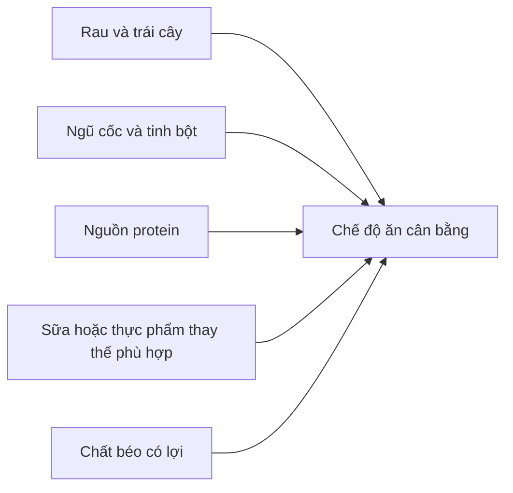
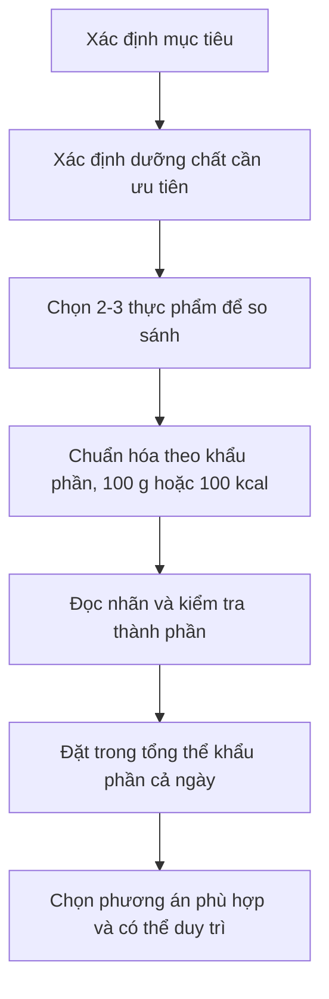

# 086 — What Is Nutrient Density?

| Thuộc tính         | Nội dung                                                                 |
| ------------------ | ------------------------------------------------------------------------ |
| **Module**         | Module 09 — More Dieting Tips & Strategies                               |
| **Bài học**        | What Is Nutrient Density?                                                |
| **Tên tiếng Việt** | Mật độ dinh dưỡng là gì?                                                 |
| **Thời lượng**     | 03:40                                                                    |
| **Chủ đề chính**   | Đánh giá lượng dưỡng chất mà thực phẩm cung cấp so với năng lượng của nó |

> **Ý tưởng cốt lõi:** Thực phẩm có mật độ dinh dưỡng cao cung cấp nhiều vitamin, khoáng chất và thành phần có lợi hơn trong một lượng calo tương đối hợp lý. Tuy nhiên, khái niệm này phải được sử dụng **theo mục tiêu dinh dưỡng cụ thể**, không nên biến thành một bảng xếp hạng tuyệt đối.

## Mục lục

1. [Mục tiêu bài học](#1-mục-tiêu-bài-học)
2. [Nội dung chính](#2-nội-dung-chính)
3. [Áp dụng thực tế](#3-áp-dụng-thực-tế)
4. [Lưu ý & lỗi thường gặp](#4-lưu-ý--lỗi-thường-gặp)
5. [Checklist thực hành](#5-checklist-thực-hành)
6. [Tóm tắt](#6-tóm-tắt)
7. [Tài liệu tham khảo](#7-tài-liệu-tham-khảo)

---

## 1. Mục tiêu bài học

Sau bài học này, bạn có thể:

* Giải thích được khái niệm **mật độ dinh dưỡng**.
* Phân biệt mật độ dinh dưỡng với **mật độ năng lượng**.
* Biết cách so sánh hai thực phẩm theo cùng một dưỡng chất.
* Hiểu vì sao “giàu dinh dưỡng” là một khái niệm **tương đối**, không phải nhãn tuyệt đối.
* Lựa chọn thực phẩm phù hợp với mục tiêu như tăng protein, bổ sung chất xơ, canxi hoặc vitamin.
* Tránh quan niệm sai rằng thực phẩm ít calo luôn tốt hoặc thực phẩm nhiều calo luôn kém lành mạnh.

---

## 2. Nội dung chính

### 2.1. Mật độ dinh dưỡng là gì?

Theo định nghĩa thường dùng, mật độ dinh dưỡng cho biết lượng dưỡng chất mà một thực phẩm cung cấp so với:

* Năng lượng, thường tính trên **100 kcal**;
* Khối lượng, chẳng hạn trên **100 g**;
* Hoặc một **khẩu phần ăn thực tế**.

Các mô hình đánh giá dinh dưỡng khác nhau có thể dùng những mẫu số khác nhau, vì vậy cùng một thực phẩm có thể nhận kết quả khác nhau tùy cách tính. ([PubMed][1])

Công thức đơn giản khi đánh giá một dưỡng chất cụ thể:

[
\text{Mật độ của dưỡng chất X}
==============================

\frac{\text{Lượng dưỡng chất X trong thực phẩm}}
{\text{Năng lượng của thực phẩm}}
]

Ví dụ:

[
\text{Mật độ protein}
=====================

\frac{\text{Số gam protein}}
{\text{Số kcal}}
]

Một thực phẩm cung cấp **10 g protein trong 100 kcal** sẽ có mật độ protein cao hơn thực phẩm chỉ cung cấp **3 g protein trong 100 kcal**.

### Định nghĩa mở rộng

Các hướng dẫn dinh dưỡng hiện đại không chỉ xem xét số lượng vitamin và khoáng chất. Thực phẩm giàu dinh dưỡng thường:

* Cung cấp vitamin, khoáng chất, protein, chất xơ hoặc các thành phần có lợi khác;
* Có ít hoặc không có đường bổ sung;
* Không chứa quá nhiều chất béo bão hòa và natri.

Các nhóm thường được xếp vào dạng giàu dinh dưỡng gồm rau, trái cây, ngũ cốc nguyên hạt, hải sản, trứng, đậu, đậu lăng, các loại hạt không muối, sữa ít béo và thịt nạc khi được chế biến với ít đường, chất béo bão hòa và muối. ([Dietary Guidelines][2])

---

### 2.2. Mật độ dinh dưỡng khác mật độ năng lượng

Hai thuật ngữ này dễ bị nhầm lẫn:

| Khái niệm             | Câu hỏi cần trả lời                                               | Cách tính thường dùng                              |
| --------------------- | ----------------------------------------------------------------- | -------------------------------------------------- |
| **Mật độ dinh dưỡng** | Thực phẩm cung cấp bao nhiêu dưỡng chất?                          | Dưỡng chất trên 100 kcal, 100 g hoặc một khẩu phần |
| **Mật độ năng lượng** | Thực phẩm cung cấp bao nhiêu calo trong một khối lượng nhất định? | kcal trên mỗi gam thực phẩm                        |

Ví dụ:

* Rau xanh thường có **mật độ năng lượng thấp** và cung cấp nhiều vitamin, khoáng chất trên lượng calo nhỏ.
* Các loại hạt có **mật độ năng lượng cao** vì chứa nhiều chất béo, nhưng vẫn có thể giàu protein, chất xơ, vitamin và khoáng chất.
* Nước ngọt có thể cung cấp nhiều năng lượng từ đường nhưng rất ít dưỡng chất thiết yếu.

> **Kết luận:** “Nhiều calo” không tự động đồng nghĩa với “kém dinh dưỡng”, và “ít calo” cũng không tự động đồng nghĩa với “đủ dinh dưỡng”.

---

### 2.3. Ví dụ: bánh mì trắng và bánh mì nguyên cám

Trong bài giảng, hai lát bánh mì có lượng calo gần tương đương được so sánh theo vitamin E:

* Bánh mì trắng cung cấp lượng vitamin E tương đối thấp.
* Bánh mì nguyên cám cung cấp nhiều vitamin E hơn trong cùng mức năng lượng.
* Nếu mục tiêu là tăng vitamin E, bánh mì nguyên cám sẽ là lựa chọn phù hợp hơn trong ví dụ này.

Tuy nhiên, đây chỉ là **ví dụ minh họa cho phương pháp so sánh**. Hàm lượng vitamin E thực tế thay đổi theo công thức, kích thước lát bánh, mức độ tăng cường vi chất và thương hiệu. Cần kiểm tra nhãn hoặc cơ sở dữ liệu thành phần thực phẩm thay vì áp dụng một con số cố định cho mọi sản phẩm. NIH cho biết nhu cầu tham chiếu hằng ngày đối với vitamin E trên nhãn thực phẩm Hoa Kỳ là 15 mg, trong khi USDA FoodData Central cung cấp dữ liệu thành phần cho nhiều loại thực phẩm và sản phẩm khác nhau. ([ODS][3])

#### Cách so sánh đúng

1. Chọn **một dưỡng chất cần đánh giá**.
2. Chuẩn hóa hai thực phẩm về cùng đơn vị:

   * Cùng 100 kcal;
   * Cùng 100 g;
   * Hoặc cùng một khẩu phần hợp lý.
3. So sánh lượng dưỡng chất.
4. Kiểm tra thêm đường bổ sung, natri, chất béo bão hòa và kích thước khẩu phần.
5. Đặt kết quả trong bối cảnh toàn bộ chế độ ăn.

---

### 2.4. Vì sao thực phẩm ít chế biến thường có lợi thế?

Thực phẩm nguyên bản hoặc ít chế biến thường giữ lại nhiều:

* Chất xơ;
* Vitamin và khoáng chất;
* Nước;
* Cấu trúc thực phẩm tự nhiên;
* Các hợp chất thực vật có lợi.

Ngược lại, một số thực phẩm siêu chế biến có thể chứa nhiều đường bổ sung, chất béo hoặc natri, làm tăng năng lượng mà không tăng tương ứng lượng dưỡng chất. Một nghiên cứu so sánh thực phẩm tại Hoa Kỳ ghi nhận nhóm thực phẩm siêu chế biến có mật độ năng lượng cao hơn và điểm mật độ dinh dưỡng thấp hơn nhóm chưa hoặc ít chế biến. ([PubMed][4])

Tuy nhiên, không nên kết luận rằng **mọi hình thức chế biến đều có hại**. Các ví dụ chế biến hữu ích gồm:

* Đông lạnh rau quả;
* Thanh trùng sữa;
* Đóng hộp đậu hoặc cá;
* Bổ sung canxi hoặc vitamin D vào thực phẩm;
* Xay, nấu hoặc lên men để bảo quản và cải thiện khả năng sử dụng.

Điều cần đánh giá là **thành phần cuối cùng**, không chỉ tên phương pháp chế biến.

---

### 2.5. Alcohol là ví dụ về năng lượng nhưng ít dưỡng chất

Ethanol cung cấp khoảng **7 kcal mỗi gam**, cao hơn carbohydrate và protein, vốn cung cấp khoảng 4 kcal mỗi gam. Tuy nhiên, đồ uống có cồn thường cung cấp ít dưỡng chất thiết yếu so với lượng năng lượng của chúng. ([NCBI][5])

Vì thế, xét riêng theo lượng dưỡng chất trên mỗi calo, alcohol thường có mật độ dinh dưỡng rất thấp.

> Điều này không có nghĩa tất cả đồ uống chứa cồn có thành phần giống nhau. Bia, rượu vang và cocktail còn có thể chứa carbohydrate, đường hoặc các thành phần khác, làm tổng lượng calo thay đổi.

---

### 2.6. Mật độ dinh dưỡng là khái niệm tương đối

Câu nói:

> “Thực phẩm A rất giàu dinh dưỡng.”

vẫn chưa đủ thông tin.

Cần hỏi thêm:

> “Giàu dưỡng chất nào?”

Một thực phẩm có thể:

* Giàu vitamin C nhưng ít protein;
* Giàu protein nhưng ít chất xơ;
* Giàu canxi nhưng nhiều natri;
* Giàu chất béo không bão hòa nhưng cũng nhiều calo;
* Giàu sắt nhưng không cung cấp nhiều vitamin C.

#### Ví dụ với trái cây

Trái cây có thể cung cấp nhiều vitamin, kali, chất xơ và nước trong một lượng calo tương đối thấp. Tuy nhiên, phần lớn trái cây chỉ chứa một lượng protein nhỏ và không nên được xem là nguồn protein chính.

Do đó:

* Nếu mục tiêu là tăng vitamin và chất xơ, trái cây có thể rất hữu ích.
* Nếu mục tiêu là đạt 100–150 g protein mỗi ngày, cần bổ sung thịt, cá, trứng, sữa, đậu phụ, đậu, đậu lăng hoặc các nguồn protein phù hợp khác.

---

### 2.7. Không có một “siêu thực phẩm” đáp ứng mọi nhu cầu

Một thực phẩm không cần chứa tất cả dưỡng chất để được xem là lành mạnh.

Chế độ ăn đầy đủ được xây dựng bằng cách **kết hợp nhiều nhóm thực phẩm**:

Không nên đánh giá toàn bộ chế độ ăn chỉ dựa trên:

* Một loại rau;
* Một loại vitamin;
* Một bữa ăn;
* Một sản phẩm “ăn kiêng”;
* Hoặc một bảng xếp hạng thực phẩm trên mạng.

---

### 2.8. Nhu cầu dinh dưỡng mang tính cá nhân

Thực phẩm phù hợp với một người chưa chắc đã là lựa chọn tối ưu cho người khác.

Nhu cầu có thể thay đổi theo:

* Tuổi và giới tính;
* Kích thước cơ thể;
* Mức độ vận động;
* Mục tiêu tăng cơ hoặc giảm mỡ;
* Thai kỳ và cho con bú;
* Chế độ ăn chay hoặc thuần chay;
* Dị ứng và không dung nạp thực phẩm;
* Bệnh lý và thuốc đang sử dụng;
* Kết quả xét nghiệm và tình trạng thiếu chất thực tế.

Ví dụ, một người ăn thuần chay có lượng canxi thấp có thể ưu tiên sữa đậu nành tăng cường canxi, đậu phụ làm bằng muối canxi hoặc các thực phẩm tăng cường phù hợp khác. NIH xác nhận nhiều loại đồ uống thực vật, đậu phụ và ngũ cốc ăn liền có thể được bổ sung canxi, nhưng hàm lượng phải được kiểm tra trên nhãn. ([ODS][6])

> **Không nên tự chẩn đoán thiếu vi chất chỉ dựa trên cảm giác hoặc triệu chứng chung.** Khi nghi ngờ thiếu chất, cần đánh giá khẩu phần, tiền sử sức khỏe và xét nghiệm phù hợp với hướng dẫn của chuyên gia y tế.

---

### 2.9. Hình minh họa nghiên cứu

> **Hình:** Ví dụ của Dietary Guidelines for Americans cho thấy những thay đổi nhỏ trong cách chuẩn bị và tỷ lệ thành phần có thể làm bữa ăn giàu dinh dưỡng hơn đồng thời giảm tổng năng lượng. ([Dietary Guidelines][7])

Trong ví dụ này, phiên bản giàu dinh dưỡng hơn sử dụng:

* Gạo lứt kết hợp rau xà lách;
* Thịt gà nướng thay vì thịt gà nhiều sốt;
* Nhiều rau hơn;
* Salsa tươi;
* Ít phô mai;
* Không thêm kem chua;
* Trà không đường.

Thông điệp chính không phải là phải sao chép chính xác bữa ăn trong hình, mà là:

> **Cải thiện từng thành phần nhỏ có thể nâng cao chất lượng dinh dưỡng của toàn bộ bữa ăn.**

---

## 3. Áp dụng thực tế

### 3.1. Quy trình lựa chọn thực phẩm

### Bước 1: Xác định mục tiêu

Ví dụ:

* Giảm mỡ nhưng vẫn no;
* Tăng cơ;
* Tăng chất xơ;
* Bổ sung canxi;
* Ăn ít natri;
* Tăng sắt;
* Cải thiện chất lượng bữa sáng.

### Bước 2: Xác định dưỡng chất ưu tiên

| Mục tiêu           | Dưỡng chất hoặc yếu tố nên chú ý                         |
| ------------------ | -------------------------------------------------------- |
| Tăng cơ            | Protein, tổng năng lượng, carbohydrate quanh buổi tập    |
| Giảm mỡ            | Protein, chất xơ, thể tích thức ăn, tổng calo            |
| Hỗ trợ tiêu hóa    | Chất xơ, nước và khả năng dung nạp cá nhân               |
| Hỗ trợ xương       | Canxi, vitamin D, protein                                |
| Ăn thuần chay      | Protein, vitamin B12, sắt, kẽm, canxi, iodine và omega-3 |
| Kiểm soát huyết áp | Natri, kali và tổng mô hình ăn uống                      |

### Bước 3: So sánh đúng đơn vị

Không nên so sánh:

* 100 g rau với 100 g dầu ăn;
* Một lát bánh mì với cả một gói bánh;
* Một thìa bơ đậu phộng với một bát trái cây lớn.

Hãy dùng đơn vị phù hợp với câu hỏi:

* **Trên 100 kcal:** hữu ích khi kiểm soát năng lượng.
* **Trên 100 g:** hữu ích khi so sánh các sản phẩm cùng loại.
* **Trên khẩu phần:** hữu ích nhất cho quyết định ăn uống thực tế.

### Bước 4: Đọc cả mặt trước và mặt sau bao bì

Không chỉ dựa vào các từ:

* “Healthy”;
* “Fitness”;
* “Natural”;
* “Low fat”;
* “High protein”;
* “Sugar-free”;
* “Diet”.

Cần kiểm tra:

1. Kích thước khẩu phần;
2. Tổng năng lượng;
3. Protein;
4. Chất xơ;
5. Đường bổ sung;
6. Chất béo bão hòa;
7. Natri;
8. Vitamin và khoáng chất liên quan đến mục tiêu;
9. Danh sách thành phần.

---

### 3.2. Các cách thay thế đơn giản

| Lựa chọn ban đầu                   | Lựa chọn giàu dinh dưỡng hơn                    | Lợi ích chính                             |
| ---------------------------------- | ----------------------------------------------- | ----------------------------------------- |
| Nước ngọt có đường                 | Nước, trà không đường hoặc nước có lát trái cây | Giảm năng lượng từ đường bổ sung          |
| Ngũ cốc ăn sáng nhiều đường        | Yến mạch, sữa chua và trái cây                  | Tăng chất xơ, protein và vi chất          |
| Bánh ngọt làm bữa phụ              | Trái cây kết hợp sữa chua hoặc một phần hạt     | Tăng protein, chất xơ và độ no            |
| Cơm với rất ít rau                 | Giữ cơm nhưng thêm rau và nguồn protein         | Cân bằng bữa ăn tốt hơn                   |
| Gà chiên nhiều sốt                 | Gà nướng hoặc áp chảo với rau                   | Giảm dầu và tăng thể tích bữa ăn          |
| Mì ăn liền dùng toàn bộ gói gia vị | Giảm gói gia vị, thêm trứng, đậu phụ và rau     | Tăng protein, rau và giảm natri tương đối |
| Bánh mì trắng đơn thuần            | Bánh mì nguyên cám với trứng, cá hoặc đậu       | Tăng chất xơ và protein của cả bữa        |

> Không nhất thiết phải loại bỏ hoàn toàn món ăn yêu thích. Có thể cải thiện mật độ dinh dưỡng bằng cách **thêm dưỡng chất** hoặc **điều chỉnh tỷ lệ thành phần**.

---

### 3.3. Mô hình xây dựng một bữa ăn

Một bữa ăn giàu dinh dưỡng thường có thể được xây dựng từ:

* **Nguồn protein:** cá, trứng, thịt nạc, đậu phụ, đậu hoặc sữa chua;
* **Rau hoặc trái cây:** tạo chất xơ, vitamin, khoáng chất và thể tích;
* **Nguồn carbohydrate:** cơm, khoai, yến mạch, bánh mì hoặc ngũ cốc;
* **Chất béo phù hợp:** cá béo, quả bơ, lạc, vừng hoặc các loại hạt;
* **Đồ uống ít hoặc không thêm đường.**

Ví dụ bữa ăn Việt Nam:

> Cơm + cá hấp + rau luộc + canh + trái cây.

Không cần tất cả thành phần đều phải “ít calo”. Điều quan trọng là tổng bữa ăn cung cấp đủ dưỡng chất và phù hợp với nhu cầu năng lượng.

---

### 3.4. Áp dụng cho giảm cân

Mật độ dinh dưỡng có thể giúp giảm cân vì nó hướng người ăn đến những thực phẩm cung cấp nhiều dưỡng chất trong ngân sách calo giới hạn.

Tuy nhiên:

[
\text{Giàu dinh dưỡng}
\neq
\text{Có thể ăn không giới hạn}
]

Các loại hạt, bơ hạt, phô mai, dầu ô liu và cá béo có thể giàu dưỡng chất nhưng vẫn chứa nhiều năng lượng. Khẩu phần vẫn cần phù hợp với tổng nhu cầu.

Một chiến lược thực tế:

1. Đặt nguồn protein vào mỗi bữa.
2. Tăng lượng rau và thực phẩm giàu chất xơ.
3. Chọn đồ uống không hoặc ít calo.
4. Sử dụng dầu, hạt và sốt với khẩu phần có chủ đích.
5. Theo dõi tổng năng lượng nếu tiến độ giảm cân bị đình trệ.

---

### 3.5. Áp dụng cho tăng cơ

Khi tăng cơ, không nên chỉ chọn các thực phẩm có điểm vitamin cao nhưng quá ít protein và năng lượng.

Cần ưu tiên đồng thời:

* Đủ tổng năng lượng;
* Đủ protein;
* Đủ carbohydrate để tập luyện;
* Đủ chất béo;
* Đủ vitamin và khoáng chất.

Trong trường hợp này, mật độ protein và khả năng đạt tổng calo có thể quan trọng hơn việc chọn món ít calo nhất.

---

## 4. Lưu ý & lỗi thường gặp

### Lỗi 1: Xem “giàu dinh dưỡng” là danh hiệu tuyệt đối

Không có thực phẩm nào tốt nhất trong mọi hoàn cảnh.

Cải bó xôi có thể giàu folate và vitamin K nhưng không thay thế được một nguồn protein đầy đủ. Cá có thể giàu protein và một số acid béo nhưng không cung cấp lượng chất xơ đáng kể.

**Cách sửa:** Luôn hỏi “giàu dưỡng chất nào và phục vụ mục tiêu nào?”.

---

### Lỗi 2: Chỉ nhìn lượng calo

Một sản phẩm ít calo có thể:

* Ít protein;
* Ít chất xơ;
* Ít vitamin và khoáng chất;
* Không tạo cảm giác no;
* Hoặc không đáp ứng mục tiêu của bữa ăn.

**Cách sửa:** Đánh giá cả calo, protein, chất xơ, đường bổ sung, natri và vi chất.

---

### Lỗi 3: Cho rằng thực phẩm nhiều calo đều không tốt

Hạt, cá béo, trứng và một số sản phẩm từ sữa có thể chứa nhiều năng lượng nhưng đồng thời cung cấp protein, vitamin, khoáng chất hoặc chất béo có lợi.

**Cách sửa:** Kiểm soát khẩu phần thay vì loại bỏ máy móc.

---

### Lỗi 4: So sánh sai đơn vị

So sánh 100 g rau với 100 g dầu có thể tạo ra kết luận thiếu thực tế vì khẩu phần tiêu thụ thông thường hoàn toàn khác nhau.

**Cách sửa:** Dùng cả ba góc nhìn khi cần:

* Trên 100 g;
* Trên 100 kcal;
* Trên khẩu phần thường ăn.

---

### Lỗi 5: Tin tuyệt đối vào danh sách “10 thực phẩm giàu dinh dưỡng nhất”

Danh sách xếp hạng phụ thuộc vào:

* Những dưỡng chất nào được đưa vào công thức;
* Cách tính trên 100 g hay 100 kcal;
* Có trừ điểm cho natri, đường và chất béo bão hòa hay không;
* Nhu cầu của nhóm dân số nào;
* Khẩu phần thực tế.

Nghiên cứu về các chỉ số mật độ dinh dưỡng cho thấy mô hình có thể được áp dụng cho thực phẩm, bữa ăn hoặc toàn bộ chế độ ăn, nhưng kết quả phụ thuộc vào dưỡng chất và phương pháp được chọn. ([PubMed][8])

---

### Lỗi 6: Cho rằng mọi thực phẩm chế biến đều nghèo dinh dưỡng

Đậu đóng hộp, rau đông lạnh, sữa chua, cá hộp hoặc thực phẩm tăng cường vi chất vẫn có thể đóng góp đáng kể vào chế độ ăn.

**Cách sửa:** Đọc thành phần và nhãn dinh dưỡng thay vì chỉ dựa vào mức độ chế biến.

---

### Lỗi 7: Dùng thực phẩm bổ sung thay cho chế độ ăn

Một viên vitamin có thể cung cấp vi chất nhưng không thay thế được:

* Protein;
* Chất xơ;
* Năng lượng;
* Nước;
* Cấu trúc thực phẩm;
* Sự đa dạng của khẩu phần.

**Cách sửa:** Chỉ dùng thực phẩm bổ sung khi có nhu cầu phù hợp và liều lượng an toàn.

---

### Lỗi 8: Bỏ qua khả năng dung nạp và bệnh lý

Một thực phẩm có thành phần tốt trên giấy vẫn có thể không phù hợp nếu người ăn:

* Bị dị ứng;
* Không dung nạp lactose;
* Mắc bệnh thận;
* Cần hạn chế kali, natri hoặc phospho;
* Đang sử dụng thuốc có tương tác với thực phẩm;
* Có rối loạn tiêu hóa.

**Cách sửa:** Cá nhân hóa chế độ ăn theo sức khỏe thực tế.

---

## 5. Checklist thực hành

### Khi lựa chọn thực phẩm

* [ ] Tôi đã xác định dưỡng chất cần ưu tiên.
* [ ] Tôi đang so sánh theo cùng khẩu phần hoặc cùng lượng calo.
* [ ] Tôi đã kiểm tra protein và chất xơ.
* [ ] Tôi đã kiểm tra đường bổ sung.
* [ ] Tôi đã kiểm tra natri và chất béo bão hòa.
* [ ] Tôi không đánh giá thực phẩm chỉ bằng số calo.
* [ ] Tôi đã xem danh sách thành phần.
* [ ] Tôi đã cân nhắc mức độ no và khả năng duy trì.
* [ ] Tôi đã đặt thực phẩm trong tổng thể chế độ ăn.
* [ ] Tôi không coi một thực phẩm là “tốt nhất cho tất cả mọi người”.

### Khi xây dựng bữa ăn

* [ ] Có nguồn protein phù hợp.
* [ ] Có ít nhất một loại rau hoặc trái cây.
* [ ] Có nguồn carbohydrate phù hợp với mức vận động.
* [ ] Có lượng chất béo hợp lý.
* [ ] Đồ uống không chứa quá nhiều đường bổ sung.
* [ ] Khẩu phần phù hợp với mục tiêu năng lượng.
* [ ] Bữa ăn đa dạng và có thể duy trì lâu dài.

---

## 6. Tóm tắt

> **Mật độ dinh dưỡng cho biết lượng dưỡng chất mà thực phẩm cung cấp so với lượng calo, khối lượng hoặc khẩu phần của thực phẩm.**

Các điểm cần nhớ:

1. Thực phẩm cung cấp nhiều dưỡng chất hơn trong cùng lượng calo thường có mật độ dinh dưỡng cao hơn.
2. Mật độ dinh dưỡng có thể được đánh giá trên 100 kcal, 100 g hoặc một khẩu phần.
3. Đây là khái niệm **tương đối**: thực phẩm phải được đánh giá theo dưỡng chất và mục tiêu cụ thể.
4. Thực phẩm ít calo không mặc nhiên giàu dinh dưỡng.
5. Thực phẩm nhiều calo không mặc nhiên kém lành mạnh.
6. Rau, trái cây, ngũ cốc nguyên hạt, protein nạc, đậu và các loại hạt thường đóng góp nhiều dưỡng chất.
7. Không một thực phẩm đơn lẻ nào đáp ứng đầy đủ tất cả nhu cầu.
8. Chế độ ăn tốt cần đa dạng, cân bằng, phù hợp với sức khỏe và có thể duy trì.

### Công thức ghi nhớ

[
\boxed{
\text{Mục tiêu cá nhân}
+
\text{Dưỡng chất cần thiết}
+
\text{Khẩu phần phù hợp}
========================

\text{Lựa chọn thực phẩm tốt hơn}
}
]

---

## 7. Tài liệu tham khảo

* Báo cáo và định nghĩa về thực phẩm giàu dinh dưỡng của Dietary Guidelines Advisory Committee. ([Dietary Guidelines][2])
* Tổng quan về nguyên tắc và công cụ đánh giá mật độ dinh dưỡng. ([PubMed][1])
* Nghiên cứu phát triển và kiểm định chỉ số Nutrient Rich Foods. ([PubMed][8])
* Nghiên cứu về mật độ năng lượng và mật độ dinh dưỡng của thực phẩm siêu chế biến. ([PubMed][4])
* NIH Office of Dietary Supplements: vitamin E và nguồn thực phẩm. ([ODS][3])
* NIH Office of Dietary Supplements: canxi và các nguồn thực phẩm tăng cường. ([ODS][6])
* USDA FoodData Central: cơ sở dữ liệu thành phần thực phẩm. ([FoodData Central][9])

[1]: https://pubmed.ncbi.nlm.nih.gov/24646818/?utm_source=chatgpt.com "Nutrient density: principles and evaluation tools"
[2]: https://www.dietaryguidelines.gov/sites/default/files/2024-12/F1.%2520Appendix%2520Glossary%2520of%2520Terms%2520and%2520Abbreviations_FINAL_508c.pdf "Scientific Report of the 2025 Dietary Guidelines Advisory Committee: Part F. Appendix F-1: Glossary of Terms an Abbreviations"
[3]: https://ods.od.nih.gov/factsheets/VitaminE-HealthProfessional/?uid=35a1477bbe868s16&utm_source=chatgpt.com "Vitamin E - Health Professional Fact Sheet"
[4]: https://pubmed.ncbi.nlm.nih.gov/31231655/?utm_source=chatgpt.com "Characterizing Ultra-Processed Foods by Energy Density ..."
[5]: https://www.ncbi.nlm.nih.gov/books/NBK285525/?utm_source=chatgpt.com "Recommendations and remarks - Guideline: Sugars Intake for Adults and Children - NCBI Bookshelf"
[6]: https://ods.od.nih.gov/factsheets/Calcium-Consumer/?utm_source=chatgpt.com "Calcium - Consumer"
[7]: https://www.dietaryguidelines.gov/node/355 "A Meal | Dietary Guidelines for Americans"
[8]: https://pubmed.ncbi.nlm.nih.gov/20368382/?utm_source=chatgpt.com "development and validation of the nutrient rich foods index"
[9]: https://fdc.nal.usda.gov/?utm_source=chatgpt.com "USDA FoodData Central"

---

# Bài luyện tập

## Mục tiêu

## Đề bài

## Yêu cầu hoàn thành

- [ ] 
- [ ] 
- [ ] 

## Kết quả / lời giải

## Ghi chú
