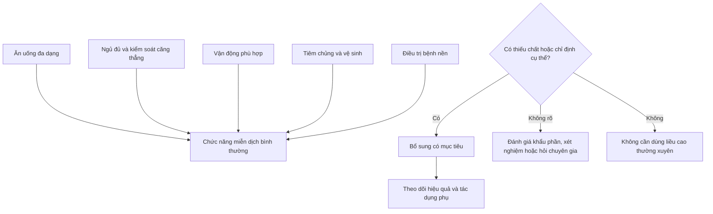
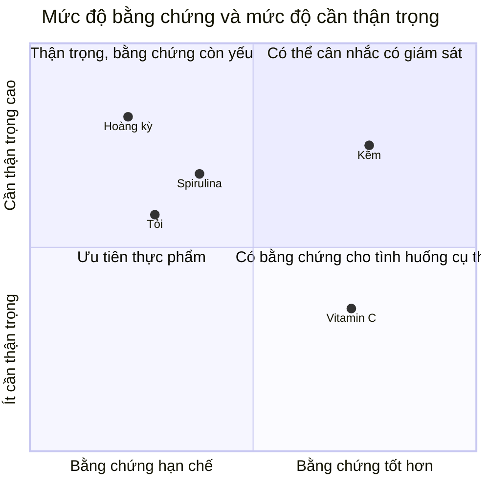
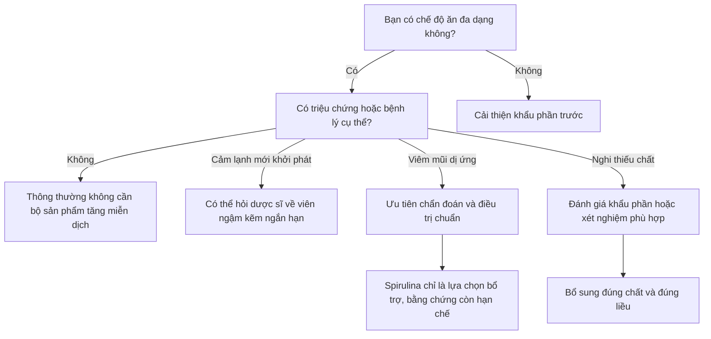

# 087 — 5 Best Supplements To Boost Immunity

> **Bản hiệu đính theo bằng chứng khoa học:** Cụm từ *“boost immunity”* — “tăng cường miễn dịch” — dễ gây hiểu nhầm. Thực phẩm bổ sung chủ yếu giúp **duy trì chức năng miễn dịch bình thường**, đặc biệt khi cơ thể thiếu chất; chúng không làm hệ miễn dịch trở nên “siêu mạnh” và không thay thế chế độ ăn, giấc ngủ, vận động, tiêm chủng hoặc điều trị y khoa.

| Thuộc tính            | Nội dung                                                                             |
| --------------------- | ------------------------------------------------------------------------------------ |
| **Module**            | Module 09 — More Dieting Tips & Strategies                                           |
| **Bài học**           | 5 Best Supplements To Boost Immunity                                                 |
| **Tên tiếng Việt**    | 5 thực phẩm bổ sung thường được dùng để hỗ trợ hệ miễn dịch                          |
| **Thời lượng**        | 03:56                                                                                |
| **Chủ đề chính**      | Tỏi, kẽm, vitamin C, hoàng kỳ và spirulina                                           |
| **Mức độ bằng chứng** | Không đồng đều; mạnh nhất trong bài là kẽm và vitamin C cho một số tình huống cụ thể |

> **Sửa lỗi bản chép:** “Estra Astroglide” trong transcript thực chất là **Astragalus** — cây **hoàng kỳ**. Những con số về hiệu quả và liều dùng trong bản gốc không nên được xem là khuyến nghị áp dụng cho tất cả mọi người.

---

## Hình ảnh minh họa

| Tỏi                                                                                          | Nguồn vitamin C                                                                                                         |
| -------------------------------------------------------------------------------------------- | ----------------------------------------------------------------------------------------------------------------------- |
|  |  |
| *Tỏi — Allium sativum* ([Wikimedia Commons][1])                                              | *Cam và các loại trái cây có múi là nguồn vitamin C phổ biến.* ([Wikimedia Commons][2])                                 |

| Hoàng kỳ                                                                                                      | Spirulina                                                                                      |
| ------------------------------------------------------------------------------------------------------------- | ---------------------------------------------------------------------------------------------- |
|  |  |
| *Astragalus membranaceus — hoàng kỳ.* ([Wikimedia Commons][3])                                                | *Spirulina là sản phẩm từ vi khuẩn lam thuộc chi Arthrospira.* ([Wikimedia Commons][4])        |

---

## Mục lục

1. [Mục tiêu bài học](#1-mục-tiêu-bài-học)
2. [Nội dung chính](#2-nội-dung-chính)
3. [Áp dụng thực tế](#3-áp-dụng-thực-tế)
4. [Lưu ý & lỗi thường gặp](#4-lưu-ý--lỗi-thường-gặp)
5. [Checklist thực hành](#5-checklist-thực-hành)
6. [Tóm tắt](#6-tóm-tắt)

---

## 1. Mục tiêu bài học

Sau bài học, người học có thể:

* Hiểu thực phẩm bổ sung chỉ là **phần hỗ trợ**, không phải nền tảng chính của sức khỏe miễn dịch.
* Phân biệt giữa:

  * bổ sung để khắc phục thiếu chất;
  * sử dụng ngắn hạn khi có triệu chứng;
  * sử dụng thường xuyên nhưng chưa có đủ bằng chứng.
* Đánh giá mức độ bằng chứng của tỏi, kẽm, vitamin C, hoàng kỳ và spirulina.
* Nhận biết các nguy cơ như dùng quá liều kẽm, tương tác thuốc của tỏi và hoàng kỳ, hoặc ô nhiễm độc tố trong sản phẩm tảo.
* Biết khi nào nên ưu tiên thực phẩm và khi nào cần hỏi bác sĩ, dược sĩ hoặc chuyên gia dinh dưỡng.

---

## 2. Nội dung chính

### 2.1. Thực phẩm bổ sung có thực sự “tăng cường miễn dịch” không?

Hệ miễn dịch là một mạng lưới gồm hàng rào da và niêm mạc, tế bào miễn dịch, kháng thể, cytokine cùng nhiều cơ quan và mô khác nhau. Mục tiêu không phải là kích thích mọi thành phần hoạt động càng mạnh càng tốt, vì phản ứng miễn dịch quá mức cũng có thể gây dị ứng, viêm hoặc làm trầm trọng bệnh tự miễn.

Thực phẩm bổ sung thường mang lại lợi ích rõ nhất khi:

1. Người sử dụng đang thiếu chất.
2. Một chất được dùng đúng dạng, đúng thời điểm cho một tình trạng cụ thể.
3. Liều lượng phù hợp và không gây tương tác với thuốc.

### 2.2. Tổng quan mức độ bằng chứng

| Thành phần    | Lợi ích có khả năng nhất                                                      |      Mức độ bằng chứng | Nhận định thực tế                                                                       |
| ------------- | ----------------------------------------------------------------------------- | ---------------------: | --------------------------------------------------------------------------------------- |
| **Tỏi**       | Có thể hỗ trợ một số chỉ số tim mạch; tác dụng phòng cảm chưa rõ              | Thấp đối với miễn dịch | Có thể dùng như thực phẩm, nhưng chưa đủ cơ sở gọi là chất phòng cảm đã được chứng minh |
| **Kẽm**       | Có thể rút ngắn thời gian cảm lạnh khi dùng sớm dưới dạng viên ngậm hoặc siro |             Trung bình | Có ích trong một số trường hợp, nhưng không nên dùng liều cao kéo dài                   |
| **Vitamin C** | Có thể làm cảm lạnh ngắn hơn một chút khi dùng thường xuyên                   |             Trung bình | Không chữa cảm lạnh; hiệu quả phòng bệnh rõ hơn ở người chịu stress thể lực cực cao     |
| **Hoàng kỳ**  | Một số nghiên cứu ghi nhận thay đổi chỉ dấu miễn dịch                         |                   Thấp | Chưa đủ bằng chứng đáng tin cậy để khuyến nghị cho người khỏe mạnh                      |
| **Spirulina** | Có thể giảm một số triệu chứng viêm mũi dị ứng                                |    Thấp đến trung bình | Không đồng nghĩa với phòng nhiễm trùng hay “tăng miễn dịch” toàn thân                   |

---

### 2.3. Số 1 — Tỏi và thực phẩm bổ sung từ tỏi

#### Tỏi có gì đặc biệt?

Tỏi chứa nhiều hợp chất lưu huỳnh hữu cơ. Khi tỏi được nghiền hoặc băm, các phản ứng enzyme có thể tạo ra allicin và các hợp chất liên quan. Những chất này đã được nghiên cứu về tác dụng chống oxy hóa, viêm, huyết áp và lipid máu.

#### Bằng chứng đối với cảm lạnh và miễn dịch

Một vài nghiên cứu nhỏ ghi nhận nhóm dùng chiết xuất tỏi có ít ngày ốm hơn hoặc triệu chứng nhẹ hơn. Tuy nhiên, các tuyên bố như giảm 61% số ngày ốm hoặc giảm 58% tỷ lệ mắc bệnh chủ yếu dựa trên những thử nghiệm riêng lẻ với số người tham gia hạn chế.

Đánh giá cập nhật của NCCIH cho biết chỉ có rất ít nghiên cứu về tác dụng của tỏi đối với cảm lạnh và cúm. Một tổng quan năm 2022 chỉ tìm thấy hai nghiên cứu gợi ý lợi ích, nhưng cả hai đều nhỏ và có những hạn chế về phương pháp. Vì vậy, chưa thể kết luận rằng viên tỏi phòng cảm lạnh một cách đáng tin cậy. ([NCCIH][5])

#### Cách áp dụng

* Có thể sử dụng tỏi như một loại gia vị trong chế độ ăn.
* Không bắt buộc phải mua viên tỏi nếu khẩu phần đã đa dạng.
* Chưa có liều bổ sung tỏi tiêu chuẩn được xác nhận để “tăng miễn dịch”.
* Các sản phẩm khác nhau có thể chứa tỏi già, dầu tỏi, bột tỏi hoặc lượng hợp chất hoạt tính rất khác nhau.

#### Thận trọng

Tỏi dạng bổ sung có thể gây đau bụng, đầy hơi, buồn nôn, mùi cơ thể và làm tăng nguy cơ chảy máu. Người dùng aspirin, thuốc chống đông, thuốc chống kết tập tiểu cầu hoặc chuẩn bị phẫu thuật cần trao đổi với bác sĩ trước khi sử dụng. ([NCCIH][5])

---

### 2.4. Số 2 — Kẽm

#### Vai trò của kẽm

Kẽm là khoáng chất thiết yếu tham gia vào hoạt động của nhiều enzyme, duy trì hàng rào biểu mô và hỗ trợ cả miễn dịch bẩm sinh lẫn miễn dịch thích ứng. Thiếu kẽm có thể làm suy giảm quá trình hình thành, hoạt hóa và trưởng thành của tế bào lympho. ([ODS][6])

Nguồn thực phẩm chứa kẽm gồm:

* Hàu và các loại hải sản có vỏ.
* Thịt bò, thịt lợn và thịt gia cầm.
* Trứng và các sản phẩm từ sữa.
* Đậu, hạt và ngũ cốc nguyên cám.

#### Kẽm và cảm lạnh

Kết quả nghiên cứu không hoàn toàn đồng nhất. Tuy nhiên, viên ngậm hoặc siro kẽm dùng sớm sau khi xuất hiện triệu chứng có thể rút ngắn thời gian cảm lạnh.

Một phân tích gồm 28 thử nghiệm với 5.446 người ghi nhận triệu chứng ở nhóm sử dụng kẽm chấm dứt trung bình sớm hơn khoảng hai ngày. Kẽm không cho thấy tác dụng rõ ràng trong việc ngăn một người mắc cảm lạnh và ảnh hưởng đến mức độ nặng của triệu chứng vẫn không nhất quán. ([ODS][6])

> **Điểm quan trọng:** Bằng chứng này chủ yếu liên quan đến **viên ngậm kẽm acetate hoặc gluconate dùng sớm**, không có nghĩa rằng uống viên kẽm thông thường hằng ngày sẽ phòng được cảm lạnh.

#### Nhu cầu và giới hạn

* Nhu cầu ở người trưởng thành thường nằm trong khoảng **8–12 mg/ngày**, tùy giới tính và giai đoạn sinh lý.
* Giới hạn dung nạp tối đa đối với người trưởng thành là **40 mg/ngày** từ thực phẩm và sản phẩm bổ sung, trừ khi được điều trị dưới sự giám sát y tế. ([ODS][6])

Bản gốc đề xuất 5–10 mg để phòng bệnh và 25–40 mg khi “có nguy cơ thiếu kẽm”. Cách chia liều này quá đơn giản:

* 5–10 mg/ngày không bảo đảm phòng nhiễm trùng ở người đã đủ kẽm.
* 25–40 mg/ngày không nên tự dùng kéo dài chỉ vì nghi ngờ thiếu chất.
* Các thử nghiệm viên ngậm cảm lạnh sử dụng liều ngắn hạn khác với liều bổ sung dinh dưỡng hằng ngày.

#### Nguy cơ của việc dùng quá nhiều

Kẽm liều cao có thể gây buồn nôn, nôn, tiêu chảy, đau bụng, đau đầu và vị kim loại. Sử dụng liều cao kéo dài có thể gây thiếu đồng, giảm HDL và thậm chí làm suy giảm chức năng miễn dịch. Kẽm cũng có thể làm giảm hấp thu một số kháng sinh và thuốc penicillamine. ([ODS][6])

---

### 2.5. Số 3 — Vitamin C

#### Vai trò sinh học

Vitamin C là chất dinh dưỡng thiết yếu có vai trò:

* Chống oxy hóa.
* Hỗ trợ hoạt động của tế bào miễn dịch.
* Tham gia tổng hợp collagen.
* Hỗ trợ lành vết thương.
* Tăng hấp thu sắt không heme từ thực vật.

Nguồn thực phẩm tốt gồm ổi, cam, quýt, kiwi, dâu tây, ớt chuông, bông cải xanh và rau cải.

#### Vitamin C có ngăn ngừa cảm lạnh không?

Ở phần lớn dân số, uống vitamin C thường xuyên không làm giảm đáng kể nguy cơ mắc cảm lạnh. Tuy nhiên, nó có thể giúp thời gian bị cảm ngắn hơn một chút và triệu chứng nhẹ hơn ở một số người.

Lợi ích phòng cảm có vẻ rõ hơn ở những nhóm chịu stress thể lực rất cao, chẳng hạn vận động viên sức bền hoặc quân nhân hoạt động trong môi trường lạnh. Bắt đầu dùng vitamin C sau khi đã xuất hiện triệu chứng thường không mang lại hiệu quả rõ ràng. ([ODS][7])

#### Nhu cầu tham khảo ở người trưởng thành

| Đối tượng                            | Nhu cầu vitamin C tham khảo |
| ------------------------------------ | --------------------------: |
| Nam trưởng thành                     |                  90 mg/ngày |
| Nữ trưởng thành                      |                  75 mg/ngày |
| Người hút thuốc                      | Cộng thêm khoảng 35 mg/ngày |
| Giới hạn tối đa ở người trưởng thành |               2.000 mg/ngày |

Các mức nhu cầu này thường có thể đạt được bằng rau quả. ([ODS][8])

#### Có nên uống vitamin C hằng ngày?

Vitamin C bổ sung có thể hợp lý khi:

* Khẩu phần rất ít rau và trái cây.
* Có nguy cơ thiếu vitamin C.
* Đang trong giai đoạn ăn kiêng hạn chế nhiều nhóm thực phẩm.
* Có chỉ định của bác sĩ hoặc chuyên gia dinh dưỡng.

Ngược lại, việc dùng 1.000–2.000 mg mỗi ngày không mặc nhiên tạo ra lợi ích miễn dịch lớn hơn. Liều cao có thể gây tiêu chảy, buồn nôn và đau quặn bụng. Người mắc bệnh thừa sắt cần đặc biệt thận trọng. ([ODS][7])

---

### 2.6. Số 4 — Hoàng kỳ

#### Hoàng kỳ là gì?

Hoàng kỳ, tên khoa học *Astragalus membranaceus*, là một loại cây có rễ được sử dụng trong y học cổ truyền Trung Quốc. Các sản phẩm hoàng kỳ thường được quảng bá cho nhiễm trùng đường hô hấp, viêm mũi dị ứng, mệt mỏi và “điều hòa miễn dịch”.

#### Bằng chứng hiện nay

Một số nghiên cứu ghi nhận thay đổi về kháng thể, tế bào miễn dịch hoặc cytokine sau khi sử dụng hoàng kỳ. Tuy nhiên, nhiều nghiên cứu:

* Có quy mô nhỏ.
* Sử dụng chế phẩm và liều lượng khác nhau.
* Kết hợp hoàng kỳ với nhiều dược liệu hoặc thuốc khác.
* Có nguy cơ sai lệch cao.

NCCIH kết luận hiện chưa có đủ bằng chứng khoa học đáng tin cậy để xác định hoàng kỳ hữu ích cho bất kỳ tình trạng sức khỏe cụ thể nào. Một tổng quan năm 2023 ghi nhận một số thay đổi về đáp ứng miễn dịch, nhưng các nghiên cứu nhỏ và không đồng nhất. ([NCCIH][9])

#### Vấn đề về liều dùng

Con số “250–500 mg, ba đến bốn lần mỗi ngày” trong bản chép không phải là một liều miễn dịch tiêu chuẩn được xác nhận. Các sản phẩm có thể khác nhau về:

* Loài cây.
* Bộ phận sử dụng.
* Tỷ lệ chiết xuất.
* Hàm lượng polysaccharide hoặc hoạt chất.
* Độ tinh khiết.

Vì vậy, không nên chuyển trực tiếp liều của một nghiên cứu hoặc một sản phẩm sang sản phẩm khác.

#### Ai nên tránh?

Hoàng kỳ có thể làm thay đổi hoạt động miễn dịch. Người mắc bệnh tự miễn hoặc đang dùng thuốc ức chế miễn dịch nên tránh hoặc chỉ sử dụng khi được bác sĩ cho phép. Chưa có đủ dữ liệu an toàn cho phụ nữ mang thai và cho con bú. ([NCCIH][9])

---

### 2.7. Số 5 — Spirulina

#### Spirulina là gì?

Spirulina là tên thương mại thường dùng cho sinh khối của các vi khuẩn lam thuộc chi *Arthrospira*. Sản phẩm có thể được bán dưới dạng bột, viên nén hoặc viên nang.

Spirulina cung cấp protein và một số vi chất, nhưng hàm lượng dinh dưỡng khác nhau tùy cách nuôi, thu hoạch và chế biến.

#### Tác dụng đối với dị ứng

Một số thử nghiệm nhỏ cho thấy spirulina có thể làm giảm triệu chứng viêm mũi dị ứng như:

* Nghẹt mũi.
* Chảy nước mũi.
* Hắt hơi.
* Giảm khả năng ngửi.

Một thử nghiệm lâm sàng ghi nhận spirulina cải thiện nhiều triệu chứng viêm mũi dị ứng, nhưng cần nghiên cứu lớn và độc lập hơn để xác nhận hiệu quả. ([PubMed Central (PMC)][10])

> Việc giảm triệu chứng dị ứng không đồng nghĩa với việc spirulina đã được chứng minh là giúp cơ thể chống lại virus hoặc vi khuẩn tốt hơn.

#### Liều dùng

Một số nghiên cứu về viêm mũi dị ứng sử dụng khoảng 2 g/ngày. Tuy nhiên:

* Chưa có “liều tăng miễn dịch” tiêu chuẩn.
* Không nên xem 2 g/ngày là khuyến nghị cho mọi người.
* Spirulina không phải chất dinh dưỡng bắt buộc nếu khẩu phần đã đầy đủ.

#### Chất lượng sản phẩm

Các sản phẩm tảo có thể bị nhiễm microcystin — độc tố không thể nhận biết bằng mắt, mùi hoặc vị. Ở mức đáng kể, microcystin có thể gây tổn thương gan và thận. FDA khuyến nghị nhà sản xuất kiểm tra từng lô và cung cấp chứng nhận phân tích để kiểm soát nguy cơ ô nhiễm. ([U.S. Food and Drug Administration][11])

Khi lựa chọn sản phẩm, nên ưu tiên:

* Có kiểm nghiệm độc lập.
* Có mã lô và hạn sử dụng rõ ràng.
* Có chứng nhận phân tích chất lượng.
* Công bố kiểm tra microcystin, vi sinh vật và kim loại nặng.
* Không quảng cáo chữa khỏi bệnh.

---

### 2.8. So sánh trực tiếp năm sản phẩm

> Sơ đồ mang tính minh họa giáo dục, không phải hệ thống chấm điểm y khoa chính thức.

---

## 3. Áp dụng thực tế

### 3.1. Nguyên tắc ưu tiên

Thay vì bắt đầu bằng việc mua nhiều viên bổ sung, hãy thực hiện theo thứ tự:

1. Đảm bảo đủ năng lượng và protein.
2. Ăn nhiều loại rau, trái cây, đậu, hạt, ngũ cốc và thực phẩm giàu kẽm.
3. Ngủ đủ và có lịch ngủ tương đối ổn định.
4. Vận động đều nhưng tránh tập quá sức kéo dài.
5. Kiểm soát rượu bia và không hút thuốc.
6. Điều trị các bệnh nền.
7. Bổ sung có mục tiêu khi khẩu phần không đáp ứng hoặc có chỉ định.

Tiêm chủng vẫn là một trong những biện pháp hiệu quả nhất để phòng các bệnh truyền nhiễm có vaccine; không có sản phẩm tự nhiên nào thay thế được vaccine cúm. ([NCCIH][12])

### 3.2. Sơ đồ ra quyết định

### 3.3. Cách tiếp cận “food first”

| Dưỡng chất hoặc thành phần | Nguồn thực phẩm ưu tiên                                |
| -------------------------- | ------------------------------------------------------ |
| Hợp chất từ tỏi            | Tỏi tươi dùng trong món ăn                             |
| Kẽm                        | Hàu, thịt, trứng, sữa, đậu, hạt                        |
| Vitamin C                  | Ổi, cam, quýt, kiwi, dâu, ớt chuông, bông cải          |
| Hoàng kỳ                   | Không phải thành phần thiết yếu của khẩu phần          |
| Spirulina                  | Không cần thiết nếu khẩu phần đã đủ protein và vi chất |

### 3.4. Ví dụ thực hành trong một ngày

* **Bữa sáng:** trứng, sữa chua và một phần trái cây.
* **Bữa trưa:** thịt, cá hoặc đậu; rau xanh và cơm hoặc ngũ cốc.
* **Bữa phụ:** ổi, cam, kiwi hoặc hạt.
* **Bữa tối:** protein, rau đa dạng màu sắc và món có tỏi.
* **Nước uống:** ưu tiên nước lọc; hạn chế đồ uống có cồn.
* **Thực phẩm bổ sung:** chỉ thêm khi có lý do cụ thể, không dùng theo tâm lý “càng nhiều càng tốt”.

---

## 4. Lưu ý & lỗi thường gặp

### 4.1. Hiểu “hỗ trợ miễn dịch” là “không bao giờ bị bệnh”

Không có thực phẩm bổ sung nào bảo đảm ngăn chặn mọi bệnh nhiễm trùng. Người có chế độ ăn tốt vẫn có thể bị cảm lạnh, cúm hoặc các bệnh truyền nhiễm khác.

### 4.2. Chọn năm sản phẩm và uống cùng lúc

Dùng nhiều sản phẩm đồng thời làm tăng nguy cơ:

* Trùng lặp thành phần.
* Vượt giới hạn an toàn.
* Tương tác với thuốc.
* Khó xác định sản phẩm nào gây tác dụng phụ.

### 4.3. Uống kẽm liều cao kéo dài

Đây là một trong những lỗi đáng lo nhất. Kẽm quá liều có thể gây thiếu đồng và cuối cùng làm suy giảm chức năng miễn dịch — trái ngược với mục tiêu ban đầu. ([ODS][6])

### 4.4. Chỉ uống vitamin C khi đã bị cảm

Dữ liệu hiện có gợi ý vitamin C cần được sử dụng thường xuyên trước đó mới có khả năng làm giảm nhẹ thời gian cảm lạnh. Bắt đầu sau khi triệu chứng xuất hiện thường ít có lợi. ([ODS][7])

### 4.5. Tin rằng “tự nhiên” đồng nghĩa với “an toàn”

Tỏi có thể tăng nguy cơ chảy máu. Hoàng kỳ có thể không phù hợp với bệnh tự miễn hoặc thuốc ức chế miễn dịch. Spirulina có nguy cơ nhiễm độc tố nếu sản xuất không được kiểm soát.

### 4.6. Dùng thực phẩm bổ sung để thay thế điều trị

Không dùng các sản phẩm này thay cho thuốc kháng sinh khi có chỉ định, thuốc điều trị cúm, thuốc dị ứng, vaccine hoặc chăm sóc y tế.

### 4.7. Bỏ qua các nhóm cần thận trọng

Cần hỏi bác sĩ hoặc dược sĩ trước khi sử dụng nếu thuộc một trong các nhóm:

* Phụ nữ mang thai hoặc cho con bú.
* Trẻ em.
* Người mắc bệnh gan hoặc thận.
* Người mắc bệnh tự miễn.
* Người đang hóa trị hoặc xạ trị.
* Người dùng thuốc chống đông, thuốc ức chế miễn dịch hoặc nhiều thuốc cùng lúc.
* Người chuẩn bị phẫu thuật.

### 4.8. Tin vào các con số phần trăm từ một nghiên cứu nhỏ

Một nghiên cứu có kết quả nổi bật chưa đủ để chứng minh sản phẩm hiệu quả cho toàn bộ dân số. Cần xem xét:

* Số lượng người tham gia.
* Nhóm đối chứng.
* Khả năng làm mù.
* Nguồn tài trợ.
* Tính lặp lại ở các nghiên cứu khác.
* Sự khác nhau giữa kết quả thống kê và lợi ích thực tế.

---

## 5. Checklist thực hành

### Trước khi mua

* [ ] Tôi đã xác định mục tiêu cụ thể: thiếu chất, cảm lạnh, dị ứng hay chỉ lo lắng chung?
* [ ] Tôi đã kiểm tra thành phần từ các sản phẩm khác để tránh trùng liều.
* [ ] Tôi đã ưu tiên cải thiện thực phẩm, giấc ngủ và vận động.
* [ ] Sản phẩm có nhãn, mã lô và hàm lượng rõ ràng.
* [ ] Sản phẩm không quảng cáo chữa khỏi cảm lạnh, cúm hoặc bệnh truyền nhiễm.
* [ ] Sản phẩm thảo dược hoặc tảo có kiểm nghiệm độc lập.
* [ ] Tôi đã kiểm tra tương tác với thuốc đang dùng.

### Trong quá trình sử dụng

* [ ] Không vượt liều ghi trên nhãn hoặc liều chuyên gia chỉ định.
* [ ] Không dùng kẽm liều cao kéo dài.
* [ ] Theo dõi buồn nôn, tiêu chảy, đau bụng, phát ban hoặc chảy máu bất thường.
* [ ] Ngừng dùng và hỏi chuyên gia khi xuất hiện tác dụng phụ.
* [ ] Không tự tăng liều khi không thấy hiệu quả ngay.
* [ ] Đánh giá lại sau một khoảng thời gian xác định thay vì sử dụng vô thời hạn.

### Khi bị bệnh

* [ ] Không trì hoãn khám bệnh vì đang dùng thực phẩm bổ sung.
* [ ] Đi khám nếu sốt cao, khó thở, đau ngực, mất nước hoặc triệu chứng nặng dần.
* [ ] Không dùng thực phẩm bổ sung thay cho thuốc được kê đơn.
* [ ] Đặc biệt thận trọng nếu người bệnh là trẻ nhỏ, người cao tuổi hoặc có bệnh nền.

---

## 6. Tóm tắt

1. **Tỏi:** Là thực phẩm lành mạnh, nhưng bằng chứng phòng cảm lạnh từ viên bổ sung còn rất hạn chế.

2. **Kẽm:** Có bằng chứng tốt nhất trong năm chất đối với việc rút ngắn cảm lạnh khi dùng sớm dưới dạng phù hợp. Tuy nhiên, dùng liều cao kéo dài có thể gây thiếu đồng và tác dụng phụ.

3. **Vitamin C:** Có thể làm thời gian cảm lạnh ngắn hơn một chút khi dùng thường xuyên; không phải thuốc chữa cảm và không nhất thiết cần bổ sung nếu khẩu phần giàu rau quả.

4. **Hoàng kỳ:** Một số nghiên cứu cho thấy ảnh hưởng đến các chỉ dấu miễn dịch, nhưng chất lượng bằng chứng chưa đủ để khuyến nghị rộng rãi. Cần tránh ở người mắc bệnh tự miễn hoặc dùng thuốc ức chế miễn dịch.

5. **Spirulina:** Có thể hỗ trợ một số triệu chứng viêm mũi dị ứng, nhưng chưa được chứng minh là phòng nhiễm trùng. Chất lượng và nguy cơ nhiễm độc tố của sản phẩm cần được kiểm soát.

> **Thông điệp chính:** Không có “combo năm viên” phù hợp cho tất cả mọi người. Giá trị lớn nhất của thực phẩm bổ sung nằm ở việc **bổ sung đúng chất, cho đúng người, đúng thời điểm và đúng liều**.

[1]: https://commons.wikimedia.org/wiki/File%3AGarlic_Bulbs.jpg?utm_source=chatgpt.com "File:Garlic Bulbs.jpg - Wikimedia Commons"
[2]: https://commons.wikimedia.org/wiki/File%3AOranges_gives_Vitamin_C.jpg?utm_source=chatgpt.com "File:Oranges gives Vitamin C.jpg - Wikimedia Commons"
[3]: https://commons.wikimedia.org/wiki/File%3AAstragalus_membranaceus.jpg?utm_source=chatgpt.com "File:Astragalus membranaceus.jpg - Wikimedia Commons"
[4]: https://commons.wikimedia.org/wiki/File%3ASpirulina.jpg?utm_source=chatgpt.com "File:Spirulina.jpg - Wikimedia Commons"
[5]: https://www.nccih.nih.gov/health/garlic "Garlic: Usefulness and Safety | NCCIH"
[6]: https://ods.od.nih.gov/factsheets/ImmuneFunction-HealthProfessional/ "Dietary Supplements for Immune Function and Infectious Diseases - Health Professional Fact Sheet"
[7]: https://ods.od.nih.gov/factsheets/ImmuneFunction-Consumer/ "Dietary Supplements for Immune Function and Infectious Diseases - Consumer"
[8]: https://ods.od.nih.gov/factsheets/VitaminC-HealthProfessional/?utm_source=chatgpt.com "Vitamin C - Health Professional Fact Sheet"
[9]: https://www.nccih.nih.gov/health/astragalus "Astragalus: Usefulness and Safety | NCCIH"
[10]: https://pmc.ncbi.nlm.nih.gov/articles/PMC7416373/?utm_source=chatgpt.com "Clinical comparison of the efficacy of spirulina platensis ... - PMC"
[11]: https://www.fda.gov/food/natural-toxins-food/blue-green-algae-products-and-microcystins "Blue-Green Algae Products and Microcystins | FDA"
[12]: https://www.nccih.nih.gov/health/tips/tips-natural-products-for-the-flu-and-colds-what-does-the-science-say?utm_source=chatgpt.com "5 Tips: Natural Products for the Flu and Colds: What Does the ..."

---

# Bài luyện tập

## Mục tiêu

## Đề bài

## Yêu cầu hoàn thành

- [ ] 
- [ ] 
- [ ] 

## Kết quả / lời giải

## Ghi chú
