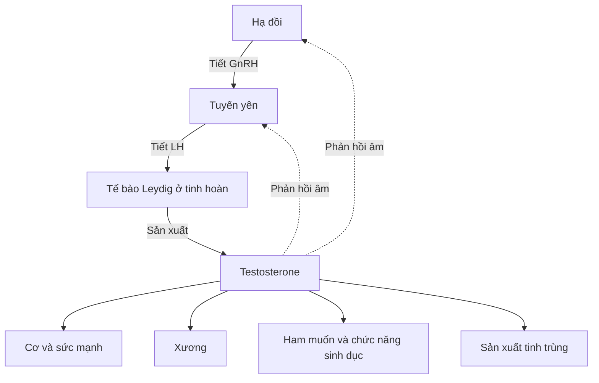
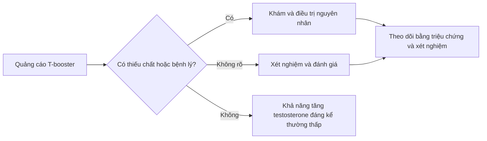
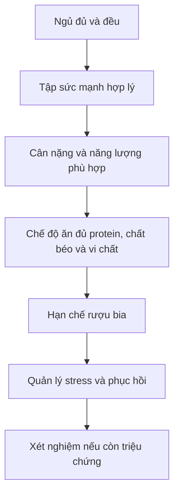

# 088 — Cách tăng testosterone tự nhiên

## How To Naturally Increase Testosterone

| Thuộc tính       | Nội dung                                                                            |
| ---------------- | ----------------------------------------------------------------------------------- |
| **Module**       | Module 09 — More Dieting Tips & Strategies                                          |
| **Bài học**      | How To Naturally Increase Testosterone                                              |
| **Thời lượng**   | 06:36                                                                               |
| **Chủ đề chính** | Cách duy trì và tối ưu testosterone bằng dinh dưỡng, vận động, giấc ngủ và lối sống |

*Hình 1. Mô hình ba chiều của phân tử testosterone. [Nguồn ảnh Wikimedia Commons](https://commons.wikimedia.org/wiki/File:Testosterone-from-xtal-3D-vdW.png). Ảnh mô tả phân tử testosterone có công thức C₁₉H₂₈O₂. ([Wikimedia Commons][1])*

> [!IMPORTANT]
> “Tăng testosterone tự nhiên” nên được hiểu là **loại bỏ những yếu tố đang làm testosterone thấp hơn mức sinh lý phù hợp với cơ thể**, không phải đẩy hormone lên mức siêu sinh lý như khi sử dụng steroid đồng hóa.

## Mục lục

1. [Mục tiêu bài học](#1-mục-tiêu-bài-học)
2. [Nội dung chính](#2-nội-dung-chính)
3. [Áp dụng thực tế](#3-áp-dụng-thực-tế)
4. [Lưu ý và lỗi thường gặp](#4-lưu-ý-và-lỗi-thường-gặp)
5. [Checklist thực hành](#5-checklist-thực-hành)
6. [Tóm tắt](#6-tóm-tắt)

---

## 1. Mục tiêu bài học

Sau bài học này, người học có thể:

* Hiểu vai trò cơ bản của testosterone đối với cơ, xương, chức năng sinh dục, ham muốn và sức khỏe tổng thể.
* Phân biệt giữa **tối ưu hormone bằng lối sống** và sử dụng testosterone hoặc steroid từ bên ngoài.
* Biết những yếu tố có thể làm testosterone giảm như thiếu ngủ, béo phì, uống nhiều rượu, thiếu vi chất, thiếu năng lượng kéo dài hoặc tập luyện quá mức.
* Xây dựng kế hoạch thực tế gồm dinh dưỡng cân bằng, tập sức mạnh, kiểm soát cân nặng, ngủ đủ và quản lý căng thẳng.
* Nhận biết khi nào cần xét nghiệm và thăm khám thay vì tự sử dụng “testosterone booster”.

Testosterone là androgen chủ yếu ở nam giới, nhưng nữ giới cũng sản xuất một lượng nhỏ. Hormone này tham gia duy trì khối lượng cơ, sức khỏe xương, ham muốn tình dục và nhiều chức năng sinh sản. Nồng độ quá thấp hoặc quá cao đều có thể gây vấn đề sức khỏe. ([Cleveland Clinic][2])

---

## 2. Nội dung chính

### 2.1. Testosterone được điều hòa như thế nào?

Ở nam giới, phần lớn testosterone được sản xuất tại tế bào Leydig của tinh hoàn thông qua **trục hạ đồi – tuyến yên – tuyến sinh dục**:

*Hình 2. Sơ đồ trục hạ đồi – tuyến yên – tuyến sinh dục. [Nguồn ảnh Wikimedia Commons](https://commons.wikimedia.org/wiki/File:Hypothalamic–pituitary–gonadal_axis_in_males.png), giấy phép CC BY 4.0. ([Wikimedia Commons][3])*

Việc đưa testosterone từ bên ngoài vào có thể tạo phản hồi âm mạnh lên trục hormone này. Vì vậy, testosterone kê đơn và steroid đồng hóa không phải là biện pháp “tự nhiên” và không nên được sử dụng khi chưa có chẩn đoán, chỉ định và theo dõi y tế.

---

### 2.2. Giới hạn của các phương pháp tự nhiên

Di truyền, tuổi tác, tình trạng sức khỏe, thành phần cơ thể và chức năng của trục nội tiết quyết định phần lớn mức testosterone nền. Các phương pháp tự nhiên thường mang lại hiệu quả rõ nhất khi một người đang có yếu tố gây giảm testosterone, chẳng hạn:

* Thiếu vitamin D hoặc kẽm.
* Béo phì và rối loạn chuyển hóa.
* Thiếu ngủ kéo dài.
* Uống rượu quá mức.
* Ăn kiêng quá khắt khe.
* Tập luyện quá sức và phục hồi không đầy đủ.
* Có bệnh lý nội tiết hoặc bệnh mạn tính chưa được điều trị.

Do đó, lối sống lành mạnh có thể giúp một người tiến gần hơn đến **mức testosterone sinh lý tối ưu của chính họ**, nhưng không biến một người mới tập thành vận động viên thể hình trong vài tuần.

---

### 2.3. Ưu tiên thành phần cơ thể và cân nặng phù hợp

Ở nam giới thừa cân hoặc béo phì, giảm cân có thể làm tăng testosterone toàn phần và testosterone tự do, đặc biệt khi mức testosterone thấp liên quan đến béo phì. Mức cải thiện thường phụ thuộc vào lượng cân nặng và mỡ cơ thể giảm được. ([PubMed][4])

Điều này không có nghĩa là phải giảm cân bằng mọi giá. Một mức thâm hụt năng lượng quá lớn, kéo dài, kết hợp với khối lượng tập luyện cao có thể tạo stress sinh lý và làm suy giảm khả năng phục hồi.

**Chiến lược hợp lý:**

* Giảm cân từ từ nếu đang thừa cân hoặc béo phì.
* Duy trì đủ protein và chất béo.
* Tập sức mạnh để bảo tồn khối cơ.
* Tránh chế độ ăn cực thấp calo kéo dài.
* Có các giai đoạn duy trì cân nặng khi cần thiết.

---

### 2.4. Ăn đủ chất béo nhưng không cần “nạp mỡ” để tăng hormone

Chất béo tham gia cấu tạo màng tế bào, hỗ trợ hấp thu vitamin tan trong dầu và cung cấp nguyên liệu cho nhiều quá trình sinh học. Một số nghiên cứu trước đây ghi nhận chế độ ăn rất ít chất béo có thể làm giảm nhẹ testosterone ở nam giới. Tuy nhiên, một phân tích tổng hợp mới hơn không tìm thấy khác biệt có ý nghĩa rõ ràng giữa chế độ ăn ít và nhiều chất béo đối với các hormone sinh dục. Vì vậy, bằng chứng hiện vẫn chưa hoàn toàn thống nhất. ([PubMed][5])

Không có bằng chứng cho thấy chỉ cần tăng chất béo lên 30–40% năng lượng là testosterone sẽ liên tục tăng. Cách tiếp cận phù hợp hơn là **tránh chế độ ăn cực ít chất béo** và duy trì khẩu phần cân bằng.

#### Nguồn chất béo nên ưu tiên

| Nhóm                          | Thực phẩm gợi ý                                              |
| ----------------------------- | ------------------------------------------------------------ |
| **Không bão hòa đơn**         | Dầu ô liu, quả bơ, hạnh nhân, hạt điều                       |
| **Omega-3**                   | Cá hồi, cá mòi, cá thu, hạt chia, hạt lanh                   |
| **Không bão hòa đa**          | Các loại hạt, dầu thực vật phù hợp                           |
| **Chất béo bão hòa tự nhiên** | Trứng, sữa, thịt — sử dụng trong chế độ ăn tổng thể cân bằng |

> Không nên tăng thịt chế biến, bơ, mỡ động vật hoặc đồ chiên chỉ với mục đích “tăng testosterone”.

---

### 2.5. Vitamin D: chỉ bổ sung đúng khi có nhu cầu

Vitamin D có vai trò quan trọng đối với xương, cơ và nhiều quá trình sinh học. Một số phân tích tổng hợp cho thấy bổ sung vitamin D **có thể** làm tăng nhẹ testosterone toàn phần ở một số nam giới, nhưng kết quả giữa các nghiên cứu chưa nhất quán và vẫn cần thêm thử nghiệm chất lượng cao. ([PubMed Central (PMC)][6])

Xét nghiệm được sử dụng để đánh giá tình trạng vitamin D là **25-hydroxyvitamin D — 25(OH)D**. NIH cho biết mức dưới 30 nmol/L, tương đương dưới 12 ng/mL, có liên quan đến thiếu vitamin D; từ 50 nmol/L hay 20 ng/mL trở lên được xem là đủ đối với phần lớn người khỏe mạnh. Tuy nhiên, không nên tự diễn giải kết quả xét nghiệm mà bỏ qua bối cảnh sức khỏe cá nhân. ([ODS][7])

#### Nguồn vitamin D

* Ánh nắng phù hợp với loại da, vị trí địa lý và thời điểm trong ngày.
* Cá béo.
* Lòng đỏ trứng.
* Sữa hoặc thực phẩm được tăng cường vitamin D.
* Viên bổ sung khi có chỉ định phù hợp.

Không nên tự sử dụng vitamin D liều cao trong thời gian dài để “tăng testosterone”. Đưa vitamin D từ mức thiếu về mức đủ khác hoàn toàn với việc dùng liều cao khi cơ thể đã đủ.

---

### 2.6. Kẽm: hữu ích nhất khi đang thiếu

Thiếu kẽm có liên quan đến testosterone thấp hơn, và việc bổ sung có thể giúp phục hồi testosterone ở người thiếu kẽm. Tuy nhiên, khi lượng kẽm đã đầy đủ, bổ sung thêm không bảo đảm testosterone tiếp tục tăng. ([PubMed][8])

Nhu cầu kẽm khuyến nghị đối với người trưởng thành là:

| Đối tượng                          | Lượng kẽm khuyến nghị |
| ---------------------------------- | --------------------: |
| Nam trưởng thành                   |        **11 mg/ngày** |
| Nữ trưởng thành                    |         **8 mg/ngày** |
| Ngưỡng tối đa dung nạp ở người lớn |        **40 mg/ngày** |

Các giá trị trên tính tổng lượng kẽm từ thức ăn, đồ uống, thực phẩm bổ sung và thuốc. ([ODS][9])

#### Thực phẩm giàu kẽm

* Hàu và các loại động vật có vỏ.
* Thịt bò, thịt lợn và thịt gia cầm.
* Sữa và phô mai.
* Đậu, hạt bí, hạt điều và ngũ cốc nguyên hạt.

Dùng kẽm liều cao kéo dài có thể cản trở hấp thu đồng và gây thiếu đồng. Vì vậy, không nên mặc định sử dụng viên kẽm 30–50 mg mỗi ngày chỉ để hỗ trợ hormone. ([ODS][10])

---

### 2.7. Tập luyện sức mạnh

Một buổi tập sức mạnh cường độ vừa đến cao có thể làm testosterone tăng tạm thời sau khi tập. Tuy nhiên, mức tăng cấp tính này thường trở về nền và không đồng nghĩa testosterone lúc nghỉ sẽ tăng lâu dài. Lợi ích xây dựng cơ của tập luyện chủ yếu đến từ kích thích cơ học, tăng tổng hợp protein cơ, tăng kỹ năng vận động và khả năng tăng tải theo thời gian. ([PubMed Central (PMC)][11])

#### Nguyên tắc tập phù hợp

* Tập sức mạnh khoảng **2–4 buổi mỗi tuần**.
* Ưu tiên các nhóm cơ lớn.
* Tăng tải hoặc số lần lặp một cách từ từ.
* Dành đủ thời gian phục hồi cho từng nhóm cơ.
* Không cần tập đến kiệt sức trong mọi hiệp.
* Kết hợp vận động tim mạch với mức độ phù hợp.

Ví dụ một tuần:

| Ngày      | Hoạt động                        |
| --------- | -------------------------------- |
| Thứ Hai   | Tập toàn thân hoặc thân trên     |
| Thứ Ba    | Đi bộ, vận động nhẹ              |
| Thứ Tư    | Tập thân dưới                    |
| Thứ Năm   | Nghỉ hoặc cardio nhẹ             |
| Thứ Sáu   | Tập toàn thân                    |
| Cuối tuần | Nghỉ chủ động, thể thao giải trí |

---

### 2.8. Ngủ đủ và cải thiện chất lượng giấc ngủ

Một nghiên cứu nhỏ trên 10 nam giới trẻ ghi nhận ngủ khoảng 5 giờ mỗi đêm trong một tuần làm testosterone ban ngày giảm khoảng 10–15%. Tuy nhiên, nghiên cứu sau đó không phải lúc nào cũng tái hiện được kết quả tương tự. Điều này cho thấy mối liên hệ giữa giấc ngủ và testosterone có thật nhưng phụ thuộc vào thời lượng, chất lượng, tuổi, sức khỏe và thiết kế nghiên cứu. ([PubMed Central (PMC)][12])

Khuyến nghị đồng thuận dành cho người trưởng thành là ngủ đều đặn **từ 7 giờ trở lên mỗi đêm** để hỗ trợ sức khỏe; nhiều người hoạt động tốt nhất trong khoảng 7–9 giờ. ([JCSM][13])

#### Cách cải thiện giấc ngủ

* Đi ngủ và thức dậy vào thời gian tương đối cố định.
* Hạn chế caffeine vào chiều tối.
* Tránh uống nhiều rượu gần giờ ngủ.
* Giảm ánh sáng mạnh và màn hình trước khi ngủ.
* Giữ phòng ngủ tối, mát và yên tĩnh.
* Điều trị ngáy to, khó thở hoặc nghi ngờ ngưng thở khi ngủ.
* Không tập quá nặng sát giờ ngủ nếu điều đó khiến khó ngủ.

---

### 2.9. Hạn chế rượu bia

Uống nhiều rượu, đặc biệt khi diễn ra thường xuyên và kéo dài, có thể làm suy giảm quá trình tổng hợp testosterone, ảnh hưởng chức năng tinh hoàn và sức khỏe sinh sản nam giới. ([PubMed][14])

Do phản ứng với rượu khác nhau giữa các cá nhân, cách tiếp cận an toàn là:

* Không sử dụng rượu như một phần bắt buộc của lối sống.
* Giảm số ngày uống trong tuần.
* Tránh uống lượng lớn trong một lần.
* Không dùng rượu để dễ ngủ.
* Lưu ý tổng năng lượng từ đồ uống có cồn.

---

### 2.10. Quản lý stress và tránh quá tải phục hồi

Không nên hiểu đơn giản rằng “cortisol cao thì testosterone chắc chắn thấp”. Cortisol và testosterone thay đổi theo thời gian trong ngày, tập luyện, năng lượng nạp vào, giấc ngủ và tình trạng sức khỏe.

Tuy vậy, stress kéo dài thường đi kèm với những hành vi bất lợi cho hormone và sức khỏe như:

* Ngủ ít.
* Ăn uống thất thường.
* Dùng nhiều rượu hoặc chất kích thích.
* Giảm vận động.
* Tập luyện quá sức.
* Khó duy trì cân nặng và chế độ ăn ổn định.

#### Những phương pháp thực tế

* Đi bộ ngoài trời.
* Thiền hoặc tập thở 5–10 phút.
* Giảm số buổi tập khi cơ thể chưa phục hồi.
* Lập kế hoạch công việc và thời gian nghỉ.
* Duy trì quan hệ xã hội tích cực.
* Trao đổi với chuyên gia tâm lý nếu stress kéo dài hoặc ảnh hưởng nghiêm trọng đến cuộc sống.

*Hình 3. Những trụ cột lối sống gồm dinh dưỡng, vận động, giấc ngủ phục hồi, quan hệ xã hội, quản lý stress và giảm các chất có hại. [Nguồn ảnh Wikimedia Commons](https://commons.wikimedia.org/wiki/File:Lifestyle_Medicine_Pillars.png). ([Wikimedia Commons][15])*

---

### 2.11. Thực phẩm bổ sung “testosterone booster”

Phần lớn sản phẩm được quảng cáo là “T-booster” không có bằng chứng đủ mạnh để chứng minh rằng chúng làm tăng testosterone ở mức có ý nghĩa lâm sàng hoặc giúp tăng cơ rõ rệt.

Một nghiên cứu khảo sát 50 sản phẩm cho thấy phần lớn tuyên bố có khả năng tăng testosterone, nhưng chỉ một tỷ lệ nhỏ thành phần có dữ liệu khoa học hỗ trợ; một số sản phẩm còn chứa vitamin và khoáng chất ở liều cao. ([PubMed Central (PMC)][16])

Một tổng quan hệ thống khác cũng kết luận bằng chứng đối với các sản phẩm tăng testosterone không kê đơn vẫn hạn chế và không đồng nhất. ([PubMed][17])

---

## 3. Áp dụng thực tế

### 3.1. Thứ tự ưu tiên

Thay vì mua thực phẩm bổ sung trước, hãy xử lý các yếu tố theo thứ tự:

### 3.2. Mẫu kế hoạch một ngày

| Thời điểm      | Gợi ý                                                                           |
| -------------- | ------------------------------------------------------------------------------- |
| **Buổi sáng**  | Thức dậy đúng giờ, tiếp xúc ánh sáng tự nhiên, ăn sáng giàu protein nếu phù hợp |
| **Buổi trưa**  | Bữa ăn gồm protein, rau, carbohydrate và chất béo tốt                           |
| **Buổi chiều** | Tập sức mạnh hoặc đi bộ nhanh                                                   |
| **Sau tập**    | Bổ sung nước, protein và carbohydrate phù hợp                                   |
| **Buổi tối**   | Ăn vừa đủ, hạn chế rượu và caffeine                                             |
| **Trước ngủ**  | Giảm màn hình, thư giãn và chuẩn bị phòng ngủ                                   |
| **Ban đêm**    | Mục tiêu ngủ khoảng 7–9 giờ                                                     |

### 3.3. Mẫu thực đơn hỗ trợ sức khỏe hormone

#### Bữa sáng

* Trứng.
* Yến mạch.
* Sữa chua không đường.
* Trái cây.
* Một ít hạt.

#### Bữa trưa

* Cơm hoặc khoai.
* Cá, thịt nạc, đậu phụ hoặc thịt gia cầm.
* Rau xanh.
* Dầu ô liu hoặc quả bơ.

#### Bữa phụ

* Sữa chua, sữa hoặc phô mai.
* Trái cây.
* Hạt bí hoặc hạt điều.

#### Bữa tối

* Cá béo hoặc thịt nạc.
* Rau củ.
* Cơm, khoai hoặc ngũ cốc nguyên hạt.
* Lượng chất béo vừa phải.

---

### 3.4. Khi nào nên xét nghiệm testosterone?

Không nên chẩn đoán testosterone thấp chỉ dựa trên mệt mỏi, giảm động lực hoặc một kết quả xét nghiệm ngẫu nhiên.

Theo hướng dẫn của Endocrine Society, chẩn đoán suy sinh dục nam cần có:

1. Các triệu chứng hoặc dấu hiệu phù hợp.
2. Testosterone huyết thanh thấp rõ ràng và lặp lại.
3. Xác nhận bằng ít nhất hai lần xét nghiệm testosterone toàn phần vào buổi sáng, thường khi đói.
4. Đánh giá nguyên nhân bằng các xét nghiệm nội tiết khác khi cần thiết. ([Endocrine][18])

#### Các dấu hiệu cần trao đổi với bác sĩ

* Giảm ham muốn kéo dài.
* Rối loạn cương.
* Giảm cương tự phát buổi sáng.
* Khó có con.
* Giảm khối cơ hoặc sức mạnh không giải thích được.
* Loãng xương hoặc gãy xương bất thường.
* Mệt mỏi kéo dài đi kèm nhiều triệu chứng khác.
* Dậy thì chậm hoặc bất thường.
* Đang sử dụng thuốc có thể ảnh hưởng hormone.

---

## 4. Lưu ý và lỗi thường gặp

### Lỗi 1: Cho rằng càng nhiều testosterone càng tốt

Mục tiêu sức khỏe không phải đạt con số testosterone cao nhất, mà là có mức hormone phù hợp với tuổi, giới tính, triệu chứng và tình trạng sức khỏe.

---

### Lỗi 2: Tăng chất béo bão hòa để “tạo hormone”

Cholesterol là tiền chất của hormone steroid, nhưng ăn thêm thật nhiều cholesterol hoặc chất béo bão hòa không đồng nghĩa cơ thể sẽ sản xuất thêm testosterone theo tỷ lệ tương ứng.

---

### Lỗi 3: Tự dùng vitamin D hoặc kẽm liều cao

Bổ sung vi chất có ích nhất khi đang thiếu hoặc có nguy cơ thiếu. Liều cao không cần thiết có thể gây tác dụng phụ; riêng kẽm liều cao kéo dài có thể gây thiếu đồng. ([ODS][10])

---

### Lỗi 4: Chỉ tập nặng mà không phục hồi

Tập sức mạnh tốt cho cơ thể, nhưng tăng khối lượng tập liên tục trong khi ngủ ít và ăn thiếu có thể làm hiệu suất, tâm trạng và khả năng phục hồi suy giảm.

---

### Lỗi 5: Dùng rượu để ngủ

Rượu có thể tạo cảm giác buồn ngủ ban đầu nhưng làm gián đoạn cấu trúc giấc ngủ về sau. ([Mayo Clinic][19])

---

### Lỗi 6: Tin vào cảm giác “testosterone thấp” mà không xét nghiệm

Mệt mỏi, mất tập trung, tâm trạng thấp và giảm hiệu suất có thể đến từ thiếu ngủ, thiếu máu, bệnh tuyến giáp, trầm cảm, stress, thiếu năng lượng, thuốc hoặc nhiều nguyên nhân khác.

---

### Lỗi 7: Dùng testosterone hoặc steroid để tăng cơ nhanh

Testosterone kê đơn là phương pháp điều trị y tế cho những trường hợp được chẩn đoán phù hợp, không phải thực phẩm bổ sung thể hình. Việc sử dụng không có chỉ định có thể ảnh hưởng trục hormone và khả năng sinh sản.

> [!CAUTION]
> Người đang muốn có con cần đặc biệt thận trọng với testosterone từ bên ngoài vì nó có thể ức chế tín hiệu nội tiết cần thiết cho quá trình sản xuất tinh trùng.

---

### Lưu ý đối với nữ giới

Nữ giới cũng có testosterone, nhưng nồng độ và ý nghĩa lâm sàng khác nam giới. Phụ nữ không nên tự tìm cách tăng testosterone khi chưa được đánh giá y tế, đặc biệt nếu có:

* Kinh nguyệt không đều.
* Rậm lông.
* Mụn trứng cá nặng.
* Rụng tóc kiểu androgen.
* Thay đổi giọng nói.
* Khó mang thai.

Những biểu hiện này có thể liên quan đến tình trạng androgen cao hoặc các rối loạn nội tiết khác chứ không phải thiếu testosterone.

---

## 5. Checklist thực hành

### Dinh dưỡng

* [ ] Tôi không áp dụng chế độ ăn cực thấp chất béo.
* [ ] Tôi ăn đủ protein và năng lượng cho mức vận động.
* [ ] Tôi sử dụng cá, trứng, thịt, sữa, đậu và các loại hạt đa dạng.
* [ ] Tôi ưu tiên dầu ô liu, cá béo, quả bơ và các loại hạt.
* [ ] Tôi không tự dùng vitamin D liều cao.
* [ ] Tôi không dùng kẽm vượt quá nhu cầu trong thời gian dài.
* [ ] Nếu đang giảm cân, tôi sử dụng mức thâm hụt vừa phải.

### Tập luyện

* [ ] Tôi tập sức mạnh ít nhất hai buổi mỗi tuần.
* [ ] Tôi tăng tải từ từ thay vì tập đến kiệt sức mỗi ngày.
* [ ] Tôi bố trí ngày nghỉ hoặc ngày vận động nhẹ.
* [ ] Tôi giảm khối lượng tập khi có dấu hiệu phục hồi kém.

### Giấc ngủ

* [ ] Tôi dành ít nhất khoảng 7 giờ cho giấc ngủ.
* [ ] Tôi duy trì giờ ngủ và thức tương đối cố định.
* [ ] Tôi hạn chế caffeine vào chiều tối.
* [ ] Tôi không sử dụng rượu để dễ ngủ.
* [ ] Tôi tìm hỗ trợ y tế nếu ngáy to hoặc nghi ngờ ngưng thở khi ngủ.

### Lối sống

* [ ] Tôi hạn chế các đợt uống nhiều rượu bia.
* [ ] Tôi dành thời gian thư giãn hoặc đi bộ mỗi ngày.
* [ ] Tôi không mua “testosterone booster” chỉ dựa trên quảng cáo.
* [ ] Tôi không tự sử dụng testosterone hoặc steroid.
* [ ] Tôi đi khám nếu có nhiều triệu chứng kéo dài.

---

## 6. Tóm tắt

Testosterone là hormone quan trọng nhưng không tồn tại độc lập với phần còn lại của sức khỏe. Các chiến lược tự nhiên không giúp testosterone vượt xa giới hạn sinh lý, nhưng có thể giúp khắc phục những yếu tố đang làm hormone suy giảm.

### Sáu yếu tố ưu tiên

1. **Kiểm soát cân nặng và mỡ cơ thể**, đặc biệt ở người thừa cân hoặc béo phì.
2. **Ăn đủ năng lượng và chất béo**, tránh ăn kiêng cực đoan.
3. **Khắc phục thiếu vitamin D hoặc kẽm**, thay vì bổ sung vô điều kiện.
4. **Tập sức mạnh đều đặn**, nhưng phải có thời gian phục hồi.
5. **Ngủ ít nhất khoảng 7 giờ**, cải thiện cả thời lượng lẫn chất lượng.
6. **Hạn chế rượu bia và quản lý stress kéo dài**.

> **Thông điệp cốt lõi:**
> Đừng cố “hack” testosterone bằng một viên thuốc. Hãy xây dựng nền tảng gồm giấc ngủ, dinh dưỡng, vận động, thành phần cơ thể và sức khỏe tâm lý. Nếu vẫn có triệu chứng, cần xét nghiệm đúng thời điểm và được bác sĩ đánh giá nguyên nhân.

[1]: https://commons.wikimedia.org/wiki/File%3ATestosterone-from-xtal-3D-vdW.png?utm_source=chatgpt.com "File:Testosterone-from-xtal-3D-vdW.png - Wikimedia Commons"
[2]: https://my.clevelandclinic.org/health/articles/24101-testosterone?utm_source=chatgpt.com "Testosterone: What It Is, Function, Levels & Imbalances"
[3]: https://commons.wikimedia.org/wiki/File%3AHypothalamic%E2%80%93pituitary%E2%80%93gonadal_axis_in_males.png?utm_source=chatgpt.com "File:Hypothalamic–pituitary–gonadal axis in males.png - Wikimedia Commons"
[4]: https://pubmed.ncbi.nlm.nih.gov/39840189/?utm_source=chatgpt.com "Impact of Weight Loss on Testosterone Levels: A Review ..."
[5]: https://pubmed.ncbi.nlm.nih.gov/33741447/?utm_source=chatgpt.com "Low-fat diets and testosterone in men: Systematic review ..."
[6]: https://pmc.ncbi.nlm.nih.gov/articles/PMC11506788/?utm_source=chatgpt.com "The Impact of Vitamin D on Androgens and Anabolic Steroids ..."
[7]: https://ods.od.nih.gov/factsheets/VitaminD-HealthProfessional/?utm_source=chatgpt.com "Vitamin D - Health Professional Fact Sheet"
[8]: https://pubmed.ncbi.nlm.nih.gov/36577241/?utm_source=chatgpt.com "Correlation between serum zinc and testosterone"
[9]: https://ods.od.nih.gov/factsheets/Zinc-Consumer/?utm_source=chatgpt.com "Zinc - Consumer - Office of Dietary Supplements (ODS)"
[10]: https://ods.od.nih.gov/factsheets/Copper-HealthProfessional/?utm_source=chatgpt.com "Copper - Health Professional Fact Sheet"
[11]: https://pmc.ncbi.nlm.nih.gov/articles/PMC7739287/?utm_source=chatgpt.com "Various Factors May Modulate the Effect of Exercise on ... - PMC"
[12]: https://pmc.ncbi.nlm.nih.gov/articles/PMC4445839/?utm_source=chatgpt.com "Effect of 1 Week of Sleep Restriction on Testosterone Levels ..."
[13]: https://jcsm.aasm.org/doi/10.5664/jcsm.4758?utm_source=chatgpt.com "Recommended Amount of Sleep for a Healthy Adult: A Joint ..."
[14]: https://pubmed.ncbi.nlm.nih.gov/36880700/?utm_source=chatgpt.com "The effects of alcohol on testosterone synthesis in men"
[15]: https://commons.wikimedia.org/wiki/File%3ALifestyle_Medicine_Pillars.png?utm_source=chatgpt.com "File:Lifestyle Medicine Pillars.png - Wikimedia Commons"
[16]: https://pmc.ncbi.nlm.nih.gov/articles/PMC6920068/?utm_source=chatgpt.com "'Testosterone Boosting' Supplements Composition and Claims ..."
[17]: https://pubmed.ncbi.nlm.nih.gov/32358510/?utm_source=chatgpt.com "A systematic review and evidence-based analysis of ..."
[18]: https://www.endocrine.org/clinical-practice-guidelines/testosterone-therapy?utm_source=chatgpt.com "Testosterone Therapy for Hypogonadism Guideline ..."
[19]: https://www.mayoclinic.org/healthy-lifestyle/adult-health/in-depth/sleep/art-20048379?utm_source=chatgpt.com "Sleep tips: 6 steps to better sleep"

---

# Bài luyện tập

## Mục tiêu

## Đề bài

## Yêu cầu hoàn thành

- [ ] 
- [ ] 
- [ ] 

## Kết quả / lời giải

## Ghi chú
