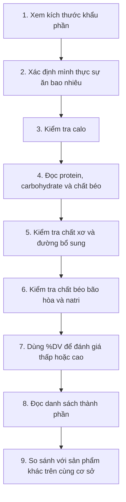

# 089 — How To Read A Nutrition Label

[](https://www.fda.gov/food/new-nutrition-facts-label/lows-and-highs-percent-daily-value-new-nutrition-facts-label) 

## Cách đọc nhãn dinh dưỡng

| Thuộc tính             | Nội dung                                                                                     |
| ---------------------- | -------------------------------------------------------------------------------------------- |
| **Module**             | Module 09 — More Dieting Tips & Strategies                                                   |
| **Bài học**            | How To Read A Nutrition Label                                                                |
| **Thời lượng**         | 03:21                                                                                        |
| **Chủ đề chính**       | Cách đọc nhãn dinh dưỡng                                                                     |
| **Mục tiêu thực hành** | Đọc nhanh khẩu phần, năng lượng, chất dinh dưỡng và danh sách thành phần để so sánh sản phẩm |

> **Lưu ý:** Mẫu `Nutrition Facts` trong bài là định dạng của Hoa Kỳ. Nhãn thực phẩm tại Việt Nam có thể trình bày khác, nhưng nguyên tắc đọc khẩu phần, năng lượng, protein, carbohydrate, chất béo, đường và natri vẫn tương tự.

## Mục lục

1. [Mục tiêu bài học](#1-mục-tiêu-bài-học)
2. [Nội dung chính](#2-nội-dung-chính)
3. [Áp dụng thực tế](#3-áp-dụng-thực-tế)
4. [Lưu ý & lỗi thường gặp](#4-lưu-ý--lỗi-thường-gặp)
5. [Checklist thực hành](#5-checklist-thực-hành)
6. [Tóm tắt](#6-tóm-tắt)

---

## Hình minh họa: cấu trúc nhãn dinh dưỡng


*Hình: phần đầu của nhãn cho biết số khẩu phần trong bao bì và lượng thực phẩm tương ứng với một khẩu phần. Thông tin dinh dưỡng phía dưới thường được tính cho chính khẩu phần này.* ([U.S. Food and Drug Administration][1])

---

## 1. Mục tiêu bài học

Sau bài học, người học có thể:

* Xác định **kích thước khẩu phần** và **số khẩu phần trong bao bì**.
* Tính lượng calo và chất dinh dưỡng thực tế khi ăn nhiều hơn một khẩu phần.
* Phân biệt chất béo tổng, chất béo bão hòa và chất béo chuyển hóa.
* Phân biệt carbohydrate tổng, chất xơ, đường tổng số và đường bổ sung.
* Sử dụng `%DV — Percent Daily Value` để nhận biết một sản phẩm có hàm lượng chất dinh dưỡng thấp hay cao.
* Đọc danh sách thành phần theo đúng thứ tự tỷ lệ khối lượng.
* So sánh hai sản phẩm trên cùng cơ sở, chẳng hạn theo **100 g**, **100 ml** hoặc cùng một khẩu phần.
* Tránh đánh giá thực phẩm chỉ bằng một con số như calo, protein hoặc lượng đường.

---

## 2. Nội dung chính

### 2.1. Quy trình đọc nhãn dinh dưỡng



Một nhãn dinh dưỡng chỉ thực sự hữu ích khi đọc theo đúng thứ tự. Sai lầm phổ biến nhất là nhìn ngay vào calo hoặc protein nhưng bỏ qua việc các con số đó đang được tính cho bao nhiêu gram thực phẩm.

---

### 2.2. Bước 1 — Đọc danh sách thành phần

Danh sách thành phần thường nằm gần bảng dinh dưỡng, dưới tiêu đề như:

* `Ingredients`
* `Thành phần`
* `Nguyên liệu`

Các thành phần được liệt kê theo **thứ tự khối lượng giảm dần**. Thành phần xuất hiện đầu tiên thường chiếm tỷ lệ lớn nhất; những thành phần đứng cuối được sử dụng với lượng nhỏ hơn. ([U.S. Food and Drug Administration][2])

#### Ví dụ

```text
Thành phần: Bột mì, đường, dầu cọ, bột cacao, sữa bột, muối...
```

Điều này cho thấy:

1. Bột mì là thành phần nhiều nhất.
2. Đường đứng thứ hai nên sản phẩm có thể chứa lượng đường đáng kể.
3. Dầu cọ là một trong những thành phần chính.
4. Cacao, sữa và muối có tỷ lệ thấp hơn các thành phần đứng trước.

#### Danh sách càng ngắn càng tốt?

Đây chỉ là một **mẹo sàng lọc nhanh**, không phải quy luật tuyệt đối.

* Một sản phẩm có ba thành phần vẫn có thể chứa nhiều đường, muối hoặc chất béo bão hòa.
* Một sản phẩm có danh sách dài có thể chỉ chứa nhiều loại hạt, gia vị, vitamin hoặc khoáng chất bổ sung.
* Tên hóa học hoặc tên lạ không tự động có nghĩa thành phần đó có hại.

Vì vậy, cần kết hợp danh sách thành phần với bảng giá trị dinh dưỡng thay vì chỉ đếm số lượng nguyên liệu.

#### Nhận biết đường trong danh sách thành phần

Đường bổ sung có thể xuất hiện dưới nhiều tên như:

* Đường mía, đường nâu, sucrose.
* Glucose, fructose, dextrose.
* Xi-rô glucose, xi-rô ngô.
* Mật ong, mật đường, syrup.
* Nước trái cây cô đặc được sử dụng làm chất tạo ngọt.

Khi một hoặc nhiều dạng đường đứng gần đầu danh sách, lượng chất tạo ngọt trong sản phẩm có thể tương đối lớn. Tuy nhiên, quyết định cuối cùng nên dựa thêm vào mục **Total Sugars** và **Added Sugars** trên bảng dinh dưỡng.

---

### 2.3. Bước 2 — Kiểm tra kích thước khẩu phần

Đây là phần quan trọng nhất của nhãn.

Thông thường, phần đầu nhãn sẽ cho biết:

| Thông tin                  | Ý nghĩa                                       |
| -------------------------- | --------------------------------------------- |
| **Servings per container** | Số khẩu phần có trong toàn bộ bao bì          |
| **Serving size**           | Khối lượng hoặc thể tích của một khẩu phần    |
| **Amount per serving**     | Các giá trị dinh dưỡng tính cho một khẩu phần |

Kích thước khẩu phần phản ánh lượng mà người tiêu dùng thường ăn, **không nhất thiết là lượng được khuyến nghị nên ăn**. Một bao bì cũng có thể chứa nhiều hơn một khẩu phần. ([U.S. Food and Drug Administration][1])

#### Ví dụ

```text
2 servings per container
Serving size: 30 g
Calories: 150
```

Nếu ăn hết gói:

```text
Khối lượng thực tế = 30 g × 2 = 60 g
Calo thực tế       = 150 × 2 = 300 kcal
```

Tất cả các giá trị khác như chất béo, đường, protein và natri cũng phải nhân đôi.

> **Nguyên tắc:** Không đọc bất kỳ con số nào trước khi biết nó được tính cho một khẩu phần hay toàn bộ bao bì.

---

### 2.4. Bước 3 — Kiểm tra tổng năng lượng

`Calories` hoặc `Energy` cho biết lượng năng lượng mà một khẩu phần cung cấp.

Tuy nhiên, calo không cho biết:

* Năng lượng đến từ protein, carbohydrate hay chất béo.
* Sản phẩm có nhiều chất xơ hay không.
* Sản phẩm có nhiều đường bổ sung, natri hoặc chất béo bão hòa hay không.
* Sản phẩm có giúp no lâu hay phù hợp với mục tiêu cá nhân hay không.

Do đó, hai sản phẩm có cùng 200 kcal vẫn có thể có giá trị dinh dưỡng rất khác nhau.

#### Năng lượng đến từ các chất đa lượng

| Chất dinh dưỡng | Năng lượng gần đúng |
| --------------- | ------------------: |
| Protein         |            4 kcal/g |
| Carbohydrate    |            4 kcal/g |
| Chất béo        |            9 kcal/g |
| Cồn             |            7 kcal/g |

Calo nên được xem cùng protein, chất xơ, đường, loại chất béo và kích thước khẩu phần.

---

### 2.5. Bước 4 — Đọc chất béo

Nhãn có thể bao gồm:

* `Total Fat` — tổng chất béo.
* `Saturated Fat` — chất béo bão hòa.
* `Trans Fat` — chất béo chuyển hóa.

#### Cách đánh giá

**Tổng chất béo không tự động là xấu.** Chất béo có vai trò cung cấp năng lượng, tạo cấu trúc tế bào và hỗ trợ hấp thu các vitamin tan trong chất béo.

Cần quan tâm nhiều hơn đến **loại chất béo**:

| Thành phần             | Cách đọc thực tế                       |
| ---------------------- | -------------------------------------- |
| Chất béo không bão hòa | Thường là nguồn chất béo nên ưu tiên   |
| Chất béo bão hòa       | Nên kiểm soát tổng lượng trong cả ngày |
| Chất béo chuyển hóa    | Nên càng thấp càng tốt                 |

Khi so sánh hai sản phẩm tương đương, có thể ưu tiên sản phẩm:

* Có ít chất béo bão hòa hơn.
* Không có hoặc có rất ít chất béo chuyển hóa.
* Có nguồn chất béo từ hạt, cá, quả bơ hoặc dầu thực vật không hydro hóa.

FDA khuyến nghị sử dụng `%DV` để lựa chọn thực phẩm có tỷ lệ chất béo bão hòa thấp hơn. ([U.S. Food and Drug Administration][3])

---

### 2.6. Bước 5 — Đọc carbohydrate, chất xơ và đường

`Total Carbohydrate` thường bao gồm:

```text
Carbohydrate tổng
├── Chất xơ
├── Đường tổng số
│   ├── Đường tự nhiên
│   └── Đường bổ sung
└── Tinh bột và các carbohydrate khác
```

#### Chất xơ

`Dietary Fiber` là chỉ số nên được ưu tiên khi lựa chọn:

* Ngũ cốc nguyên hạt.
* Bánh mì và cereal.
* Đồ ăn nhẹ.
* Các sản phẩm từ đậu.
* Thực phẩm hỗ trợ kiểm soát cảm giác đói.

Theo quy tắc `%DV` của FDA, từ 20% DV chất xơ trở lên trong một khẩu phần được xem là mức cao. FDA cũng xác định chất xơ là một trong những chất dinh dưỡng thường nên lựa chọn ở mức cao hơn. ([U.S. Food and Drug Administration][4])

#### Đường tổng số và đường bổ sung

| Thuật ngữ        | Ý nghĩa                                                        |
| ---------------- | -------------------------------------------------------------- |
| **Total Sugars** | Bao gồm cả đường tự nhiên và đường được thêm vào               |
| **Added Sugars** | Đường hoặc chất tạo ngọt được bổ sung trong quá trình chế biến |

Ví dụ, sữa và trái cây có thể chứa đường tự nhiên. Vì vậy, chỉ nhìn vào `Total Sugars` có thể chưa đủ để kết luận sản phẩm có nhiều đường bổ sung.

Khi nhãn có mục `Added Sugars`, nên ưu tiên kiểm tra mục này. FDA khuyến nghị lựa chọn thường xuyên hơn những sản phẩm có `%DV` đường bổ sung thấp hơn. ([U.S. Food and Drug Administration][3])

#### Ví dụ so sánh

| Sản phẩm | Carb tổng | Chất xơ | Đường tổng | Đường bổ sung |
| -------- | --------: | ------: | ---------: | ------------: |
| A        |      30 g |     1 g |       18 g |          16 g |
| B        |      30 g |     6 g |        8 g |           3 g |

Dù có cùng 30 g carbohydrate, sản phẩm B thường phù hợp hơn khi mục tiêu là tăng chất xơ và hạn chế đường bổ sung.

---

### 2.7. Bước 6 — Đọc protein

`Protein` cho biết lượng chất đạm trong một khẩu phần.

Protein là một **chất dinh dưỡng đa lượng**, không phải vi chất dinh dưỡng. Vitamin và khoáng chất mới được xếp vào nhóm vi chất.

Lượng protein cao hơn có thể hữu ích khi chế độ ăn ưu tiên:

* Xây dựng hoặc duy trì khối cơ.
* Kiểm soát cảm giác đói.
* Bảo tồn khối nạc trong giai đoạn giảm cân.
* Phục hồi sau tập luyện.

Tuy nhiên, “protein càng cao càng tốt” không phải quy tắc áp dụng cho mọi sản phẩm. Một thực phẩm giàu protein vẫn có thể đồng thời chứa nhiều:

* Natri.
* Chất béo bão hòa.
* Đường bổ sung.
* Năng lượng trên mỗi khẩu phần.

Do đó, hãy đánh giá protein trong bối cảnh của toàn bộ nhãn.

#### Cách so sánh chính xác hơn

Có thể xem:

```text
Protein trên 100 g
```

hoặc:

```text
Protein trên 100 kcal
```

Ví dụ:

| Sản phẩm | Năng lượng | Protein | Protein/100 kcal |
| -------- | ---------: | ------: | ---------------: |
| A        |   200 kcal |    10 g |              5 g |
| B        |   300 kcal |    12 g |              4 g |

Sản phẩm A có ít protein tuyệt đối hơn nhưng mật độ protein trên năng lượng cao hơn.

---

### 2.8. Bước 7 — Kiểm tra natri

`Sodium` là lượng natri trong một khẩu phần, thường được ghi bằng miligam.

Natri không phải là chất cần loại bỏ hoàn toàn; cơ thể cần natri cho cân bằng dịch, dẫn truyền thần kinh và chức năng tế bào. Vấn đề chủ yếu là lượng natri quá cao trong toàn bộ chế độ ăn. WHO khuyến nghị người trưởng thành tiêu thụ dưới **2.000 mg natri mỗi ngày**, tương đương dưới khoảng **5 g muối**. ([World Health Organization][5])

#### Quy đổi natri và muối

```text
1 g muối ≈ 400 mg natri
5 g muối ≈ 2.000 mg natri
```

#### Cách đọc nhanh natri bằng %DV

* `≤ 5% DV`: thấp.
* `≥ 20% DV`: cao.

Ví dụ, một khẩu phần có 37% DV natri được xem là cao. Nếu ăn hai khẩu phần, lượng natri tăng lên 74% DV. ([U.S. Food and Drug Administration][3])

> Natri không chỉ đến từ muối ăn. Nó còn có thể xuất hiện trong nước mắm, nước tương, bột nêm, thịt chế biến, mì ăn liền, snack và nhiều loại thực phẩm đóng gói. ([World Health Organization][5])

---

### 2.9. Bước 8 — Sử dụng phần trăm giá trị hằng ngày

`% Daily Value`, viết tắt là `%DV`, cho biết một khẩu phần đóng góp bao nhiêu phần trăm vào giá trị tham chiếu hằng ngày của từng chất dinh dưỡng.

#### Quy tắc 5–20

| %DV trong một khẩu phần | Đánh giá   |
| ----------------------: | ---------- |
|        **5% trở xuống** | Thấp       |
|               **6–19%** | Trung bình |
|         **20% trở lên** | Cao        |

FDA khuyến nghị thường xuyên lựa chọn thực phẩm:

* **Cao hơn** về chất xơ, vitamin D, canxi, sắt và kali.
* **Thấp hơn** về chất béo bão hòa, natri và đường bổ sung. ([U.S. Food and Drug Administration][4])


#### Không cộng các %DV theo chiều dọc

Không nên cộng:

```text
12% chất béo + 37% natri + 14% chất xơ = 63%
```

Mỗi `%DV` đề cập đến một chất dinh dưỡng khác nhau và được so sánh với giá trị tham chiếu riêng của chất đó. ([U.S. Food and Drug Administration][3])

#### 2.000 kcal không phải mục tiêu cho tất cả mọi người

Phần chú thích dưới nhãn FDA sử dụng 2.000 kcal/ngày làm mức tham chiếu chung. Nhu cầu thực tế còn phụ thuộc vào:

* Tuổi.
* Giới tính.
* Chiều cao và cân nặng.
* Mức vận động.
* Mục tiêu tăng, giảm hay duy trì cân nặng.
* Tình trạng sức khỏe.

Vì vậy, `%DV` chủ yếu là công cụ so sánh và định hướng nhanh, không phải kế hoạch dinh dưỡng cá nhân tuyệt đối. ([U.S. Food and Drug Administration][4])

---

### 2.10. Vitamin và khoáng chất

Phần cuối nhãn FDA thường thể hiện một số vi chất như:

* Vitamin D.
* Canxi.
* Sắt.
* Kali.

Hàm lượng cao hơn có thể là một điểm tích cực, nhưng không nên dùng vitamin bổ sung để “bù” cho một sản phẩm chứa quá nhiều đường, chất béo bão hòa hoặc natri.

Ví dụ, cereal có thể được bổ sung nhiều vitamin và sắt nhưng vẫn chứa lượng đường bổ sung cao. Cần đánh giá đồng thời:

```text
Vi chất + chất xơ + protein
so với
đường bổ sung + natri + chất béo bão hòa
```

---

### 2.11. Ghi nhãn dinh dưỡng tại Việt Nam

Theo Thông tư 29/2023/TT-BYT, nhãn của thực phẩm thuộc phạm vi điều chỉnh tại Việt Nam phải thể hiện các thành phần cơ bản gồm:

* Năng lượng.
* Chất đạm.
* Carbohydrate.
* Chất béo.
* Natri.

Đồ uống và thực phẩm có bổ sung đường phải ghi thêm **đường tổng số**; thực phẩm chế biến bằng phương pháp chiên rán phải ghi thêm **chất béo bão hòa**. ([Cơ sở dữ liệu Chính phủ][6])

Giá trị dinh dưỡng có thể được thể hiện:

* Trong 100 g thực phẩm.
* Trong 100 ml thực phẩm.
* Trong một khẩu phần xác định.
* Theo mỗi phần đóng gói khi số phần trong bao bì được công bố. ([Cơ sở dữ liệu Chính phủ][6])

Thông tư có hiệu lực từ ngày 15/02/2024. Lộ trình quy định từ ngày 01/01/2026 không được sản xuất, in ấn, nhập khẩu hoặc sử dụng nhãn không phù hợp; thực phẩm đã được sản xuất hoặc nhập khẩu trước thời điểm này có thể tiếp tục lưu thông đến hết hạn sử dụng. ([Văn Bản Chính Phủ][7])

---

## 3. Áp dụng thực tế

### 3.1. Phương pháp đọc nhãn trong 60 giây

#### 10 giây đầu: kiểm tra khẩu phần

```text
Khẩu phần bao nhiêu gram?
Bao bì có mấy khẩu phần?
Mình sẽ ăn bao nhiêu?
```

#### 15 giây tiếp theo: kiểm tra các chất cần hạn chế

* Đường bổ sung.
* Chất béo bão hòa.
* Chất béo chuyển hóa.
* Natri.

#### 15 giây tiếp theo: kiểm tra các chất nên ưu tiên

* Protein.
* Chất xơ.
* Vitamin và khoáng chất phù hợp.
* Nguồn chất béo không bão hòa.

#### 10 giây tiếp theo: đọc thành phần đầu tiên

Xem ba đến năm thành phần đầu có phải là:

* Ngũ cốc nguyên hạt.
* Thịt, cá, sữa hoặc đậu.
* Trái cây, rau củ hoặc hạt.

Hay chủ yếu là:

* Đường.
* Xi-rô.
* Bột tinh chế.
* Dầu hoặc chất béo.
* Muối và chất tạo vị.

#### 10 giây cuối: so sánh với sản phẩm tương đương

Chỉ so sánh khi:

* Khẩu phần bằng nhau; hoặc
* Đã quy đổi về 100 g/100 ml.

---

### 3.2. Công thức quy đổi về 100 g

Khi nhãn chỉ ghi theo khẩu phần:

```text
Giá trị trên 100 g
= Giá trị trong một khẩu phần ÷ khối lượng khẩu phần × 100
```

#### Ví dụ

Một khẩu phần 40 g chứa:

* 160 kcal.
* 8 g protein.
* 6 g chất béo.
* 12 g carbohydrate.

Quy đổi:

```text
Năng lượng = 160 ÷ 40 × 100 = 400 kcal/100 g
Protein    = 8 ÷ 40 × 100   = 20 g/100 g
Chất béo   = 6 ÷ 40 × 100   = 15 g/100 g
Carb       = 12 ÷ 40 × 100  = 30 g/100 g
```

Việc quy đổi giúp tránh tình trạng một nhà sản xuất dùng khẩu phần rất nhỏ để các con số trên nhãn trông thấp hơn.

---

### 3.3. Phân tích mẫu nhãn FDA

Mẫu lasagna của FDA ghi:

| Thành phần       | Một khẩu phần 227 g | Đánh giá                           |
| ---------------- | ------------------: | ---------------------------------- |
| Năng lượng       |            280 kcal | Cần nhân theo số khẩu phần thực tế |
| Chất béo tổng    |        9 g — 12% DV | Trung bình                         |
| Chất béo bão hòa |      4,5 g — 23% DV | Cao                                |
| Natri            |     850 mg — 37% DV | Cao                                |
| Carbohydrate     |       34 g — 12% DV | Trung bình                         |
| Chất xơ          |        4 g — 14% DV | Trung bình                         |
| Đường bổ sung    |         0 g — 0% DV | Thấp                               |
| Protein          |                15 g | Khá cao trong một khẩu phần        |
| Canxi            |     320 mg — 25% DV | Cao                                |

Nếu ăn hai khẩu phần:

| Thành phần       |     Hai khẩu phần |
| ---------------- | ----------------: |
| Năng lượng       |          560 kcal |
| Chất béo bão hòa |      9 g — 46% DV |
| Natri            | 1.700 mg — 74% DV |
| Carbohydrate     |              68 g |
| Protein          |              30 g |

Ví dụ này cho thấy sản phẩm có protein và canxi đáng kể nhưng đồng thời chứa nhiều chất béo bão hòa và natri. Vì vậy, không thể đánh giá sản phẩm chỉ dựa trên protein hoặc một loại vitamin. ([U.S. Food and Drug Administration][1])

---

### 3.4. So sánh hai loại sữa chua

| Chỉ số trên 100 g | Sữa chua A | Sữa chua B |
| ----------------- | ---------: | ---------: |
| Năng lượng        |    95 kcal |    70 kcal |
| Protein           |      3,5 g |        8 g |
| Đường tổng số     |       14 g |        5 g |
| Đường bổ sung     |        9 g |        0 g |
| Chất béo bão hòa  |      2,5 g |      0,8 g |
| Natri             |      60 mg |      55 mg |

Nếu mục tiêu là tăng protein và hạn chế đường bổ sung, sản phẩm B là lựa chọn phù hợp hơn dù cả hai đều được quảng cáo là “sữa chua giàu dinh dưỡng”.

---

### 3.5. So sánh hai loại cereal

| Chỉ số trên 100 g   | Cereal A |            Cereal B |
| ------------------- | -------: | ------------------: |
| Năng lượng          | 380 kcal |            370 kcal |
| Protein             |      7 g |                10 g |
| Chất xơ             |      3 g |                11 g |
| Đường bổ sung       |     24 g |                 6 g |
| Natri               |   420 mg |              250 mg |
| Thành phần đầu tiên |    Đường | Yến mạch nguyên hạt |

Cereal B nổi bật hơn vì:

* Thành phần chính là ngũ cốc nguyên hạt.
* Nhiều chất xơ hơn.
* Nhiều protein hơn.
* Ít đường bổ sung và natri hơn.

Chênh lệch calo giữa hai sản phẩm không đáng kể, nhưng chất lượng dinh dưỡng tổng thể khác nhau rõ rệt.

---

## 4. Lưu ý & lỗi thường gặp

### Lỗi 1 — Nhầm một bao bì với một khẩu phần

Một chai có thể chứa 2,5 khẩu phần. Uống hết chai đồng nghĩa phải nhân các giá trị với 2,5.

---

### Lỗi 2 — So sánh hai khẩu phần khác nhau

```text
Sản phẩm A: 120 kcal cho 25 g
Sản phẩm B: 170 kcal cho 50 g
```

Không thể kết luận A ít calo hơn nếu chưa quy đổi:

```text
A = 480 kcal/100 g
B = 340 kcal/100 g
```

Thực tế B có mật độ năng lượng thấp hơn.

---

### Lỗi 3 — Chỉ nhìn vào mặt trước bao bì

Các cụm từ như:

* “Tự nhiên”.
* “Ít béo”.
* “Giàu năng lượng”.
* “Fitness”.
* “Whole grain”.
* “Không cholesterol”.
* “Bổ sung vitamin”.

không phản ánh toàn bộ giá trị dinh dưỡng. Luôn kiểm tra bảng dinh dưỡng và danh sách thành phần.

---

### Lỗi 4 — Cho rằng carbohydrate hoặc chất béo đều xấu

Cần xem **chất lượng nguồn cung cấp**:

* Carbohydrate từ yến mạch, đậu hoặc trái cây khác với carbohydrate chủ yếu từ đường bổ sung.
* Chất béo từ hạt hoặc cá khác với sản phẩm có nhiều chất béo chuyển hóa và chất béo bão hòa.

---

### Lỗi 5 — Chỉ nhìn đường tổng số

Đường trong sữa và trái cây không giống hoàn toàn với đường được bổ sung vào nước ngọt hoặc bánh kẹo. Khi có thông tin, hãy kiểm tra riêng mục `Added Sugars`.

---

### Lỗi 6 — Nghĩ “0 g” nghĩa là tuyệt đối không có

Cách làm tròn số và ngưỡng công bố có thể khác nhau tùy quy định từng quốc gia. Vì vậy, với các chất cần hạn chế, nên đọc thêm danh sách thành phần và tổng lượng tiêu thụ trong ngày.

---

### Lỗi 7 — Cho rằng protein càng cao thì sản phẩm càng tốt

Một loại thịt chế biến có thể giàu protein nhưng cũng rất nhiều natri. Một thanh protein có thể chứa nhiều protein nhưng đồng thời nhiều calo và chất tạo ngọt.

---

### Lỗi 8 — Đánh giá thực phẩm chỉ bằng số lượng thành phần

Danh sách ngắn không đảm bảo sản phẩm ít đường hoặc ít muối; danh sách dài không tự động đồng nghĩa thực phẩm không lành mạnh.

---

### Lỗi 9 — Xem %DV như nhu cầu cá nhân chính xác

%DV là giá trị tham chiếu chung, hữu ích để so sánh sản phẩm. Người có bệnh thận, tăng huyết áp, đái tháo đường, dị ứng thực phẩm hoặc nhu cầu dinh dưỡng đặc biệt có thể cần giới hạn khác theo hướng dẫn chuyên môn.

---

### Lỗi 10 — Bỏ qua chất gây dị ứng

Ngoài dinh dưỡng, cần tìm mục cảnh báo như:

```text
Contains: Milk, Eggs, Peanuts, Soy, Wheat...
```

Đối với người có dị ứng, đây có thể là thông tin quan trọng hơn toàn bộ các chỉ số calo hoặc protein.

---

## 5. Checklist thực hành

### Checklist đọc một sản phẩm

* [ ] Tôi đã kiểm tra kích thước một khẩu phần.
* [ ] Tôi biết bao bì có bao nhiêu khẩu phần.
* [ ] Tôi đã xác định lượng mình thực sự sẽ ăn.
* [ ] Tôi đã nhân các giá trị nếu ăn nhiều hơn một khẩu phần.
* [ ] Tôi đã kiểm tra tổng calo.
* [ ] Tôi đã xem lượng protein.
* [ ] Tôi đã kiểm tra chất xơ.
* [ ] Tôi đã phân biệt đường tổng số và đường bổ sung.
* [ ] Tôi đã xem chất béo bão hòa và chất béo chuyển hóa.
* [ ] Tôi đã kiểm tra lượng natri.
* [ ] Tôi đã sử dụng quy tắc 5–20% DV.
* [ ] Tôi đã đọc ba đến năm thành phần đầu tiên.
* [ ] Tôi đã kiểm tra thông tin dị ứng.
* [ ] Tôi đã so sánh sản phẩm trên cùng khẩu phần hoặc trên 100 g/100 ml.
* [ ] Tôi không đánh giá sản phẩm chỉ bằng một chỉ số duy nhất.

### Checklist lựa chọn nhanh

| Nên ưu tiên cao hơn              | Nên ưu tiên thấp hơn        |
| -------------------------------- | --------------------------- |
| Protein phù hợp mục tiêu         | Đường bổ sung               |
| Chất xơ                          | Chất béo chuyển hóa         |
| Vitamin và khoáng chất cần thiết | Chất béo bão hòa            |
| Thành phần thực phẩm nguyên bản  | Natri                       |
| Tỷ lệ protein/calo phù hợp       | Năng lượng vượt quá nhu cầu |

---

## 6. Tóm tắt

Đọc nhãn dinh dưỡng nên bắt đầu từ **kích thước khẩu phần**, không phải từ calo.

Quy trình cơ bản:

```text
Khẩu phần
→ Lượng thực sự ăn
→ Calo
→ Protein, carbohydrate và chất béo
→ Chất xơ và đường bổ sung
→ Chất béo bão hòa và natri
→ %DV
→ Danh sách thành phần
→ So sánh trên cùng cơ sở
```

Những nguyên tắc quan trọng nhất:

1. Các con số trên nhãn thường được tính cho **một khẩu phần**.
2. Ăn hai khẩu phần đồng nghĩa nhận gần gấp đôi calo và các chất dinh dưỡng.
3. Thành phần được liệt kê theo khối lượng giảm dần. ([U.S. Food and Drug Administration][2])
4. `≤5% DV` được xem là thấp; `≥20% DV` được xem là cao. ([U.S. Food and Drug Administration][4])
5. Nên ưu tiên nhiều chất xơ hơn và hạn chế đường bổ sung, chất béo bão hòa cùng natri.
6. Không đánh giá thực phẩm chỉ dựa trên calo, protein hoặc số lượng thành phần.
7. Khi so sánh sản phẩm, hãy sử dụng cùng khẩu phần hoặc quy đổi về **100 g/100 ml**.
8. Lựa chọn tốt nhất là sản phẩm phù hợp với **tổng thể chế độ ăn**, mục tiêu và lượng thực tế sẽ tiêu thụ.

[1]: https://www.fda.gov/food/nutrition-facts-label/serving-size-nutrition-facts-label "Serving Size on the Nutrition Facts Label | FDA"
[2]: https://www.fda.gov/food/food-additives-and-gras-ingredients-information-consumers/types-food-ingredients "Types of Food Ingredients | FDA"
[3]: https://www.fda.gov/food/nutrition-facts-label/how-understand-and-use-nutrition-facts-label "How to Understand and Use the Nutrition Facts Label | FDA"
[4]: https://www.fda.gov/food/nutrition-facts-label/lows-and-highs-percent-daily-value-nutrition-facts-label "The Lows and Highs of Percent Daily Value on the Nutrition Facts Label | FDA"
[5]: https://www.who.int/news-room/fact-sheets/detail/sodium-reduction "Sodium reduction"
[6]: https://datafiles.chinhphu.vn/cpp/files/vbpq/2024/01/29-byt.signed.pdf "https://datafiles.chinhphu.vn/cpp/files/vbpq/2024/01/29-byt.signed.pdf"
[7]: https://vanban.chinhphu.vn/?docid=209434&pageid=27160 "Thông tư số 29/2023/TT-BYT của Bộ Y tế: Hướng dẫn nội dung, cách ghi thành phần dinh dưỡng, giá trị dinh dưỡng trên nhãn thực phẩm"

---

# Bài luyện tập

## Mục tiêu


## Đề bài


## Yêu cầu hoàn thành

- [ ] 
- [ ] 
- [ ] 

## Kết quả / lời giải


## Ghi chú
