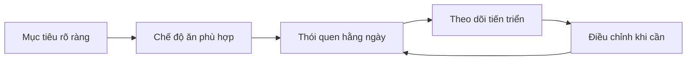
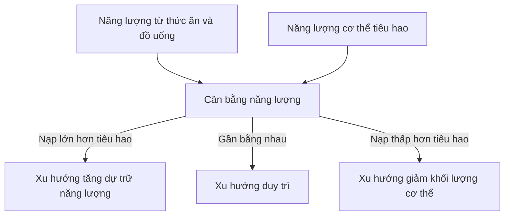
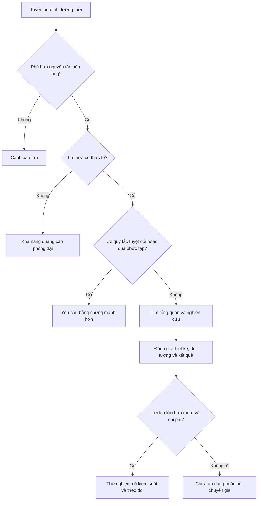

# 084 — Even More Dieting Tips And Strategies

[](https://www.health.harvard.edu/staying-healthy/healthy-eating-plate?utm_source=chatgpt.com) 

| Thuộc tính       | Nội dung                                   |
| ---------------- | ------------------------------------------ |
| **Module**       | Module 09 — More Dieting Tips & Strategies |
| **Bài học**      | Even More Dieting Tips And Strategies      |
| **Thời lượng**   | 01:06                                      |
| **Chủ đề chính** | Các mẹo và chiến lược ăn uống bổ sung      |

> **Ghi chú:** Đây là bài mở đầu ngắn cho phần cuối của chương trình. Mục tiêu chính là kết nối các nguyên tắc dinh dưỡng nền tảng với những tình huống thực tế như đánh giá chế độ ăn mới, đọc nhãn thực phẩm và tự nghiên cứu thông tin dinh dưỡng.


*Nguồn ảnh: National Cancer Institute/NIH, thuộc phạm vi công cộng.*

## Mục lục

1. [Mục tiêu bài học](#1-mục-tiêu-bài-học)
2. [Nội dung chính](#2-nội-dung-chính)
3. [Áp dụng thực tế](#3-áp-dụng-thực-tế)
4. [Lưu ý & lỗi thường gặp](#4-lưu-ý--lỗi-thường-gặp)
5. [Checklist thực hành](#5-checklist-thực-hành)
6. [Tóm tắt](#6-tóm-tắt)

---

## 1. Mục tiêu bài học

Sau bài học, người học có thể:

* Hiểu rằng không tồn tại một “mẹo thần kỳ” phù hợp với tất cả mọi người.
* Biết cách đặt các mẹo ăn kiêng vào một hệ thống nguyên tắc thống nhất.
* Phân biệt giữa **chiến lược hữu ích**, **sở thích cá nhân** và **quy tắc không cần thiết**.
* Ưu tiên những phương pháp đơn giản, có thể duy trì lâu dài.
* Chuẩn bị nền tảng để đánh giá các xu hướng dinh dưỡng mới.

---

## 2. Nội dung chính

### 2.1. Các nguyên tắc quan trọng hơn tên gọi của chế độ ăn

Một chế độ ăn không trở nên tốt chỉ vì được gọi là:

* Low-carb.
* Low-fat.
* Keto.
* Paleo.
* Nhịn ăn gián đoạn.
* “Detox”.
* Ăn sạch hoặc “clean eating”.

Điều cần đánh giá là chế độ đó có:

1. Phù hợp với nhu cầu năng lượng hay không.
2. Cung cấp đủ protein, chất béo thiết yếu và carbohydrate phù hợp hay không.
3. Có đủ vitamin, khoáng chất và chất xơ hay không.
4. Có phù hợp với sức khỏe, lịch sinh hoạt và sở thích cá nhân hay không.
5. Có thể duy trì trong nhiều tháng hoặc nhiều năm hay không.

Một mô hình ăn uống hỗ trợ quản lý cân nặng thường nhấn mạnh thực phẩm giàu dinh dưỡng, sự đa dạng và lượng năng lượng phù hợp, thay vì loại bỏ hoàn toàn một nhóm thực phẩm. ([CDC][1])

### 2.2. Kết quả đến từ hệ thống, không phải một mẹo riêng lẻ



Một mẹo ăn uống chỉ có giá trị khi nó giúp bạn:

* Kiểm soát khẩu phần dễ hơn.
* Ăn đủ protein và rau quả.
* Giảm những nguồn năng lượng không cần thiết.
* Chuẩn bị bữa ăn thuận tiện hơn.
* Tuân thủ kế hoạch trong thời gian dài.

### 2.3. Đơn giản thường hiệu quả hơn phức tạp

Một kế hoạch đơn giản có thể chỉ cần:

* Mỗi bữa có một nguồn protein.
* Phần lớn bữa ăn sử dụng thực phẩm ít chế biến.
* Ăn rau hoặc trái cây mỗi ngày.
* Điều chỉnh khẩu phần theo mục tiêu.
* Theo dõi cân nặng và vòng eo theo xu hướng.
* Cho phép một mức linh hoạt hợp lý.

CDC lưu ý rằng không nhất thiết phải đếm calo mọi lúc, nhưng hiểu nhu cầu năng lượng và ghi lại lượng ăn trong một giai đoạn có thể giúp nhận diện khẩu phần thực tế. ([CDC][1])

---

## 3. Áp dụng thực tế

### 3.1. Bộ lọc năm câu hỏi

Trước khi áp dụng một mẹo ăn kiêng, hãy hỏi:

| Câu hỏi                                               | Ý nghĩa                                                            |
| ----------------------------------------------------- | ------------------------------------------------------------------ |
| Mẹo này giúp giải quyết vấn đề gì?                    | Đói, thiếu thời gian, khó kiểm soát khẩu phần hay ăn uống cảm xúc? |
| Nó có phù hợp với nguyên tắc dinh dưỡng cơ bản không? | Có đủ năng lượng và vi chất hay không?                             |
| Có bằng chứng đáng tin cậy không?                     | Hay chỉ dựa trên lời kể cá nhân?                                   |
| Tôi có thể duy trì nó không?                          | Có phù hợp với công việc, ngân sách và gia đình không?             |
| Có cách đơn giản hơn không?                           | Tránh tạo thêm quy tắc không cần thiết                             |

### 3.2. Ví dụ

#### Tình huống A: Không kiểm soát được đồ ăn vặt

**Chiến lược phù hợp:**

* Không để đồ ăn vặt ngay trên bàn.
* Chuẩn bị trái cây, sữa chua hoặc thực phẩm giàu protein.
* Chia đồ ăn thành khẩu phần nhỏ thay vì ăn trực tiếp từ túi.
* Ăn đủ trong các bữa chính để giảm đói quá mức.

#### Tình huống B: Không có thời gian nấu ăn

**Chiến lược phù hợp:**

* Chuẩn bị protein cho hai đến ba ngày.
* Sử dụng rau đông lạnh không thêm sốt.
* Chuẩn bị cơm, khoai hoặc ngũ cốc theo mẻ.
* Chọn một số bữa ăn mặc định dễ lặp lại.

#### Tình huống C: Cân nặng không thay đổi

**Kiểm tra lần lượt:**

1. Theo dõi thêm từ hai đến ba tuần.
2. Kiểm tra khẩu phần, đồ uống và nước sốt.
3. Xem xét mức vận động.
4. Điều chỉnh nhẹ lượng ăn.
5. Tránh thay đổi toàn bộ chương trình cùng lúc.

---

## 4. Lưu ý & lỗi thường gặp

### 4.1. Chạy theo quá nhiều mẹo cùng lúc

Thay đổi đồng thời thời gian ăn, tỷ lệ dinh dưỡng, thực phẩm, lịch tập và thực phẩm bổ sung sẽ khiến bạn không biết yếu tố nào thực sự có tác dụng.

> **Cách tốt hơn:** Mỗi lần chỉ thay đổi một hoặc hai yếu tố và theo dõi kết quả.

### 4.2. Biến sở thích cá nhân thành quy luật chung

Một người có thể cảm thấy tốt khi ăn ít carbohydrate, nhưng điều đó không chứng minh rằng tất cả mọi người phải tránh carbohydrate.

CDC khuyến nghị duy trì sự đa dạng và cảnh báo rằng loại bỏ cả một nhóm thực phẩm có thể làm giảm khả năng nhận đủ dưỡng chất hoặc duy trì kế hoạch lâu dài. ([CDC][1])

### 4.3. Quá tập trung vào “hoàn hảo”

Một bữa ăn ngoài kế hoạch không phá hỏng toàn bộ quá trình. Điều quyết định kết quả là xu hướng ăn uống trong nhiều tuần và nhiều tháng.

### 4.4. Chỉ quan tâm đến cân nặng

Ngoài cân nặng, nên theo dõi:

* Vòng eo.
* Hiệu suất tập luyện.
* Mức đói.
* Chất lượng giấc ngủ.
* Năng lượng trong ngày.
* Khả năng duy trì kế hoạch.
* Các chỉ số sức khỏe khi có chỉ định y tế.

---

## 5. Checklist thực hành

* [ ] Tôi đã xác định rõ mục tiêu hiện tại.
* [ ] Kế hoạch của tôi phù hợp với nhu cầu năng lượng.
* [ ] Tôi ăn đa dạng thực phẩm giàu dinh dưỡng.
* [ ] Tôi không loại bỏ một nhóm thực phẩm chỉ vì xu hướng.
* [ ] Tôi có một số bữa ăn mặc định dễ chuẩn bị.
* [ ] Tôi theo dõi tiến triển theo xu hướng, không phản ứng với từng ngày.
* [ ] Tôi chỉ thay đổi một vài yếu tố mỗi lần.
* [ ] Tôi ưu tiên chiến lược có thể duy trì lâu dài.
* [ ] Tôi biết khi nào cần hỏi bác sĩ hoặc chuyên gia dinh dưỡng.

---

## 6. Tóm tắt

> **Các mẹo ăn kiêng chỉ hữu ích khi chúng củng cố những nguyên tắc nền tảng.**

Một chiến lược tốt cần:

* Phù hợp với mục tiêu.
* Đảm bảo dinh dưỡng.
* Đơn giản và thực tế.
* Có thể theo dõi.
* Có khả năng duy trì.
* Không dựa trên lời hứa thần kỳ.

---

# 090 — How To Do Your Own Research

| Thuộc tính       | Nội dung                                   |
| ---------------- | ------------------------------------------ |
| **Module**       | Module 09 — More Dieting Tips & Strategies |
| **Bài học**      | How To Do Your Own Research                |
| **Thời lượng**   | 03:57                                      |
| **Chủ đề chính** | Cách tự nghiên cứu thông tin dinh dưỡng    |


*Nguồn ảnh: Shixart1985/Wikimedia Commons, giấy phép CC BY 2.0.*

## Mục lục

1. [Mục tiêu bài học](#1-mục-tiêu-bài-học-1)
2. [Nội dung chính](#2-nội-dung-chính-1)
3. [Áp dụng thực tế](#3-áp-dụng-thực-tế-1)
4. [Lưu ý & lỗi thường gặp](#4-lưu-ý--lỗi-thường-gặp-1)
5. [Checklist thực hành](#5-checklist-thực-hành-1)
6. [Tóm tắt](#6-tóm-tắt-1)

---

## 1. Mục tiêu bài học

Sau bài học, người học có thể:

* Đánh giá một chế độ ăn hoặc lời khuyên dinh dưỡng mới.
* Phát hiện các dấu hiệu quảng cáo phóng đại.
* Kiểm tra xem tuyên bố có phù hợp với nguyên tắc năng lượng và dinh dưỡng hay không.
* Phân biệt bằng chứng mạnh với lời kể cá nhân.
* Xác định nguồn thông tin có độ tin cậy cao.
* Tránh kết luận quá mức từ một nghiên cứu đơn lẻ.

---

## 2. Nội dung chính

## 2.1. Bước 1 — So sánh với các nguyên tắc nền tảng

Khi gặp một chế độ ăn mới, trước tiên hãy kiểm tra:

### Cân bằng năng lượng

Đối với giảm cân, năng lượng tiêu hao trung bình phải lớn hơn năng lượng nạp vào trong một khoảng thời gian đủ dài. Tuy nhiên, mức ăn, vận động, giấc ngủ, thuốc, bệnh lý, gene và môi trường đều có thể ảnh hưởng đến quá trình kiểm soát cân nặng. ([CDC][2])



> Cân bằng năng lượng là điều kiện nền tảng của thay đổi cân nặng, nhưng không phải tiêu chí duy nhất để đánh giá chất lượng sức khỏe của một chế độ ăn.

### Mật độ dinh dưỡng

Một chế độ ăn hợp lý nên cung cấp đa dạng:

* Rau và trái cây.
* Nguồn protein phù hợp.
* Ngũ cốc nguyên hạt hoặc nguồn carbohydrate giàu dinh dưỡng.
* Chất béo không bão hòa.
* Vitamin, khoáng chất và chất xơ.

Các hướng dẫn ăn uống lành mạnh nhấn mạnh sự đa dạng, thực phẩm giàu dinh dưỡng và lượng năng lượng phù hợp thay vì chỉ tập trung vào một dưỡng chất riêng lẻ. ([CDC][3])

### Tính bền vững

Hãy xem xét:

* Chi phí.
* Khả năng chuẩn bị.
* Mức độ ngon miệng.
* Ảnh hưởng đến đời sống xã hội.
* Mức đói.
* Khả năng duy trì trong dài hạn.

---

## 2.2. Bước 2 — Kiểm tra lời hứa của chế độ ăn

### Lời hứa hợp lý

* “Có thể hỗ trợ kiểm soát khẩu phần.”
* “Có thể giúp tăng lượng rau.”
* “Có thể phù hợp với một số người.”
* “Kết quả phụ thuộc vào tổng lượng ăn và mức tuân thủ.”

### Lời hứa đáng nghi

* “Giảm mỡ mà không cần quan tâm đến lượng ăn.”
* “Một loại trái cây sẽ đốt cháy mỡ bụng.”
* “Uống nước vào một giờ cụ thể sẽ làm mỡ biến mất.”
* “Thanh lọc hoàn toàn độc tố trong vài ngày.”
* “Hiệu quả cho tất cả mọi người.”
* “Cam kết giảm một lượng cân lớn trong thời gian rất ngắn.”

Nhiều tuyên bố tiếp thị bắt đầu từ một cơ chế sinh học có thật, nhưng sau đó phóng đại cơ chế đó thành kết quả lâm sàng chưa được chứng minh.

### Bộ lọc nhanh

| Dấu hiệu                     | Câu hỏi cần đặt ra                                  |
| ---------------------------- | --------------------------------------------------- |
| Kết quả quá nhanh            | Tỷ lệ giảm là bao nhiêu và trong thời gian nào?     |
| Một thực phẩm duy nhất       | Tổng chế độ ăn có được kiểm soát không?             |
| “Khoa học chứng minh”        | Nghiên cứu nào, trên người hay động vật?            |
| Người nổi tiếng xác nhận     | Có dữ liệu đối chứng hay chỉ là trải nghiệm?        |
| Bán sản phẩm độc quyền       | Người cung cấp thông tin có xung đột lợi ích không? |
| “Bác sĩ không muốn bạn biết” | Có nguồn y khoa độc lập xác nhận không?             |

---

## 2.3. Bước 3 — Phát hiện các quy tắc tuyệt đối

Cần thận trọng với những khẳng định như:

* Mọi loại carbohydrate đều xấu.
* Mọi loại chất béo đều xấu.
* Không bao giờ được ăn sau một giờ nhất định.
* Phải ăn một thực phẩm vào đúng một thời điểm.
* Một phương pháp chắc chắn phù hợp với mọi người.

Chất béo bão hòa, chất béo không bão hòa và chất béo chuyển hóa không có cùng đặc tính. Tương tự, carbohydrate trong nước ngọt, bánh kẹo, đậu, trái cây và ngũ cốc nguyên hạt không nên được đánh giá như một nhóm hoàn toàn giống nhau.

Việc chỉ tập trung vào một dưỡng chất có thể bỏ qua chất lượng tổng thể của thực phẩm; một sản phẩm có một dưỡng chất “tốt” không tự động trở thành thực phẩm lành mạnh toàn diện. ([The Nutrition Source][4])

---

## 2.4. Bước 4 — Kiểm tra mức độ phức tạp

Một chế độ ăn quá phức tạp có thể yêu cầu:

* Ăn nhiều loại thực phẩm vào những giờ rất cụ thể.
* Không kết hợp hai nhóm thực phẩm nhất định.
* Thực hiện hàng loạt nghi thức trước hoặc sau bữa ăn.
* Mua nhiều sản phẩm chuyên dụng.
* Tuân thủ danh sách cấm dài nhưng không có lý do y khoa.

Sự phức tạp không đồng nghĩa với hiệu quả.

> Một quy tắc chỉ nên được giữ lại khi nó tạo ra lợi ích rõ ràng, phù hợp với bằng chứng hoặc giúp người dùng tuân thủ tốt hơn.

---

## 2.5. Bước 5 — Tìm nguồn đáng tin cậy

### Nguồn nên ưu tiên

1. Hướng dẫn của cơ quan y tế hoặc tổ chức khoa học.
2. Tổng quan hệ thống và phân tích gộp.
3. Thử nghiệm đối chứng ngẫu nhiên phù hợp với câu hỏi.
4. Nghiên cứu đoàn hệ lớn và có thời gian theo dõi dài.
5. Bài phân tích của chuyên gia có trích dẫn nguồn đầy đủ.
6. Nghiên cứu đơn lẻ.
7. Ý kiến chuyên gia không dẫn chứng.
8. Lời kể cá nhân và nội dung quảng cáo.

Cochrane xem tổng quan hệ thống là một trong những phương pháp đáng tin cậy nhất để tổng hợp hiệu quả của một can thiệp, bởi nó tìm kiếm, đánh giá và kết hợp nhiều nghiên cứu thay vì chọn một kết quả riêng lẻ. ([Cochrane][5])


*Nguồn ảnh: NSW Ministry of Health/CIAP, CC BY 4.0.*

> **Lưu ý:** Tháp bằng chứng chỉ là mô hình định hướng. Loại nghiên cứu tốt nhất còn phụ thuộc vào câu hỏi. Trong dinh dưỡng, thử nghiệm ngẫu nhiên và nghiên cứu đoàn hệ đều có vai trò, đồng thời mỗi thiết kế có những điểm mạnh và hạn chế riêng. ([The Nutrition Source][6])

---

## 2.6. Bước 6 — Đọc nghiên cứu thay vì chỉ đọc tiêu đề

Khi xem một nghiên cứu, hãy kiểm tra:

### Câu hỏi nghiên cứu

* Nghiên cứu đang hỏi điều gì?
* Kết quả chính đã được xác định trước hay được chọn sau khi phân tích?

### Đối tượng

* Người hay động vật?
* Người khỏe mạnh hay người có bệnh?
* Số lượng người tham gia?
* Độ tuổi và giới tính?
* Kết quả có áp dụng được cho bạn không?

### Thiết kế

* Quan sát hay can thiệp?
* Có nhóm đối chứng không?
* Có phân nhóm ngẫu nhiên không?
* Có làm mù người tham gia hoặc nhà nghiên cứu không?
* Thời gian theo dõi đủ dài không?

### Kết quả

* Kết quả có ý nghĩa thống kê không?
* Mức thay đổi có đủ lớn để có ý nghĩa thực tế không?
* Khoảng tin cậy có rộng không?
* Có nhiều người bỏ cuộc không?
* Kết quả là chỉ dấu trung gian hay kết quả sức khỏe thực sự?

### Xung đột lợi ích

* Ai tài trợ?
* Tác giả có liên hệ tài chính với sản phẩm không?
* Dữ liệu và phương pháp có minh bạch không?

Examine khuyến nghị đọc toàn bộ bài nghiên cứu trước khi sử dụng nó làm bằng chứng, vì phần tiêu đề hoặc tóm tắt có thể không thể hiện đầy đủ các hạn chế về thiết kế và kết quả. ([Examine][7])

---

## 2.7. Bước 7 — Tìm toàn bộ bức tranh bằng chứng

Không nên hỏi:

> “Tôi có tìm được một nghiên cứu ủng hộ ý kiến này không?”

Nên hỏi:

> “Toàn bộ bằng chứng hiện có nghiêng về kết luận nào, mức chắc chắn ra sao và còn điểm nào chưa rõ?”



---

## 3. Áp dụng thực tế

## 3.1. Ví dụ: “Uống nước chanh buổi sáng giúp đốt mỡ”

### Phân tích

| Tiêu chí            | Đánh giá                                                               |
| ------------------- | ---------------------------------------------------------------------- |
| Cân bằng năng lượng | Nước chanh không tự tạo ra thâm hụt năng lượng                         |
| Cơ chế              | Có thể giúp uống nhiều nước hơn hoặc thay đồ uống có đường             |
| Lời hứa             | “Đốt mỡ mạnh” là phóng đại                                             |
| Bằng chứng          | Cần nghiên cứu so sánh trực tiếp                                       |
| Kết luận            | Có thể là đồ uống ít năng lượng, nhưng không phải chất đốt mỡ đặc biệt |

Nước không cung cấp năng lượng; thay đồ uống có đường bằng nước có thể làm giảm lượng năng lượng nạp vào, nhưng điều này khác với tuyên bố rằng một loại nước uống tự trực tiếp “đốt mỡ”. ([CDC][1])

## 3.2. Ví dụ: “Không được ăn carbohydrate sau 18 giờ”

### Phân tích

* Không có cơ sở để xem 18 giờ là ranh giới sinh học áp dụng cho tất cả mọi người.
* Ăn muộn có thể gây vấn đề nếu làm tổng lượng ăn tăng hoặc ảnh hưởng giấc ngủ.
* Người tập buổi tối có thể cần carbohydrate để phục hồi.
* Điều quan trọng là tổng chế độ ăn, khẩu phần, hoàn cảnh và khả năng tuân thủ.

### Kết luận

Quy tắc này có thể giúp một số người giảm ăn vặt buổi tối, nhưng không nên được trình bày như quy luật bắt buộc cho tất cả mọi người.

## 3.3. Ví dụ: “Một chế độ ăn loại bỏ hoàn toàn chất béo”

### Phân tích

* Chất béo cung cấp năng lượng và tham gia nhiều chức năng sinh học.
* Các loại chất béo khác nhau cần được phân biệt.
* Chế độ quá hạn chế có nguy cơ khó duy trì.
* Cần đánh giá khả năng cung cấp acid béo thiết yếu và vitamin tan trong chất béo.

### Kết luận

Không nên đánh đồng toàn bộ chất béo thành một nhóm cần loại bỏ.

---

## 3.4. Mẫu ghi chú nghiên cứu

```markdown
# Tuyên bố cần kiểm tra

## 1. Tuyên bố chính
- Điều gì được khẳng định?
- Mức tác dụng được hứa hẹn là bao nhiêu?

## 2. Cơ chế được đề xuất
- Cơ chế có hợp lý về mặt sinh học không?
- Có bị suy diễn từ cơ chế thành kết quả thực tế không?

## 3. Bằng chứng
- Tổng quan hệ thống:
- Thử nghiệm ngẫu nhiên:
- Nghiên cứu quan sát:
- Nghiên cứu trên động vật hoặc tế bào:

## 4. Đối tượng nghiên cứu
- Tuổi:
- Tình trạng sức khỏe:
- Cỡ mẫu:
- Thời gian theo dõi:

## 5. Mức độ chắc chắn
- Cao / trung bình / thấp / rất thấp

## 6. Rủi ro và chi phí
- Tác dụng phụ:
- Tương tác thuốc:
- Chi phí:
- Khả năng duy trì:

## 7. Kết luận cá nhân
- Nên áp dụng:
- Có thể thử:
- Chưa đủ bằng chứng:
- Không nên áp dụng:
```

---

## 4. Lưu ý & lỗi thường gặp

### 4.1. Chỉ tìm thông tin xác nhận niềm tin

Đây là **thiên kiến xác nhận**: ưu tiên những nghiên cứu đồng ý với mình và bỏ qua nghiên cứu trái chiều.

**Cách khắc phục:**

* Chủ động tìm cả bằng chứng ủng hộ và phản đối.
* Ưu tiên tổng quan có phương pháp tìm kiếm rõ ràng.
* Xem xét chất lượng, không chỉ số lượng nghiên cứu.

### 4.2. Đánh đồng tương quan với nguyên nhân

Nếu người ăn nhiều rau có sức khỏe tốt hơn, nguyên nhân có thể bao gồm:

* Chế độ ăn tổng thể tốt hơn.
* Vận động nhiều hơn.
* Ít hút thuốc hơn.
* Thu nhập và khả năng tiếp cận y tế khác nhau.

Nghiên cứu quan sát có thể phát hiện mối liên hệ nhưng thường khó loại bỏ hoàn toàn các yếu tố gây nhiễu.

### 4.3. Dựa vào nghiên cứu trên động vật để kết luận cho người

Nghiên cứu tế bào và động vật hữu ích để khám phá cơ chế, nhưng chỉ là điểm khởi đầu; kết quả không tự động áp dụng được cho con người. ([The Nutrition Source][6])

### 4.4. Chỉ nhìn vào giá trị `p`

Một kết quả có ý nghĩa thống kê chưa chắc có ý nghĩa thực tế. Cần xem:

* Kích thước hiệu ứng.
* Khoảng tin cậy.
* Rủi ro tuyệt đối.
* Mức độ liên quan đến sức khỏe thực tế.

### 4.5. Tin vào một nghiên cứu mới vì được đưa tin rộng rãi

Một nghiên cứu đơn lẻ có thể:

* Có cỡ mẫu nhỏ.
* Đo quá nhiều kết quả.
* Chỉ tồn tại trong thời gian ngắn.
* Chưa được lặp lại.
* Mâu thuẫn với phần lớn bằng chứng trước đó.

Harvard cung cấp tài liệu riêng về các dấu hiệu chất lượng cần xem xét khi đánh giá tin tức và nghiên cứu dinh dưỡng, nhấn mạnh việc phân biệt bằng chứng mạnh với nội dung giật gân. ([The Nutrition Source][8])

### 4.6. Tin rằng “tự nhiên” luôn đồng nghĩa với an toàn

Một chất có nguồn gốc tự nhiên vẫn có thể:

* Gây tác dụng phụ.
* Tương tác với thuốc.
* Gây độc ở liều cao.
* Không phù hợp trong thai kỳ hoặc bệnh lý nền.

### 4.7. Tự áp dụng chế độ điều trị bệnh

Người có bệnh thận, gan, tiểu đường, rối loạn ăn uống, bệnh tiêu hóa, đang mang thai hoặc sử dụng thuốc không nên tự thay đổi chế độ ăn cực đoan mà không có hướng dẫn chuyên môn.

---

## 5. Checklist thực hành

### Kiểm tra tuyên bố

* [ ] Tuyên bố có hứa hẹn kết quả phi thực tế không?
* [ ] Tuyên bố có phủ nhận cân bằng năng lượng không?
* [ ] Có tuyên bố một thực phẩm duy nhất tạo ra kết quả lớn không?
* [ ] Có sử dụng từ tuyệt đối như “luôn luôn”, “không bao giờ” hoặc “tất cả” không?
* [ ] Có yêu cầu mua một sản phẩm độc quyền không?

### Kiểm tra bằng chứng

* [ ] Nghiên cứu được thực hiện trên người.
* [ ] Đối tượng nghiên cứu tương đồng với nhóm áp dụng.
* [ ] Cỡ mẫu đủ hợp lý.
* [ ] Có nhóm đối chứng phù hợp.
* [ ] Thời gian nghiên cứu đủ dài.
* [ ] Kết quả có ý nghĩa thực tế.
* [ ] Đã xem xét các nghiên cứu khác.
* [ ] Có tổng quan hệ thống hoặc hướng dẫn chuyên môn.
* [ ] Nguồn tài trợ và xung đột lợi ích được công khai.

### Kiểm tra khả năng áp dụng

* [ ] Chế độ ăn đảm bảo năng lượng và vi chất.
* [ ] Không loại bỏ thực phẩm không cần thiết.
* [ ] Chi phí phù hợp.
* [ ] Có thể duy trì lâu dài.
* [ ] Rủi ro thấp hơn lợi ích dự kiến.
* [ ] Có kế hoạch theo dõi kết quả.
* [ ] Tôi biết khi nào cần tham khảo chuyên gia.

---

## 6. Tóm tắt

Quy trình đánh giá một chế độ ăn hoặc lời khuyên dinh dưỡng mới:

```text
Kiểm tra nguyên tắc nền tảng
            ↓
Đánh giá lời hứa và ngôn ngữ quảng cáo
            ↓
Phát hiện quy tắc tuyệt đối hoặc quá phức tạp
            ↓
Tìm nguồn độc lập và bằng chứng tổng hợp
            ↓
Kiểm tra đối tượng, thiết kế và kết quả nghiên cứu
            ↓
Đánh giá lợi ích, rủi ro, chi phí và khả năng duy trì
            ↓
Thử nghiệm thận trọng hoặc chưa áp dụng
```

> **Thông điệp cốt lõi:**
> Đừng hỏi một chế độ ăn có nổi tiếng hay không. Hãy hỏi nó có phù hợp với các nguyên tắc nền tảng, được hỗ trợ bởi tổng thể bằng chứng và có thể duy trì an toàn trong đời sống thực hay không.

[1]: https://www.cdc.gov/healthy-weight-growth/about/tips-for-balancing-food-activity.html "Tips for Maintaining Healthy Weight | Healthy Weight and Growth | CDC"
[2]: https://www.cdc.gov/healthy-weight-growth/physical-activity/index.html?utm_source=chatgpt.com "Physical Activity and Your Weight and Health | Healthy Weight and Growth | CDC"
[3]: https://www.cdc.gov/healthy-weight-growth/healthy-eating/index.html "Tips for Healthy Eating for a Healthy Weight | Healthy Weight and Growth | CDC"
[4]: https://nutritionsource.hsph.harvard.edu/food-label-guide/?utm_source=chatgpt.com "Understanding Food Labels - The Nutrition Source"
[5]: https://www.cochrane.org/evidence?utm_source=chatgpt.com "Our evidence"
[6]: https://nutritionsource.hsph.harvard.edu/research-study-types/ "Research Study Types • The Nutrition Source"
[7]: https://examine.com/guides/how-to-read-a-study/?srsltid=AfmBOoo8XJ5tA2BN91DZ7f2JjSJWbHluXbgCVY6bbhSMOU3KMB4dugMy&utm_source=chatgpt.com "How to read a scientific study"
[8]: https://nutritionsource.hsph.harvard.edu/media/ "Diet in the News – What to Believe? • The Nutrition Source"

---

# Bài luyện tập

## Mục tiêu


## Đề bài


## Yêu cầu hoàn thành

- [ ] 
- [ ] 
- [ ] 

## Kết quả / lời giải


## Ghi chú
