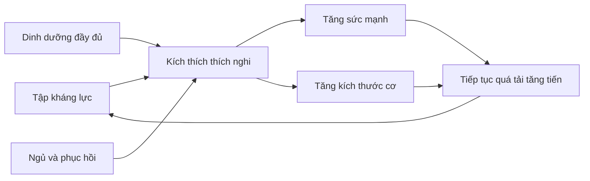
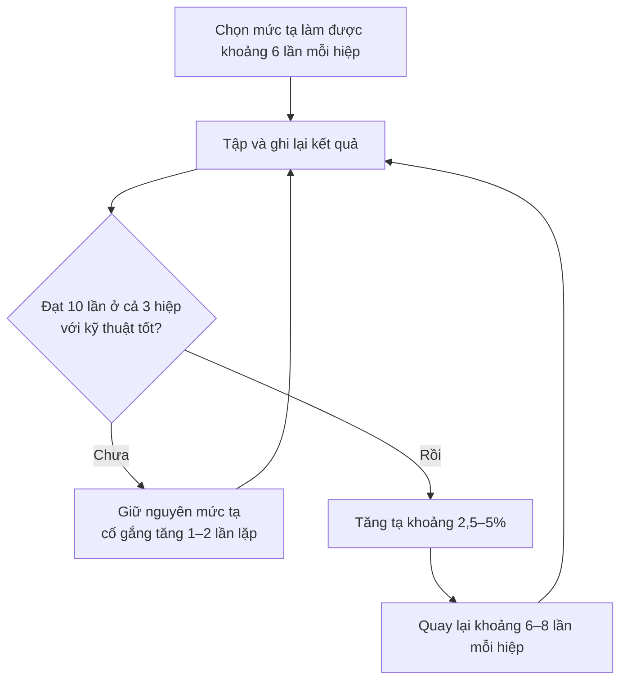
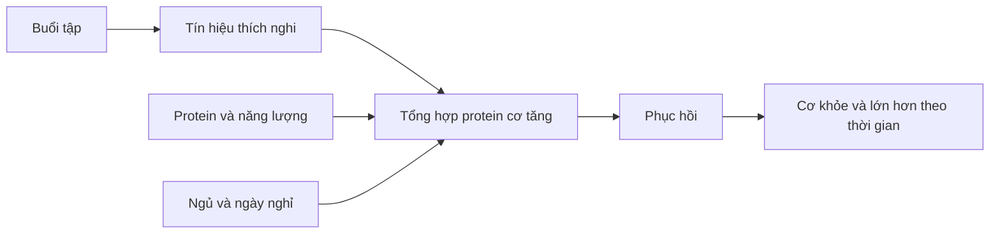
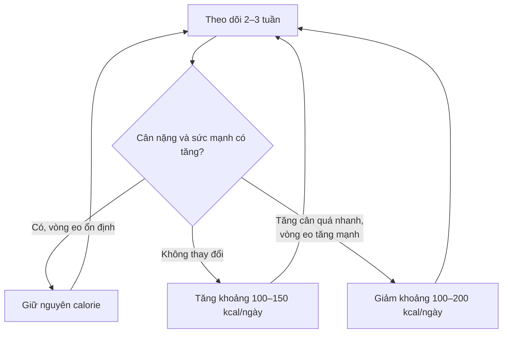

# 091 — Step-By-Step Muscle Building Formula


> **Hình minh họa:** Tập kháng lực với tạ đòn.
> **Nguồn ảnh:** [Wikimedia Commons — Bench Press](https://commons.wikimedia.org/wiki/File:Bench_Press.jpg)

| Thuộc tính            | Nội dung                                   |
| --------------------- | ------------------------------------------ |
| **Module**            | Module 10 — Bonus Lessons on Muscle Growth |
| **Bài học**           | Step-By-Step Muscle Building Formula       |
| **Thời lượng**        | 07:18                                      |
| **Chủ đề chính**      | Công thức xây dựng cơ bắp từng bước        |
| **Công thức cốt lõi** | Tập luyện × Dinh dưỡng × Phục hồi          |

## Mục lục

1. [Mục tiêu bài học](#1-mục-tiêu-bài-học)
2. [Nội dung chính](#2-nội-dung-chính)
3. [Áp dụng thực tế](#3-áp-dụng-thực-tế)
4. [Lưu ý & lỗi thường gặp](#4-lưu-ý--lỗi-thường-gặp)
5. [Checklist thực hành](#5-checklist-thực-hành)
6. [Tóm tắt](#6-tóm-tắt)

---

## 1. Mục tiêu bài học

Sau bài học này, người học có thể:

* Hiểu ba yếu tố quyết định quá trình tăng cơ: **tập luyện, dinh dưỡng và phục hồi**.
* Phân biệt mục tiêu **tăng sức mạnh** với mục tiêu **tăng kích thước cơ bắp**.
* Biết cách lựa chọn bài tập đa khớp và bài tập cô lập.
* Áp dụng nguyên tắc **quá tải tăng tiến — progressive overload**.
* Xây dựng mức thặng dư năng lượng vừa phải, thay vì “ăn càng nhiều càng tốt”.
* Đảm bảo lượng protein, carbohydrate và chất béo phù hợp.
* Sắp xếp cardio để hỗ trợ sức khỏe mà không làm ảnh hưởng đáng kể đến việc tăng cơ.
* Nhận biết vai trò của giấc ngủ, ngày nghỉ và quản lý căng thẳng.

> [!IMPORTANT]
> Tăng cơ không phải là một “mẹo bí mật” hay một chương trình phức tạp. Kết quả chủ yếu đến từ việc thực hiện những nguyên tắc cơ bản một cách **đều đặn, có thể đo lường và đủ lâu**. Hướng dẫn tập kháng lực năm 2026 của American College of Sports Medicine cũng nhấn mạnh rằng tính nhất quán quan trọng hơn việc cố tìm một chương trình hoàn hảo.

---

## 2. Nội dung chính

### 2.1. Công thức xây dựng cơ bắp

Có thể tóm tắt toàn bộ quá trình tăng cơ bằng ba trụ cột:



### Ba trụ cột

| Trụ cột        | Vai trò                                                                           |
| -------------- | --------------------------------------------------------------------------------- |
| **Tập luyện**  | Tạo lực căng cơ học và tín hiệu để cơ thể thích nghi                              |
| **Dinh dưỡng** | Cung cấp năng lượng, protein và vi chất cho quá trình tập luyện, tái tạo mô       |
| **Phục hồi**   | Cho phép hệ cơ, thần kinh, mô liên kết và toàn cơ thể thích nghi với chương trình |

Nếu một trong ba yếu tố bị thiếu trong thời gian dài, tiến độ thường sẽ chậm lại:

* Tập tốt nhưng ăn quá ít → khó tăng cân và tăng cơ.
* Ăn nhiều nhưng không có kích thích tập luyện → phần lớn cân nặng tăng thêm có thể là mỡ.
* Tập và ăn tốt nhưng ngủ quá ít → giảm hiệu suất, khả năng phục hồi và chất lượng buổi tập.

---

### 2.2. Trụ cột thứ nhất: tập kháng lực

#### 2.2.1. Bài tập đa khớp

Bài tập đa khớp sử dụng nhiều khớp và nhiều nhóm cơ trong cùng một chuyển động. Ví dụ:

* Squat và các biến thể.
* Deadlift, Romanian deadlift và hip hinge.
* Bench press, dumbbell press và chống đẩy.
* Overhead press.
* Row, pull-up và lat pulldown.
* Lunge, split squat và step-up.

Các động tác này hiệu quả vì có thể:

* Huấn luyện nhiều nhóm cơ trong thời gian ngắn.
* Sử dụng mức kháng lực tương đối lớn.
* Phát triển khả năng phối hợp và kiểm soát toàn thân.
* Tạo nền tảng sức mạnh cho những bài tập chuyên biệt hơn.

#### Hình minh họa các bài tập với tạ đòn

| Barbell squat                                                                                                     | Bench press                                                                                                                 |
| ----------------------------------------------------------------------------------------------------------------- | --------------------------------------------------------------------------------------------------------------------------- |
|  |                             |
| **Deadlift**                                                                                                      | **Overhead press**                                                                                                          |
|                           |  |

Nguồn ảnh: Wikimedia Commons — [Squat](https://commons.wikimedia.org/wiki/File:Barbell_pad_back_squat.jpg), [Bench press](https://commons.wikimedia.org/wiki/File:Bench_Press.jpg), [Deadlift](https://commons.wikimedia.org/wiki/File:Deadlift.JPG), [Overhead press](https://commons.wikimedia.org/wiki/File:How_to_do_an_Overhead_Press.jpg).

> [!NOTE]
> Squat, deadlift, bench press và overhead press là những bài tập rất hữu ích, nhưng **không phải bốn bài bắt buộc đối với tất cả mọi người**. Có thể sử dụng máy tập, tạ đơn, dây kháng lực hoặc các biến thể phù hợp với cấu trúc cơ thể, khả năng vận động và tiền sử chấn thương. Một phân tích tổng hợp năm 2023 không tìm thấy khác biệt đáng kể về tăng cơ giữa tập với tạ tự do và máy tập; mức tăng sức mạnh thường mang tính đặc hiệu với hình thức đã luyện tập.

#### Bài tập cô lập vẫn có giá trị

Bài tập cô lập chủ yếu tác động vào một nhóm cơ hoặc một chuyển động khớp, chẳng hạn:

* Biceps curl.
* Triceps extension.
* Lateral raise.
* Leg curl.
* Leg extension.
* Calf raise.

Chúng đặc biệt hữu ích khi:

* Muốn tăng thêm khối lượng tập cho một nhóm cơ cụ thể.
* Một nhóm cơ chưa được kích thích đủ trong bài đa khớp.
* Cần tập quanh một chấn thương hoặc hạn chế vận động.
* Muốn phát triển cơ bắp cân đối hơn.

Vì vậy, chương trình hợp lý thường kết hợp:

```text
Bài tập đa khớp làm nền tảng
              +
Bài tập cô lập để bổ sung điểm yếu
```

---

### 2.2.2. Quá tải tăng tiến

Cơ thể thích nghi với mức áp lực mà nó thường xuyên phải chịu. Nếu chương trình không tạo ra thử thách mới trong thời gian dài, tiến độ có thể chậm lại.

**Quá tải tăng tiến** là quá trình tăng dần yêu cầu của bài tập theo thời gian.

Có thể tạo quá tải bằng cách:

1. Tăng trọng lượng.
2. Tăng số lần lặp.
3. Tăng số hiệp có chất lượng.
4. Cải thiện biên độ chuyển động.
5. Thực hiện cùng khối lượng với kỹ thuật tốt hơn.
6. Kiểm soát chuyển động tốt hơn.
7. Giảm mức hỗ trợ ở các bài tập như pull-up.
8. Thực hiện nhiều công việc hơn mà vẫn kiểm soát được mệt mỏi.

Nghiên cứu cho thấy tăng dần **trọng lượng hoặc số lần lặp** đều có thể giúp người mới cải thiện sức mạnh và kích thước cơ.

#### Phương pháp “double progression”

Ví dụ chương trình yêu cầu bench press:

```text
3 hiệp × 6–10 lần
```

Quy trình:



Ví dụ nhật ký:

| Tuần |  Mức tạ | Kết quả      |
| ---: | ------: | ------------ |
|    1 |   50 kg | 8 — 7 — 6    |
|    2 |   50 kg | 9 — 8 — 7    |
|    3 |   50 kg | 10 — 9 — 8   |
|    4 |   50 kg | 10 — 10 — 10 |
|    5 | 52,5 kg | 8 — 7 — 6    |

Đây là quá tải tăng tiến ngay cả khi không thể tăng tạ trong mọi buổi.

---

### 2.2.3. Tập nặng và phạm vi số lần lặp

Nội dung gốc nhấn mạnh rằng các bài chính nên luôn được tập với tạ nặng và số lần lặp thấp. Điều này đúng hơn đối với mục tiêu **tăng sức mạnh tối đa**, nhưng chưa đầy đủ đối với mục tiêu tăng cơ.

* Tạ nặng đặc biệt hiệu quả để cải thiện thành tích 1RM.
* Cơ bắp có thể phát triển với nhiều phạm vi tải khác nhau.
* Khi dùng tạ nhẹ hơn, hiệp tập thường cần được thực hiện tương đối gần giới hạn để tạo đủ kích thích.
* Không cần đưa mọi hiệp đến thất bại hoàn toàn.

Các phân tích tổng hợp cho thấy tải nặng tạo lợi thế rõ hơn về sức mạnh tối đa, trong khi mức tăng cơ có thể tương đương trên một phạm vi tải rộng khi nỗ lực và khối lượng tập được kiểm soát.

#### Phạm vi thực hành đơn giản

| Mục tiêu                    | Phạm vi thường dùng | Ghi chú                                  |
| --------------------------- | ------------------: | ---------------------------------------- |
| Sức mạnh                    |        3–6 lần/hiệp | Tải tương đối nặng, nghỉ dài             |
| Kết hợp sức mạnh và tăng cơ |       6–10 lần/hiệp | Phù hợp với nhiều bài đa khớp            |
| Tăng cơ                     |       8–15 lần/hiệp | Dễ kiểm soát kỹ thuật và khối lượng      |
| Bài cô lập                  |      10–20 lần/hiệp | Giảm áp lực khớp, vẫn tạo kích thích tốt |

Phần lớn các hiệp có thể kết thúc khi người tập cảm thấy mình vẫn thực hiện được khoảng **1–3 lần lặp nữa với kỹ thuật đúng**.

---

### 2.2.4. Khối lượng và tần suất tập luyện

Hướng dẫn ACSM năm 2026 cho thấy:

* Tập kháng lực ít nhất khoảng hai buổi mỗi tuần có thể mang lại lợi ích đáng kể.
* Khối lượng cao hơn, khoảng từ 10 hiệp cho một nhóm cơ mỗi tuần, có liên quan đến khả năng tối ưu tăng cơ tốt hơn.
* Tuy nhiên, người mới không cần bắt đầu ngay với khối lượng cao.

Mức khởi đầu thực tế:

| Trình độ       | Khối lượng gợi ý                                         |
| -------------- | -------------------------------------------------------- |
| Người mới      | Khoảng 6–10 hiệp/nhóm cơ/tuần                            |
| Đã có nền tảng | Khoảng 10–16 hiệp/nhóm cơ/tuần                           |
| Nâng cao       | Điều chỉnh cá nhân dựa trên tiến độ và khả năng phục hồi |

Khối lượng chỉ nên được tăng khi:

* Kỹ thuật vẫn ổn định.
* Hiệu suất không suy giảm liên tục.
* Đau nhức không kéo dài quá mức.
* Giấc ngủ và động lực tập luyện vẫn tốt.

---

### 2.2.5. Cardio có cản trở tăng cơ không?

Cardio không chỉ có mục đích “đốt calorie”. Nó còn giúp:

* Cải thiện sức khỏe tim mạch.
* Tăng khả năng vận chuyển và sử dụng oxy.
* Cải thiện sức bền giữa các hiệp tập.
* Hỗ trợ kiểm soát huyết áp và sức khỏe tổng thể.
* Tăng khả năng thực hiện hoạt động hằng ngày.

Bằng chứng hiện đại cho thấy kết hợp cardio với tập sức mạnh nhìn chung **không làm giảm đáng kể tăng cơ hoặc sức mạnh tối đa**. Tuy nhiên, sức mạnh bùng nổ có thể bị ảnh hưởng khi khối lượng cardio quá cao hoặc cả hai hình thức được thực hiện sát nhau trong cùng buổi.

#### Cách bố trí cardio khi ưu tiên tăng cơ

* Thực hiện 2–3 buổi cardio nhẹ hoặc vừa mỗi tuần.
* Mỗi buổi khoảng 20–30 phút là mức khởi đầu hợp lý.
* Ưu tiên đi bộ nhanh, đạp xe nhẹ hoặc máy elliptical.
* Hạn chế chạy đường dài với khối lượng lớn nếu chân khó phục hồi.
* Khi có thể, cách buổi cardio cường độ cao và buổi tập chân ít nhất vài giờ hoặc xếp vào ngày khác.
* Tăng lượng thức ăn nếu cardio khiến cân nặng liên tục giảm.

---

### 2.3. Trụ cột thứ hai: dinh dưỡng

### 2.3.1. Thặng dư năng lượng

Calorie là đơn vị đo năng lượng trong thực phẩm. Cơ thể cần năng lượng để:

* Duy trì các chức năng sống.
* Thực hiện buổi tập.
* Phục hồi sau tập.
* Tổng hợp mô mới.
* Duy trì hoạt động hằng ngày.

Có thể hình dung quá trình tăng cơ như mở rộng một ngôi nhà:

```text
Tập luyện      = bản thiết kế và tín hiệu xây dựng
Protein        = vật liệu cấu trúc
Năng lượng     = chi phí vận hành công trình
Phục hồi       = thời gian thi công
```

Một mức thặng dư năng lượng vừa phải thường hỗ trợ quá trình tăng cân và tăng cơ. Tuy nhiên, chưa có một mức thặng dư duy nhất phù hợp với tất cả mọi người. Tổng quan về dinh dưỡng ngoài mùa thi đấu từng đề xuất khoảng 10–20% trên mức duy trì, nhưng nghiên cứu sau đó cho thấy thặng dư quá lớn chủ yếu làm tăng tốc độ tích mỡ thay vì tăng thêm sức mạnh hoặc độ dày cơ.

#### Cách bắt đầu bảo thủ

1. Ước tính mức calorie duy trì.
2. Tăng khoảng 5–10%.
3. Theo dõi cân nặng trung bình trong 2–3 tuần.
4. Chỉ tăng thêm calorie nếu cân nặng và hiệu suất không thay đổi.

Ví dụ:

```text
Mức duy trì ước tính: 2.500 kcal/ngày
Thặng dư 5–10%:       125–250 kcal/ngày
Mức bắt đầu:          khoảng 2.625–2.750 kcal/ngày
```

> [!TIP]
> Người mới tập, người quay lại sau thời gian nghỉ hoặc người có tỷ lệ mỡ tương đối cao đôi khi vẫn có thể tăng cơ khi ăn ở mức duy trì, thậm chí trong mức thâm hụt nhỏ. Vì vậy, thặng dư calorie không phải lúc nào cũng là điều kiện tuyệt đối, nhưng thường hữu ích khi mục tiêu chính là tối đa hóa tăng khối lượng cơ.

---

### 2.3.2. Protein

Protein cung cấp amino acid phục vụ quá trình duy trì và xây dựng mô cơ.

Mức thực hành phù hợp với đa số người tập:

```text
Khoảng 1,6–2,2 g protein/kg trọng lượng cơ thể/ngày
```

Ví dụ người nặng 70 kg:

```text
70 × 1,6 = 112 g protein/ngày
70 × 2,2 = 154 g protein/ngày
```

Các phân tích tổng hợp cho thấy lượng protein quanh mức 1,6 g/kg/ngày thường đủ để hỗ trợ phần lớn lợi ích tăng khối nạc khi kết hợp với tập kháng lực; nhu cầu thực tế có thể thay đổi theo tổng năng lượng, tuổi, mức độ tập luyện và sở thích ăn uống.


> **Hình minh họa:** Một số thực phẩm giàu protein như trứng, thịt gia cầm, đậu lăng và các loại hạt.
> **Nguồn ảnh:** [Wikimedia Commons — Protein-rich Foods](https://commons.wikimedia.org/wiki/File:Protein-rich_Foods.jpg)

Nguồn protein có thể bao gồm:

| Nguồn động vật   | Nguồn thực vật                   |
| ---------------- | -------------------------------- |
| Trứng            | Đậu phụ                          |
| Thịt gà          | Đậu nành                         |
| Cá và hải sản    | Đậu lăng                         |
| Thịt nạc         | Đậu gà                           |
| Sữa, sữa chua    | Các loại đậu                     |
| Whey hoặc casein | Protein đậu Hà Lan hoặc đậu nành |

Nên phân bổ protein vào khoảng 3–5 bữa trong ngày thay vì dồn toàn bộ vào một bữa.

---

### 2.3.3. Carbohydrate và chất béo

#### Carbohydrate

Carbohydrate hỗ trợ:

* Bổ sung glycogen cơ.
* Duy trì hiệu suất ở những buổi tập có khối lượng cao.
* Cung cấp năng lượng cho hoạt động hằng ngày.
* Giúp người tập đạt đủ tổng calorie dễ hơn.

Không nhất thiết phải ăn cực nhiều carbohydrate để tăng cơ, nhưng việc cắt giảm quá thấp có thể làm một số người giảm hiệu suất, đặc biệt trong các buổi tập dài hoặc nhiều hiệp.

Nguồn carbohydrate phù hợp:

* Cơm, khoai, yến mạch.
* Bánh mì và mì.
* Trái cây.
* Rau củ.
* Các loại đậu.
* Ngũ cốc nguyên hạt.

#### Chất béo

Chất béo tham gia vào:

* Cấu trúc màng tế bào.
* Hấp thu vitamin tan trong chất béo.
* Sản xuất hormone.
* Cung cấp năng lượng.
* Tạo hương vị và cảm giác no.

Nguồn chất béo nên ưu tiên:

* Cá béo.
* Dầu ô liu.
* Quả bơ.
* Các loại hạt.
* Trứng.
* Bơ đậu phộng không thêm quá nhiều đường.

---

### 2.3.4. “Calorie tốt” và “calorie xấu”

Không nên phân loại thực phẩm một cách tuyệt đối thành “tốt” hoặc “xấu”. Tuy nhiên, hai chế độ ăn có cùng calorie vẫn có thể khác nhau đáng kể về:

* Hàm lượng protein.
* Chất xơ.
* Vitamin và khoáng chất.
* Khả năng tạo cảm giác no.
* Ảnh hưởng đến tiêu hóa.
* Chất lượng buổi tập.
* Sức khỏe lâu dài.

Một chế độ ăn chỉ gồm pizza, kem và thức ăn nhanh có thể tạo thặng dư calorie, nhưng khó đảm bảo đủ protein, chất xơ và vi chất.

Nguyên tắc thực tế:

```text
Khoảng 80–90% thực phẩm ít chế biến, giàu dinh dưỡng
+
Khoảng 10–20% thực phẩm theo sở thích
```

Điều này giúp chế độ ăn vừa có chất lượng, vừa dễ duy trì.

---

### 2.4. Trụ cột thứ ba: phục hồi

### 2.4.1. Cơ bắp không phát triển ngay trong lúc tập

Buổi tập tạo ra kích thích để cơ thể thích nghi. Sau đó, cơ thể cần:

* Amino acid.
* Năng lượng.
* Thời gian.
* Giấc ngủ.
* Khả năng kiểm soát căng thẳng.

Tăng cơ không đơn giản là “phá hủy càng nhiều sợi cơ thì cơ càng lớn”. Lực căng cơ học và sự cân bằng giữa tổng hợp với phân giải protein là những yếu tố quan trọng; đau nhức hoặc tổn thương cơ nghiêm trọng không phải mục tiêu của buổi tập.



---

### 2.4.2. Giấc ngủ

Phần lớn người trưởng thành nên hướng đến khoảng:

```text
7–9 giờ ngủ mỗi đêm
```

Các cơ quan y tế và tuyên bố đồng thuận về giấc ngủ khuyến nghị người trưởng thành ngủ ít nhất khoảng 7 giờ thường xuyên; nhu cầu cá nhân có thể cao hơn.

Thiếu ngủ có thể:

* Làm giảm khả năng tập trung.
* Giảm động lực và hiệu suất buổi tập.
* Làm quá trình phục hồi khó khăn hơn.
* Ảnh hưởng đến điều hòa cảm giác đói.
* Làm giảm đáp ứng đồng hóa của cơ với dinh dưỡng.

Một nghiên cứu thực nghiệm cho thấy chỉ một đêm thiếu ngủ cũng có thể làm giảm đáp ứng tổng hợp protein cơ sau bữa ăn.

#### Cách cải thiện giấc ngủ

* Đi ngủ và thức dậy vào giờ tương đối cố định.
* Giảm ánh sáng mạnh và thiết bị điện tử trước khi ngủ.
* Hạn chế caffeine vào cuối ngày.
* Giữ phòng ngủ tối, yên tĩnh và mát.
* Tránh tập quá nặng sát giờ ngủ nếu điều đó khiến cơ thể khó thư giãn.
* Tránh dùng rượu như một phương pháp hỗ trợ giấc ngủ.
* Điều trị các vấn đề như ngáy lớn hoặc nghi ngờ ngưng thở khi ngủ.

Ngủ trưa có thể hỗ trợ tỉnh táo trong một số trường hợp nhưng không nên được xem là sự thay thế hoàn toàn cho giấc ngủ ban đêm ổn định.

---

### 2.4.3. Ngày nghỉ và quản lý mệt mỏi

Dấu hiệu chương trình có thể đang vượt quá khả năng phục hồi:

* Thành tích giảm liên tục qua nhiều buổi.
* Đau khớp tăng dần.
* Cơ bắp đau kéo dài bất thường.
* Khó ngủ dù rất mệt.
* Không còn động lực tập luyện.
* Nhịp tim lúc nghỉ tăng bất thường.
* Dễ cáu gắt hoặc mất tập trung.
* Thường xuyên bị ốm.

Biện pháp xử lý:

1. Giảm số hiệp trong một tuần.
2. Tránh tập mọi hiệp đến thất bại.
3. Thêm một ngày nghỉ.
4. Thực hiện một tuần giảm tải.
5. Kiểm tra lại lượng calorie và protein.
6. Ưu tiên giấc ngủ.

> [!WARNING]
> Massage, thiền, tắm ấm và các kỹ thuật thư giãn có thể hỗ trợ cảm giác phục hồi, nhưng không thay thế giấc ngủ và dinh dưỡng. Không sử dụng thuốc kê đơn, hormone hoặc chất tăng cường thành tích cho mục đích phục hồi nếu không có chỉ định và giám sát y tế.

---

## 3. Áp dụng thực tế

### 3.1. Mẫu chương trình ba buổi mỗi tuần cho người mới

Đây là ví dụ giáo dục, không phải chương trình bắt buộc cho mọi người.

#### Lịch tuần

| Thứ            | Hoạt động            |
| -------------- | -------------------- |
| Thứ Hai        | Buổi A               |
| Thứ Ba         | Đi bộ hoặc nghỉ      |
| Thứ Tư         | Buổi B               |
| Thứ Năm        | Nghỉ                 |
| Thứ Sáu        | Buổi A               |
| Thứ Bảy        | Cardio nhẹ hoặc nghỉ |
| Chủ Nhật       | Nghỉ                 |
| Tuần tiếp theo | B — A — B            |

### Buổi A

| Bài tập                         | Hiệp × lần |
| ------------------------------- | ---------: |
| Squat hoặc leg press            |   3 × 6–10 |
| Bench press hoặc dumbbell press |   3 × 6–10 |
| Seated row hoặc barbell row     |   3 × 8–12 |
| Romanian deadlift               |   2 × 8–10 |
| Lateral raise                   |  2 × 12–15 |
| Plank                           |   2–3 hiệp |

### Buổi B

| Bài tập                                         |        Hiệp × lần |
| ----------------------------------------------- | ----------------: |
| Deadlift nhẹ, trap-bar deadlift hoặc hip thrust |         2–3 × 5–8 |
| Overhead press                                  |          3 × 6–10 |
| Lat pulldown hoặc assisted pull-up              |          3 × 8–12 |
| Split squat hoặc lunge                          | 3 × 8–12 mỗi chân |
| Biceps curl                                     |         2 × 10–15 |
| Triceps extension                               |         2 × 10–15 |

### Quy tắc thực hiện

* Khởi động 5–10 phút.
* Thực hiện 1–3 hiệp khởi động cho bài đầu tiên.
* Giữ lại khoảng 2–3 lần lặp dự phòng trong các tuần đầu.
* Nghỉ khoảng 2–3 phút ở bài đa khớp.
* Nghỉ khoảng 1–2 phút ở bài cô lập.
* Ghi lại mức tạ, số lần lặp và cảm nhận sau buổi tập.
* Khi đạt giới hạn trên của phạm vi lặp với kỹ thuật tốt, tăng tạ nhẹ.

---

### 3.2. Ví dụ dinh dưỡng cho người nặng 70 kg

Mục tiêu minh họa:

```text
Protein: khoảng 120–150 g/ngày
Calorie: mức duy trì + khoảng 150–250 kcal
Bữa ăn: 3–5 bữa/ngày
```

#### Thực đơn tham khảo

| Bữa         | Ví dụ                                       |
| ----------- | ------------------------------------------- |
| Sáng        | Yến mạch, sữa, trứng và một phần trái cây   |
| Trưa        | Cơm, thịt gà hoặc đậu phụ, rau và dầu ô liu |
| Trước tập   | Chuối, sữa chua hoặc bánh mì                |
| Sau tập/tối | Cơm hoặc khoai, cá/thịt nạc, rau            |
| Bữa phụ     | Sữa, whey, trái cây hoặc các loại hạt       |

Không bắt buộc phải uống whey. Whey chỉ là một nguồn protein tiện lợi khi khó đạt đủ protein từ thức ăn.

---

### 3.3. Cách đánh giá tiến độ

Không nên chỉ dựa vào cân nặng trong một ngày.

Theo dõi:

* Cân nặng trung bình mỗi tuần.
* Vòng ngực, cánh tay, đùi và eo.
* Hình ảnh trong cùng điều kiện ánh sáng.
* Mức tạ và số lần lặp.
* Chất lượng giấc ngủ.
* Cảm giác đói và tiêu hóa.
* Mức độ mệt mỏi.

#### Quy tắc điều chỉnh calorie



---

## 4. Lưu ý & lỗi thường gặp

### Lỗi 1: Thay đổi bài tập liên tục để “đánh lừa cơ”

Cơ bắp không cần bị “bối rối”. Thay đổi bài tập quá thường xuyên khiến người tập khó:

* Học kỹ thuật.
* Theo dõi tiến độ.
* Xác định mức quá tải.
* So sánh hiệu suất giữa các tuần.

Nên giữ các bài chính đủ lâu để cải thiện kỹ thuật và sức mạnh. Việc thay đổi bài có hệ thống vẫn có giá trị, nhưng thay đổi ngẫu nhiên quá mức có thể làm giảm khả năng đo lường tiến độ.

### Lỗi 2: Tin rằng bốn bài tạ đòn là bắt buộc

Không có bài tập duy nhất phù hợp với tất cả mọi người. Người tập có thể thay:

* Back squat bằng front squat, hack squat hoặc leg press.
* Barbell bench press bằng dumbbell press hoặc máy chest press.
* Conventional deadlift bằng trap-bar deadlift, Romanian deadlift hoặc hip thrust.
* Barbell overhead press bằng dumbbell press hoặc máy shoulder press.

### Lỗi 3: Tăng tạ bằng mọi giá

Tăng tạ nhưng giảm biên độ, nảy tạ hoặc mất kiểm soát không phải là tiến bộ thực sự.

Ưu tiên:

```text
Kỹ thuật ổn định → đủ biên độ → tăng số lần lặp → tăng trọng lượng
```

### Lỗi 4: Tập mọi hiệp đến thất bại

Tập đến thất bại có thể được sử dụng có chọn lọc, đặc biệt ở bài máy hoặc bài cô lập. Tuy nhiên, làm điều đó ở mọi hiệp có thể tạo nhiều mệt mỏi hơn mức cần thiết. Hướng dẫn ACSM 2026 kết luận rằng tập đến thất bại không nhất quán tạo ra kết quả tốt hơn.

### Lỗi 5: Ăn càng nhiều càng tăng cơ nhanh

Cơ thể có giới hạn về tốc độ xây dựng mô cơ. Thặng dư quá lớn thường làm tăng mỡ nhanh hơn thay vì tăng thêm cơ.

### Lỗi 6: Chỉ chú ý đến protein

Protein quan trọng, nhưng người tập vẫn cần:

* Đủ tổng năng lượng.
* Carbohydrate để hỗ trợ luyện tập.
* Chất béo thiết yếu.
* Rau, trái cây và chất xơ.
* Nước và các chất điện giải.

### Lỗi 7: Loại bỏ hoàn toàn cardio

Cardio được bố trí hợp lý có thể cải thiện sức khỏe và khả năng làm việc mà không phá hỏng quá trình tăng cơ. Vấn đề thường đến từ **khối lượng cardio quá lớn, ăn không bù đủ hoặc phục hồi kém**, không phải từ bản thân cardio.

### Lỗi 8: Xem đau cơ là thước đo hiệu quả

Không đau cơ không có nghĩa là buổi tập vô ích. Đau cơ quá mức cũng không chứng minh rằng cơ sẽ tăng nhanh hơn.

Thước đo tốt hơn là:

* Kỹ thuật.
* Số lần lặp.
* Trọng lượng.
* Tổng khối lượng có chất lượng.
* Sự phát triển theo nhiều tuần và nhiều tháng.

### Lỗi 9: Bỏ qua đau khớp và chấn thương

Dừng hoặc điều chỉnh bài tập khi xuất hiện:

* Đau nhói.
* Tê hoặc mất cảm giác.
* Đau lan xuống tay hoặc chân.
* Sưng khớp.
* Yếu lực bất thường.
* Đau tăng qua từng buổi.

Cần tham khảo bác sĩ hoặc chuyên gia vật lý trị liệu khi triệu chứng kéo dài hoặc nghiêm trọng.

---

## 5. Checklist thực hành

### Tập luyện

* [ ] Tập kháng lực ít nhất 2–3 buổi mỗi tuần.
* [ ] Bao phủ các mẫu chuyển động đẩy, kéo, squat và hip hinge.
* [ ] Sử dụng bài tập phù hợp với cơ thể và thiết bị hiện có.
* [ ] Ghi lại mức tạ, hiệp và số lần lặp.
* [ ] Tăng dần trọng lượng hoặc số lần lặp.
* [ ] Không thay đổi toàn bộ bài tập mỗi tuần.
* [ ] Không tập mọi hiệp đến thất bại.
* [ ] Duy trì kỹ thuật và biên độ chuyển động có kiểm soát.

### Dinh dưỡng

* [ ] Ước tính mức calorie duy trì.
* [ ] Bắt đầu với thặng dư nhỏ nếu mục tiêu là tăng cân.
* [ ] Ăn khoảng 1,6–2,2 g protein/kg/ngày.
* [ ] Phân bổ protein qua 3–5 bữa.
* [ ] Ăn đủ carbohydrate để duy trì hiệu suất.
* [ ] Không cắt giảm chất béo quá thấp.
* [ ] Ăn rau, trái cây và thực phẩm giàu vi chất.
* [ ] Điều chỉnh calorie dựa trên dữ liệu 2–3 tuần.

### Phục hồi

* [ ] Ngủ khoảng 7–9 giờ mỗi đêm.
* [ ] Có ít nhất 1–2 ngày nghỉ hoặc phục hồi nhẹ mỗi tuần.
* [ ] Không tập nặng cùng một nhóm cơ mỗi ngày.
* [ ] Theo dõi đau khớp và dấu hiệu mệt mỏi tích lũy.
* [ ] Thực hiện tuần giảm tải khi cần.
* [ ] Không sử dụng thuốc hoặc hormone tăng cường thành tích khi không có chỉ định y tế.

### Theo dõi tiến độ

* [ ] Tính cân nặng trung bình theo tuần.
* [ ] Đo vòng eo và các nhóm cơ định kỳ.
* [ ] Chụp ảnh trong điều kiện tương tự.
* [ ] Theo dõi thành tích ở các bài chính.
* [ ] Đánh giá giấc ngủ, năng lượng và cảm giác đói.
* [ ] Chỉ thay đổi một hoặc hai biến số tại một thời điểm.

---

## 6. Tóm tắt

Công thức tăng cơ có ba thành phần:

```text
Tập kháng lực có tiến triển
          +
Đủ năng lượng và protein
          +
Ngủ và phục hồi đầy đủ
          =
Tăng cơ và sức mạnh theo thời gian
```

Những điểm quan trọng nhất:

1. **Tập kháng lực nhất quán:** lựa chọn các bài đa khớp hiệu quả nhưng không coi bất kỳ bài nào là bắt buộc.
2. **Áp dụng quá tải tăng tiến:** tăng trọng lượng, số lần lặp hoặc khối lượng có chất lượng theo thời gian.
3. **Phân biệt tăng cơ và tăng sức mạnh:** tạ nặng có lợi thế cho sức mạnh tối đa, còn tăng cơ có thể đạt được trên phạm vi số lần lặp rộng hơn.
4. **Không cần loại bỏ cardio:** bố trí cardio hợp lý và ăn đủ năng lượng.
5. **Duy trì thặng dư vừa phải:** ăn quá nhiều không khiến cơ phát triển nhanh tương ứng.
6. **Đảm bảo protein:** khoảng 1,6–2,2 g/kg/ngày là phạm vi thực hành phù hợp với nhiều người tập.
7. **Ưu tiên giấc ngủ:** phần lớn người trưởng thành nên hướng đến 7–9 giờ mỗi đêm.
8. **Theo dõi bằng dữ liệu:** sử dụng nhật ký tập, cân nặng trung bình, số đo và hiệu suất thay vì cảm giác của một ngày.
9. **Kiên nhẫn:** tăng cơ là quá trình diễn ra trong nhiều tháng và nhiều năm, không phải vài ngày.

> [!CAUTION]
> Nội dung này phục vụ mục đích giáo dục. Người có bệnh tim mạch, tăng huyết áp, bệnh thận, chấn thương cơ xương khớp hoặc tình trạng sức khỏe đặc biệt nên tham khảo bác sĩ hay chuyên gia đủ chuyên môn trước khi bắt đầu chương trình tập và dinh dưỡng mới.

### Tài liệu nghiên cứu nổi bật

* [Infographic ACSM 2026 — Effective Resistance Training Plan](https://acsm.org/wp-content/uploads/2026/03/Resistance-Training-Position-Stand-infographic.pdf)
* Tổng quan ACSM 2026 về tập kháng lực, sức mạnh và tăng cơ.
* Quá tải tăng tiến bằng tăng tạ hoặc số lần lặp.
* So sánh tạ nặng và tạ nhẹ đối với sức mạnh, tăng cơ.
* So sánh máy tập và tạ tự do.
* Tập cardio kết hợp tập sức mạnh.
* Protein và tập kháng lực.
* Thặng dư năng lượng nhỏ và lớn trong giai đoạn tăng cơ.
* Khuyến nghị thời lượng ngủ cho người trưởng thành.
