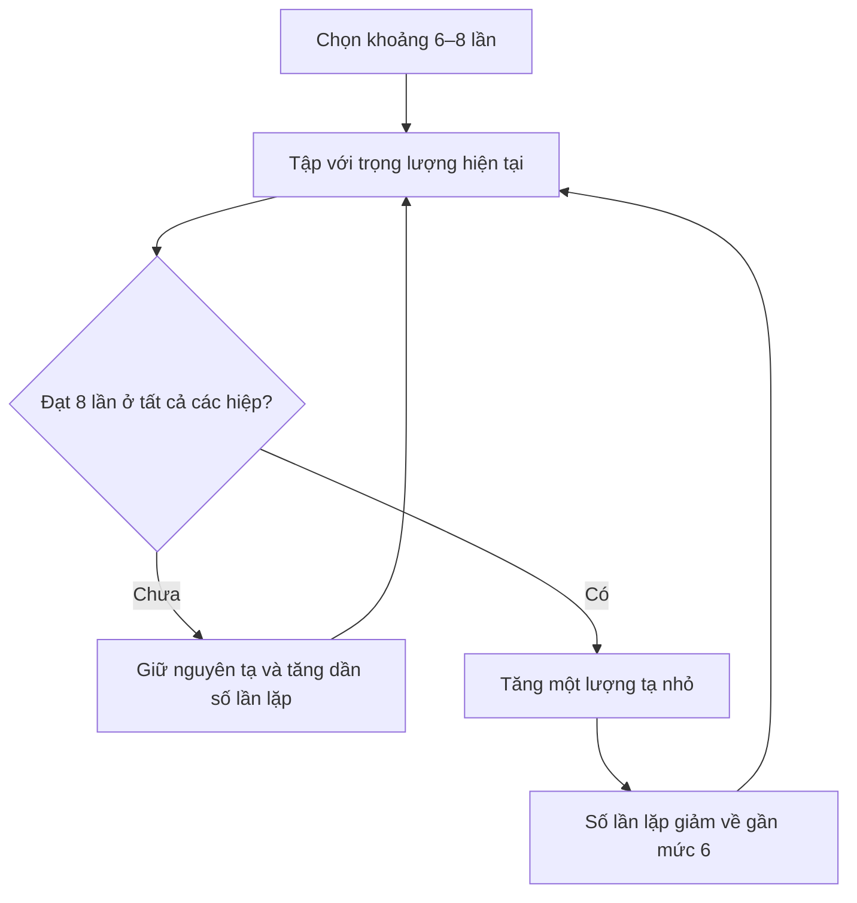

# 092 — Progressive Overload

| Thuộc tính       | Nội dung                                     |
| ---------------- | -------------------------------------------- |
| **Module**       | Module 10 — Bonus Lessons on Muscle Growth   |
| **Bài học**      | Progressive Overload                         |
| **Thời lượng**   | 02:33                                        |
| **Chủ đề chính** | Nguyên tắc tăng tiến mức tải trong tập luyện |


*Ảnh minh họa: bài tập bench press với tạ đòn. [Nguồn ảnh và giấy phép CC BY-SA 4.0](https://commons.wikimedia.org/wiki/File:Bench_Press.jpg).*

## Mục lục

1. [Mục tiêu bài học](#1-mục-tiêu-bài-học)
2. [Nội dung chính](#2-nội-dung-chính)
3. [Áp dụng thực tế](#3-áp-dụng-thực-tế)
4. [Lưu ý & lỗi thường gặp](#4-lưu-ý--lỗi-thường-gặp)
5. [Checklist thực hành](#5-checklist-thực-hành)
6. [Tóm tắt](#6-tóm-tắt)

---

## 1. Mục tiêu bài học

Sau khi hoàn thành bài học, bạn có thể:

* Hiểu **progressive overload** — tăng tiến mức tải — là gì.
* Giải thích vì sao cơ bắp và sức mạnh có thể chững lại sau giai đoạn đầu.
* Phân biệt tăng tiến mức tải với việc chỉ đơn giản là thêm nhiều tạ.
* Áp dụng phương pháp **tăng số lần lặp rồi tăng trọng lượng**.
* Theo dõi quá trình tập bằng nhật ký thay vì đánh giá dựa trên cảm giác.
* Nhận biết khi nào cần tiếp tục tăng tải, giữ nguyên hoặc giảm tải để phục hồi.

> **Ý tưởng cốt lõi:** Cơ thể sẽ thích nghi với một mức kích thích quen thuộc. Để tiếp tục tiến bộ, mức độ thử thách phải được tăng dần theo thời gian.

---

## 2. Nội dung chính

### 2.1. Vì sao người mới thường tiến bộ rất nhanh rồi chững lại?

Trong vài tuần đầu tập luyện, người mới thường nhận thấy:

* Có thể nâng mức tạ lớn hơn nhanh chóng.
* Thực hiện động tác ổn định hơn.
* Số lần lặp tăng lên.
* Cơ bắp có vẻ phát triển rõ rệt.
* Khả năng phối hợp và kiểm soát động tác được cải thiện.

Tuy nhiên, sau một thời gian, cơ thể đã quen với chương trình hiện tại. Một mức tạ từng rất khó có thể trở thành mức tạ bình thường. Nếu người tập tiếp tục thực hiện cùng bài tập, cùng trọng lượng, cùng số hiệp và cùng số lần lặp, kích thích tập luyện có thể không còn đủ lớn để tạo ra sự thích nghi đáng kể.

Điều này không có nghĩa là chương trình đã hoàn toàn mất tác dụng. Nó cho thấy người tập cần điều chỉnh mức độ thử thách một cách có hệ thống.

---

### 2.2. Progressive overload là gì?

**Progressive overload** là nguyên tắc tăng dần yêu cầu mà cơ thể phải đáp ứng trong quá trình tập luyện.

Trong tập kháng lực, điều này có thể được thực hiện bằng cách:

* Tăng trọng lượng.
* Tăng số lần lặp.
* Tăng số hiệp.
* Tăng phạm vi chuyển động.
* Cải thiện kỹ thuật và kiểm soát mức tạ.
* Chuyển sang biến thể khó hơn.
* Tăng khối lượng tập luyện phù hợp theo tuần.

Nghiên cứu mô tả progressive overload là việc duy trì một kích thích đủ lớn so với khả năng thích nghi hiện tại của người tập. Việc tăng trọng lượng là cách phổ biến nhất, nhưng không phải là cách duy nhất.

> **Progressive overload không có nghĩa là phải tăng tạ trong mọi buổi tập.**
> Khi đã tập lâu hơn, một mức tăng nhỏ cũng có thể cần nhiều tuần để đạt được.

### 2.3. Chu trình thích nghi của cơ thể


Quá trình này có thể được hiểu như sau:

1. Tập luyện tạo ra một yêu cầu cao hơn trạng thái nghỉ ngơi.
2. Cơ thể xuất hiện mệt mỏi và cần thời gian hồi phục.
3. Khi được cung cấp đủ năng lượng, protein và giấc ngủ, cơ thể thích nghi.
4. Khả năng tạo lực và chịu đựng của cơ bắp được cải thiện.
5. Mức tập cũ dần trở nên ít thử thách hơn.
6. Người tập cần tăng yêu cầu để tiếp tục tạo ra kích thích mới.

Progressive overload là một phần quan trọng của quá trình này, nhưng không tự động bảo đảm tăng cơ. Kết quả còn phụ thuộc vào mức độ nỗ lực, tổng khối lượng tập, kỹ thuật, dinh dưỡng, giấc ngủ và khả năng phục hồi.

---

### 2.4. Các cách áp dụng progressive overload

| Phương pháp                  | Ví dụ                                | Lưu ý                                                 |
| ---------------------------- | ------------------------------------ | ----------------------------------------------------- |
| **Tăng trọng lượng**         | Bench press từ 70 kg lên 72 kg       | Chỉ tăng khi vẫn kiểm soát được kỹ thuật              |
| **Tăng số lần lặp**          | 70 kg × 6 lần thành 70 kg × 8 lần    | Phù hợp khi chưa thể tăng thêm tạ                     |
| **Tăng số hiệp**             | Từ 3 hiệp lên 4 hiệp                 | Làm tăng khối lượng và nhu cầu phục hồi               |
| **Tăng phạm vi chuyển động** | Squat sâu hơn với cùng trọng lượng   | Không ép phạm vi khiến tư thế bị mất kiểm soát        |
| **Cải thiện kỹ thuật**       | Giảm đà, kiểm soát pha hạ tạ         | Cùng mức tạ nhưng cơ mục tiêu phải làm việc nhiều hơn |
| **Dùng biến thể khó hơn**    | Push-up thường → decline push-up     | Hữu ích khi tập với trọng lượng cơ thể                |
| **Tăng số buổi hợp lý**      | Tập một nhóm cơ 1 buổi → 2 buổi/tuần | Cần phân bổ khối lượng và phục hồi phù hợp            |

Không nên cố thay đổi tất cả các yếu tố cùng lúc. Khi tăng trọng lượng, hãy giữ tương đối ổn định số hiệp, phạm vi chuyển động và kỹ thuật để biết chính xác yếu tố nào đang tạo ra tiến bộ.

---

### 2.5. Phương pháp tăng kép — Double Progression

Một trong những cách đơn giản nhất để áp dụng progressive overload là:

1. Chọn một khoảng số lần lặp.
2. Giữ nguyên trọng lượng.
3. Tăng dần số lần lặp trong khoảng đã chọn.
4. Khi đạt giới hạn trên với kỹ thuật tốt, tăng trọng lượng.
5. Số lần lặp sẽ giảm xuống.
6. Tiếp tục xây dựng số lần lặp trở lại.

Ví dụ, chương trình quy định:

```text
Bench press: 3 hiệp × 6–8 lần
```

Quá trình tăng tiến có thể diễn ra như sau:

| Buổi tập | Trọng lượng |   Kết quả | Quyết định                    |
| -------: | ----------: | --------: | ----------------------------- |
|        1 |       68 kg | 8 – 8 – 8 | Đã đạt giới hạn trên          |
|        2 |       70 kg | 6 – 6 – 5 | Giữ nguyên 70 kg              |
|        3 |       70 kg | 7 – 6 – 6 | Tiếp tục tăng số lần lặp      |
|        4 |       70 kg | 7 – 7 – 7 | Giữ nguyên trọng lượng        |
|        5 |       70 kg | 8 – 8 – 7 | Chưa cần tăng tạ              |
|        6 |       70 kg | 8 – 8 – 8 | Có thể tăng lên mức tiếp theo |
|        7 |       72 kg | 6 – 6 – 5 | Bắt đầu chu kỳ mới            |

Trong ví dụ từ bài học:

* **150 lb tương đương khoảng 68 kg.**
* Tăng thêm 5 lb đưa tổng trọng lượng lên khoảng **155 lb, tương đương 70,3 kg**.
* Khi vừa tăng tạ, số lần lặp giảm từ 8 xuống khoảng 5–6 là điều bình thường.
* Những buổi tiếp theo được dùng để xây dựng số lần lặp trở lại.



---

### 2.6. Không cần liên tục “gây sốc” cho cơ bắp

Một quan niệm phổ biến là phải thay đổi bài tập sau vài buổi để “đánh lừa” hoặc “gây sốc” cho cơ bắp.

Trên thực tế, thay đổi bài tập quá thường xuyên có thể gây khó khăn cho việc:

* Học kỹ thuật.
* Theo dõi sức mạnh.
* So sánh hiệu suất giữa các tuần.
* Xác định chương trình có thật sự hiệu quả hay không.
* Tích lũy đủ thời gian luyện tập một động tác.

Việc thay đổi bài tập vẫn có giá trị khi:

* Động tác gây đau hoặc khó chịu bất thường.
* Không còn thiết bị phù hợp.
* Muốn ưu tiên một nhóm cơ khác.
* Cần quản lý mệt mỏi hoặc chấn thương.
* Đã hoàn thành một giai đoạn chương trình.
* Động lực tập luyện giảm rõ rệt.

Tuy nhiên, sự thay đổi nên có mục đích thay vì hoàn toàn ngẫu nhiên. Hướng dẫn ACSM cập nhật năm 2026 nhấn mạnh rằng sự nhất quán và khả năng duy trì chương trình thường quan trọng hơn những phương pháp tập phức tạp; các kỹ thuật nâng cao không phải lúc nào cũng cần thiết đối với người tập thông thường.

---

### 2.7. Bằng chứng nghiên cứu

Một thử nghiệm kéo dài tám tuần đã so sánh hai phương pháp:

* **LOAD:** tăng trọng lượng trong khi duy trì khoảng số lần lặp.
* **REPS:** giữ trọng lượng ban đầu và tăng số lần lặp.

Cả hai nhóm đều cải thiện sức mạnh và kích thước cơ. Phần lớn kết quả tăng cơ giữa hai phương pháp tương đối giống nhau, trong khi nhóm tăng trọng lượng có xu hướng nhỉnh hơn một chút về sức mạnh tối đa. Điều này cho thấy tăng số lần lặp là một chiến lược progressive overload hợp lý, đặc biệt khi chưa thể tăng thêm trọng lượng.

Một nghiên cứu khác công bố năm 2024 cũng kết luận rằng tăng tải bằng trọng lượng hoặc bằng số lần lặp đều có thể hỗ trợ cải thiện sức mạnh và tăng cơ trong giai đoạn đầu của quá trình tập luyện.


*Infographic chính thức của American College of Sports Medicine về cách xây dựng chương trình tập kháng lực hiệu quả. [Xem nội dung gốc tại ACSM](https://acsm.org/effective-resistance-training-program-infographic/).*

---

## 3. Áp dụng thực tế

### 3.1. Bước 1 — Chọn các bài tập ổn định

Ưu tiên một số động tác có thể theo dõi trong nhiều tuần, chẳng hạn:

* Squat hoặc leg press.
* Bench press hoặc dumbbell press.
* Deadlift hoặc Romanian deadlift.
* Pull-up hoặc lat pulldown.
* Barbell row hoặc cable row.
* Overhead press.

Không cần giữ mọi bài tập mãi mãi. Tuy nhiên, nên duy trì các bài tập chính đủ lâu để kỹ thuật và hiệu suất có thể được đánh giá chính xác.

---

### 3.2. Bước 2 — Chọn khoảng số lần lặp

Ví dụ:

| Loại bài tập               |             Khoảng số lần lặp gợi ý |
| -------------------------- | ----------------------------------: |
| Bài compound nặng          |                             4–8 lần |
| Bài compound thông thường  |                            6–12 lần |
| Bài cô lập                 |                           10–20 lần |
| Bài tập trọng lượng cơ thể | 8–20 lần hoặc dùng biến thể khó hơn |

Đây là các khoảng thực hành, không phải giới hạn tuyệt đối. Khoảng số lần lặp nên phù hợp với mục tiêu, kỹ thuật và mức độ thoải mái của người tập.

---

### 3.3. Bước 3 — Đánh giá mức độ nỗ lực bằng RIR

**RIR — Repetitions in Reserve** là số lần lặp bạn ước tính vẫn có thể thực hiện trước khi không thể hoàn thành thêm một lần đúng kỹ thuật.

|       RIR | Ý nghĩa                            |
| --------: | ---------------------------------- |
| **4 RIR** | Có thể thực hiện thêm khoảng 4 lần |
| **3 RIR** | Có thể thực hiện thêm khoảng 3 lần |
| **2 RIR** | Có thể thực hiện thêm khoảng 2 lần |
| **1 RIR** | Có thể thực hiện thêm khoảng 1 lần |
| **0 RIR** | Đã đạt giới hạn của hiệp           |

RIR là công cụ hữu ích để điều chỉnh cường độ, nhưng người mới có thể chưa ước lượng chính xác. Độ chính xác thường được cải thiện khi có thêm kinh nghiệm tập luyện.

Phần lớn các hiệp tập có thể được kết thúc khi người tập cảm thấy vẫn còn khoảng 1–3 lần lặp đúng kỹ thuật. Không nhất thiết phải tập đến thất bại hoàn toàn trong mọi hiệp. Một nghiên cứu tám tuần cho thấy tập với khoảng 1–2 RIR có thể tạo mức tăng cơ tương tự tập đến thất bại, đồng thời gây ít mệt mỏi cấp tính hơn.

---

### 3.4. Bước 4 — Ghi lại quá trình tập

Mỗi buổi nên ghi tối thiểu:

```text
Ngày:
Tên bài tập:
Trọng lượng:
Số hiệp:
Số lần lặp từng hiệp:
RIR ước tính:
Ghi chú kỹ thuật:
Mức năng lượng và giấc ngủ:
```

Ví dụ:

| Ngày  | Bài tập     | Trọng lượng | Các hiệp | RIR cuối | Ghi chú            |
| ----- | ----------- | ----------: | -------- | -------: | ------------------ |
| 03/08 | Bench press |       70 kg | 7–7–6    |        2 | Kỹ thuật ổn định   |
| 07/08 | Bench press |       70 kg | 8–7–7    |      1–2 | Hiệp cuối hơi chậm |
| 11/08 | Bench press |       70 kg | 8–8–8    |        1 | Có thể tăng mức tạ |

Nhật ký giúp phân biệt giữa:

* Tiến bộ thực sự.
* Một buổi tập tốt bất thường.
* Một buổi tập kém do thiếu ngủ hoặc mệt mỏi.
* Plateau kéo dài cần điều chỉnh chương trình.

---

### 3.5. Quy tắc quyết định sau mỗi buổi

| Kết quả                                      | Hành động                                  |
| -------------------------------------------- | ------------------------------------------ |
| Đạt giới hạn trên, kỹ thuật tốt, còn 1–2 RIR | Tăng một lượng tạ nhỏ                      |
| Nằm trong khoảng số lần lặp                  | Giữ nguyên tạ và cố thêm 1–2 lần tổng cộng |
| Không đạt giới hạn dưới                      | Giữ hoặc giảm nhẹ trọng lượng              |
| Kỹ thuật bắt đầu hỏng                        | Không tăng tải                             |
| Hiệu suất giảm trong một buổi                | Kiểm tra giấc ngủ, ăn uống và mệt mỏi      |
| Hiệu suất giảm liên tục nhiều buổi           | Xem xét giảm khối lượng hoặc deload        |

---

### 3.6. Progressive overload khi tập tại nhà

Không có thêm tạ vẫn có thể áp dụng progressive overload.

Ví dụ với push-up:

```text
Push-up kê tay cao
        ↓
Push-up tiêu chuẩn
        ↓
Push-up với nhịp hạ chậm
        ↓
Decline push-up
        ↓
Push-up đeo ba lô
        ↓
Archer push-up
```

Các lựa chọn khác:

* Tăng số lần lặp.
* Tăng số hiệp.
* Kéo dài phạm vi chuyển động.
* Giảm sự hỗ trợ.
* Dùng dây kháng lực mạnh hơn.
* Đeo ba lô có thêm trọng lượng.
* Chuyển sang biến thể đòi hỏi đòn bẩy khó hơn.

---

### 3.7. Xử lý plateau

**Plateau** là giai đoạn hiệu suất không cải thiện trong một khoảng thời gian, không phải chỉ một buổi tập kém.

Khi gặp plateau:

1. Kiểm tra lại nhật ký tập luyện.
2. Đánh giá kỹ thuật và phạm vi chuyển động.
3. Kiểm tra giấc ngủ, năng lượng và protein.
4. Giữ nguyên trọng lượng thêm vài buổi để tăng số lần lặp.
5. Sử dụng mức tăng nhỏ hơn nếu có thể.
6. Giảm nhẹ khối lượng trong một tuần nếu mệt mỏi tích lũy.
7. Chỉ thay bài tập khi có lý do rõ ràng.

> **Đừng phản ứng quá mức trước một buổi tập kém.**
> Sức mạnh có thể dao động theo giấc ngủ, căng thẳng, dinh dưỡng và mức độ phục hồi.

---

## 4. Lưu ý & lỗi thường gặp

### 4.1. Chỉ xem việc tăng tạ là tiến bộ

Bạn vẫn có thể tiến bộ khi:

* Tăng số lần lặp.
* Thực hiện cùng số lần lặp với kỹ thuật tốt hơn.
* Tăng phạm vi chuyển động.
* Kiểm soát pha hạ tạ tốt hơn.
* Hoàn thành cùng bài tập với mức nỗ lực thấp hơn.

---

### 4.2. Tăng trọng lượng quá nhanh

Mức tăng quá lớn có thể khiến:

* Số lần lặp giảm khỏi khoảng mục tiêu.
* Kỹ thuật bị phá vỡ.
* Cơ mục tiêu không còn là bộ phận chịu tải chính.
* Mệt mỏi tăng nhanh hơn khả năng phục hồi.

Hãy ưu tiên những bước tăng nhỏ, đặc biệt với các bài thân trên.

---

### 4.3. Đánh đổi kỹ thuật để đạt con số lớn hơn

Ví dụ:

* Bench press nhưng nhấc hông quá mức.
* Squat ngày càng nông khi tăng tạ.
* Curl bằng cách đung đưa toàn thân.
* Row nhưng giảm mạnh phạm vi chuyển động.

Đó không phải là sự so sánh công bằng giữa hai buổi tập. Progressive overload chỉ có ý nghĩa khi tiêu chuẩn kỹ thuật tương đối nhất quán.

---

### 4.4. Thay đổi chương trình quá thường xuyên

Thay bài tập mỗi tuần khiến bạn khó xác định:

* Mình có mạnh hơn hay không.
* Số lần lặp tăng do thích nghi hay do bài tập khác.
* Nhóm cơ mục tiêu có thật sự được cải thiện không.
* Chương trình nào đang mang lại kết quả.

---

### 4.5. Cố lập kỷ lục trong mọi buổi tập

Progressive overload được đánh giá theo xu hướng nhiều tuần hoặc nhiều tháng, không phải yêu cầu phải phá kỷ lục mỗi ngày.

Một số buổi chỉ cần:

* Lặp lại thành tích cũ với kỹ thuật tốt hơn.
* Giữ hiệu suất trong khi đang mệt.
* Hoàn thành khối lượng dự kiến.
* Chuẩn bị cho một lần tăng tải trong tương lai.

---

### 4.6. Tăng quá nhiều yếu tố cùng lúc

Không nên đồng thời:

* Tăng tạ.
* Tăng số hiệp.
* Tăng số lần lặp.
* Giảm thời gian nghỉ.
* Tăng số buổi tập.

Điều này khiến mệt mỏi tăng đột ngột và khó xác định nguyên nhân khi hiệu suất suy giảm.

---

### 4.7. Bỏ qua phục hồi

Cơ bắp không phát triển chỉ trong lúc nâng tạ. Quá trình thích nghi cần:

* Đủ năng lượng.
* Đủ protein.
* Giấc ngủ phù hợp.
* Thời gian phục hồi giữa các buổi.
* Quản lý căng thẳng.
* Chương trình có khối lượng vừa sức.

Nếu khả năng phục hồi không theo kịp, việc liên tục tăng tải có thể làm giảm chất lượng tập luyện thay vì cải thiện kết quả.

---

## 5. Checklist thực hành

### Trước buổi tập

* [ ] Tôi đã xác định trọng lượng và khoảng số lần lặp.
* [ ] Tôi biết kết quả của buổi tập trước.
* [ ] Tôi đã khởi động phù hợp.
* [ ] Tôi không tăng tạ chỉ vì áp lực từ người khác.
* [ ] Tôi đặt kỹ thuật và phạm vi chuyển động lên trước trọng lượng.

### Trong buổi tập

* [ ] Tôi ghi lại số lần lặp của từng hiệp.
* [ ] Tôi duy trì kỹ thuật tương đối nhất quán.
* [ ] Tôi không biến bài tập thành một động tác hoàn toàn khác.
* [ ] Tôi theo dõi mức RIR ở các hiệp chính.
* [ ] Tôi dừng hiệp nếu xuất hiện đau nhói hoặc bất thường.

### Sau buổi tập

* [ ] Tôi đã ghi trọng lượng, số hiệp và số lần lặp.
* [ ] Tôi đánh giá chất lượng kỹ thuật.
* [ ] Tôi biết buổi sau cần giữ nguyên hay tăng tải.
* [ ] Tôi xem xét xu hướng nhiều buổi thay vì một kết quả đơn lẻ.
* [ ] Tôi ưu tiên ăn uống, ngủ và phục hồi.

---

## 6. Tóm tắt

**Progressive overload** là nguyên tắc tăng dần mức độ thử thách của quá trình tập luyện để cơ thể tiếp tục thích nghi.

Những điểm quan trọng:

1. Không nhất thiết phải tăng tạ trong mọi buổi.
2. Có thể tăng tiến bằng trọng lượng, số lần lặp, số hiệp, kỹ thuật hoặc độ khó.
3. Phương pháp đơn giản nhất là tăng số lần lặp trước, sau đó mới tăng trọng lượng.
4. Khi tăng tạ, số lần lặp tạm thời giảm xuống là điều bình thường.
5. Nên giữ chương trình đủ ổn định để theo dõi tiến bộ.
6. Không đánh đổi kỹ thuật để đạt con số lớn hơn.
7. Tiến bộ phải đi cùng dinh dưỡng, giấc ngủ và phục hồi.

> **Thông điệp cuối cùng:**
> Đừng cố làm cho mỗi buổi tập trở nên hoàn toàn khác biệt. Hãy làm cho chương trình hiện tại khó hơn một cách từ từ, có kiểm soát và có thể đo lường được.
