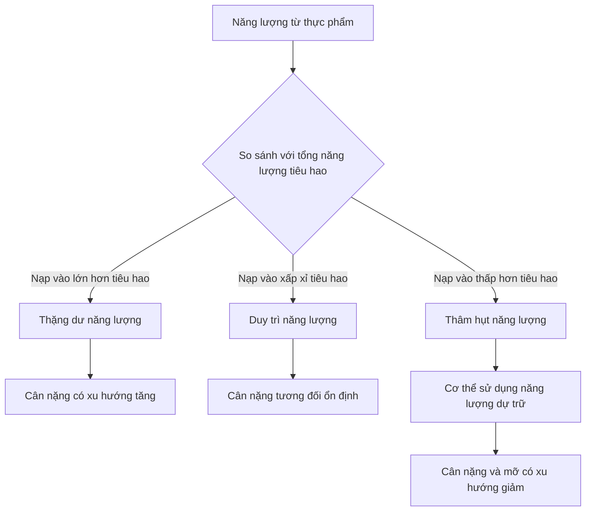
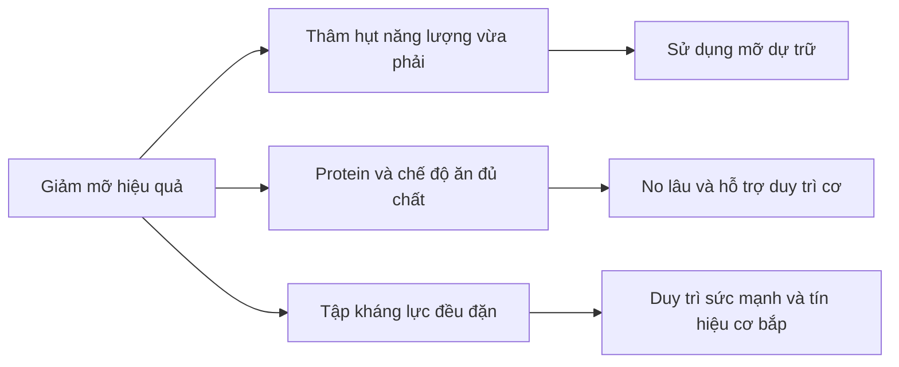
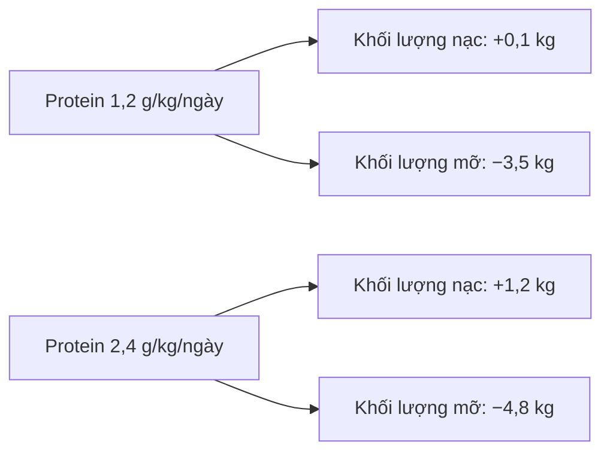
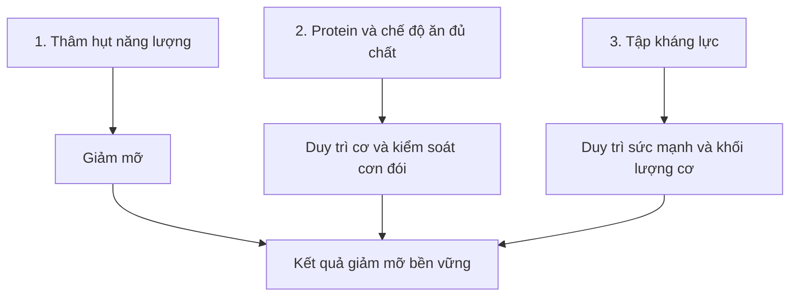

# 093 — Step-By-Step Fat Loss Formula

## Công thức giảm mỡ từng bước

| Thuộc tính             | Nội dung                                             |
| ---------------------- | ---------------------------------------------------- |
| **Module**             | Module 10 — Bonus Lessons on Muscle Growth           |
| **Bài học**            | Step-By-Step Fat Loss Formula                        |
| **Thời lượng**         | 06:24                                                |
| **Chủ đề chính**       | Công thức giảm mỡ từng bước                          |
| **Mục tiêu tổng quát** | Giảm mỡ bền vững, duy trì sức mạnh và hạn chế mất cơ |


> **Hình minh họa:** Tập luyện sức mạnh là một thành phần quan trọng của chương trình giảm mỡ nhằm duy trì khối lượng cơ và khả năng vận động. Ảnh được phát hành theo giấy phép CC BY 2.0.

---

## Mục lục

1. [Mục tiêu bài học](#1-mục-tiêu-bài-học)
2. [Nội dung chính](#2-nội-dung-chính)
3. [Áp dụng thực tế](#3-áp-dụng-thực-tế)
4. [Lưu ý & lỗi thường gặp](#4-lưu-ý--lỗi-thường-gặp)
5. [Checklist thực hành](#5-checklist-thực-hành)
6. [Tóm tắt](#6-tóm-tắt)

---

## 1. Mục tiêu bài học

Sau bài học này, người học có thể:

* Phân biệt **giảm cân** với **giảm mỡ**.
* Hiểu nguyên tắc cân bằng năng lượng và thâm hụt calo.
* Thiết lập mức thâm hụt phù hợp thay vì áp dụng chế độ ăn cực đoan.
* Xây dựng chế độ ăn đủ protein, chất xơ và vi chất.
* Kết hợp tập kháng lực, cardio và vận động hằng ngày.
* Hiểu khi nào có thể vừa giảm mỡ vừa tăng cơ.
* Nhận diện những quan niệm sai như giảm mỡ cục bộ, cardio càng nhiều càng tốt và tập nhiều lần lặp để “siết nét”.
* Theo dõi tiến độ và điều chỉnh kế hoạch dựa trên dữ liệu thực tế.

> **Thông điệp trung tâm:** Giảm mỡ không cần một loại thực phẩm, thực phẩm bổ sung hay phương pháp “bí mật”. Nền tảng vẫn là duy trì thâm hụt năng lượng, ăn đủ dinh dưỡng và tập luyện để bảo vệ cơ bắp.

---

## 2. Nội dung chính

### 2.1. Phân biệt giảm cân và giảm mỡ

**Giảm cân** là sự giảm xuống của tổng khối lượng cơ thể. Con số trên cân có thể thay đổi do:

* Mỡ cơ thể.
* Khối lượng cơ.
* Nước.
* Glycogen dự trữ.
* Thức ăn trong hệ tiêu hóa.

**Giảm mỡ** là quá trình làm giảm mô mỡ trong khi cố gắng duy trì tối đa khối lượng cơ và sức mạnh.

Vì vậy, một chương trình hiệu quả không chỉ đặt mục tiêu “cân nặng thấp hơn”, mà phải hướng tới:

```text
Giảm khối lượng mỡ
        +
Duy trì cơ bắp
        +
Duy trì sức khỏe và hiệu suất
```

Khối lượng cơ thể có thể dao động đáng kể theo từng ngày do nước, muối, carbohydrate và lượng thức ăn. Do đó, nên đánh giá xu hướng trung bình trong nhiều ngày thay vì phản ứng với một lần cân đơn lẻ.

---

### 2.2. Nguyên tắc cơ bản: thâm hụt năng lượng

Cơ thể nhận năng lượng từ thực phẩm và tiêu hao năng lượng để:

* Duy trì các chức năng sống cơ bản.
* Tiêu hóa và hấp thu thức ăn.
* Thực hiện hoạt động hằng ngày.
* Tập luyện thể thao.
* Duy trì thân nhiệt và sửa chữa mô.

Cân bằng năng lượng có thể được mô tả như sau:

[
\text{Cân bằng năng lượng}
==========================

## \text{Năng lượng nạp vào}

\text{Năng lượng tiêu hao}
]

Khi năng lượng nạp vào thấp hơn năng lượng tiêu hao trong một khoảng thời gian đủ dài, cơ thể phải sử dụng năng lượng dự trữ và cân nặng có xu hướng giảm. Đây là nguyên tắc nền tảng của quá trình giảm cân, mặc dù phản ứng thực tế còn chịu ảnh hưởng của sự thích nghi chuyển hóa, cảm giác đói, hoạt động tự phát và thay đổi thành phần cơ thể.



#### Thâm hụt phải được duy trì theo thời gian

Một ngày ăn ít không tạo ra kết quả đáng kể nếu những ngày sau đó ăn bù quá nhiều. Điều quan trọng là **mức năng lượng trung bình của cả tuần**.

Ví dụ:

| Ngày          | Chênh lệch năng lượng |
| ------------- | --------------------: |
| Thứ Hai       |             −400 kcal |
| Thứ Ba        |             −400 kcal |
| Thứ Tư        |             −400 kcal |
| Thứ Năm       |             −400 kcal |
| Thứ Sáu       |             −400 kcal |
| Thứ Bảy       |           +1.000 kcal |
| Chủ Nhật      |           +1.000 kcal |
| **Tổng tuần** |            **0 kcal** |

Trong ví dụ trên, năm ngày ăn kiêng đã bị hai ngày cuối tuần bù lại gần như hoàn toàn.

---

### 2.3. Có thể giảm cân bằng cách chỉ ăn pizza không?

Về mặt năng lượng, một người vẫn có thể giảm cân nếu tổng lượng calo từ pizza thấp hơn lượng cơ thể tiêu hao. Tuy nhiên, điều này không có nghĩa mọi chế độ ăn có cùng ảnh hưởng đến:

* Cảm giác no và mức độ đói.
* Khả năng duy trì chế độ ăn.
* Lượng protein và chất xơ.
* Vitamin và khoáng chất.
* Sức khỏe tim mạch và chuyển hóa.
* Hiệu suất tập luyện.
* Khả năng duy trì khối lượng cơ.

Các chiến lược kiểm soát cân nặng hiệu quả cần quan tâm cả **số lượng thực phẩm**, **thành phần dinh dưỡng** và tính bền vững của chế độ ăn.

> **Kết luận:**
> Calo quyết định liệu cân nặng có thể giảm hay không; chất lượng thực phẩm ảnh hưởng mạnh đến sức khỏe, cảm giác no, hiệu suất và khả năng duy trì kế hoạch.

---

### 2.4. Ba trụ cột của một chương trình giảm mỡ



#### Trụ cột 1: Tạo thâm hụt năng lượng hợp lý

Mức khởi đầu thực tế thường là:

* Giảm khoảng **10–20%** so với lượng calo duy trì; hoặc
* Tạo thâm hụt khoảng **300–500 kcal/ngày**.

Không nên mặc định rằng thâm hụt càng lớn thì kết quả càng tốt. Thâm hụt quá lớn có thể làm tăng:

* Cảm giác đói.
* Mệt mỏi.
* Suy giảm hiệu suất tập luyện.
* Nguy cơ mất khối lượng cơ.
* Khả năng bỏ cuộc hoặc ăn bù.

Một phân tích về tập kháng lực trong điều kiện thiếu năng lượng cho thấy mức thiếu hụt lớn kéo dài có thể cản trở sự gia tăng khối lượng nạc; những người ưu tiên bảo vệ cơ nên đặc biệt thận trọng với mức thiếu hụt trên khoảng 500 kcal/ngày.

CDC khuyến nghị giảm cân từ từ, khoảng **1–2 pound mỗi tuần**, tương đương khoảng **0,45–0,9 kg/tuần**, thường dễ duy trì hơn so với giảm quá nhanh. Tốc độ phù hợp còn phụ thuộc cân nặng ban đầu, thành phần cơ thể và tình trạng sức khỏe.

#### Trụ cột 2: Ăn đủ protein và thực phẩm giàu dinh dưỡng

Không có một tỷ lệ carbohydrate, chất béo và protein duy nhất phù hợp với tất cả mọi người. Tuy nhiên, khi giảm mỡ, protein nên được ưu tiên vì protein hỗ trợ:

* Duy trì khối lượng cơ.
* Phục hồi sau tập luyện.
* Kiểm soát cảm giác đói.
* Đáp ứng tổng hợp protein cơ.

Đối với người trưởng thành khỏe mạnh đang tập kháng lực, mức thực hành thường dùng là khoảng **1,6–2,2 g protein/kg cân nặng/ngày**. Những vận động viên tương đối ít mỡ hoặc đang áp dụng mức thâm hụt lớn có thể cần tiếp cận đầu trên của khoảng khuyến nghị dưới sự hướng dẫn phù hợp. Các tổng quan dành cho vận động viên trong giai đoạn giảm cân đưa ra phạm vi khoảng 1,6–2,4 g/kg/ngày.

Ví dụ, người nặng 70 kg có thể bắt đầu với:

[
70 \times 1{,}6 = 112\ \text{g protein/ngày}
]

đến:

[
70 \times 2{,}0 = 140\ \text{g protein/ngày}
]

Phần năng lượng còn lại có thể được phân bổ linh hoạt giữa carbohydrate và chất béo dựa trên:

* Sở thích ăn uống.
* Khả năng tiêu hóa.
* Cường độ tập luyện.
* Tình trạng sức khỏe.
* Khả năng tuân thủ lâu dài.


> **Hình minh họa:** Một cách trực quan để xây dựng bữa ăn cân bằng với rau quả, thực phẩm giàu tinh bột, nguồn protein và sản phẩm từ sữa. Hình được phát hành theo giấy phép CC BY-SA 3.0.

Ưu tiên phần lớn khẩu phần từ:

* Thịt nạc, cá, trứng, sữa, đậu phụ và các loại đậu.
* Rau xanh và trái cây.
* Khoai, yến mạch, gạo và ngũ cốc nguyên hạt.
* Dầu thực vật, quả bơ, hạt và cá béo.
* Nước và đồ uống không hoặc ít năng lượng.

Các món ăn yêu thích vẫn có thể xuất hiện với khẩu phần phù hợp. Một chế độ ăn không cần “hoàn hảo”, nhưng phải đủ tốt để duy trì trong nhiều tháng.

#### Trụ cột 3: Tập luyện để bảo vệ cơ bắp

Khi giảm cân chỉ bằng ăn kiêng, một phần khối lượng giảm được có thể đến từ mô nạc. Tập kháng lực giúp cung cấp tín hiệu rằng cơ bắp vẫn cần được duy trì.

Các tổng quan nghiên cứu cho thấy tập kháng lực trong quá trình giảm cân có thể hạn chế mất khối lượng nạc; tập kháng lực kết hợp hạn chế calo cũng là một trong những phương án hiệu quả để giảm mỡ và bảo vệ thành phần cơ thể.

Một chương trình nên bao gồm các chuyển động chính:

| Nhóm chuyển động | Ví dụ                                  |
| ---------------- | -------------------------------------- |
| Đẩy thân trên    | Bench press, chống đẩy, shoulder press |
| Kéo thân trên    | Row, pull-up, lat pulldown             |
| Gập gối          | Squat, split squat, leg press          |
| Gập hông         | Romanian deadlift, hip thrust          |
| Core             | Plank, dead bug, Pallof press          |
| Mang vật nặng    | Farmer’s walk                          |

Mục tiêu trong giai đoạn giảm mỡ không nhất thiết là lập kỷ lục mỗi tuần. Một dấu hiệu tích cực là người tập vẫn duy trì được phần lớn:

* Mức tạ.
* Số lần lặp.
* Kỹ thuật.
* Tổng khối lượng tập luyện.
* Khả năng phục hồi.

---

### 2.5. Vai trò của cardio và hoạt động hằng ngày

Cardio làm tăng năng lượng tiêu hao và cải thiện sức khỏe tim phổi. Tuy nhiên, cardio không thể bù lại vô hạn cho lượng calo nạp vào.

```text
Cardio nhiều
     +
Ăn vượt mức tiêu hao nhiều hơn
     =
Vẫn có thể tăng cân
```

Ngược lại, cardio vẫn có lợi ngay cả khi cân nặng thay đổi ít, vì tập luyện có thể cải thiện thể lực và giảm một phần mỡ nội tạng hoặc mỡ vùng bụng.

Một cách kết hợp thực tế:

* Tập kháng lực: 2–4 buổi mỗi tuần.
* Cardio cường độ vừa: 2–3 buổi mỗi tuần.
* Đi bộ và vận động nhẹ: duy trì hằng ngày.
* Tăng dần khối lượng thay vì bắt đầu bằng mức quá cao.

CDC khuyến nghị người trưởng thành thực hiện hoạt động tăng cường cơ bắp ít nhất hai ngày mỗi tuần bên cạnh hoạt động aerobic.

---

### 2.6. Có thể vừa giảm mỡ vừa tăng cơ không?

Quá trình vừa giảm mỡ vừa tăng hoặc duy trì khối lượng cơ thường được gọi là **body recomposition — tái cấu trúc cơ thể**.

Điều này không phải hoàn toàn bất khả thi. Khả năng tái cấu trúc cơ thể thường cao hơn ở:

* Người mới bắt đầu tập kháng lực.
* Người quay lại tập sau thời gian nghỉ dài.
* Người đang có tỷ lệ mỡ cơ thể tương đối cao.
* Người trước đó ăn thiếu protein hoặc tập chưa có cấu trúc.
* Người cải thiện đồng thời dinh dưỡng, giấc ngủ và chương trình tập.

Khả năng này thường thấp hơn ở người đã tập lâu năm, tương đối ít mỡ và gần với tiềm năng cơ bắp của mình. Mức thâm hụt quá lớn cũng làm quá trình tăng khối lượng nạc khó khăn hơn.

#### Minh họa từ một thử nghiệm ngẫu nhiên

Trong một nghiên cứu kéo dài bốn tuần ở nam thanh niên thực hiện chương trình tập luyện cường độ cao sáu ngày mỗi tuần và ăn thâm hụt năng lượng lớn:



Nhóm protein cao đạt mức tăng khối lượng nạc và giảm mỡ lớn hơn. Tuy nhiên, đây là một thử nghiệm ngắn hạn, có chương trình ăn uống và tập luyện được kiểm soát chặt chẽ; không nên xem kết quả này là mức thay đổi điển hình cho tất cả mọi người.

#### Bulking và cutting

Người tập có kinh nghiệm thường chia kế hoạch thành hai giai đoạn:

| Giai đoạn   | Năng lượng   | Mục tiêu            |
| ----------- | ------------ | ------------------- |
| **Bulking** | Thặng dư nhẹ | Tăng cơ và sức mạnh |
| **Cutting** | Thâm hụt     | Giảm mỡ, duy trì cơ |

Tuy nhiên, người mới bắt đầu hoặc người có nhiều mỡ dự trữ không nhất thiết phải “bulk” ngay. Họ có thể ưu tiên tái cấu trúc cơ thể bằng cách tập kháng lực, ăn đủ protein và duy trì mức thâm hụt vừa phải.

---

### 2.7. Ba quan niệm sai phổ biến

#### Quan niệm sai 1: Có thể giảm mỡ ở đúng vùng đang tập

Gập bụng có thể làm cơ bụng khỏe hơn, nhưng không đảm bảo cơ thể sẽ lấy mỡ chủ yếu từ vùng bụng. Vị trí giảm mỡ chịu ảnh hưởng đáng kể của di truyền, giới tính, hormone và tổng lượng mỡ cơ thể.

Một thử nghiệm về bài tập bụng cho thấy sáu tuần tập bụng cải thiện sức bền cơ bụng nhưng không làm giảm đáng kể lượng mỡ bụng. Vì vậy, tập một vùng cơ không phải là phương pháp đáng tin cậy để lựa chọn vùng mỡ sẽ biến mất trước.

```text
Tập bụng  → Cơ bụng khỏe hơn
Thâm hụt năng lượng → Tổng lượng mỡ giảm
Di truyền → Quyết định vùng nào giảm nhanh hoặc chậm hơn
```

#### Quan niệm sai 2: Cardio càng nhiều thì càng giảm mỡ

Cardio làm tăng tiêu hao năng lượng nhưng cũng có thể:

* Tăng cảm giác đói.
* Làm người tập giảm hoạt động trong phần còn lại của ngày.
* Gây mệt mỏi nếu khối lượng quá cao.
* Ảnh hưởng đến khả năng phục hồi từ tập kháng lực.

Do đó, cardio nên là công cụ bổ trợ, không phải hình phạt cho việc ăn uống.

#### Quan niệm sai 3: Muốn cơ “nét” phải tập thật nhiều lần lặp

Độ rõ của cơ bắp chủ yếu phụ thuộc vào:

1. Lượng cơ đang có.
2. Lượng mỡ che phủ bên ngoài.

Tập nhiều lần lặp không trực tiếp “đốt mỡ quanh cơ”. Các phân tích cho thấy nhiều mức tải khác nhau có thể kích thích phì đại cơ nếu các hiệp được thực hiện với nỗ lực đủ cao; tải nặng thường có lợi thế rõ hơn cho phát triển sức mạnh tối đa.

---

## 3. Áp dụng thực tế

### Bước 1: Xác định điểm xuất phát

Trong 7–14 ngày đầu, ghi lại:

* Cân nặng buổi sáng.
* Vòng eo.
* Số bước mỗi ngày.
* Lịch tập luyện.
* Lượng thức ăn hoặc calo ước tính.
* Giấc ngủ và cảm giác đói.

Cân vào buổi sáng sau khi đi vệ sinh và trước khi ăn uống giúp điều kiện đo nhất quán hơn.

#### Cách tính cân nặng trung bình tuần

[
\text{Cân trung bình tuần}
==========================

\frac{\text{Tổng cân nặng của 7 ngày}}{7}
]

Ví dụ:

| Ngày           |     Cân nặng |
| -------------- | -----------: |
| Thứ Hai        |      70,5 kg |
| Thứ Ba         |      70,2 kg |
| Thứ Tư         |      70,4 kg |
| Thứ Năm        |      69,9 kg |
| Thứ Sáu        |      70,1 kg |
| Thứ Bảy        |      69,8 kg |
| Chủ Nhật       |      70,0 kg |
| **Trung bình** | **70,13 kg** |

So sánh trung bình tuần này với tuần trước đáng tin cậy hơn so với so sánh từng ngày.

---

### Bước 2: Ước tính mức calo duy trì

Có hai cách:

#### Cách A — Sử dụng công thức TDEE

Sử dụng tuổi, giới tính, chiều cao, cân nặng và mức vận động để tạo con số ước tính ban đầu.

#### Cách B — Dựa trên dữ liệu thực tế

Nếu cân nặng trung bình ổn định trong khoảng hai tuần và lượng ăn được ghi tương đối chính xác, mức calo trung bình hiện tại có thể gần với mức duy trì.

> Công thức TDEE chỉ cung cấp điểm bắt đầu. Xu hướng cân nặng thực tế mới là dữ liệu dùng để điều chỉnh.

---

### Bước 3: Tạo mức thâm hụt ban đầu

Ví dụ:

* Calo duy trì ước tính: **2.400 kcal/ngày**.
* Giảm 15%:
  [
  2.400 \times 0{,}15 = 360\ \text{kcal}
  ]
* Mức ăn khởi đầu:
  [
  2.400 - 360 = 2.040\ \text{kcal/ngày}
  ]

Có thể làm tròn thành khoảng **2.000–2.100 kcal/ngày**.

Không cần tiếp tục cắt giảm nếu cân nặng và vòng eo đang giảm với tốc độ phù hợp.

---

### Bước 4: Thiết lập protein và cấu trúc bữa ăn

Ví dụ cho người nặng 70 kg:

* Protein mục tiêu: khoảng **112–140 g/ngày**.
* Chia thành 3–5 bữa.
* Mỗi bữa có một nguồn protein rõ ràng.
* Bổ sung rau, trái cây hoặc thực phẩm giàu chất xơ.
* Phân bổ carbohydrate quanh thời điểm tập nếu điều này giúp duy trì hiệu suất.

#### Mẫu một bữa ăn

```text
1–2 lòng bàn tay protein
        +
1–2 nắm rau
        +
1 phần carbohydrate
        +
1 lượng nhỏ chất béo
```

| Thành phần   | Ví dụ                       |
| ------------ | --------------------------- |
| Protein      | Thịt gà, cá, trứng, đậu phụ |
| Carbohydrate | Cơm, khoai, yến mạch        |
| Rau          | Rau cải, súp lơ, cà rốt     |
| Chất béo     | Dầu ô liu, hạt, quả bơ      |

---

### Bước 5: Xây dựng chương trình tập luyện

#### Lịch mẫu ba buổi toàn thân

| Buổi       | Bài tập chính                                                     |
| ---------- | ----------------------------------------------------------------- |
| **Buổi A** | Squat, bench press, row, Romanian deadlift, plank                 |
| **Buổi B** | Deadlift nhẹ, shoulder press, lat pulldown, split squat, dead bug |
| **Buổi C** | Leg press, incline press, cable row, hip thrust, farmer’s walk    |

Nguyên tắc:

* Duy trì kỹ thuật tốt.
* Theo dõi mức tạ và số lần lặp.
* Không cần tập đến kiệt sức ở mọi hiệp.
* Cố gắng duy trì phần lớn sức mạnh trong quá trình giảm mỡ.
* Giảm khối lượng tập nếu khả năng phục hồi suy giảm rõ rệt, nhưng không nên bỏ hoàn toàn tập kháng lực.

---

### Bước 6: Bổ sung cardio và vận động nhẹ

Ví dụ:

* 2 buổi cardio cường độ vừa, mỗi buổi 20–40 phút.
* Đi bộ sau một hoặc hai bữa ăn.
* Duy trì số bước tương đối ổn định.
* Tăng hoạt động từng mức nhỏ nếu tiến độ chững lại.

Không nên đồng thời:

* Cắt quá nhiều calo.
* Tăng cardio đột ngột.
* Tăng số buổi tập tạ.
* Giảm thời gian ngủ.

Thay đổi quá nhiều yếu tố cùng lúc khiến khó xác định nguyên nhân gây mệt mỏi hoặc đình trệ.

---

### Bước 7: Đánh giá sau 2–3 tuần

#### Tiếp tục kế hoạch nếu:

* Cân nặng trung bình đang giảm.
* Vòng eo đang giảm.
* Sức mạnh tương đối ổn định.
* Mức đói và năng lượng có thể kiểm soát.
* Kế hoạch phù hợp với sinh hoạt.

#### Điều chỉnh nếu:

* Cân trung bình và vòng eo không thay đổi trong ít nhất 2–3 tuần.
* Việc ghi chép tương đối chính xác.
* Số bước và lịch tập không giảm đáng kể.

Có thể chọn **một** trong hai phương án:

1. Giảm thêm khoảng 100–200 kcal/ngày.
2. Tăng nhẹ số bước hoặc thời lượng cardio.

Không nên thay đổi chỉ vì cân không giảm trong hai hoặc ba ngày.

---

### Bước 8: Xử lý giai đoạn chững cân

Khi cân nặng giảm, cơ thể nhỏ hơn thường tiêu hao ít năng lượng hơn. Hạn chế calo cũng có thể làm giảm một phần năng lượng tiêu hao ngoài mức được giải thích chỉ bằng thay đổi khối lượng cơ thể.

Trước khi giảm thêm calo, hãy kiểm tra:

* Khẩu phần có tăng dần không?
* Dầu ăn, nước sốt và đồ uống đã được tính chưa?
* Cuối tuần có ăn vượt kế hoạch không?
* Số bước có giảm không?
* Giấc ngủ có kém hơn không?
* Cân có đang bị ảnh hưởng bởi chu kỳ kinh nguyệt, muối hoặc stress không?

---

## 4. Lưu ý & lỗi thường gặp

### 4.1. Tạo thâm hụt quá lớn

Dấu hiệu có thể bao gồm:

* Đói liên tục.
* Mất ngủ.
* Dễ cáu gắt.
* Giảm ham muốn tập luyện.
* Sức mạnh giảm nhanh.
* Khó tập trung.
* Thường xuyên ăn mất kiểm soát.

**Cách khắc phục:** tăng nhẹ calo, giảm cardio hoặc đặt tốc độ giảm cân chậm hơn.

---

### 4.2. Chỉ quan tâm đến số cân

Có thể đang giảm mỡ dù cân thay đổi chậm nếu:

* Vòng eo giảm.
* Quần áo rộng hơn.
* Hình ảnh cơ thể thay đổi.
* Sức mạnh tăng.
* Người mới tập đang tăng một phần khối lượng cơ.

Nên sử dụng nhiều chỉ số thay vì chỉ một chỉ số.

---

### 4.3. Ăn “sạch” nhưng không kiểm soát khẩu phần

Những thực phẩm giàu dinh dưỡng vẫn có thể chứa nhiều năng lượng:

* Các loại hạt.
* Bơ đậu phộng.
* Dầu ăn.
* Phô mai.
* Quả bơ.
* Granola.
* Trái cây sấy.
* Sinh tố.

“Lành mạnh” không đồng nghĩa với “không có calo”.

---

### 4.4. Cắt hoàn toàn carbohydrate hoặc chất béo

Không cần loại bỏ hoàn toàn một nhóm chất để giảm mỡ.

* Carbohydrate hỗ trợ hoạt động cường độ cao và tập luyện.
* Chất béo tham gia cấu tạo tế bào và nhiều quá trình sinh lý.
* Protein hỗ trợ duy trì và sửa chữa mô.

Nên điều chỉnh lượng và lựa chọn nguồn thực phẩm thay vì cấm hoàn toàn.

---

### 4.5. Tập cardio nhưng bỏ tập kháng lực

Cardio có lợi cho tim phổi và tiêu hao năng lượng, nhưng tập kháng lực cung cấp kích thích trực tiếp hơn để duy trì cơ và sức mạnh trong giai đoạn giảm cân.

---

### 4.6. Tin vào thực phẩm hoặc thực phẩm bổ sung “đốt mỡ”

Không có thực phẩm bổ sung phổ biến nào có thể thay thế:

* Thâm hụt năng lượng.
* Chế độ ăn đủ protein.
* Tập luyện.
* Giấc ngủ.
* Sự nhất quán.

Một sản phẩm có thể tạo hiệu ứng nhỏ nhưng không thể sửa chữa một chế độ ăn liên tục vượt quá nhu cầu năng lượng.

---

### 4.7. Đánh giá thấp giấc ngủ và stress

Thiếu ngủ và stress kéo dài có thể làm kế hoạch khó tuân thủ hơn do ảnh hưởng đến năng lượng, khả năng phục hồi và hành vi ăn uống. Một chương trình quản lý cân nặng lành mạnh nên bao gồm dinh dưỡng, vận động, ngủ đủ và quản lý stress.

---

### 4.8. Dùng lượng calo trên đồng hồ như con số tuyệt đối

Đồng hồ và máy tập chỉ cung cấp ước tính. Không nên tự động “ăn lại” toàn bộ lượng calo thiết bị báo đã đốt.

Hãy xem dữ liệu thiết bị như công cụ so sánh giữa các ngày, không phải phép đo chính xác tuyệt đối.

---

### 4.9. Sao chép chế độ ăn của người khác

Nhu cầu năng lượng phụ thuộc vào:

* Kích thước cơ thể.
* Tuổi.
* Giới tính.
* Mức vận động.
* Khối lượng cơ.
* Nghề nghiệp.
* Tình trạng sức khỏe.
* Mục tiêu và lịch tập.

Cùng một mức 1.800 kcal có thể là thâm hụt đối với người này nhưng lại gần mức duy trì hoặc quá thấp đối với người khác.

---

### 4.10. Không biết khi nào cần hỗ trợ chuyên môn

Nên trao đổi với bác sĩ hoặc chuyên gia dinh dưỡng khi:

* Đang mang thai hoặc cho con bú.
* Có tiền sử rối loạn ăn uống.
* Đang sử dụng thuốc ảnh hưởng đến đường huyết hoặc cân nặng.
* Có bệnh thận, gan, tim mạch hoặc rối loạn nội tiết.
* Cân nặng giảm không chủ ý.
* Xuất hiện chóng mặt, ngất, rối loạn kinh nguyệt hoặc suy giảm sức khỏe rõ rệt.

Các loại thuốc, bệnh lý, hormone, stress, tuổi và yếu tố di truyền đều có thể ảnh hưởng đến kiểm soát cân nặng.

---

## 5. Checklist thực hành

### Trước khi bắt đầu

* [ ] Tôi đã xác định lý do muốn giảm mỡ.
* [ ] Tôi có số đo cân nặng và vòng eo ban đầu.
* [ ] Tôi đã theo dõi lượng ăn hoặc thói quen ăn trong ít nhất một tuần.
* [ ] Tôi có mức calo duy trì ước tính.
* [ ] Tôi không đặt mục tiêu giảm cân cực đoan.

### Dinh dưỡng

* [ ] Tôi đang duy trì mức thâm hụt vừa phải.
* [ ] Mỗi bữa chính có nguồn protein.
* [ ] Tôi ăn rau hoặc trái cây mỗi ngày.
* [ ] Tôi kiểm soát dầu ăn, nước sốt và đồ uống có năng lượng.
* [ ] Tôi vẫn dành một phần khẩu phần cho những món mình yêu thích.
* [ ] Chế độ ăn có thể duy trì trong nhiều tháng.

### Tập luyện

* [ ] Tôi tập kháng lực ít nhất hai buổi mỗi tuần.
* [ ] Tôi theo dõi mức tạ và số lần lặp.
* [ ] Tôi không thay toàn bộ tập tạ bằng cardio.
* [ ] Tôi duy trì vận động và số bước hằng ngày.
* [ ] Tôi có ít nhất một hoặc hai ngày phục hồi phù hợp.

### Theo dõi tiến độ

* [ ] Tôi sử dụng cân nặng trung bình tuần.
* [ ] Tôi đo vòng eo định kỳ.
* [ ] Tôi theo dõi sức mạnh trong phòng tập.
* [ ] Tôi chỉ điều chỉnh sau khi có dữ liệu ít nhất 2–3 tuần.
* [ ] Tôi thay đổi từng yếu tố nhỏ thay vì thay đổi toàn bộ kế hoạch.

### Phục hồi

* [ ] Tôi ngủ đủ và có giờ ngủ tương đối ổn định.
* [ ] Tôi theo dõi mức đói, tâm trạng và năng lượng.
* [ ] Tôi không liên tục tập đến kiệt sức.
* [ ] Tôi sẵn sàng giảm tốc độ nếu sức khỏe hoặc hiệu suất suy giảm.

---

## 6. Tóm tắt

Công thức giảm mỡ có thể được rút gọn thành ba yếu tố:



### Những điểm cần ghi nhớ

1. **Muốn giảm mỡ, cần duy trì thâm hụt năng lượng.**
2. **Chất lượng thực phẩm vẫn quan trọng**, ngay cả khi tổng calo quyết định xu hướng cân nặng.
3. **Protein và tập kháng lực** giúp hạn chế mất cơ.
4. **Cardio là công cụ hỗ trợ**, không phải điều kiện duy nhất để giảm mỡ.
5. Không thể kiểm soát chính xác vùng cơ thể sẽ giảm mỡ trước.
6. Tập nhiều lần lặp không tự động làm cơ “nét” hơn.
7. Vừa giảm mỡ vừa tăng cơ là khả thi trong một số trường hợp, đặc biệt ở người mới tập hoặc quay lại tập.
8. Theo dõi xu hướng trong nhiều tuần và chỉ điều chỉnh khi có đủ dữ liệu.
9. Kế hoạch tốt nhất không phải kế hoạch nhanh nhất, mà là kế hoạch có thể duy trì đủ lâu để tạo kết quả.

> **Công thức cuối cùng**
>
> [
> \boxed{
> \text{Giảm mỡ}
> ==============
>
> \text{Thâm hụt vừa phải}
> +
> \text{Đủ protein}
> +
> \text{Tập kháng lực}
> +
> \text{Sự nhất quán}
> }
> ]

---

# Bài luyện tập

## Mục tiêu


## Đề bài


## Yêu cầu hoàn thành

- [ ] 
- [ ] 
- [ ] 

## Kết quả / lời giải


## Ghi chú
