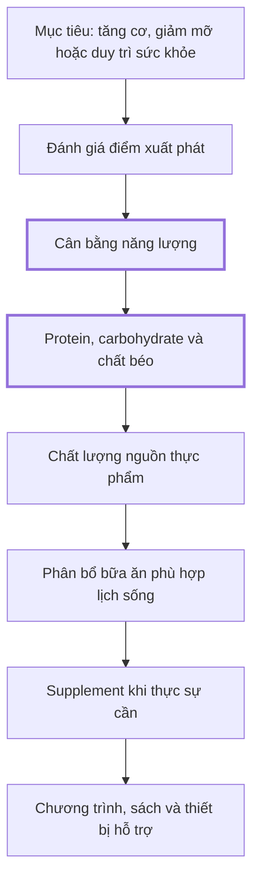
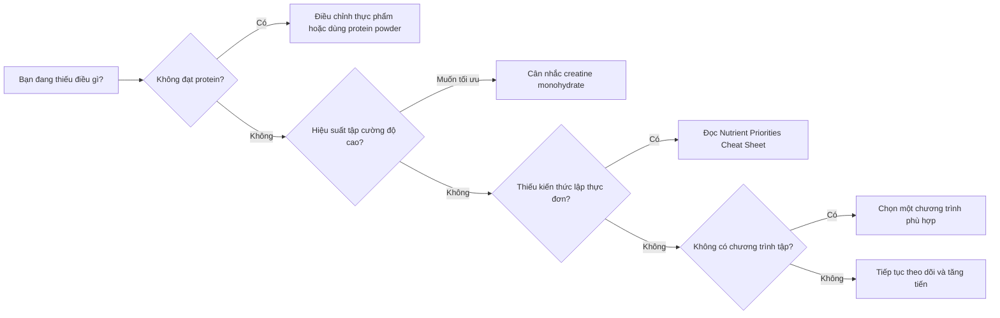

# 094 — Bonus Lecture & Resources

| Thuộc tính       | Nội dung                                   |
| ---------------- | ------------------------------------------ |
| **Module**       | Module 10 — Bonus Lessons on Muscle Growth |
| **Bài học**      | Bonus Lecture & Resources                  |
| **Thời lượng**   | 00:10                                      |
| **Chủ đề chính** | Bài học và tài nguyên bổ sung              |

> **Phạm vi bài học:** Đây là bài kết thúc ngắn, chủ yếu hướng người học đến các tài liệu bổ sung. Nội dung bên dưới được hệ thống hóa từ những tệp đính kèm và bổ sung một số lưu ý dựa trên bằng chứng hiện hành.

## Mục lục

1. [Mục tiêu bài học](#1-mục-tiêu-bài-học)
2. [Nội dung chính](#2-nội-dung-chính)
3. [Áp dụng thực tế](#3-áp-dụng-thực-tế)
4. [Lưu ý & lỗi thường gặp](#4-lưu-ý--lỗi-thường-gặp)
5. [Checklist thực hành](#5-checklist-thực-hành)
6. [Tóm tắt](#6-tóm-tắt)

---

## 1. Mục tiêu bài học

Sau bài học này, người học có thể:

* Nhận biết các tài nguyên bổ sung đi kèm khóa học.
* Sử dụng tài liệu theo đúng thứ tự ưu tiên thay vì bắt đầu bằng thực phẩm bổ sung.
* Phân biệt công cụ theo dõi, tài liệu dinh dưỡng, giáo trình tập luyện và tài liệu tham khảo.
* Đánh giá các khuyến nghị về supplement một cách thận trọng.
* Xây dựng một hệ thống học và thực hành lâu dài sau khi hoàn thành khóa học.

---

## 2. Nội dung chính

### 2.1. Bản đồ tài nguyên

Các tài nguyên không có mức độ quan trọng ngang nhau. Tài liệu **Nutrient Priorities Cheat Sheet** sắp xếp năm thành phần của một chế độ ăn thể hình theo thứ tự:

1. Cân bằng năng lượng.
2. Chất dinh dưỡng đa lượng.
3. Nguồn thực phẩm.
4. Thời điểm ăn.
5. Thực phẩm bổ sung. 

**Ý nghĩa:** supplement nằm ở cuối hệ thống. Nó chỉ có giá trị khi việc tập luyện, tổng năng lượng, protein và khả năng phục hồi đã tương đối ổn định.

### 2.2. Bộ tài nguyên đính kèm

| Tài nguyên                                                                               | Chức năng chính                            | Cách sử dụng                                                      |
| ---------------------------------------------------------------------------------------- | ------------------------------------------ | ----------------------------------------------------------------- |
| [BMI Calculator](sandbox:/mnt/data/BMI+Calculator%20%281%29.xls)                         | Nhập chiều cao và cân nặng để ước tính BMI | Dùng làm chỉ số sàng lọc ban đầu, không dùng để kết luận tỷ lệ mỡ |
| [Nutrient Priorities Cheat Sheet](sandbox:/mnt/data/Nutrient+Priorities+Cheat+Sheet.pdf) | Tóm tắt thứ tự ưu tiên trong dinh dưỡng    | Đọc trước khi thay đổi thực đơn hoặc mua supplement               |
| [Recommended Resources](sandbox:/mnt/data/Recommended+Resources.pdf)                     | Danh sách chương trình, sách và thiết bị   | Chọn tài nguyên phù hợp với mục tiêu hiện tại                     |
| [Recommended Supplements](sandbox:/mnt/data/Recommended+Supplements%20%281%29.pdf)       | Danh sách supplement do tác giả đề xuất    | Xem như tài liệu tham khảo, không phải đơn thuốc                  |

BMI là một công cụ sàng lọc nhanh dựa trên cân nặng so với chiều cao, nhưng không phân biệt được khối cơ với khối mỡ. Điều này đặc biệt quan trọng với người tập tạ có nhiều cơ bắp; BMI không nên được sử dụng như một chẩn đoán độc lập. ([CDC][1])

---

### 2.3. Tài liệu ưu tiên dinh dưỡng

#### Tầng 1 — Cân bằng năng lượng

Tài liệu xác định cân bằng calorie là biến số quan trọng nhất trong chế độ ăn:

* **Thâm hụt năng lượng:** tiêu hao nhiều hơn lượng ăn vào, cân nặng có xu hướng giảm.
* **Cân bằng năng lượng:** lượng ăn vào xấp xỉ tiêu hao, cân nặng tương đối ổn định.
* **Thặng dư năng lượng:** lượng ăn vào cao hơn tiêu hao, năng lượng dư được lưu trữ dưới dạng glycogen hoặc mỡ.  

#### Tầng 2 — Chất dinh dưỡng đa lượng

Ba nhóm chính được tài liệu đề cập gồm:

* **Protein:** cung cấp amino acid để duy trì và phát triển mô cơ.
* **Carbohydrate:** hỗ trợ năng lượng tập luyện và phục hồi glycogen.
* **Chất béo:** tham gia cấu tạo tế bào, hấp thu vitamin và nhiều chức năng sinh lý. 

#### Tầng 3 — Nguồn thực phẩm

Nguồn thực phẩm có thể không quyết định trực tiếp việc tăng hay giảm cân nếu tổng năng lượng giống nhau, nhưng lại ảnh hưởng lớn đến:

* Mật độ vi chất.
* Chất xơ.
* Cảm giác no.
* Tiêu hóa.
* Sức khỏe và khả năng duy trì chế độ ăn lâu dài. 

*Ảnh minh họa một kế hoạch bữa ăn được xây dựng từ rau, trái cây, ngũ cốc và các nguồn chất béo nguyên bản. Ảnh chỉ mang tính minh họa, không phải thực đơn bắt buộc.* 

#### Tầng 4 — Thời điểm ăn

Meal timing bao gồm số bữa và thời điểm ăn. Tài liệu nhấn mạnh người mới thường đánh giá quá cao yếu tố này; một người bận rộn vẫn có thể đạt kết quả tốt nếu kiểm soát được tổng calorie và macronutrient. 

#### Tầng 5 — Supplement

Supplement không thể thay thế một chế độ ăn được tổ chức tốt. NIH cũng nhấn mạnh rằng nền tảng để đạt hiệu suất thể chất vẫn là đủ năng lượng, nước, carbohydrate, protein, chất béo, vitamin và khoáng chất; một số supplement chỉ có thể hỗ trợ thêm cho nền tảng đó.  ([ODS][2])

---

### 2.4. Danh sách supplement trong tài liệu

Tài liệu đính kèm giới thiệu năm nhóm chính:

1. Creatine.
2. Protein powder.
3. Fish oil.
4. Caffeine.
5. Beta-alanine. 

| Supplement               | Vai trò thực tế                                                      | Mức độ ưu tiên                                  |
| ------------------------ | -------------------------------------------------------------------- | ----------------------------------------------- |
| **Creatine monohydrate** | Hỗ trợ các hoạt động lặp lại cường độ cao và quá trình tập kháng lực | Cao nếu người tập khỏe mạnh và tập đều          |
| **Protein powder**       | Cách thuận tiện để bù phần protein còn thiếu                         | Tùy chế độ ăn                                   |
| **Fish oil**             | Chủ yếu nhằm bổ sung omega-3 khi chế độ ăn thiếu cá                  | Không phải supplement tăng cơ trực tiếp         |
| **Caffeine**             | Có thể giảm cảm nhận mệt mỏi và hỗ trợ hiệu suất ở một số người      | Tùy khả năng dung nạp                           |
| **Beta-alanine**         | Có thể hữu ích hơn với vận động cường độ cao kéo dài khoảng vài phút | Thấp đối với người chỉ tập tăng cơ thông thường |

#### Creatine

Tài liệu khuyến nghị creatine với lượng khoảng **3–5 g/ngày**. 

Creatine là một trong những supplement thể thao được nghiên cứu nhiều nhất. Bằng chứng hiện có ủng hộ khả năng cải thiện hiệu suất trong các đợt vận động ngắn, lặp lại và cường độ cao như tập tạ hoặc chạy nước rút. Creatine monohydrate là dạng phổ biến và được nghiên cứu kỹ nhất. ([ODS][2])

Một phân tích tổng hợp năm 2024 cũng ghi nhận nhóm kết hợp creatine với tập kháng lực có mức tăng sức mạnh thân trên và thân dưới tốt hơn nhóm chỉ tập với giả dược. Kết quả gộp không đồng nghĩa mọi cá nhân sẽ tăng đúng số kilogram thể hiện trên biểu đồ. ([MDPI][3])

*Forest plot: các điểm và khoảng tin cậy nằm về phía “Favours Creatine” cho thấy kết quả chung nghiêng về creatine kết hợp tập kháng lực.*

*Ảnh sản phẩm chỉ nhằm minh họa hình thức creatine dạng bột, không phải bằng chứng về hiệu quả và không đại diện cho khuyến nghị thương hiệu.* 

#### Protein powder

Protein powder không bắt buộc để tăng cơ. Nó hữu ích khi người tập:

* Khó đạt nhu cầu protein bằng thực phẩm.
* Không có thời gian chuẩn bị bữa ăn.
* Cần một lựa chọn dễ mang theo khi đi học, đi làm hoặc di chuyển.

Tài liệu mô tả protein powder như một giải pháp tiện lợi, đặc biệt quanh buổi tập hoặc khi đi xa. 

NIH cho biết người tập thể thao thường cần tổng protein khoảng **1,2–2,0 g/kg/ngày**; nhu cầu này có thể được đáp ứng bằng thực phẩm và bổ sung protein chỉ khi cần thiết. Tổng lượng protein trong ngày quan trọng hơn việc phải uống shake ngay lập tức sau buổi tập. ([ODS][2])

#### Fish oil

Ngay trong tài liệu, fish oil được mô tả là không trực tiếp làm tăng tốc độ xây cơ; mục đích chính là hỗ trợ bổ sung omega-3 và sức khỏe tổng thể. 

Vì hàm lượng EPA và DHA giữa các sản phẩm khác nhau, không nên chỉ nhìn vào tổng số milligram “fish oil” trên mặt trước bao bì.

#### Caffeine

Tài liệu cũ đưa ra khoảng **200–500 mg trước tập**. Tuy nhiên, không nên xem mức này là liều mặc định cho tất cả mọi người.

NIH ghi nhận caffeine khoảng **2–6 mg/kg** trước vận động có thể hỗ trợ hiệu suất ở một số người, nhưng dùng nhiều hơn thường không tạo thêm lợi ích và làm tăng nguy cơ mất ngủ, bồn chồn, lo âu, tim đập nhanh hoặc rối loạn nhịp. Mức từ 500 mg/ngày trở lên thậm chí có thể làm giảm hiệu suất; FDA cho rằng 400 mg/ngày thường không gây tác dụng nguy hiểm đối với phần lớn người trưởng thành khỏe mạnh, nhưng độ nhạy cá nhân khác nhau đáng kể. ([ODS][2])

> **Thực hành an toàn:** tính cả caffeine từ cà phê, trà, nước tăng lực và pre-workout; tránh dùng vào cuối ngày nếu nó làm giảm chất lượng giấc ngủ.

#### Beta-alanine

Beta-alanine làm tăng carnosine trong cơ, qua đó có thể hỗ trợ đệm sự thay đổi pH trong hoạt động cường độ cao. Tuy nhiên, lợi ích thường phù hợp hơn với các nỗ lực kéo dài khoảng **60–240 giây**, không phải một chất tăng cơ trực tiếp. Bằng chứng vẫn có mức độ không nhất quán giữa các hình thức vận động. ([ODS][2])

Cảm giác châm chích da sau khi dùng beta-alanine là tác dụng thường gặp; chia nhỏ liều có thể làm giảm hiện tượng này. ([ODS][2])

---

### 2.5. Chương trình, sách và thiết bị

Tài liệu **Recommended Resources** phân chia tài nguyên thành bốn nhóm thực hành: supplement, chương trình, sách và fitness gear. 

#### Chương trình được đề cập

| Mục tiêu                           | Chương trình trong tài liệu       |
| ---------------------------------- | --------------------------------- |
| Tăng cơ và thay đổi hình thể       | The Body Transformation Blueprint |
| Tập bodyweight                     | Bar Brothers                      |
| Cải thiện sức mạnh bench press     | Critical Bench                    |
| Điều chỉnh tư thế đầu đưa ra trước | The Forward Head Posture Fix      |

Các chương trình này là đề xuất cá nhân của tác giả tài liệu, không phải danh sách duy nhất hoặc bắt buộc. 

#### Sách được đề cập

| Trình độ                    | Sách                                            |
| --------------------------- | ----------------------------------------------- |
| Người mới tập nam           | *Bigger Leaner Stronger*                        |
| Người mới tập nữ            | *Thinner Leaner Stronger*                       |
| Muốn hiểu sâu về phì đại cơ | *Science and Development of Muscle Hypertrophy* |
| Tổng quan dinh dưỡng        | *Nutrition for Dummies*                         |
| Tra cứu supplement          | *Examine Supplement Guide*                      |
| Trình độ đại học/chuyên sâu | *Advanced Nutrition and Human Metabolism*       |

#### Thiết bị được đề cập

* **Lifting straps:** hỗ trợ các bài kéo khi lực nắm là yếu tố giới hạn.
* **Weighted vest:** tăng tải cho bài bodyweight.
* **Bộ dumbbell cơ bản:** phù hợp khi tập tại nhà. 

Thiết bị chỉ nên được mua khi giải quyết một nhu cầu cụ thể. Một chương trình tốt vẫn có thể được thực hiện với thiết bị tối thiểu nếu có nguyên tắc tăng tiến rõ ràng.

---

## 3. Áp dụng thực tế

### Quy trình sử dụng bộ tài nguyên

|  Bước | Hành động                                      | Kết quả cần có                                       |
| ----: | ---------------------------------------------- | ---------------------------------------------------- |
| **1** | Xác định mục tiêu chính trong 8–12 tuần        | Tăng cơ, giảm mỡ hoặc duy trì                        |
| **2** | Ghi cân nặng, chiều cao và số đo cơ bản        | Có mốc ban đầu để so sánh                            |
| **3** | Ước tính mức calorie hiện tại                  | Biết nên duy trì, tăng hay giảm năng lượng           |
| **4** | Thiết lập protein và phân bổ các macro còn lại | Kế hoạch ăn có thể thực hiện                         |
| **5** | Chọn một chương trình tập phù hợp              | Không thay đổi chương trình liên tục                 |
| **6** | Theo dõi tải, số lần lặp và hiệu suất          | Đánh giá progressive overload                        |
| **7** | Chỉ cân nhắc supplement khi có nhu cầu rõ      | Tránh mua sản phẩm không cần thiết                   |
| **8** | Đánh giá lại sau 2–4 tuần                      | Điều chỉnh dựa trên xu hướng, không dựa vào một ngày |

### Ví dụ lựa chọn tài nguyên theo nhu cầu

---

## 4. Lưu ý & lỗi thường gặp

### 4.1. Xem danh sách tài nguyên như một đơn mua hàng

Tài liệu có chứa các khuyến nghị mang tính cá nhân và nội dung giới thiệu sản phẩm/chương trình. Việc một sản phẩm xuất hiện trong danh sách không có nghĩa người học bắt buộc phải mua hoặc nó phù hợp với mọi đối tượng. 

### 4.2. Dùng supplement để bù cho chế độ tập và ăn thiếu ổn định

Creatine không thể thay thế progressive overload. Protein powder không thể bù cho một chế độ ăn thiếu năng lượng và vi chất. Caffeine không thể thay thế giấc ngủ.

### 4.3. Sao chép liều lượng mà không xét thể trạng

Liều supplement có thể phụ thuộc vào:

* Cân nặng.
* Tổng lượng từ thực phẩm.
* Thuốc đang sử dụng.
* Khả năng dung nạp.
* Bệnh lý nền.
* Thời điểm tập và giờ ngủ.

NIH khuyến nghị trao đổi với chuyên gia y tế khi supplement có khả năng tương tác với thuốc hoặc khi người dùng có vấn đề sức khỏe. Các sản phẩm nhiều thành phần cũng khó dự đoán hiệu quả và độ an toàn hơn sản phẩm đơn thành phần. ([ODS][2])

### 4.4. Đánh giá tiến bộ chỉ bằng BMI

BMI có thể hữu ích ở cấp độ sàng lọc, nhưng người tập tăng cơ nên kết hợp thêm:

* Chu vi vòng eo.
* Ảnh tiến trình trong cùng điều kiện.
* Hiệu suất các bài tập.
* Xu hướng cân nặng trung bình tuần.
* Tỷ lệ mỡ nếu có phương pháp đo đủ nhất quán.

### 4.5. Bắt đầu quá nhiều chương trình cùng lúc

Kết hợp ngẫu nhiên nhiều chương trình thường làm mất cấu trúc về volume, cường độ và phục hồi. Tốt hơn hết là chọn một chương trình, thực hiện đủ lâu và chỉ điều chỉnh khi dữ liệu cho thấy cần thiết.

### 4.6. Tin tuyệt đối vào ảnh “trước và sau”

Ảnh biến đổi hình thể có thể bị ảnh hưởng bởi ánh sáng, tư thế, độ căng cơ, lượng nước, góc máy và thời điểm chụp. Nó có giá trị truyền cảm hứng nhưng không thay thế dữ liệu nghiên cứu hoặc hồ sơ tiến trình cá nhân.

---

## 5. Checklist thực hành

### Thiết lập nền tảng

* [ ] Tôi đã xác định một mục tiêu chính cho 8–12 tuần.
* [ ] Tôi có số đo và ảnh mốc ban đầu.
* [ ] Tôi hiểu BMI chỉ là một chỉ số sàng lọc.
* [ ] Tôi biết mức calorie gần đúng để bắt đầu.
* [ ] Tôi có mục tiêu protein hằng ngày.
* [ ] Phần lớn thực đơn đến từ thực phẩm giàu dinh dưỡng.
* [ ] Tôi có một chương trình tập rõ ràng.
* [ ] Tôi ghi lại mức tạ, số lần lặp và số hiệp.

### Trước khi mua supplement

* [ ] Tôi đã xác định vấn đề cụ thể supplement cần giải quyết.
* [ ] Tôi đã kiểm tra tổng lượng từ thực phẩm và đồ uống.
* [ ] Tôi đã đọc thành phần và liều trên nhãn.
* [ ] Tôi ưu tiên sản phẩm đơn thành phần, minh bạch hàm lượng.
* [ ] Tôi không dùng caffeine để bù cho thiếu ngủ.
* [ ] Tôi đã kiểm tra tương tác thuốc hoặc hỏi chuyên gia khi cần.
* [ ] Tôi chỉ thêm từng sản phẩm một để theo dõi phản ứng.
* [ ] Tôi không kỳ vọng supplement tạo ra kết quả nếu chương trình tập không tiến triển.

---

## 6. Tóm tắt

Bài học cuối không bổ sung thêm một “bí quyết” tăng cơ mới mà cung cấp hệ thống tài nguyên để người học tiếp tục thực hành.

Cấu trúc ưu tiên nên là:

> **Tập luyện có tăng tiến → calorie phù hợp → đủ protein và macro → thực phẩm chất lượng → phục hồi → supplement tùy chọn.**

Bộ tài nguyên đính kèm gồm công cụ BMI, bảng ưu tiên dinh dưỡng, danh sách chương trình, sách, thiết bị và supplement. Chúng nên được dùng như **điểm khởi đầu để tổ chức kế hoạch**, không phải những quy tắc bắt buộc hay sự bảo chứng cho một sản phẩm cụ thể.

Trong nhóm supplement được đề cập, creatine monohydrate và protein powder thường có ứng dụng thực tế rõ ràng nhất cho người tập kháng lực; caffeine phụ thuộc mạnh vào khả năng dung nạp, beta-alanine có mục tiêu chuyên biệt hơn, còn fish oil không nên được xem như chất tăng cơ trực tiếp. Nền tảng tập luyện và dinh dưỡng vẫn quyết định phần lớn kết quả.

[1]: https://www.cdc.gov/bmi/about/index.html?utm_source=chatgpt.com "About Body Mass Index (BMI)"
[2]: https://ods.od.nih.gov/factsheets/ExerciseAndAthleticPerformance-HealthProfessional/ "Dietary Supplements for Exercise and Athletic Performance - Health Professional Fact Sheet"
[3]: https://www.mdpi.com/2072-6643/16/21/3665?utm_source=chatgpt.com "Effects of Creatine Supplementation and Resistance Training on Muscle Strength Gains in Adults <50 Years of Age: A Systematic Review and Meta-Analysis"

---

# Bài luyện tập

## Mục tiêu

## Đề bài

## Yêu cầu hoàn thành

- [ ] 
- [ ] 
- [ ] 

## Kết quả / lời giải

## Ghi chú
