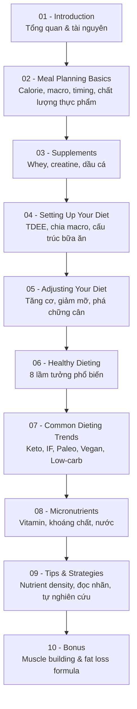

# Nutrition Masterclass: Build Your Perfect Diet & Meal Plan

Khóa học dinh dưỡng thể hình đi từ nguyên lý calorie/macro cơ bản đến việc tự thiết kế một chế độ ăn và thực đơn cá nhân hoàn chỉnh, kèm phần phá bỏ lầm tưởng, giải thích các trào lưu ăn kiêng phổ biến và vi chất dinh dưỡng.

- **Số module:** 10
- **Số bài học:** 94
- **Tổng thời lượng:** 4 giờ 4 phút
- **Ngôn ngữ khóa học:** Tiếng Anh (ghi chú bằng tiếng Việt)

> **Lưu ý:** Đây là tài liệu giáo dục dinh dưỡng thể hình cho người trưởng thành khỏe mạnh, không thay thế tư vấn y tế. Nếu có bệnh lý nền (tiểu đường, bệnh thận, rối loạn ăn uống, đang mang thai/cho con bú), hãy tham khảo bác sĩ hoặc chuyên gia dinh dưỡng trước khi áp dụng.

## Cấu trúc khóa học

| Module | Tên module | Chủ đề | Số bài | Thời lượng |
|---|---|---|---|---|
| [01](01 - Introduction/README.md) | Introduction | Giới thiệu khóa học, giảng viên, tài nguyên | 3 | 8 phút |
| [02](02 - Meal Planning Basics/README.md) | Meal Planning Basics | Calorie, macro, thời điểm ăn, chất lượng thực phẩm | 21 | 1 giờ 2 phút |
| [03](03 - Supplements/README.md) | Supplements | Whey, creatine, dầu cá, các supplement khác | 7 | 22 phút |
| [04](04 - Setting Up Your Diet/README.md) | Setting Up Your Diet | TDEE, chia macro, cấu trúc bữa ăn, chọn thực phẩm | 13 | 20 phút |
| [05](05 - Adjusting Your Diet for Weight Loss and Muscle Gains/README.md) | Adjusting Your Diet for Weight Loss & Muscle Gains | Tăng cơ, giảm mỡ, cheat meal, phá chững cân | 7 | 25 phút |
| [06](06 - Healthy Dieting/README.md) | Healthy Dieting | 8 lầm tưởng phổ biến về dinh dưỡng | 9 | 16 phút |
| [07](07 - Common Dieting Trends Explained/README.md) | Common Dieting Trends Explained | Gluten-free, Paleo, Low-carb, IF, Vegan, Keto | 7 | 27 phút |
| [08](08 - Micronutrients/README.md) | Micronutrients | Vitamin A–K, khoáng chất, nước | 16 | 23 phút |
| [09](09 - More Dieting Tips and Strategies/README.md) | More Dieting Tips & Strategies | Nam/nữ, mật độ dinh dưỡng, miễn dịch, testosterone, đọc nhãn | 7 | 26 phút |
| [10](10 - Bonus Lessons on Muscle Growth/README.md) | Bonus Lessons on Muscle Growth | Công thức tăng cơ, progressive overload, giảm mỡ | 4 | 16 phút |

## Lộ trình học



## Nguyên tắc xuyên suốt khóa học

**Thứ tự ưu tiên trong dinh dưỡng:**

```
1. CALORIE        → quyết định cân nặng tăng hay giảm
2. MACRONUTRIENT  → quyết định phần tăng/giảm đó là cơ hay mỡ
3. THỰC PHẨM & VI CHẤT → quyết định sức khỏe, độ no, độ bền
4. THỜI ĐIỂM ĂN   → tinh chỉnh hiệu suất tập luyện
5. SUPPLEMENT     → phần nhỏ nhất, tác động ít nhất
```

## Cách sử dụng thư mục ghi chú này

- Mỗi module có một `README.md` liệt kê danh sách bài học kèm thời lượng và bản dịch tiêu đề.
- Mỗi bài học có một file riêng (`NNN - Tên bài học.md`) gồm khung 6 phần: **Mục tiêu bài học → Nội dung chính → Áp dụng thực tế → Lưu ý & lỗi thường gặp → Checklist thực hành → Tóm tắt**.
- **Trạng thái hiện tại:** bài `001–013` đã có nội dung đầy đủ; bài `014–094` mới ở dạng khung (tiêu đề + mục lục) để tự điền nội dung khi xem video.

## Tiến độ ghi chú

- [x] Module 01 — Introduction (001–003)
- [ ] Module 02 — Meal Planning Basics (004–013 xong, 014–024 còn khung)
- [ ] Module 03 — Supplements (025–031)
- [ ] Module 04 — Setting Up Your Diet (032–044)
- [ ] Module 05 — Adjusting Your Diet (045–051)
- [ ] Module 06 — Healthy Dieting (052–060)
- [ ] Module 07 — Common Dieting Trends (061–067)
- [ ] Module 08 — Micronutrients (068–083)
- [ ] Module 09 — Tips & Strategies (084–090)
- [ ] Module 10 — Bonus Lessons (091–094)
