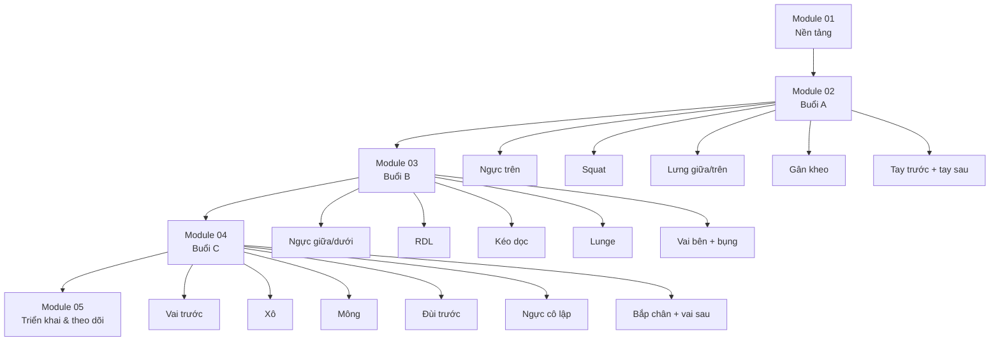

# Bản đồ khóa học

```mermaid
flowchart TD
    A[Module 01<br/>Nền tảng] --> B[Module 02<br/>Buổi A]
    B --> C[Module 03<br/>Buổi B]
    C --> D[Module 04<br/>Buổi C]
    D --> E[Module 05<br/>Triển khai & theo dõi]

    B --> B1[Ngực trên]
    B --> B2[Squat]
    B --> B3[Lưng giữa/trên]
    B --> B4[Gân kheo]
    B --> B5[Tay trước + tay sau]

    C --> C1[Ngực giữa/dưới]
    C --> C2[RDL]
    C --> C3[Kéo dọc]
    C --> C4[Lunge]
    C --> C5[Vai bên + bụng]

    D --> D1[Vai trước]
    D --> D2[Xô]
    D --> D3[Mông]
    D --> D4[Đùi trước]
    D --> D5[Ngực cô lập]
    D --> D6[Bắp chân + vai sau]
```

## Nhịp tuần

```mermaid
flowchart LR
    A[Buổi A] --> R1[1 ngày nghỉ hoặc phục hồi]
    R1 --> B[Buổi B]
    B --> R2[1 ngày nghỉ hoặc phục hồi]
    R2 --> C[Buổi C]
    C --> R3[Phục hồi trước tuần mới]
```

Khóa học không bắt buộc đúng các ngày trong tuần; ý chính là phân bố ba buổi đủ xa nhau để chất lượng tập và hồi phục được duy trì.
