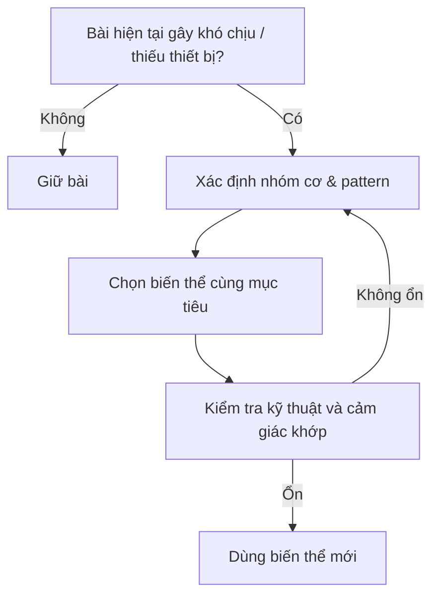

# Bài triển khai 3 — Thay thế bài tập

## Nguyên tắc

Thay bài nhưng giữ **vai trò chuyển động** và **nhóm cơ mục tiêu**.

## Các thay thế xuất hiện trong transcript

| Bài gốc | Thay thế được nêu |
|---|---|
| Barbell bench press | Flat dumbbell press |
| Seated leg curl | Lying leg curl |
| Hip thrust | Dumbbell step-up |
| Dumbbell curl + DB overhead extension | Cable curl phía sau thân + cable overhead extension |
| Standing calf raise | Leg press / Smith / single-leg dumbbell calf raise |

Đây là những thay thế có trong nguồn, không phải danh sách đầy đủ ngoài transcript.
