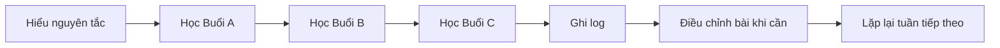

# Bài cuối — Tóm tắt toàn khóa

## 5 ý chính

1. **Ba buổi, ba góc tiếp cận.**  
   A, B và C không giống nhau hoàn toàn, nhưng cùng phủ toàn thân.

2. **Compound trước, isolation sau.**  
   Các bài lớn được dùng để tạo hiệu quả cao trước khi bổ sung vùng dễ bỏ sót.

3. **Không ép mọi người vào một hình mẫu kỹ thuật duy nhất.**  
   Squat depth, RDL depth hay bench angle có thể khác tùy cấu trúc cơ thể.

4. **Vị trí kéo giãn được nhấn mạnh xuyên suốt transcript.**  
   Nhiều bài dùng stretch hoặc partial reps ở vị trí dài hơn của cơ.

5. **Khả năng duy trì mới làm chương trình có giá trị.**  
   Đa dạng bài tập trong tuần được dùng để giúp khớp, động lực và độ cân bằng phát triển.

## Sơ đồ toàn khóa

