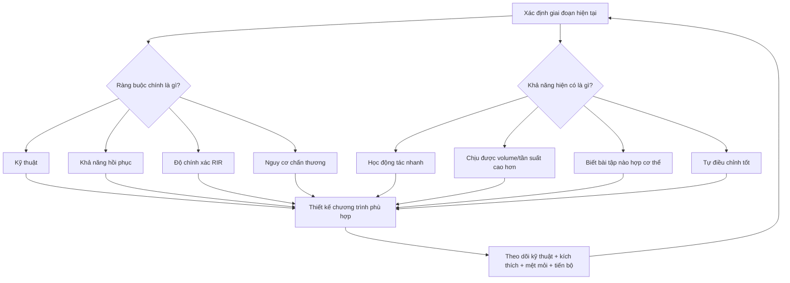

# Bản đồ toàn khóa học

## Ý tưởng trung tâm

Khóa học không bắt đầu bằng câu hỏi “tập mấy ngày là tốt nhất?”, mà bắt đầu bằng câu hỏi:

> **Ở cấp độ hiện tại, cơ thể và kỹ năng của người tập đang bị giới hạn bởi điều gì, và họ đã có khả năng gì để khai thác?**

Từ đó mới suy ra cách chọn bài, số hiệp, số buổi, khoảng lặp, mức độ gắng sức và tốc độ tăng tải.

## Bản đồ chuyển giai đoạn

| Giai đoạn | Trọng tâm chính | Điều không nên vội làm |
|---|---|---|
| Người mới | Học kỹ thuật, xây nền động tác, tiến bộ đơn giản | Chương trình quá nhiều ngày, quá nhiều biến thể, tải quá nặng |
| Trung cấp | Thử nghiệm có hệ thống để hiểu phản ứng cá nhân | Chốt quá sớm rằng một bài/rep range “hợp cơ địa” |
| Nâng cao | Chuyên môn hóa, tối ưu stimulus-to-fatigue, quản lý hồi phục | Cố tập mọi nhóm cơ ở volume tối đa cùng lúc |

## Quy tắc xuyên suốt

- **Kỹ thuật tốt đi trước cường độ cao.**
- **Không cần dùng phương pháp phức tạp hơn nếu phương pháp đơn giản vẫn còn tạo tiến bộ.**
- **Cấp độ càng cao, tiến bộ càng chậm và yêu cầu cá nhân hóa càng lớn.**
- **Mục tiêu là tăng cơ lâu dài, không phải chứng minh mình “tập nâng cao”.**
