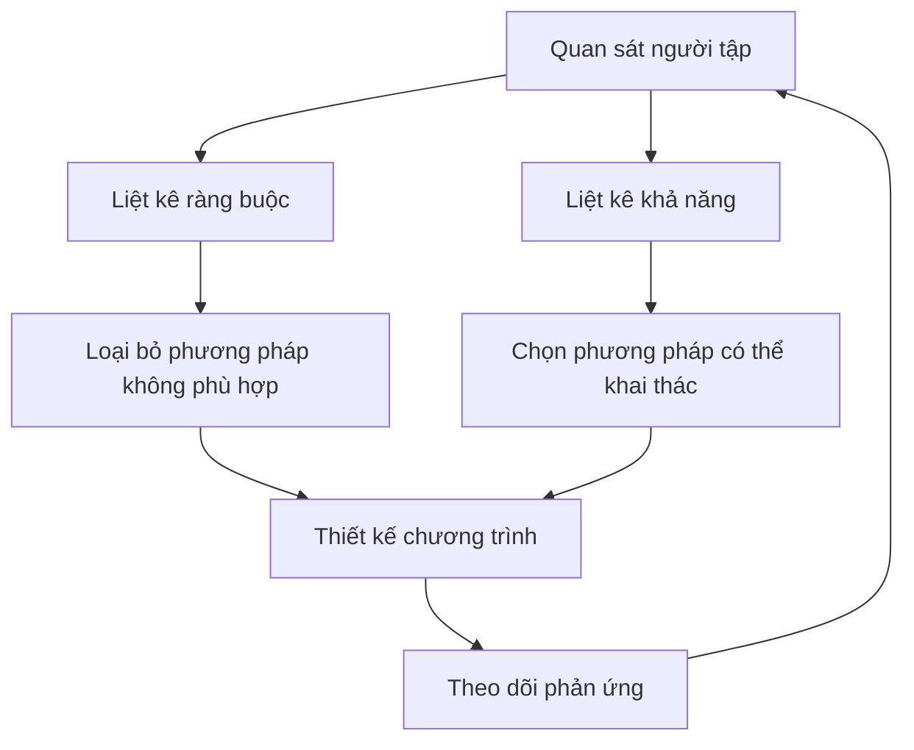

# Bài 2 — Khung tư duy: Ràng buộc và khả năng

## Mục tiêu bài học

Biết cách dùng hai câu hỏi — **“điều gì đang giới hạn?”** và **“điều gì đã có thể khai thác?”** — để suy ra phương pháp tập phù hợp.

## 1. Ràng buộc là gì?

Ràng buộc là những yếu tố khiến một người **không thể hưởng lợi tốt** từ một số phương pháp nhất định.

Ví dụ theo từng cấp độ:

- Người mới: kỹ thuật chưa ổn định, dễ quá tải thông tin, khó ước lượng RIR.
- Trung cấp: cần nhiều volume hơn, nhưng chưa biết rõ bài tập nào phù hợp nhất với bản thân.
- Nâng cao: sức mạnh lớn hơn làm một số tải nặng trở nên rủi ro hơn; tổng mệt mỏi có thể vượt khả năng hồi phục toàn thân.

## 2. Khả năng là gì?

Khả năng là những thứ người tập **đã có thể thực hiện và hưởng lợi**.

- Người mới có thể phát triển từ lượng tập nhỏ và tiến bộ đơn giản.
- Trung cấp có thể tập nhiều ngày hơn, thử nhiều bài và nhiều khoảng lặp hơn.
- Người nâng cao có thể ước lượng RIR chính xác hơn, hiểu rõ tỷ lệ kích thích / mệt mỏi của bài tập với chính mình và tự cá nhân hóa chương trình.

## 3. Từ phân tích đến chương trình

## 4. Tại sao cách tiếp cận này tốt hơn “copy chương trình”? 

Hai người có thể cùng tập bốn năm nhưng khác nhau đáng kể về:

- kỹ thuật;
- khả năng chịu volume;
- lịch sử chấn thương;
- khả năng cảm nhận cơ mục tiêu;
- mức độ chính xác khi đánh giá RIR;
- mức độ hồi phục giữa các buổi.

Vì vậy, “cùng số năm” không đồng nghĩa “cùng chương trình”.

## Bài tập thực hành

Tạo hai cột cho chương trình hiện tại của bạn:

| Ràng buộc hiện tại | Khả năng hiện tại |
|---|---|
| Ví dụ: kỹ thuật squat chưa ổn định khi tải nặng | Có thể duy trì 2–3 buổi/tuần đều đặn |
| ... | ... |

Sau đó đặt câu hỏi: **chương trình hiện tại đang tôn trọng các ràng buộc này chưa?**
