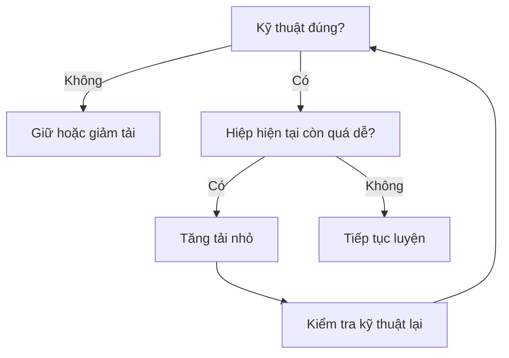

# Bài 6 — Người mới: Tiến bộ và củng cố kỹ thuật

## Mục tiêu bài học

Biết cách tăng độ khó mà không hy sinh chất lượng động tác.

## 1. Tiến bộ ở người mới có thể rất đơn giản

Người mới không cần một hệ thống auto-regulation phức tạp. Khi một tải trở nên dễ, tốc độ thanh không chậm rõ rệt và kỹ thuật vẫn ổn định, nguồn đề xuất có thể tăng một lượng nhỏ trọng lượng.

Ví dụ được nêu trong nguồn là tăng khoảng **5–10 lb** khi mức hiện tại không còn tạo đủ thử thách.

## 2. Trình tự ưu tiên

## 3. Ladder độ khó trong những tuần đầu

Nguồn mô tả quá trình chuyển dần:

- ban đầu: các hiệp nhẹ để học động tác;
- sau 1–2 tuần: hiệp cuối bắt đầu thử thách hơn;
- vài tuần sau: nhiều hiệp có thể trở nên khó hơn nhưng kỹ thuật vẫn phải được giữ.

Điều này giúp người mới học cách tập nặng **sau khi** đã có nền kỹ thuật, thay vì học kỹ thuật trong lúc phải “sống sót” với tải quá cao.

## 4. Kỹ thuật là tài sản dài hạn

Một kỹ thuật tốt được xây ở giai đoạn đầu có thể được mang sang toàn bộ hành trình tập. Ngược lại, thói quen kỹ thuật kém đã được củng cố qua nhiều tháng sẽ khó sửa hơn.

### Câu chốt

> Nếu phải chọn giữa “tập chưa đủ ác nhưng kỹ thuật vững” và “tập rất ác nhưng kỹ thuật xấu”, nội dung nguồn ưu tiên phương án thứ nhất ở giai đoạn người mới.

## Bài tập thực hành

Chọn 3 bài chính bạn đang tập và ghi:

| Bài tập | Cue kỹ thuật quan trọng nhất | Dấu hiệu có thể tăng tải |
|---|---|---|
| ... | ... | ... |
