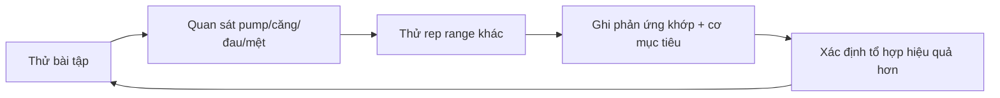

# Bài 7 — Trung cấp: Từ học động tác đến khám phá phản ứng cá nhân

## Mục tiêu bài học

Hiểu sự thay đổi vai trò của giai đoạn trung cấp: từ “học cách tập” sang “học cơ thể mình phản ứng thế nào với cách tập”.

## 1. Người trung cấp đã có nền kỹ thuật

Nguồn xem kỹ thuật tự chủ là một dấu hiệu quan trọng. Nếu một người vẫn không thể thực hiện tốt các động tác cơ bản mà không cần hỗ trợ liên tục, thì họ vẫn còn nhiều đặc điểm của người mới.

## 2. Nhưng họ chưa hiểu hoàn toàn cơ thể mình

Ở đầu giai đoạn trung cấp, người tập có thể chưa biết chắc:

- bài nào tạo kích thích tốt nhất;
- khoảng rep nào phù hợp nhất;
- bài nào làm khớp khó chịu;
- cơ nào là yếu tố giới hạn trong từng chuyển động;
- cảm giác pump hoặc mind-muscle connection có thực sự đáng tin với họ hay chưa.

Vì vậy, đây chưa phải lúc “đóng khung” chương trình vĩnh viễn.

## 3. Trung cấp là giai đoạn xây bản đồ

Nguồn dùng hình ảnh “bản đồ” rất rõ: người mới học cách đi và đọc bản đồ; trung cấp bắt đầu lấp đầy bản đồ; nâng cao dùng bản đồ đó để chọn đường hiệu quả nhất.

## 4. Mục tiêu cuối giai đoạn trung cấp

Bạn muốn tích lũy dữ liệu thực tế về chính mình đủ để biết:

- bài nào đáng giữ;
- bài nào chỉ gây mệt hoặc khó chịu;
- rep range nào cân bằng kích thích và mệt mỏi;
- nhóm cơ nào phát triển nhanh/chậm;
- cấu trúc tuần nào giúp duy trì chất lượng tập.

## Tự kiểm tra

1. Vì sao trung cấp không nên chỉ tập các bài quen thuộc nhất?
2. “Xây bản đồ” có nghĩa là gì?
3. Dữ liệu cá nhân nào sẽ hữu ích khi bạn bước sang giai đoạn nâng cao?
