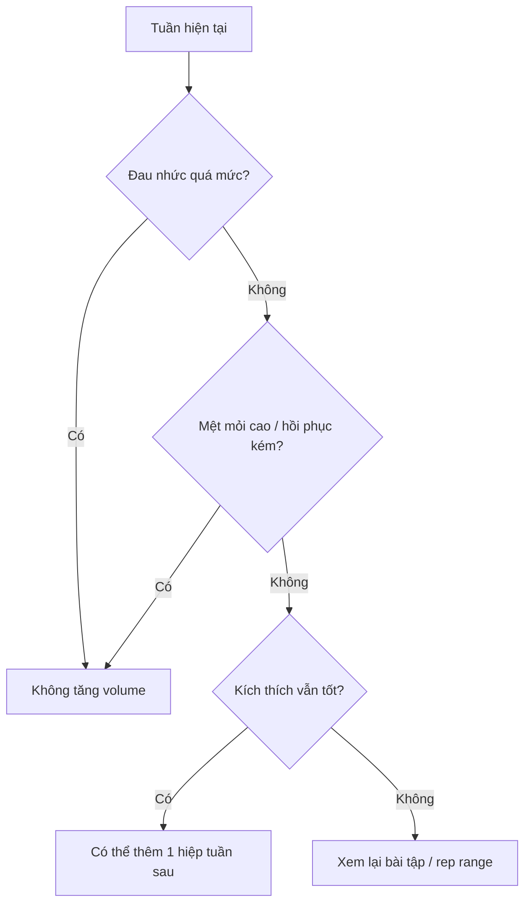

# Bài 9 — Trung cấp: Volume, frequency và cấu trúc buổi tập

## Mục tiêu bài học

Nắm các phạm vi lập trình được nêu trong nguồn cho giai đoạn trung cấp và hiểu logic đằng sau chúng.

## 1. Vì sao volume phải tăng?

Cơ thể đã thích nghi với kích thích cơ bản. Vì vậy, để tiếp tục phát triển, người trung cấp thường cần:

- nhiều nỗ lực hơn;
- nhiều hiệp hơn;
- tần suất cao hơn;
- nhiều thời gian tập hơn người mới.

## 2. Khối lượng theo nhóm cơ

Nguồn đưa ra phạm vi khoảng **5–15 hiệp mỗi cơ mỗi tuần** như một vùng tham chiếu cho trung cấp.

Trong một buổi, nguồn ưu tiên khoảng **1–2 bài cho mỗi nhóm cơ**, thay vì dồn 3–5 bài cùng một cơ vào một buổi.

## 3. Tần suất tuần

Nguồn đề xuất khoảng **3–6 buổi/tuần**, thường bắt đầu gần 3–4 buổi và tăng dần nếu cần và nếu khả năng hồi phục cho phép.

## 4. Thời lượng buổi tập

Nguồn mô tả khoảng **1 đến 1,5 giờ mỗi buổi** khi tập hiệu quả và kiểm soát thời gian nghỉ.

## 5. Tập cân bằng trước khi chuyên môn hóa mạnh

Một nguyên tắc quan trọng ở trung cấp là tiếp tục phát triển tương đối đều các nhóm cơ để:

- nhận diện điểm mạnh / yếu thật sự;
- không kết luận quá sớm rằng một nhóm cơ “không thể phát triển”;
- chuẩn bị nền cho chuyên môn hóa sau này.

## Sơ đồ ra quyết định tăng volume

Nguồn nêu cụ thể rằng nếu một cơ hồi phục rất nhanh, không đau quá mức và không quá mệt, có thể thêm một hiệp cho bài đó ở tuần sau.
