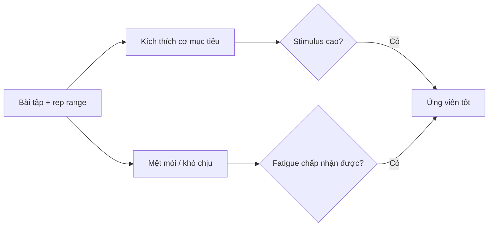

# Bài 10 — Trung cấp: Học RIR và tỷ lệ kích thích / mệt mỏi

## Mục tiêu bài học

Học cách biến RIR từ một con số phỏng đoán thành một kỹ năng thực hành, đồng thời biết đánh giá bài tập theo tỷ lệ kích thích so với mệt mỏi.

## 1. RIR phải được hiệu chỉnh bằng trải nghiệm

Nguồn khuyến nghị người trung cấp học cảm giác của:

- 3 RIR;
- 2 RIR;
- 1 RIR;
- 0 RIR;
- thất bại thật sự.

Cách học là **ước lượng**, sau đó qua nhiều buổi tăng thử thách cho đến khi tiến gần thất bại và nhìn ngược lại xem ước lượng ban đầu có đúng không.

## 2. Progressive overload trong mesocycle

Một cách được mô tả là mỗi lần quay lại bài tập, có thể tăng:

- thêm một rep; hoặc
- thêm một lượng tải nhỏ.

Khi độ khó tăng dần tới 0 RIR hoặc thất bại, bạn có thêm dữ liệu để hiệu chỉnh ước lượng RIR trước đó.

## 3. Kỹ thuật không được đổi để “giả” thêm rep

Nếu rep cuối biến thành một chuyển động khác, dữ liệu RIR trở nên ít ý nghĩa hơn. Vì vậy, kỹ thuật tốt từ giai đoạn người mới phải được giữ ngay cả khi tập rất khó.

## 4. Tỷ lệ kích thích / mệt mỏi

Một bài tốt cho cá nhân không chỉ vì nâng được nhiều tạ. Hãy xem nó có:

- tạo căng và pump tốt ở cơ mục tiêu;
- ít gây đau khớp;
- ít bị giới hạn bởi cơ không liên quan hoặc cardio;
- cho phép tiến bộ ổn định;
- không tạo mệt mỏi không cần thiết.

## Tự kiểm tra

1. Vì sao phải kiểm chứng RIR qua nhiều buổi?
2. Tại sao một bài nâng được rất nặng chưa chắc có tỷ lệ stimulus-to-fatigue tốt?
3. Kỹ thuật liên quan gì đến độ chính xác của RIR?
