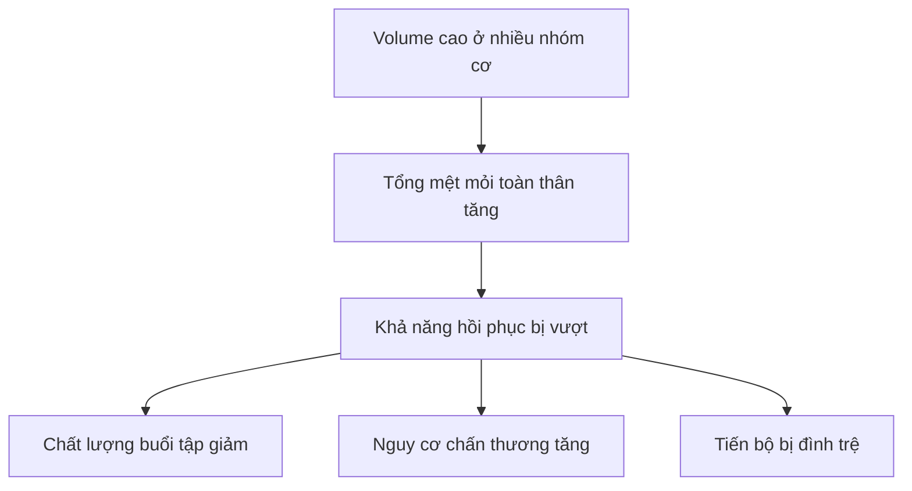

# Bài 11 — Nâng cao: Giới hạn hồi phục và rủi ro chấn thương

## Mục tiêu bài học

Hiểu nghịch lý của người nâng cao: cần kích thích lớn hơn để tiến bộ nhưng lại phải quản lý mệt mỏi và rủi ro chặt chẽ hơn.

## 1. Khi mạnh hơn, tải tuyệt đối lớn hơn

Người nâng cao thường có thể tạo lực lớn hơn. Điều này làm các hiệp rất nặng có chi phí cao hơn cho khớp và mô liên kết. Nguồn nhấn mạnh không chỉ chấn thương cấp tính mà cả các vấn đề tích lũy, dai dẳng qua nhiều tuần.

## 2. Lịch sử chấn thương trở thành một phần của thiết kế chương trình

Một bài từng phù hợp có thể không còn là lựa chọn tốt nếu nó liên tục kích thích vùng từng bị chấn thương. Vì vậy, kinh nghiệm nâng cao bao gồm cả việc biết **những tổ hợp bài tập + rep range nào nên tránh hoặc dùng rất hạn chế**.

## 3. Không thể đẩy mọi nhóm cơ lên tối đa cùng lúc

Nguồn mô tả giới hạn phục hồi toàn thân: mỗi nhóm cơ riêng lẻ có thể “chịu” nhiều volume, nhưng tổng tất cả nhóm cơ ở mức cao có thể vượt khả năng hồi phục của cả hệ thống.

## 4. Tiến bộ chậm hơn là bình thường

Nguồn nhấn mạnh người nâng cao không còn tăng nhanh như trước. Điều khó là: để có tiến bộ nhỏ, họ thường phải tạo nỗ lực và volume lớn hơn.

Điều này làm quản lý mệt mỏi trở thành một kỹ năng cốt lõi, không còn là phần phụ của chương trình.
