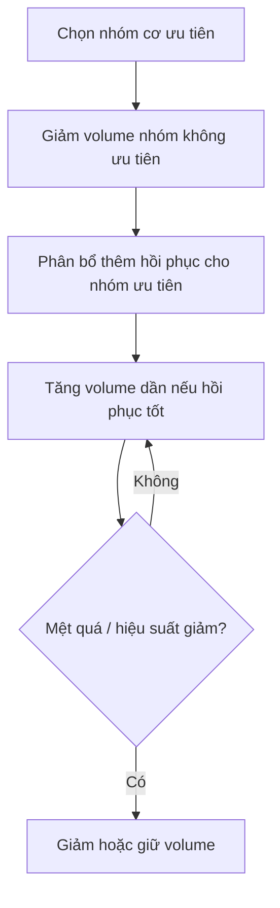

# Bài 13 — Nâng cao: Chuyên môn hóa nhóm cơ và phân bổ volume

## Mục tiêu bài học

Hiểu cách ưu tiên một số nhóm cơ trong mesocycle thay vì cố tối đa hóa mọi nhóm cơ cùng lúc.

## 1. Tư duy “đầu đốt trước / đầu đốt sau”

Nguồn đề xuất ở trình độ cao nên đưa một phần nhóm cơ về mức duy trì hoặc mức hiệu quả tối thiểu, để giải phóng khả năng hồi phục cho các nhóm cơ ưu tiên.

Một hình dung trong nguồn:

- khoảng **1/3 đến 1/2 cơ thể** có thể được đặt ở volume thấp hơn;
- phần còn lại được ưu tiên cao hơn trong mesocycle.

Đây là logic phân bổ tài nguyên, không phải bỏ hẳn các nhóm cơ không ưu tiên.

## 2. Volume ưu tiên có thể tăng mạnh

Nguồn đưa ra ví dụ một nhóm cơ ưu tiên có thể bắt đầu khoảng **10–15 hiệp/tuần** và tăng qua 4–6 tuần lên mức cao hơn, thậm chí **25–35 hiệp hoặc hơn** nếu cá nhân có thể hồi phục.

Đồng thời, nguồn cảnh báo con số này rất phụ thuộc nhóm cơ và cá nhân; volume cực cao cho nhóm cơ lớn như đùi có thể phi thực tế, trong khi các nhóm nhỏ hơn có thể chịu được nhiều hiệp hơn.

## 3. Auto-regulation theo hồi phục

Volume không tăng theo lịch cứng. Nó phải được điều chỉnh theo:

- đau nhức;
- mệt mỏi;
- chất lượng pump / kích thích;
- khả năng hoàn thành buổi sau;
- phản ứng khớp;
- tiến bộ thực tế.

## 4. Tần suất cao hơn

Nguồn mô tả người nâng cao có thể tập **4–6 buổi/tuần hoặc hơn**, thậm chí đôi lúc chia hai buổi trong một ngày để phân phối workload. Đây là công cụ cho nhu cầu volume cao, không phải mục tiêu danh dự.
