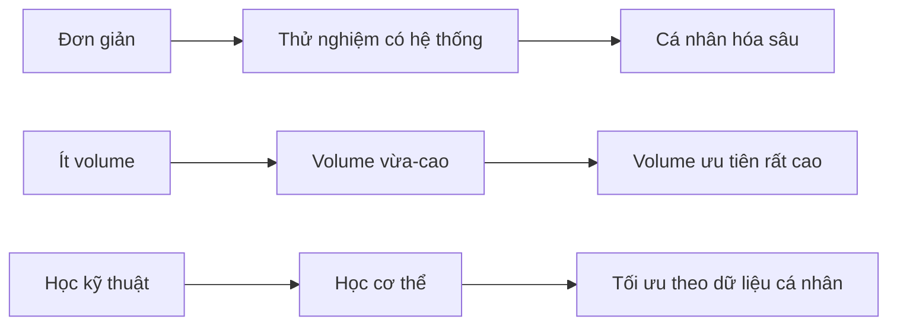

# Bài 15 — So sánh ba cấp độ trên cùng một bản đồ

## Mục tiêu bài học

Nhìn toàn bộ khóa học trong một bảng duy nhất và hiểu logic biến đổi từ người mới đến nâng cao.

## Bảng so sánh

| Yếu tố | Người mới | Trung cấp | Nâng cao |
|---|---|---|---|
| Mục tiêu học chính | Kỹ thuật và nền vận động | Khám phá phản ứng cá nhân | Chuyên môn hóa và tối ưu hóa |
| Kỹ thuật | Chưa ổn định | Tương đối thành thạo | Thành thạo và cá nhân hóa |
| RIR | Ước lượng kém | Đang học hiệu chỉnh | Tương đối chính xác |
| Volume | Thấp vẫn phát triển | Cần tăng | Có thể rất cao ở nhóm ưu tiên |
| Tần suất | Khoảng 2 → 4 buổi/tuần | Khoảng 3 → 6 | Khoảng 4 → 6+ |
| Rep range | Chủ yếu 5–10 | Thử rộng 5–30 | Tập trung vào vùng đã biết hiệu quả |
| Biến thể | Ít, lặp lại để học | Thử nhiều bài có hệ thống | Chọn lọc bài có hiệu quả cao |
| Chuyên môn hóa | Ít cần | Có thể nhẹ | Rất quan trọng |
| Tiến bộ | Nhanh | Chậm hơn | Chậm rõ rệt |
| Rủi ro chính | Kỹ thuật vỡ / quá tải thông tin | Kết luận cá nhân quá sớm | Quá tải hồi phục / chấn thương tích lũy |

## Dòng tiến hóa của chương trình

## Một quy tắc để nhớ

- **Người mới:** làm ít thứ hơn nhưng làm đúng hơn.
- **Trung cấp:** thử đủ rộng để hiểu điều gì hợp với mình.
- **Nâng cao:** dùng những gì đã học để tập trung tài nguyên vào thứ mang lại lợi ích cao nhất.

## Tự kiểm tra cuối bài

1. Điểm khác nhau lớn nhất về mục tiêu học giữa ba cấp là gì?
2. Tại sao rep range của trung cấp rộng hơn người mới?
3. Tại sao nâng cao lại quay về “ít lựa chọn hơn”, nhưng lựa chọn chính xác hơn?
