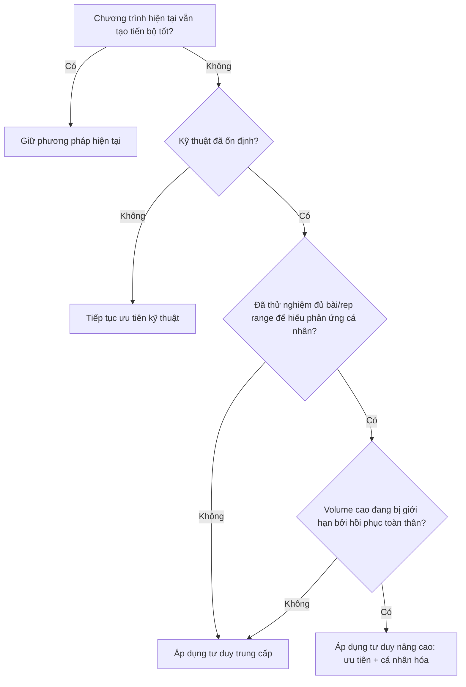

# Bài 16 — Khi nào nên chuyển giai đoạn?

## Mục tiêu bài học

Biết nhận diện thời điểm nên tăng độ phức tạp của chương trình mà không dựa máy móc vào số năm tập.

## 1. Không có ngày tốt nghiệp

Nội dung nguồn nhấn mạnh đây là **thang trượt**. Không có một ngày bạn thức dậy và chính thức trở thành “trung cấp” hoặc “nâng cao”.

## 2. Từ người mới sang trung cấp

Các dấu hiệu hợp lý để bắt đầu dùng nhiều công cụ trung cấp hơn:

- có thể tự thực hiện tốt các động tác cơ bản;
- 2 buổi/tuần hoặc volume thấp không còn đủ để tạo tiến bộ tốt như trước;
- có thể duy trì 3–4 buổi/tuần mà vẫn hồi phục;
- bắt đầu cần học RIR nghiêm túc;
- đã sẵn sàng thử nhiều bài và rep range để hiểu phản ứng cá nhân.

## 3. Từ trung cấp sang nâng cao

Dấu hiệu chương trình cần cá nhân hóa sâu hơn:

- tiến bộ rõ rệt chậm lại;
- bạn đã có nhiều năm dữ liệu về bài tập và rep range;
- ước lượng RIR tương đối chính xác;
- biết nhóm cơ mạnh/yếu của bản thân;
- biết các bài có stimulus-to-fatigue tốt hoặc xấu;
- tổng volume cần thiết đủ lớn để hồi phục toàn thân trở thành giới hạn thực tế;
- lịch sử đau/chấn thương ảnh hưởng tới lựa chọn bài.

## 4. Cây quyết định

## 5. Nguyên tắc kết thúc khóa học

> **Lấy càng nhiều tiến bộ càng tốt từ mức độ đơn giản nhất mà bạn còn đáp ứng tốt.**

Không cần “tập như người nâng cao” sớm. Khi một phương pháp đơn giản vẫn hiệu quả, đó là lợi thế chứ không phải dấu hiệu bạn đang tụt lại.

## Bài tập cuối khóa

Viết một trang ngắn trả lời:

1. Tôi đang ở giai đoạn nào về kỹ thuật?
2. Tôi đang ở giai đoạn nào về volume và khả năng hồi phục?
3. Tôi có ước lượng RIR đáng tin chưa?
4. Tôi đã biết bài / rep range nào hợp mình chưa?
5. Thay đổi **nhỏ nhất** nào cần thực hiện trong mesocycle tiếp theo?
