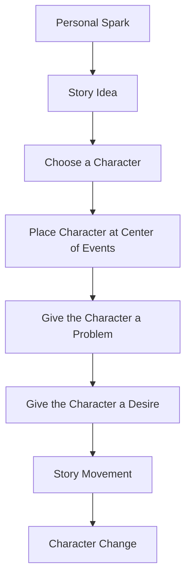
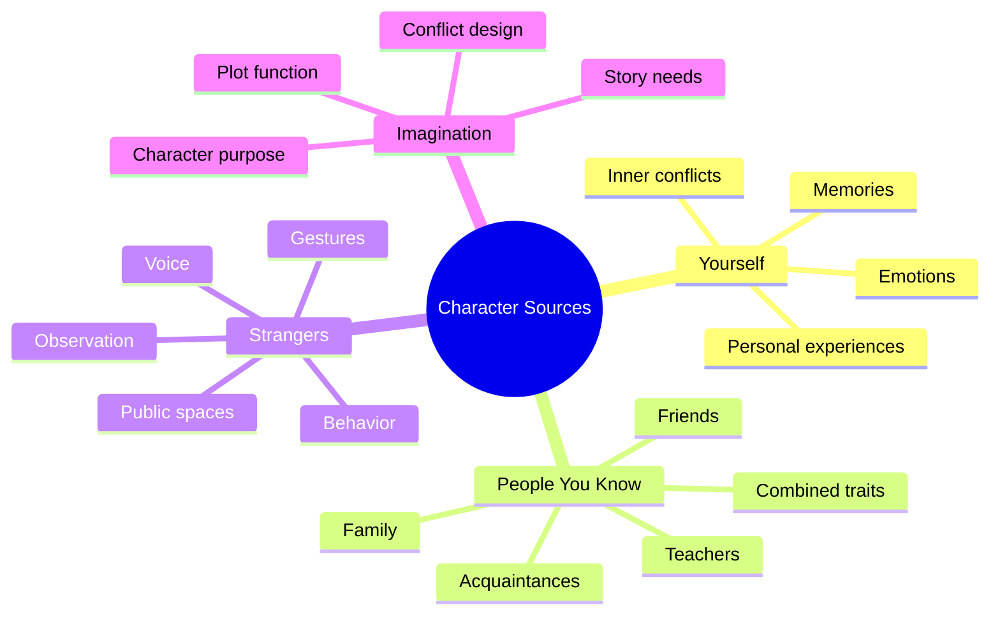

# 001 — The Origin of a Story

## Section

**01 — The Character**

## Original Lecture Title

**The Origin of a Story**

## Duration

**7:12**

---

## 1. Lesson Overview

Every story begins with a source: a question, an image, an emotion, a memory, or a “what if” that the writer cannot forget.

However, a story does not truly begin only with an idea. It begins when the writer chooses **a character** to stand at the center of the events.

A strong story asks:

> Who is the character this story is really about?

The protagonist is not simply the person who appears most often. The protagonist is the person who is most deeply involved in the events and who changes the most because of them.

---

## 2. Core Question of the Lesson

Before writing a novel, ask yourself:

> Who is the hero of this story, and why must the story happen to them?

A good story needs a character who is not only present in the plot, but also transformed by it.

---

## 3. Why the Main Character Matters

The lecture uses several examples to explain why stories choose specific protagonists.

### Example: *Breaking Bad*

Why is Walter White the main character?

He is not a gangster at the beginning. He is an ordinary chemistry teacher. That contrast makes his transformation central to the story.

### Example: *Casablanca*

Why is Rick Blaine the protagonist?

The story is about people escaping danger during World War II, but Rick is the emotional center. His past, his moral conflict, and his final decision make the story meaningful.

### Example: *Saving Private Ryan*

Why does the film focus on Captain John Miller?

The Normandy landing involved thousands of ships and soldiers, but Miller becomes central because he must lead the rescue mission and is changed by the journey.

---

## 4. Main Principle

A protagonist is the character who:

* Stands at the center of the events.
* Has the strongest connection to the story’s conflict.
* Faces the deepest internal change.
* Receives answers to questions they may not even know they have.

---

## 5. Diagram: How a Story Begins



---

## 6. Four Sources for Creating Characters

The lecture explains that characters can come from four main sources.

---

### 6.1 Source One: Yourself

Many writers begin by writing about themselves.

They use:

* Their memories
* Their emotions
* Their personal experiences
* Their fears
* Their desires
* Their inner conflicts

This can be useful because emotions feel stronger when the writer has personally experienced them.

However, there is a danger.

When a character is too close to the writer, it becomes difficult to treat them as a fictional character. The writer may avoid hurting them, humiliating them, or placing them in serious trouble.

The writer may also hide too much, especially the darker parts of the character. As a result, the reader may not fully understand or empathize with them.

#### Strength

Writing from yourself creates emotional authenticity.

#### Risk

The character may become too protected, too cryptic, or too close to autobiography.

---

### 6.2 Source Two: People You Know

Another common source is people around you:

* Friends
* Relatives
* Teachers
* Coworkers
* Neighbors
* People from your past

The advantage is that real people already have specific behaviors, contradictions, and personalities.

You can also combine traits from several people into one fictional character.

For example:

```text
Character A = Friend's humor + Uncle's stubbornness + Teacher's way of speaking
```

#### Strength

Characters feel realistic because they are inspired by real human behavior.

#### Risk

You may worry about what those people will think if they read your story.

---

### 6.3 Source Three: Strangers

Writers should develop the habit of observing strangers.

You can find inspiration from:

* Someone in a café
* A person in a park
* A passenger on a bus
* A customer in a shop
* Someone waiting at a doctor’s office
* People on television or in public spaces

Observation begins with objective details:

* Age
* Voice
* Clothes
* Posture
* Gestures
* Walking style
* Strange habits
* Facial expressions

Then imagination adds what cannot be seen.

For example:

> Why has that man been reading the same page for half an hour?
> Is he tired?
> Is he avoiding going home?
> Did he just argue with someone?
> Is he waiting for bad news?

#### Strength

This method trains the writer to notice social behavior.

#### Risk

The writer must go beyond surface description and imagine deeper motivations.

---

### 6.4 Source Four: Imagination

The fourth source is pure imagination.

This is the most difficult method, but also the most powerful.

Instead of beginning with a real person, the writer begins with the needs of the story.

The writer asks:

> What kind of character does this story need now?

This means the character is created to serve the plot, the conflict, and the emotional direction of the novel.

Even imagined characters often contain pieces of the writer or people the writer knows, but they are not directly copied from real life.

#### Strength

The character can be shaped exactly for the story.

#### Risk

This requires stronger control of plot, conflict, and structure.

---

## 7. Diagram: Four Sources of Character Creation



---

## 8. The Next Ingredients: Problem and Desire

A character alone is not enough.

The lecture compares this to boiling water: boiling water is only the beginning. To make soup, you need more ingredients.

For a story, the next two essential ingredients are:

1. **A problem**
2. **A desire**

Without a problem, the story has no tension.

Without a desire, the character has no direction.

These two elements will be explored in the next lesson.

---

## 9. Key Points

* A story often begins with a personal spark: a question, image, emotion, memory, or “what if.”
* The real foundation of a story is the choice of a central character.
* The protagonist is the person most deeply connected to the events and most changed by them.
* Characters can come from yourself, people you know, strangers, or imagination.
* Observing people is an essential skill for writers.
* A character needs both a problem and a desire to generate story movement.

---

## 10. Practical Exercise

Go to a public place such as a restaurant, bar, park, café, shop, or waiting room.

Observe one person carefully.

Write down:

* How they walk
* How they speak
* What they wear
* Any unusual gestures or habits
* What they seem to be thinking
* Why they might be there
* What name you would give them
* Why they caught your attention

Then create a short character sketch based on them.

---

## 11. Reflection Questions

1. What first made you want to write your current story?
2. Was it an image, a question, a memory, an emotion, or a character?
3. Who is the person at the center of your story?
4. Why does this story belong to that character?
5. How will this character change by the end?
6. Would you still want to write this story if no one ever read it?
7. What kind of people do you naturally notice in real life?
8. What does that reveal about the stories you are drawn to?

---

## 12. Character Origin Worksheet

| Question                                                                | Your Answer |
| ----------------------------------------------------------------------- | ----------- |
| What was the first spark of this story?                                 |             |
| Was it based on yourself, someone you know, a stranger, or imagination? |             |
| Who is the central character?                                           |             |
| Why does this story happen to them?                                     |             |
| What problem will disturb their life?                                   |             |
| What do they desire?                                                    |             |
| How might they change by the end?                                       |             |

---

## 13. Summary

This lesson introduces the origin of a story through the creation of character.

A novel may begin from a small idea, a personal memory, a strange image, or a person you observe in everyday life. But the story becomes meaningful only when you choose the character who must stand at the center of the events.

The protagonist is not simply the most visible person in the story. They are the one who is most affected, most tested, and most transformed.

To create characters, writers can draw from themselves, people they know, strangers they observe, or pure imagination. Once the character exists, the next step is to give them a problem and a desire.

That is where the story truly begins.
