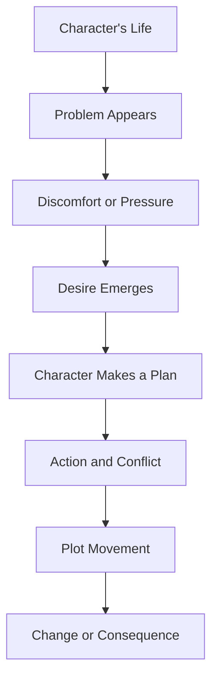

# 002 — The Character’s Problem and Desire

## Section

**01 — The Character**

## Original Lecture Title

**The Character’s Problem and Desire**

## Duration

**6:18**

---

## 1. Lesson Overview

A story becomes interesting when a character wants something, but something prevents them from getting it.

This lesson introduces two essential ingredients of storytelling:

1. **Problem**
2. **Desire**

A character’s problem creates pressure.
A character’s desire creates direction.

Together, they generate the movement of the plot.

---

## 2. Core Idea

A story usually does not begin with happiness, comfort, or completion.

A happy ending belongs at the end of the story, not the beginning.

At the beginning, the protagonist usually faces a difficulty, wound, lack, danger, or dissatisfaction. This problem pushes them to want something better.

---

## 3. Why Stories Begin with Problems

Problems force characters to make decisions.

Without problems:

* The character has no reason to act.
* The plot has no tension.
* The reader has no question to follow.
* The story becomes static.

A perfect life may be pleasant to live, but it is usually boring to tell.

---

## 4. Examples of Character Problems

### Example: *Titanic*

The story does not begin with Jack and Rose happily arriving at their destination and getting married.

That would be the ending.

Instead, the story begins with obstacles:

* Rose is trapped in a life she does not want.
* Jack belongs to a different social class.
* Their love is forbidden by circumstance.
* The ship itself becomes a deadly external problem.

The problem gives the story tension.

---

### Example: *The Hunger Games*

Katniss begins the story in a difficult situation:

* She is poor.
* She is hungry.
* Her father is dead.
* She must protect her mother and sister.
* She volunteers for a deadly competition.

Her problems immediately place her under pressure.

---

### Example: *The Grapes of Wrath*

Tom Joad returns home after serving a prison sentence, only to discover that:

* His family has left.
* He has no job.
* He has no money.
* He has no food.

The story begins from instability and lack.

---

### Example: *Shameless*

The TV series begins with a family full of problems:

* An alcoholic father
* An absent or unstable mother
* Financial struggle
* Romantic chaos
* Crime
* Emotional instability
* Children forced to grow up too early

The show is built around constant pressure and dysfunction.

---

### Example: *Confessions of a Shopaholic*

The main character has a less tragic but still powerful problem:

* She suffers from compulsive shopping.
* She has maxed out her credit cards.
* Her financial life is collapsing.

This shows that a character problem does not always have to be dramatic or tragic. It simply needs to create tension and force action.

---

## 5. Diagram: Problem Creates Story Movement



---

## 6. The First Ingredient: Problem

A problem is the force that disturbs the character’s life.

It may be external, internal, or both.

---

### 6.1 External Problem

An external problem comes from outside the character.

Examples:

* Poverty
* War
* Illness
* A dangerous enemy
* A broken relationship
* A lost job
* A family crisis
* A social restriction
* A physical journey
* A deadline

External problems are visible and concrete.

---

### 6.2 Internal Problem

An internal problem comes from inside the character.

Examples:

* Fear
* Guilt
* Shame
* Loneliness
* Addiction
* Jealousy
* Lack of confidence
* Emotional trauma
* Moral weakness
* Self-deception

Internal problems often make the character’s external goal harder to achieve.

---

### 6.3 Strong Character Problem

A strong character problem should:

* Create pressure.
* Force decisions.
* Reveal personality.
* Affect the character’s relationships.
* Push the character toward change.
* Connect to the story’s theme.

---

## 7. The Second Ingredient: Desire

Desire is what the character wants.

After a problem appears, the character begins to want something that will solve, escape, repair, or transform the situation.

For example:

A character loses the love of their life.

They may want to:

* Win that person back.
* Find a new relationship.
* Understand why they were abandoned.
* Become emotionally stronger.
* Take revenge.
* Prove they are lovable.
* Escape the pain completely.

Each desire creates a different story.

---

## 8. Why Desire Is Important

The character’s desire gives the story direction.

Once the protagonist wants something, the reader begins to ask:

> Will they get it?

This question pulls the reader through the story.

---

## 9. The Dramaturgical Question

The lecture introduces the idea of the **dramaturgical question**.

This is the central question the reader asks at the beginning of the story and expects to have answered by the end.

Examples:

| Story Type          | Dramaturgical Question                |
| ------------------- | ------------------------------------- |
| Survival story      | Will they survive?                    |
| Romance             | Will they end up together?            |
| Adventure           | Will they make it home?               |
| Revenge story       | Will they get justice?                |
| Mystery             | Will the truth be discovered?         |
| Coming-of-age story | Will they become who they need to be? |
| Quest story         | Will they reach the destination?      |

A strong desire creates a strong question.

---

## 10. Diagram: Desire Creates the Reader’s Question


---

## 11. Desire Must Be Specific

A vague desire creates a vague story.

Weak desire:

```text id="mop354"
The character wants to be happy.
```

Stronger desire:

```text id="gr07q8"
The character wants to win back his ex-girlfriend before she leaves the country.
```

Weak desire:

```text id="fpfbs5"
The character wants a better life.
```

Stronger desire:

```text id="s8elj7"
The character wants to earn enough money to save his family’s house before the bank takes it away.
```

The more concrete the desire is, the easier it is to build plot around it.

---

## 12. The Formula: Problem + Desire

A useful sentence structure is:

```text id="icbwe7"
X wants Y, but Z is in the way.
```

Examples:

```text id="vtua4z"
Katniss wants to protect her sister, but she must enter a deadly competition.
```

```text id="1imf78"
Rose wants freedom, but her family and social class trap her in an arranged future.
```

```text id="drc39w"
A lonely man wants to win back the woman he loves, but she has already decided to marry someone else.
```

```text id="iqqwja"
A young detective wants to solve her first murder case, but every witness is lying.
```

---

## 13. Desire Can Change

A character’s desire does not always stay the same.

As the story develops, the character may discover that what they wanted at the beginning is not what they truly need.

### Example: *Frankenstein*

Victor Frankenstein first wants to create life.

Later, his desire changes: he wants to destroy the life he created.

### Example: *Alice in Wonderland*

Alice first wants to follow the White Rabbit.

Later, she wants to return home.

A changing desire can show the character’s growth, confusion, or moral transformation.

---

## 14. Characters Do Not Always Get What They Want

Not every protagonist achieves their desire.

Sometimes the character fails.

Sometimes the character gets something different.

Sometimes they lose what they wanted but gain wisdom, maturity, or self-understanding.

### Example: *Because of Winn-Dixie*

Opal wants to meet her mother.

By the end of the story, she does not get exactly what she wants, but she gains emotional connection and healing.

### Example: *Saving Private Ryan*

Captain John Miller wants to bring Private Ryan home.

He nearly succeeds, but the war prevents him from fully completing the mission in the way he hoped.

This shows that desire is not only about success or failure. It is also about meaning.

---

## 15. Desire and Theme

The desire you choose for your protagonist is not random.

It should connect to the theme of your story.

To discover the theme, ask:

> What message do I want the reader to receive after reading this story?

For example:

| Character Desire           | Possible Theme                          |
| -------------------------- | --------------------------------------- |
| A character wants revenge  | Justice, obsession, forgiveness         |
| A character wants fame     | Identity, ambition, emptiness           |
| A character wants love     | Vulnerability, trust, self-worth        |
| A character wants survival | Courage, sacrifice, human resilience    |
| A character wants freedom  | Control, oppression, self-determination |
| A character wants money    | Security, greed, dignity, fear          |

The protagonist’s desire should help reveal what the story is really about.

---

## 16. Key Points

* A story usually begins with a character facing a problem.
* Problems force characters to make decisions.
* Desire gives the character direction.
* A strong desire creates a central question for the reader.
* Vague desires produce vague plots.
* The formula “X wants Y, but Z is in the way” helps clarify the story.
* Desires can change during the story.
* Characters do not always get what they want.
* The chosen desire should connect to the theme of the story.

---

## 17. Practical Exercise

Write one sentence for your protagonist using this structure:

```text id="grr3x6"
[Character name] wants [specific desire], but [problem or obstacle] is in the way.
```

Example:

```text id="6j6u4d"
Maya wants to become the first person in her family to graduate from university, but her father’s debt forces her to work every night.
```

Now write your own:

```text id="w406id"
My protagonist wants ____________________, but ____________________ is in the way.
```

---

## 18. Reflection Questions

1. Who is the hero of your story?
2. Why is this person the protagonist instead of someone else?
3. What is the biggest problem they must solve?
4. Is the problem external, internal, or both?
5. What does your character believe they want?
6. What do they truly need?
7. Is their desire specific enough to drive an entire novel?
8. What question will the reader follow until the end?
9. What happens if the character gets what they want in chapter one?
10. How does their desire connect to the theme of your story?

---

## 19. Problem and Desire Worksheet

| Question                                    | Your Answer |
| ------------------------------------------- | ----------- |
| Who is the protagonist?                     |             |
| What is their main problem?                 |             |
| Is the problem internal, external, or both? |             |
| What do they want?                          |             |
| Why do they want it?                        |             |
| What stands in the way?                     |             |
| What question will the reader ask?          |             |
| Does the desire change during the story?    |             |
| Do they get what they want at the end?      |             |
| What theme does this desire reveal?         |             |

---

## 20. Summary

This lesson explains that a story needs both a problem and a desire.

The problem disturbs the character’s life and creates pressure. The desire gives the character direction and makes the reader ask what will happen next.

A strong protagonist does not simply exist inside the story. They want something, struggle against obstacles, make decisions, and change because of what happens.

The clearer the desire, the stronger the story movement becomes.

The basic foundation of plot can be expressed in one sentence:

```text id="vlytz1"
A character wants something, but something stands in the way.
```

That sentence is often where the real story begins.
