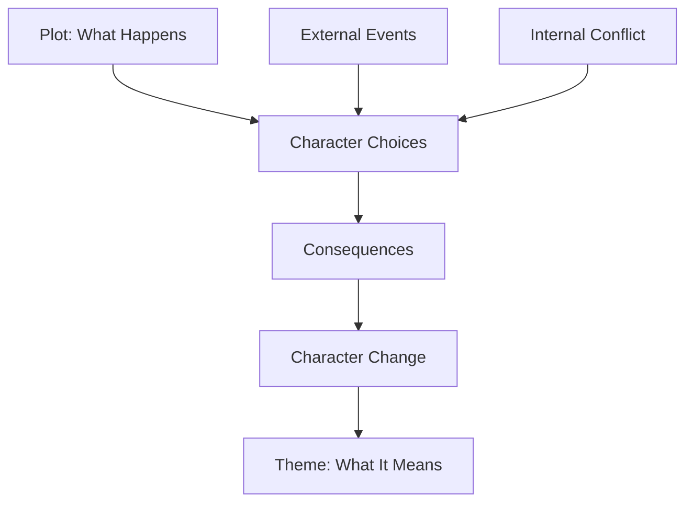
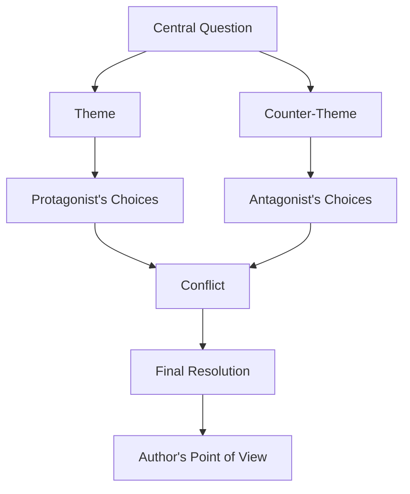

# 003 — The Message of the Story

## Section

**01 — The Character**

## Original Lecture Title

**The Message of the Story**

## Duration

**8:55**

---

## 1. Lesson Overview

A good story is not only a sequence of events.

A good story also leaves the reader with a deeper question, a new perspective, or a lesson about life.

This deeper meaning is called the **theme**.

The theme is not what happens in the plot.
The theme is what the story proves through what happens in the plot.

---

## 2. Core Idea

Stories stay in our minds because they reveal something meaningful.

They may:

* Teach us something new.
* Give us a new perspective.
* Make invisible things visible.
* Raise a universal question.
* Help us understand ourselves better.

A strong story is not just about what the protagonist does. It is also about what the protagonist learns, loses, understands, or becomes.

---

## 3. What Is Theme?

The **theme** is the deeper lesson, question, or argument inside the story.

It is the meaning beneath the plot.

A theme can often be expressed as a question or statement.

For example:

```text
Does protecting your family justify immoral actions?
```

```text
Money cannot replace love and affection.
```

```text
True identity comes from values, not appearance or origin.
```

```text
Even ordinary people can take part in the fight against evil.
```

---

## 4. Theme Is Not the Plot

A story may appear to be about one thing on the surface, but its real meaning is deeper.

| Story               | Surface Plot                                | Deeper Theme                                                 |
| ------------------- | ------------------------------------------- | ------------------------------------------------------------ |
| *Frankenstein*      | A scientist creates a monster.              | A man must face the consequences of playing God.             |
| *Misery*            | A writer is imprisoned by an obsessive fan. | Writing can become a means of survival and self-rescue.      |
| *The Godfather*     | A crime family protects its power.          | Does family loyalty justify moral corruption?                |
| *A Christmas Carol* | A miser is visited by ghosts.               | Money cannot replace love, generosity, and human connection. |
| *Avatar*            | A soldier joins an alien world.             | Identity is defined by values, not race or origin.           |

---

## 5. Diagram: Plot vs Theme



The plot shows events.
The theme emerges from choices, consequences, and transformation.

---

## 6. Why Theme Matters

Theme helps the writer decide what belongs in the story.

When you know the message of your story, you can ask:

* Does this scene support the theme?
* Does this character challenge the theme?
* Does this ending prove or contradict the theme?
* Does this subplot deepen the central question?
* Is this dialogue revealing the theme naturally, or explaining it too directly?

A clear theme gives the story direction.

---

## 7. Theme Should Not Be Preached

The message of the story should not feel like a lecture.

A theme is strongest when it appears through:

* Character decisions
* Conflict
* Failure
* Sacrifice
* Consequences
* Repeated patterns
* The ending

The reader should understand the message because they have experienced the story, not because the narrator directly explains it.

Weak theme delivery:

```text
The narrator tells the reader: “Money does not bring happiness.”
```

Stronger theme delivery:

```text
A rich character loses every meaningful relationship and only changes after choosing generosity over wealth.
```

---

## 8. Desire, Need, and Theme

The protagonist’s desire is connected to the theme.

Often, a character wants one thing, but needs something deeper.

| Character Element | Meaning                                                |
| ----------------- | ------------------------------------------------------ |
| Desire            | What the character thinks they want                    |
| Need              | What the character truly lacks                         |
| Problem           | What forces the character to act                       |
| Theme             | What the story reveals through the character’s journey |

---

## 9. Diagram: Desire Leads to Theme


The character’s desire creates the story movement.
The character’s need reveals the deeper meaning.

---

## 10. Example: *The Godfather*

Michael Corleone is forced to choose between two paths:

1. Living a just and moral life.
2. Protecting his family by any means necessary.

His desire to protect his loved ones overwhelms his need to escape crime.

The theme can be expressed as a question:

```text
Does defending one’s family justify every possible action?
```

The story becomes powerful because it does not answer this question through a lecture. It answers it through Michael’s transformation.

---

## 11. Example: *A Christmas Carol*

Scrooge wants money.

But what he truly needs is:

* Love
* Affection
* Human connection
* Generosity
* Emotional awakening

The theme can be summarized as:

```text
Money does not bring happiness.
```

The story proves this by showing Scrooge’s lonely life, his confrontation with the past and future, and his final transformation.

---

## 12. Example: *Dead Poets Society*

The teacher urges his students not to surrender completely to social expectations, family pressure, or convention.

The theme may be expressed as:

```text
It is worth fighting for your dreams, even when the cost is painful.
```

The story explores courage, individuality, conformity, and the danger of suppressing one’s inner life.

---

## 13. Example: *Avatar*

Jake Sully is torn between:

* His mission as a soldier
* His love and belonging within the alien community

At first, he wants to complete his mission.
Later, he needs to become part of a new world and defend its people.

The theme can be expressed as:

```text
Belonging and identity are not determined by race or origin, but by shared values.
```

---

## 14. Common Themes in Literature

Many stories explore universal subjects. These themes appear again and again because they reflect deep human questions.

---

### 14.1 Love

Love is one of the most common literary themes.

#### *Romeo and Juliet*

The story explores forbidden love and the tragic consequences of family hatred.

Possible theme:

```text
The mistakes and conflicts of parents can destroy the lives of their children.
```

#### *Pride and Prejudice*

Love grows from misunderstanding, pride, and initial dislike.

Possible theme:

```text
Prejudice can prevent people from seeing and accepting others clearly.
```

---

### 14.2 Death

Death appears in many stories because it forces characters to confront meaning, fear, memory, and identity.

#### *The Book Thief*

Death itself narrates the story, reflecting on human life, suffering, and compassion.

#### *Harry Potter*

Death is one of the central themes of the series.

The story explores:

* The death of Harry’s parents
* Voldemort’s fear of death
* The desire for immortality
* Sacrifice
* Moral choice

Possible theme:

```text
What matters is not escaping death, but choosing who you become while you are alive.
```

---

### 14.3 Power and Corruption

Power can appear in many forms:

* Political power
* Social power
* Power over another person’s life
* Power over truth
* Power over death

#### *Animal Farm*

The animals rebel against human masters, but the new leaders become corrupt.

Possible theme:

```text
The thirst for power can destroy harmony and equality.
```

#### *The Hunger Games*

The Capitol uses power to control, manipulate, and kill its citizens.

Possible theme:

```text
Love, friendship, and unity can resist the cruelty of oppressive power.
```

---

### 14.4 Courage and Heroism

Heroic stories often explore courage in the face of danger.

#### *The Hobbit*

Bilbo Baggins is an unlikely hero who leaves his quiet life and enters a dangerous adventure.

Possible theme:

```text
Even the most humble person can take part in the struggle against evil.
```

#### *Percy Jackson and the Olympians*

Percy faces monsters, gods, danger, and destiny.

Possible theme:

```text
A hero is never free from danger, but courage means acting despite fear.
```

---

## 15. Theme and Counter-Theme

A strong story often contains both a theme and a counter-theme.

The protagonist may represent one side of the question.
The antagonist may represent the opposite side.

For example:

| Theme                          | Counter-Theme                               |
| ------------------------------ | ------------------------------------------- |
| Love is worth sacrifice.       | Love makes people weak.                     |
| Power corrupts.                | Power is necessary for survival.            |
| Freedom is worth fighting for. | Safety matters more than freedom.           |
| Forgiveness heals.             | Revenge brings justice.                     |
| Identity comes from values.    | Identity comes from birth, race, or status. |

The story becomes dramatic when these opposing beliefs collide.

---

## 16. Diagram: Theme vs Counter-Theme



The ending reveals which worldview the story ultimately supports.

---

## 17. Three Tips for Building Your Story Theme

---

### Tip 1: Think About the Theme of Your Own Life

When writing a new story, ask yourself:

```text
What question am I trying to answer at this moment in my life?
```

Your personal concerns often influence your fiction.

Your theme may come from:

* A personal wound
* A political concern
* A social issue
* A fear
* A desire
* A moral question
* A relationship problem
* A repeated life pattern

Sometimes the reason you want to write a story is hidden inside the question your life is currently asking.

---

### Tip 2: Turn Familiar Statements into Questions

An original story does not always need a completely new theme.

Sometimes originality comes from questioning a familiar idea.

Common statement:

```text
Love overcomes all obstacles.
```

More interesting question:

```text
Does love really overcome all obstacles?
```

This question creates more tension because the answer is not obvious.

Other examples:

| Familiar Statement          | More Interesting Question                         |
| --------------------------- | ------------------------------------------------- |
| Good always defeats evil.   | What if good people must do evil things to win?   |
| Family is everything.       | What if family loyalty destroys your identity?    |
| Money cannot buy happiness. | What if poverty destroys love before money can?   |
| Truth sets people free.     | What if truth destroys the person who reveals it? |
| Dreams are worth pursuing.  | What if pursuing a dream costs everything else?   |

---

### Tip 3: Offer Your Own Interpretation

A theme is not just a topic.

“Love” is a topic.
“Love requires sacrifice” is a theme.
“Love is not enough without trust” is also a theme.

To build a theme, choose a clear question and offer your own answer through the story.

For example:

| Topic    | Thematic Question               | Possible Thematic Statement                                 |
| -------- | ------------------------------- | ----------------------------------------------------------- |
| Love     | Can love survive betrayal?      | Love survives only when truth is faced.                     |
| Power    | Does power always corrupt?      | Power reveals the corruption already inside a person.       |
| Death    | How should we face mortality?   | A meaningful life matters more than a long life.            |
| Freedom  | Is freedom worth suffering for? | Freedom without courage cannot last.                        |
| Identity | Who are we beneath our roles?   | Identity is chosen through action, not assigned by society. |

---

## 18. Practical Exercise

Finish this sentence in one line:

```text
This story proves that ____________________.
```

Examples:

```text
This story proves that love without honesty becomes a prison.
```

```text
This story proves that revenge can destroy the person who seeks it.
```

```text
This story proves that courage is not the absence of fear, but the decision to act anyway.
```

```text
This story proves that belonging is created by shared values, not blood.
```

Keep this sentence visible while drafting your story.

---

## 19. Reflection Questions

1. What is the deeper question behind your story?
2. What does your protagonist want?
3. What does your protagonist truly need?
4. How does the protagonist’s desire connect to the theme?
5. What does the antagonist believe?
6. Does the antagonist represent a counter-theme?
7. Does your ending prove your theme or contradict it?
8. Can the reader understand the theme through action rather than explanation?
9. Which scenes support the theme most clearly?
10. Which scenes do not belong because they do not connect to the central meaning?

---

## 20. Theme Worksheet

| Question                                       | Your Answer |
| ---------------------------------------------- | ----------- |
| What is the surface plot of the story?         |             |
| What is the deeper question?                   |             |
| What does the protagonist want?                |             |
| What does the protagonist truly need?          |             |
| What belief does the protagonist begin with?   |             |
| What belief do they hold by the end?           |             |
| What does the antagonist believe?              |             |
| What is the counter-theme?                     |             |
| What does the ending prove?                    |             |
| Finish the sentence: “This story proves that…” |             |

---

## 21. Key Points

* Theme is the deeper meaning beneath the plot.
* A story’s message should emerge through events, choices, and consequences.
* The protagonist’s desire should lead them toward the theme.
* A strong theme often begins as a universal question.
* The antagonist can represent the counter-theme.
* The ending reveals the author’s final point of view.
* Theme should not be preached directly.
* A clear theme helps the writer decide what belongs in the story.
* Originality can come from turning familiar statements into questions.

---

## 22. Summary

This lesson explains the third essential ingredient of story: **theme**.

A story begins with a character, then gains movement through problem and desire. But it becomes memorable when it offers a deeper message.

The theme is not a lecture placed inside the story. It is the meaning that emerges from what the characters choose, suffer, lose, and become.

To find your theme, ask yourself what question your own life is currently trying to answer. Then connect that question to your protagonist’s desire, their conflict, and the final resolution of the story.

A useful sentence to guide your draft is:

```text
This story proves that ____________________.
```

If the ending proves that sentence through action and consequence, the story will feel unified, meaningful, and emotionally complete.
