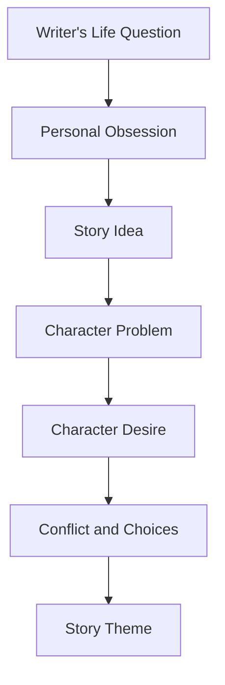

# 004 — Your Life Theme

## Section

**01 — The Character**

## Original Lecture Title

**Your Life Theme**

## Duration

**Not listed**
Writing exercise / discussion segment

---

## 1. Lesson Overview

Every writer has certain questions they return to again and again.

These questions may come from personal experience, social concerns, political worries, emotional wounds, or unresolved conflicts.

This lesson asks you to look inward and identify the question that is currently active in your life.

That question may become the hidden source of your story’s theme.

---

## 2. Core Idea

A story’s theme often begins with the writer’s own life.

Before asking what your novel is about, ask:

```text
What question am I trying to answer at this moment in my life?
```

The answer may reveal why you are drawn to this story in the first place.

---

## 3. What Is a Life Theme?

A **life theme** is a recurring question, concern, or emotional pattern that keeps appearing in your thoughts and creative work.

It is not always the same as the theme of your book.

Instead, it is the deeper source from which your book’s theme may grow.

---

## 4. Examples of Life Themes

A writer may repeatedly return to questions such as:

| Life Theme | Possible Story Question                              |
| ---------- | ---------------------------------------------------- |
| Belonging  | Where do I truly belong?                             |
| Control    | Can I control my life, or must I accept uncertainty? |
| Guilt      | Can a person be forgiven after causing harm?         |
| Love       | Is love enough to overcome fear or pride?            |
| Identity   | Who am I when I am not performing for others?        |
| Ambition   | What must I sacrifice to become successful?          |
| Freedom    | What does it cost to live honestly?                  |
| Family     | Can we escape the wounds we inherit?                 |
| Justice    | What should we do when the world is unfair?          |
| Loneliness | Can anyone truly understand another person?          |

---

## 5. Diagram: From Life Theme to Story Theme



Your personal question becomes powerful when it is transformed into character, conflict, and consequence.

---

## 6. Life Theme vs Story Theme

Your life theme and your story theme are connected, but they are not exactly the same.

| Element           | Meaning                                                 |
| ----------------- | ------------------------------------------------------- |
| Life Theme        | The question you personally keep returning to           |
| Story Theme       | The message or argument your story makes through events |
| Character Desire  | What the protagonist wants                              |
| Character Problem | What blocks or wounds the protagonist                   |
| Ending            | The final answer the story gives to the theme           |

---

## 7. Example

### Life Theme

```text
Why do I always feel like I have to prove my worth?
```

### Possible Story Theme

```text
A person becomes free only when they stop measuring themselves through other people’s approval.
```

### Possible Character

A young artist wants public recognition, but her need for praise begins to destroy her relationships and creativity.

---

## 8. Why This Matters

Naming your life theme helps you write with more honesty.

It prevents your story from becoming borrowed, generic, or emotionally empty.

When you understand the question that keeps you awake at night, you can create characters who are truly searching for something.

---

## 9. Assignment Instructions

Ask yourself:

```text
What is the question I am trying to answer at this moment in my life?
```

It may be:

* A personal problem
* A social issue
* A political concern
* A moral question
* A relationship wound
* A fear about the future
* A repeated emotional pattern
* A question about identity, love, family, ambition, or belonging

Whatever it is, write about it honestly.

---

## 10. Practical Exercise

List three questions about life that you keep returning to.

Then circle the one that feels closest to the novel you are writing.

### Example Format

```text
1. Why do I feel different from everyone else?
2. What does it mean to be truly free?
3. Can a person become successful without losing themselves?
```

Circled question:

```text
Can a person become successful without losing themselves?
```

---

## 11. Personal Reflection Prompt

Write a short paragraph answering this question:

```text
What is keeping me awake at night right now?
```

Do not try to sound literary.
Do not try to impress anyone.
Write the question as honestly and directly as possible.

---

## 12. Student Example Analysis

### Example Student Question

```text
Why do I spend so much time thinking about what I want instead of going out and getting it?
```

This is a strong life-theme question because it contains inner conflict.

Possible story themes from this question:

| Possible Theme                                | Story Direction                                                |
| --------------------------------------------- | -------------------------------------------------------------- |
| Fear can disguise itself as planning.         | A character keeps preparing but never acts.                    |
| Desire without action becomes regret.         | A character loses an opportunity because they waited too long. |
| Courage begins when thought becomes movement. | A character finally takes a risk.                              |

---

### Example Student Question

```text
Why do I feel different from everyone else?
```

This question could lead to themes about identity, belonging, alienation, or self-acceptance.

Possible story themes:

| Possible Theme                                   | Story Direction                                            |
| ------------------------------------------------ | ---------------------------------------------------------- |
| Difference becomes strength when it is accepted. | A character stops hiding their true nature.                |
| Belonging does not require becoming ordinary.    | A character finds people who accept them.                  |
| Isolation can distort how we see ourselves.      | A character learns they are not as alone as they believed. |

---

## 13. Diagram: Turning a Personal Question into Fiction


Example:

```text
Personal Question:
Why am I afraid to go after what I want?

Character:
A young musician who dreams of performing publicly.

Problem:
She freezes whenever people watch her.

Desire:
She wants to win a local music competition.

Theme:
A dream only becomes real when it survives fear.
```

---

## 14. Questions for This Assignment

Answer the following questions:

1. What is the question you are trying to answer at this moment in your life?
2. Is this question personal, social, political, emotional, or moral?
3. Why does this question matter to you now?
4. How could this question become a story?
5. What kind of character would naturally struggle with this question?
6. What would that character want?
7. What would stand in their way?
8. What ending would give this question a meaningful answer?

---

## 15. Life Theme Worksheet

| Question                                                | Your Answer |
| ------------------------------------------------------- | ----------- |
| What question is currently active in your life?         |             |
| Why does this question matter to you?                   |             |
| Is it personal, social, political, emotional, or moral? |             |
| What feeling is attached to this question?              |             |
| What kind of character could embody this question?      |             |
| What would this character want?                         |             |
| What problem would block them?                          |             |
| What might they learn by the end?                       |             |
| How could this become the theme of a story?             |             |

---

## 16. Key Points

* Writers often return to the same personal questions across different stories.
* Your life theme may come from an unresolved problem, fear, desire, or moral concern.
* A life theme is not necessarily the same as the story theme.
* The life theme is the emotional source; the story theme is the crafted message.
* Honest personal questions often create stronger fiction.
* A story becomes more original when it grows from your own concerns instead of borrowed ideas.

---

## 17. Summary

This lesson asks you to identify your own life theme.

A life theme is the question you keep returning to in your thoughts, emotions, and creative work. It may involve love, identity, ambition, guilt, family, justice, belonging, fear, or freedom.

Once you discover the question that matters to you personally, you can transform it into fiction through character, problem, desire, conflict, and theme.

The most important question of this lesson is:

```text
What question am I trying to answer at this moment in my life?
```

The answer may become the hidden engine of your novel.
