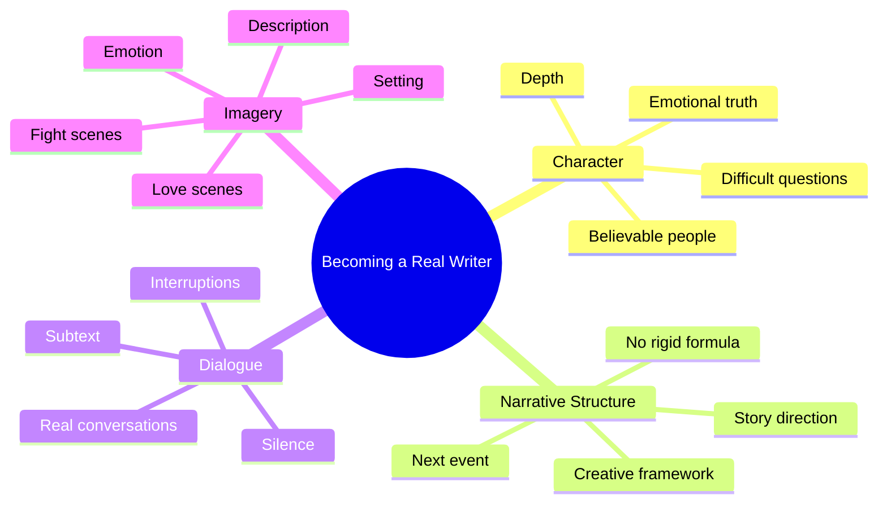
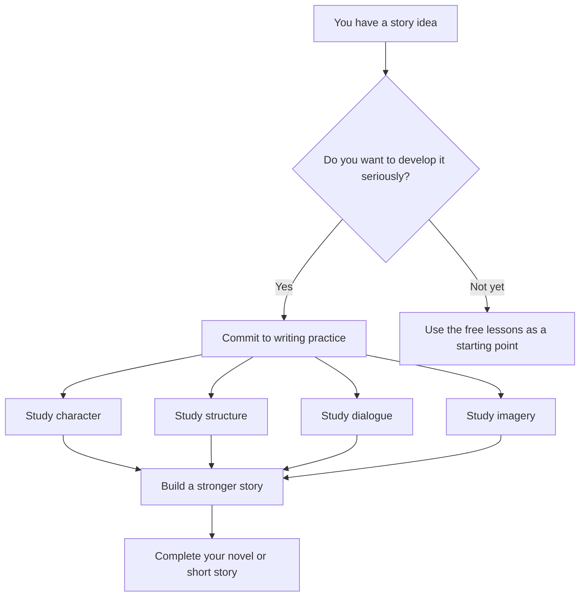

# 005 - Getting Ready to Become a Real Writer

## Section

**01 - The Character**

## Original Lecture Title

**Getting Ready to Become a Real Writer**

## Vietnamese Title

**Sẵn sàng trở thành nhà văn thật sự**

## Duration

**2:39**

---

# Lesson Overview

This lesson marks the end of the free introductory classes and introduces the full course structure. The instructor encourages the learner to decide whether they want to continue improving their writing technique in order to complete a novel or short story.

The central idea is simple: becoming a real writer is not only about inspiration. It is about craft, practice, discipline, and the willingness to face difficult creative questions.

---

# Main Message

A “real writer” is someone who treats writing seriously.

That means:

* Showing up regularly.
* Practicing even when the writing feels weak.
* Finishing drafts, including imperfect ones.
* Accepting that writing is a craft that can be learned.
* Protecting writing time like any other serious commitment.

The lesson also presents the four major areas that the full course will explore.

---

# Course Structure

The full course is organized into four major categories:

## 1. Character

This section focuses on creating characters who feel believable, alive, and emotionally complex.

Key questions include:

* How do I create a believable character?
* How do I make the reader curious about a character right away?
* How do I give a character depth?
* What makes a character feel alive?

The instructor explains that character work often requires uncomfortable questions. Writers may need to explore emotional wounds, family conflicts, personal fears, or the reasons they avoid hurting their protagonist.

These difficult decisions help add detail and truth to the story.

---

## 2. Narrative Structure

This section focuses on how stories are built.

The instructor acknowledges that many writers fear structure because they believe it limits creativity or makes stories predictable. However, the course will show that structure does not have to restrict imagination.

Instead, structure can help writers understand:

* What event should happen next.
* How to guide the story forward.
* How to avoid getting lost while drafting.
* How to use structure without becoming trapped by rigid formulas.

Structure is presented as a tool, not a prison.

---

## 3. Dialogue

This section focuses on writing dialogue that feels real and meaningful.

Key questions include:

* How do you write dialogue that sounds natural?
* What is the purpose of dialogue?
* What elements make up a strong conversation?
* How do silence, interruption, and context affect dialogue?
* How can characters say one thing while meaning something else underneath?

The course will explore dialogue not only as spoken words, but also as subtext, tension, silence, and hidden meaning.

---

## 4. Writing with Imagery

This section focuses on description, emotion, and vivid storytelling.

Key questions include:

* How do you describe an emotion?
* How do you use rhetorical figures?
* How do you build an environment?
* How do you write a love scene?
* How do you write a fight scene?

The goal is to help writers create scenes that readers can feel, imagine, and remember.

---

# Diagram: Four Pillars of the Course

---

# Key Points

## Writing is a craft

Writing is not only about waiting for inspiration. It requires practice, technique, revision, feedback, and the courage to finish imperfect drafts.

## A real writer shows up

The mindset shift is important: a writer does not wait until they feel ready. A writer writes regularly and takes the work seriously.

## Writing time must be protected

Regular writing time should be treated like an important appointment. If the writer does not protect that time, the novel or short story will remain only an idea.

## Technique helps complete the story

The course is designed to help writers improve their craft so they can complete a novel or short story with more confidence and clarity.

---

# Practical Exercise

Choose a recurring time slot this week for drafting only.

During that time:

1. Do not edit.
2. Do not research.
3. Do not wait for inspiration.
4. Write even if the first ten minutes feel bad.
5. Protect the session as a serious commitment.

---

# Reflection Questions

1. What has been stopping you from calling yourself a writer?
2. Do you treat writing as a serious craft or only as inspiration?
3. Which area do you need most right now: character, structure, dialogue, or imagery?
4. What uncomfortable question might your story be asking you to face?
5. Are you willing to keep writing even when the first draft is bad?

---

# Writer’s Decision Map

---

# Summary

This lesson closes the introductory part of the course and invites the learner to decide whether they want to continue developing their writing technique.

The full course will focus on four major areas: character, narrative structure, dialogue, and imagery. Together, these areas help writers move from having an idea to actually building and completing a story.

The main lesson is that becoming a real writer is a decision. It means showing up, practicing the craft, asking difficult questions, and treating writing as serious work.
