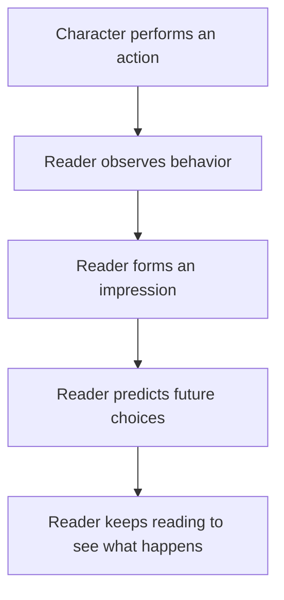
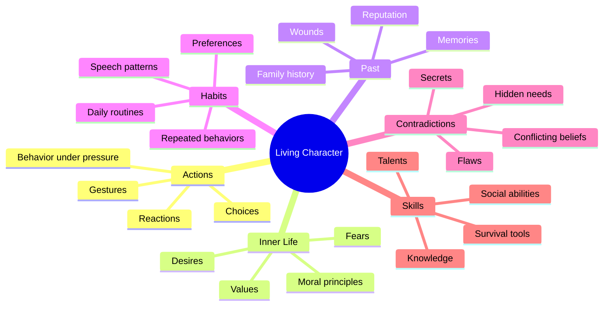

# 006 - Characters in Fiction as Real People

## Section

**01 - The Character**

## Original Lecture Title

**Characters in Fiction as Real People**

## Vietnamese Title

**Nhân vật trong tiểu thuyết như con người thật**

## Duration

**5:49**

---

# Lesson Overview

This lesson explains why fictional characters must be treated as real people. Even though characters are created from imagination, readers expect them to behave like living, believable, and complex human beings.

A strong character should feel as if they have a life beyond the page: habits, values, fears, contradictions, opinions, routines, and personal history.

When a character feels alive, the reader begins to understand them, predict their choices, and stay curious about what they will do next.

---

# Core Idea

A fictional character becomes believable when they act like a coherent person.

A coherent character has:

* Clear moral principles.
* Recognizable habits.
* A specific way of thinking.
* Strengths and weaknesses.
* Fears and desires.
* Consistent behavior.
* Personal agency.

The writer should not treat characters as puppets who exist only to serve the plot. Instead, the writer should understand the character deeply enough to ask:

> What would this character do now?

---

# Why Living Characters Matter

## 1. They help the reader believe the story

Readers do not need characters to be perfect. They need them to feel human.

A believable character may be:

* Contradictory.
* Difficult.
* Funny.
* Stubborn.
* Kind.
* Selfish.
* Brave.
* Afraid.

What matters is that their actions feel connected to who they are.

---

## 2. They help the reader make predictions

When readers understand a character’s personality, they start guessing what the character might do next.

This creates engagement.

The reader thinks:

* “I know what kind of person this is.”
* “I think they will react this way.”
* “Will they prove me right or surprise me?”
* “What will happen when their beliefs are tested?”

That curiosity keeps the reader turning pages.

---

## 3. They help the writer move the story forward

A living character can guide the writer.

When the plot becomes difficult, the writer can return to the character’s inner logic:

* What does this character want?
* What do they fear?
* What do they value?
* What would they refuse to do?
* What mistake would they naturally make?
* What choice would reveal who they really are?

This helps the story feel organic instead of forced.

---

# Character Is Revealed Through Action

One of the most important ideas in this lesson is:

> A character is what they do.

Readers form opinions about people by watching their behavior. The same is true in fiction.

A character does not need to explain who they are. Their actions can reveal it.

---

# Everyday Examples

## Example 1: The man at the pub

Imagine a man drinking beer at a pub. Suddenly, he raises his mug and shouts:

> “Hey, you bunch of drunkards, this round’s on me!”

Different people may interpret him differently:

* Some may think he is an annoying drunk.
* Others may think he is generous and fun.
* Some may want to take advantage of his offer.

One action immediately creates an impression.

---

## Example 2: The couple on the couch

You see a man and a woman being introduced. Five minutes later, they are already intimate on a couch.

Without knowing their full story, you begin to make assumptions about them.

Their behavior creates character information.

---

## Example 3: The friend who reveals your secret

You tell a friend something private. A few hours later, everyone seems to know your secret.

That action reveals something important about your friend.

You may now see them as:

* Careless.
* Disloyal.
* Attention-seeking.
* Untrustworthy.

Again, character is revealed through action.

---

# Diagram: How Readers Understand Character

---

# Showing Character Before Dialogue

A good writer can reveal the essence of a character before the character says anything.

This can be done through:

* Movement.
* Gesture.
* Reaction.
* Physical behavior.
* Choice under pressure.
* How they enter a scene.
* How others react to them.
* What objects they use or carry.

The reader should be able to feel something about the character before receiving a full explanation.

---

# Film Examples

## Indiana Jones — *Raiders of the Lost Ark*

Before the audience fully knows Indiana Jones, they see him in action.

The film shows:

* His hands.
* His feet.
* A map.
* A whip.
* His ability to survive danger.

In just a few seconds, the audience understands his essence: adventurous, skilled, daring, and resourceful.

---

## Jack Sparrow — *Pirates of the Caribbean: The Curse of the Black Pearl*

Jack Sparrow first appears standing on the mast of a sinking ship.

As the ship goes underwater, he calmly steps onto the pier as if everything is normal.

This action immediately tells us who he is:

* Chaotic.
* Stylish.
* Lucky.
* Absurdly confident.
* Comical but impressive.
* A pirate who survives disaster with flair.

His entrance is a perfect character statement.

---

# Literary Example: D’Artagnan in *The Three Musketeers*

In *The Three Musketeers*, the reader quickly understands D’Artagnan through his behavior.

He sees people talking and assumes they are insulting him. His anger grows. He prepares to challenge someone, but instead of delivering a noble speech, he bursts out with impulsive aggression.

This reveals that D’Artagnan is:

* Proud.
* Impulsive.
* Stubborn.
* Easily offended.
* Brave but immature.
* Quick to act before thinking.

The reader learns his personality through what he does, not through explanation.

---

# Diagram: Character Revelation Layers

---

# When One Action Is Enough

Sometimes, one strong action can reveal the essence of a character.

This works especially well when:

* The character has a bold personality.
* The scene creates immediate pressure.
* The action is visually or emotionally memorable.
* The action expresses a core trait clearly.

Examples:

* A pirate stepping off a sinking ship.
* A hero using a whip before we see his face.
* A young man angrily challenging someone because of wounded pride.

---

# When One Action Is Not Enough

Sometimes, one gesture is not enough to fully reveal a character.

More complex characters require additional layers, such as:

* Motivation.
* Backstory.
* Reputation.
* Habits.
* Flaws.
* Skills.
* Relationships.
* Contradictions.
* Private fears.
* Public behavior.

Just like in real life, we need time to understand people deeply.

---

# Practical Framework: How to Make a Character Feel Real

## Step 1: Give them visible behavior

Ask:

* What do they do when they enter a room?
* What do they do when they are angry?
* What do they do when they are embarrassed?
* What do they do when no one is watching?

---

## Step 2: Give them inner logic

Ask:

* What do they believe?
* What do they value?
* What are they afraid of?
* What do they want most?
* What do they refuse to admit?

---

## Step 3: Give them contradictions

Real people are not simple.

A character may be:

* Brave in public but afraid in private.
* Kind to strangers but cold to family.
* Honest about money but dishonest about love.
* Loyal to friends but cruel to themselves.

Contradictions make characters feel human.

---

## Step 4: Let them resist the plot

A character with agency should not simply obey the writer’s plan.

They should make choices that feel true to them, even when those choices complicate the story.

Ask:

> If this character were real, would they actually do what I am making them do?

---

# Character Consistency Checklist

Use this checklist when writing or revising a character:

* Does the character have clear values?
* Do they have habits beyond the main plot?
* Do they make choices that match their personality?
* Do they have flaws that affect the story?
* Do they have skills or strengths that matter?
* Do they have fears that shape their decisions?
* Do they sometimes surprise the reader without becoming random?
* Do they feel like they exist outside the scenes shown in the book?

---

# Practical Exercise

Interview your protagonist in first person for one page.

Ask questions that may never appear directly in the novel.

Possible questions:

1. What do you believe that most people disagree with?
2. What are you ashamed of?
3. What do you want but refuse to say aloud?
4. Who hurt you the most?
5. What habit do you repeat when you are nervous?
6. What would you never forgive?
7. What do people misunderstand about you?
8. What do you pretend not to care about?
9. What is one thing you would never tell the reader?
10. What would you do if the plot stopped protecting you?

---

# Reflection Questions

1. What does your character believe that you personally disagree with?
2. What action could reveal your protagonist’s essence before they speak?
3. What habit makes your character feel like a real person?
4. What flaw creates trouble for them?
5. What would your character do if they were allowed to disobey your outline?

---

# Summary

This lesson teaches that fictional characters should be treated as real people. Even though they are invented, readers expect them to behave with complexity, consistency, and agency.

A believable character is not only described. A believable character acts.

Through action, habit, contradiction, motivation, and personal history, the writer creates someone who feels alive. Once the character feels alive, they help both the reader and the writer move deeper into the story.

The key lesson is:

> Do not only ask what the plot needs. Ask what the character would truly do.
