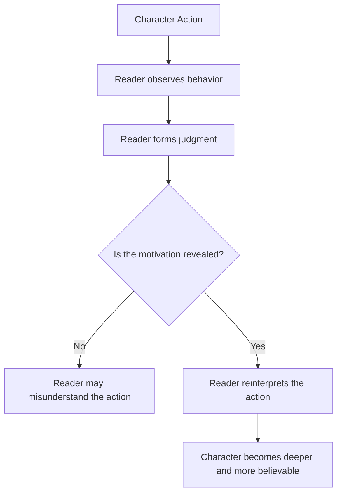
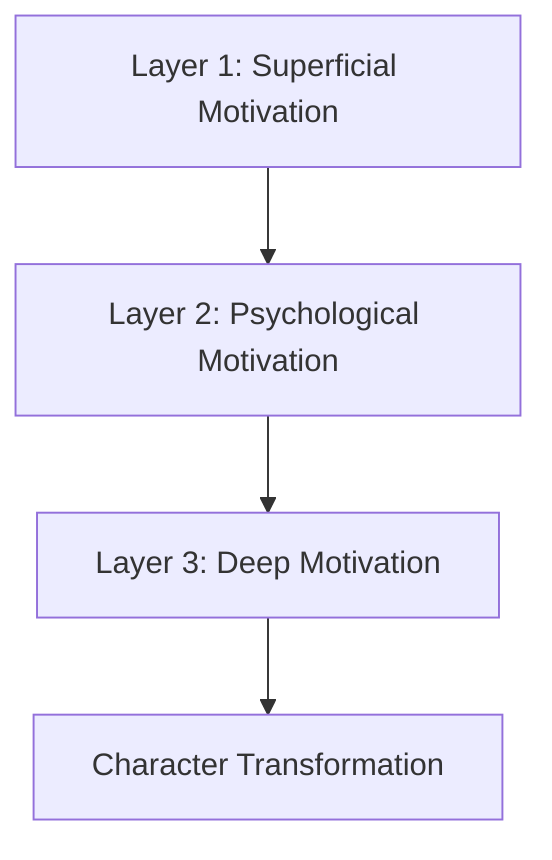
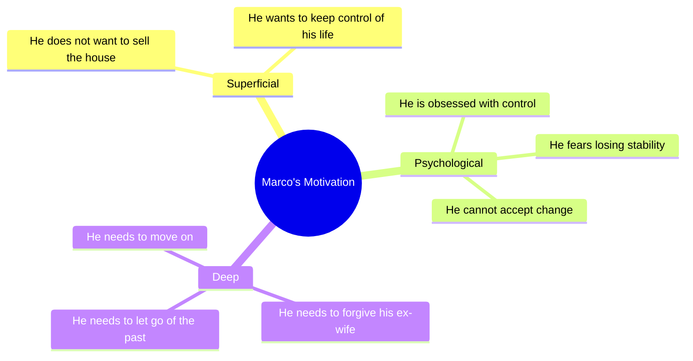
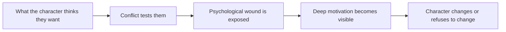
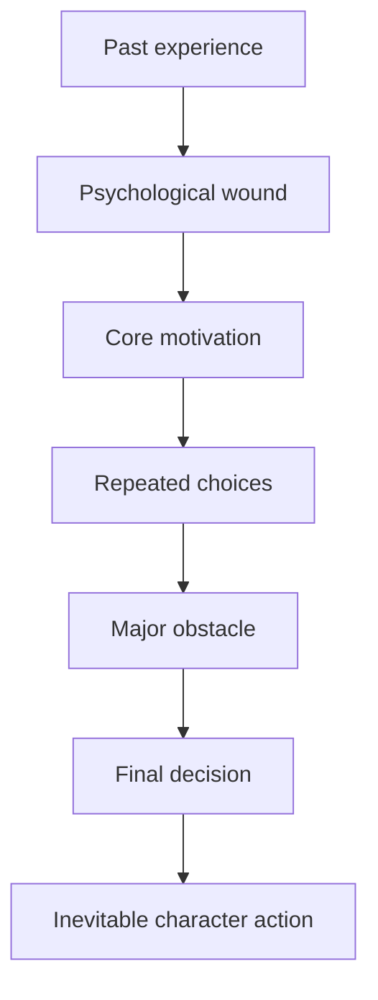

# 007 - What Drives a Character

## Section

**01 - The Character**

## Original Lecture Title

**What Drives a Character**

## Vietnamese Title

**Động lực thúc đẩy nhân vật**

## Duration

**5:29**

---

# Lesson Overview

This lesson focuses on **character motivation**: the reason behind a character’s actions.

A reader may see what a character does, but without understanding why they do it, the action can be misunderstood. The same action can appear selfish, noble, romantic, cruel, or desperate depending on the hidden motivation behind it.

In fiction, the writer must help the reader understand why characters behave the way they do. When motivation is strong and believable, the story feels coherent. When motivation is weak or unclear, readers stop trusting the story.

---

# Core Idea

A character is not only defined by what they do.

A character is also defined by **why they do it**.

The same action can have completely different meanings depending on the motive behind it.

For example:

* A man buying drinks for everyone may be generous, or he may be distracting people from a theft.
* A friend revealing your secret may be disloyal, or they may be trying to protect you.
* Two people kissing passionately may be in love, or they may be using the moment for publicity.

Motivation changes interpretation.

---

# Diagram: Action vs. Motivation

---

# Why Motivation Matters

## 1. Motivation changes the meaning of action

An action alone is not always enough.

What looks like:

* Betrayal may actually be protection.
* Violence may actually be desperation.
* Love may actually be manipulation.
* Coldness may actually be grief.
* Ambition may actually be fear.

The reader needs to understand the reason behind the behavior.

---

## 2. Motivation creates trust

Readers trust a story when character actions feel motivated.

A character may make surprising choices, but those choices should still make emotional and psychological sense.

If a character acts randomly only because the plot needs it, the reader feels manipulated.

---

## 3. Motivation creates inevitability

When motivation is strong enough, the character’s major decision feels unavoidable.

The reader thinks:

> Of course this character would do this.
> There was no other possible choice for them.

This effect is called **inevitability**.

It does not mean the story becomes predictable. It means the character’s choice feels deeply true.

---

# Examples from Stories

## Hidden Motivation Changes Everything

Sometimes, a story reveals the true motivation behind an action only at the end. When this happens, the audience reinterprets everything they have seen before.

A character who seemed cruel may have been protecting someone.

A character who seemed loving may have been manipulating someone.

A character who seemed irrational may have been acting from an old wound.

This delayed revelation can completely change the meaning of the story.

---

## Snape in *Harry Potter*

In the *Harry Potter* series, Severus Snape appears to hate Harry Potter.

He seems:

* Petty.
* Unfair.
* Deceitful.
* Hostile.
* Cruel toward Harry.

However, later in the story, the reader discovers the deeper reason behind Snape’s behavior. This hidden motivation changes how we understand his actions across the entire series.

The lesson is clear:

> A character’s visible behavior may not reveal the whole truth.

---

# The Three Layers of Character Motivation

The instructor describes motivation as a **three-layer cake**.

Each deeper layer supports the one above it.

---

# Layer 1: Superficial Motivation

Superficial motivation is the visible and obvious reason a character acts.

This layer is usually clear to:

* The writer.
* The reader.
* The character.

Common superficial motivations include:

* Money.
* Power.
* Ambition.
* Revenge.
* Survival.
* Love.
* Recognition.
* Security.

## Example

Marco does not want to sell the house he lives in after his divorce.

On the surface, his motivation may seem simple:

> He wants to keep the house.

This is the motivation that everyone can see.

---

# Layer 2: Psychological Motivation

Psychological motivation lies beneath the surface.

This layer is often connected to the character’s personal history, emotional wounds, habits, fears, or worldview.

The writer and reader may understand this motivation. The character may or may not understand it, depending on their level of self-awareness.

## Example

Marco does not want to sell the house because he has an obsession with control.

The house is not only a house.

It represents:

* Stability.
* Control.
* Identity.
* Resistance to change.
* Refusal to accept the divorce.

This motivation is deeper than the surface goal.

---

# Layer 3: Deep Motivation

Deep motivation is buried in the character’s inner self.

The character may not fully understand this motivation until they go through a transformational arc.

This is the motivation connected to the deepest emotional need of the story.

## Example

Marco’s deep motivation is not really about the house.

He needs to forgive his ex-wife before he can move on with his life.

Only after facing this deeper emotional truth can he sell the house and continue forward.

---

# Diagram: Marco’s Motivation Layers

---

# Motivation and the Character Arc

A strong story often moves from superficial motivation to deep motivation.

At the beginning, the character thinks they want one thing.

But through conflict, failure, and pressure, they discover what they truly need.

---

# Motivation Types Summary

| Motivation Layer         | Who Understands It?                    | What It Looks Like         | Example                            |
| ------------------------ | -------------------------------------- | -------------------------- | ---------------------------------- |
| Superficial Motivation   | Writer, reader, and character          | Visible goal               | Marco wants to keep the house      |
| Psychological Motivation | Writer and reader; sometimes character | Emotional pattern or wound | Marco needs control                |
| Deep Motivation          | Often hidden from the character        | Core emotional need        | Marco needs to forgive his ex-wife |

---

# How Motivation Affects Reader Judgment

Readers judge characters based on actions.

But once motivation is revealed, that judgment may change.

| Visible Action                      | First Impression        | Possible Hidden Motivation              |
| ----------------------------------- | ----------------------- | --------------------------------------- |
| A man buys drinks for everyone      | He is generous or drunk | He is distracting people from a theft   |
| A friend reveals a secret           | They are disloyal       | They are trying to protect someone      |
| Two people kiss in public           | They are in love        | They are seeking publicity              |
| A teacher mistreats a student       | He is cruel             | He is hiding a painful personal history |
| A character refuses to sell a house | He is stubborn          | He cannot let go of the past            |

---

# Inevitability

Inevitability happens when a character’s motivation is so strong that their major decision feels like the only possible choice.

For example:

* A character finally declares their love.
* A character chooses revenge.
* A character sacrifices themselves.
* A character starts a war.
* A character leaves home.
* A character forgives someone.
* A character refuses to forgive.

The decision may be dramatic, but it should not feel random.

It should feel like the natural result of everything the reader has learned about the character.

---

# Diagram: Creating Inevitability

---

# Practical Framework: Finding Character Motivation

Use these questions to understand your character more deeply.

## Superficial Motivation

Ask:

* What does the character want on the surface?
* What goal are they actively pursuing?
* What do they say they want?
* What would other characters think they want?

## Psychological Motivation

Ask:

* What fear is underneath this goal?
* What wound from the past influences this behavior?
* What emotional pattern keeps repeating?
* What does the character believe about themselves or the world?

## Deep Motivation

Ask:

* What does the character truly need?
* What truth are they avoiding?
* What must they understand by the end of the story?
* What emotional transformation is waiting for them?

---

# Practical Exercise

For every major decision your protagonist makes in Act 1, write the **one-word emotion** driving it.

Examples:

| Character Decision          | One-Word Emotion |
| --------------------------- | ---------------- |
| Refuses to leave home       | Fear             |
| Lies to a friend            | Shame            |
| Accepts a dangerous mission | Pride            |
| Helps an enemy              | Guilt            |
| Confesses love              | Hope             |
| Runs away                   | Panic            |
| Challenges authority        | Anger            |

After listing the emotions, check whether they connect to a deeper pattern.

---

# Reflection Questions

1. Could a stranger guess your character’s core motivation just by watching their actions?
2. What is your character’s superficial motivation?
3. What psychological motivation sits beneath their behavior?
4. What deep motivation is hidden even from the character?
5. Which past event shaped the way your character acts now?
6. What choice should feel inevitable by the end of the story?
7. Does your character’s motivation come from their inner life, or only from the plot’s convenience?

---

# Character Motivation Checklist

Use this checklist while planning or revising your story:

* Does the character have a clear surface goal?
* Is there an emotional reason behind that goal?
* Is the motivation connected to the character’s past?
* Does the motivation affect multiple scenes, not just one moment?
* Can the reader understand the character’s behavior even when they disagree with it?
* Does the motivation create conflict?
* Does the motivation push the character through obstacles?
* Does the final decision feel inevitable?

---

# Summary

This lesson teaches that motivation is the hidden force behind character action.

A character’s behavior can be judged incorrectly if the reader does not understand why the character acts that way. For this reason, writers must build motivations that are clear, layered, and emotionally believable.

Strong motivation has three levels:

1. **Superficial motivation** — what the character visibly wants.
2. **Psychological motivation** — the emotional pattern beneath the behavior.
3. **Deep motivation** — the hidden need that drives the character’s transformation.

The stronger the motivation, the more inevitable the character’s actions feel.

The key lesson is:

> Do not only ask what your character does. Ask why they cannot help doing it.
