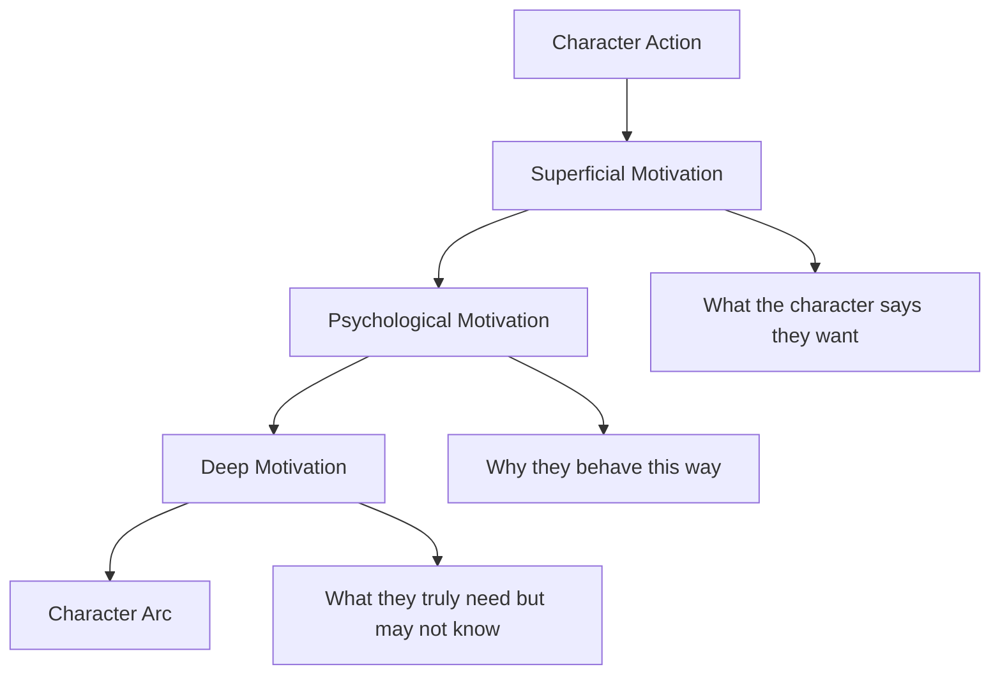
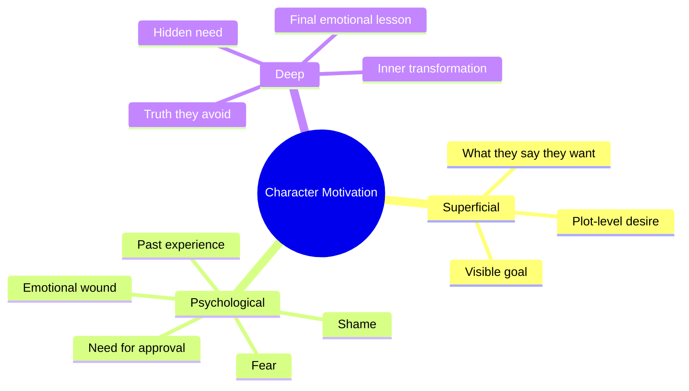
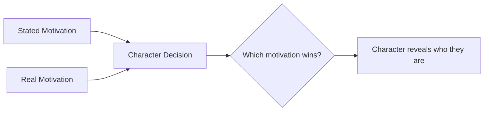

# 008 - Exercise: Character Motivation

## Section

**01 - The Character**

## Original Lecture Title

**Exercise: Character Motivation**

## Vietnamese Title

**Bài tập về động lực nhân vật**

## Duration

**Not listed**
Writing exercise / discussion segment

---

# Lesson Overview

This lesson is a practical assignment about **character motivation**.

After learning that a character’s actions must be driven by clear reasons, the learner is now asked to apply the idea directly to a protagonist.

The goal is to identify the three layers of motivation:

1. **Superficial motivation** — what the character openly wants.
2. **Psychological motivation** — the emotional reason behind their behavior.
3. **Deep motivation** — the hidden need the character may not understand yet.

---

# Assignment Title

**What Motivates Your Character?**

## Estimated Time

**400 minutes**

## Student Solutions

**172 student solutions**

---

# Core Idea

A strong character is not driven only by plot events.

A strong character acts because of inner pressure.

That pressure may come from:

* Fear.
* Love.
* Shame.
* Pride.
* Guilt.
* Ambition.
* Loneliness.
* A wound from the past.
* A need they do not fully understand.

The writer’s task is to discover what truly pushes the character forward.

---

# Key Points

## 1. Motivation must be testable

A character’s motivation should be strong enough that if you changed it, their choices would no longer make sense.

For example:

If a protagonist is driven by guilt, they may sacrifice themselves.

If they are driven by pride, they may refuse help.

If they are driven by fear, they may run away or try to control everything.

A motivation is working when it shapes behavior again and again.

---

## 2. Surface motivation and deep motivation are different

A character may say they want one thing, but emotionally need something else.

For example:

| What the character says they want | What they actually need          |
| --------------------------------- | -------------------------------- |
| “I want to win.”                  | To feel worthy.                  |
| “I want revenge.”                 | To process grief.                |
| “I want money.”                   | To feel safe.                    |
| “I want freedom.”                 | To escape shame.                 |
| “I want my father’s approval.”    | To accept themselves without it. |

This gap creates emotional depth.

---

## 3. Contradictory motivations create inner conflict

A character becomes more interesting when they are pulled in different directions.

For example:

* They want love, but they fear vulnerability.
* They want success, but they fear being seen.
* They want revenge, but they still care about the enemy.
* They want independence, but they crave belonging.
* They want the truth, but they are afraid of what it will cost.

Inner conflict makes the character feel human.

---

# Diagram: Three Layers of Motivation



---

# If You Are Not Working on a Novel

Choose one of your favorite books and study the protagonist.

Ask:

* Why does the protagonist do what they do?
* What goal are they chasing?
* What emotion drives their choices?
* What wound or belief shapes their behavior?
* What deeper need is hidden beneath their visible goal?

This exercise helps you understand how professional writers build motivation.

---

# If You Are Working on a Novel

Spend time questioning your own character.

You should be able to answer these three questions:

## 1. What is the superficial motivation?

This is the visible goal that drives the character forward in the story.

Ask:

* What does my character say they want?
* What goal are they actively pursuing?
* What would other characters think their motivation is?
* What is the obvious reason behind their actions?

Examples:

* They want to protect their family.
* They want to win a competition.
* They want to escape their hometown.
* They want to prove themselves.
* They want to solve a murder.
* They want to gain power or status.

---

## 2. What is the psychological motivation?

This is the emotional reason behind the character’s behavior.

Ask:

* What fear is underneath their goal?
* What wound from the past shapes them?
* What belief controls their choices?
* What emotional hunger keeps pushing them?
* What do they keep trying to prove?

Examples:

* They need approval from a parent.
* They fear being abandoned.
* They are obsessed with control.
* They believe they are unworthy of love.
* They want to prove they are not weak.
* They are trying to repair an old failure.

---

## 3. What is the deep motivation?

This is the hidden motivation that even the character may not understand yet.

Ask:

* What does my character truly need?
* What truth are they avoiding?
* What must they learn by the end?
* What emotional wound must they face?
* What would actually free them?

Examples:

* They need to forgive someone.
* They need to accept themselves.
* They need to let go of the past.
* They need to stop living for approval.
* They need to believe they are worthy of love.
* They need to choose their own identity.

---

# Diagram: Motivation Depth



---

# Assignment Instructions

## Option A: Analyze an Existing Book

Choose a protagonist from one of your favorite books.

Then answer:

1. What does the protagonist want on the surface?
2. What emotional reason explains their behavior?
3. What deeper need drives their journey?
4. How do their actions reveal this motivation?
5. Does their final choice feel inevitable?

---

## Option B: Analyze Your Own Character

Choose the protagonist of your novel or short story.

Then answer:

1. What is the superficial motivation that drives my character forward?
2. What is the psychological motivation behind their behavior?
3. What is the deep motivation, the one even the character is not aware of?

---

# Assignment Worksheet

Use this template for your own work.

```markdown
## Character Name

[Write your character’s name here.]

## Story Role

[Protagonist / antagonist / love interest / mentor / supporting character.]

## Superficial Motivation

What does this character openly want?

Answer:

## Psychological Motivation

What emotional wound, fear, belief, or past experience drives this behavior?

Answer:

## Deep Motivation

What does this character truly need, even if they do not understand it yet?

Answer:

## Contradiction

What two motivations pull this character in opposite directions?

Answer:

## Action Test

Name one major action this character takes. Would this action still make sense if their motivation changed?

Answer:

## Final Reflection

Which motivation wins by the end of the story, and what does that reveal about the character?

Answer:
```

---

# Example 1: Character Seeking Approval

## Superficial Motivation

The character wants to prove herself to her father.

## Psychological Motivation

She needs to be accepted because her birth parents abandoned her.

## Deep Motivation

She wants a family that chooses her freely, not one that feels forced to keep her.

## Why This Works

The surface goal is clear: she wants approval.

But underneath that goal is a deeper emotional wound: abandonment.

Her true need is not only to impress her father. Her true need is to feel chosen, loved, and secure.

---

# Example 2: Character Seen as the “Black Sheep”

## Superficial Motivation

The character is driven by loyalty to his family and country.

## Psychological Motivation

He wants to prove that he can be more than the “black sheep” of the family.

## Deep Motivation

He wants someone to see him for who he truly is, not only as a tool or a means to an end.

## Why This Works

The character’s visible motivation sounds noble: loyalty.

But the emotional motivation is more personal: he wants recognition and dignity.

The deep motivation reveals loneliness. He does not only want to serve others; he wants to be seen as a full human being.

---

# Practical Exercise

Write a short scene where your character’s stated motivation and real motivation pull in opposite directions.

## Scene Prompt

Your character says they are doing something for a practical reason.

But underneath, they are acting from a hidden emotional need.

For example:

* They say they want to win, but they really want approval.
* They say they are protecting someone, but they really fear being abandoned.
* They say they want justice, but they really want revenge.
* They say they are leaving for freedom, but they are actually running from shame.

---

# Scene Planning Table

| Scene Element     | Question                                |
| ----------------- | --------------------------------------- |
| Situation         | What is happening in the scene?         |
| Stated Motivation | What does the character say they want?  |
| Real Motivation   | What are they actually driven by?       |
| Conflict          | What forces them to choose?             |
| Revealing Action  | What do they do that exposes the truth? |
| Result            | Which motivation wins?                  |

---

# Diagram: Motivation Conflict



---

# Reflection Questions

1. Which motivation wins by the end of the scene?
2. What does that victory reveal about the character?
3. Does the character understand their own deep motivation?
4. Would the character’s choices still make sense if their motivation changed?
5. What emotion drives the character’s most important decision?
6. What contradiction makes the character more human?
7. Is the motivation rooted in the character’s past, or does it exist only for one scene?

---

# Character Motivation Checklist

Use this checklist before submitting your assignment:

* The character has a clear visible goal.
* The character’s behavior is emotionally motivated.
* The motivation connects to their past or inner wound.
* The deep motivation is not the same as the surface goal.
* The character has at least one contradiction.
* The motivation affects their choices across the story.
* The reader can understand the character even without agreeing with them.
* The final choice feels emotionally inevitable.

---

# Summary

This assignment asks the writer to move from theory to practice.

A believable character needs more than a goal. They need motivation. That motivation should exist in layers: visible, psychological, and deep.

The writer must ask why the character acts, what emotion drives them, and what hidden need they may not yet understand.

The key lesson is:

> A character becomes powerful when their actions are driven by a motivation deeper than the plot.
