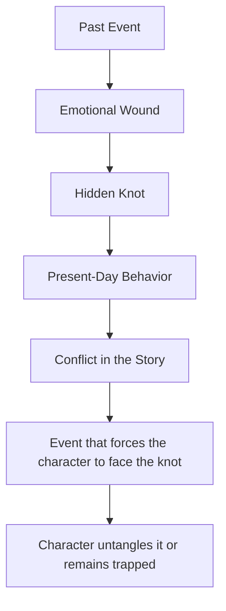
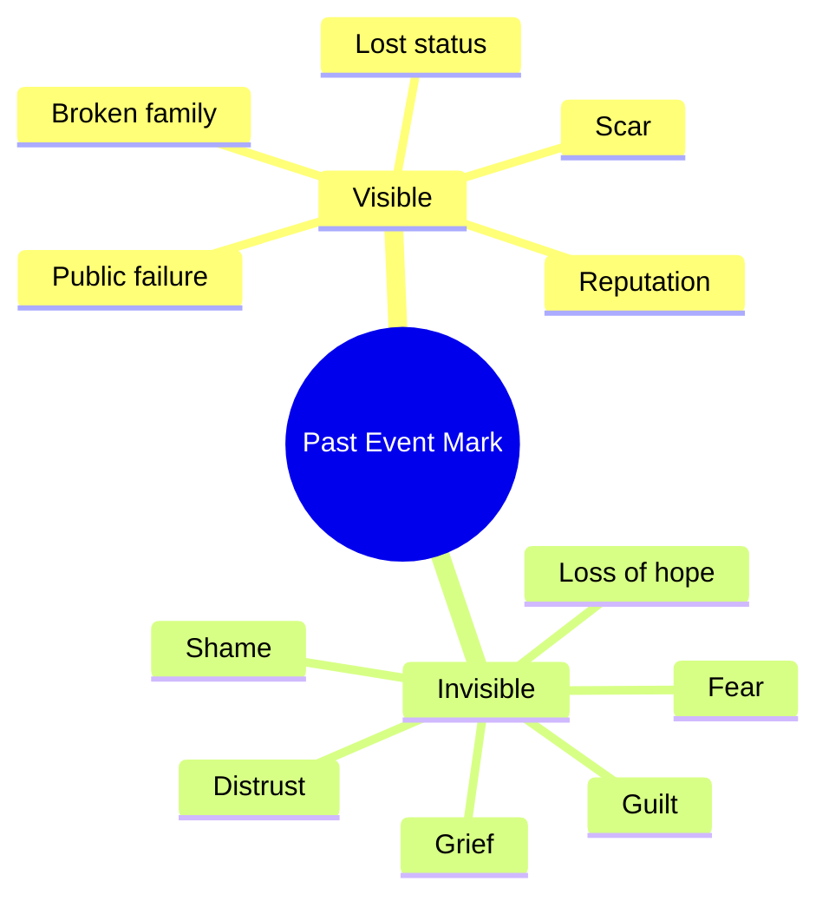
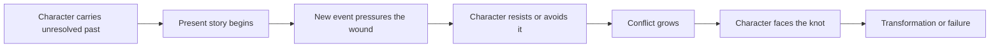
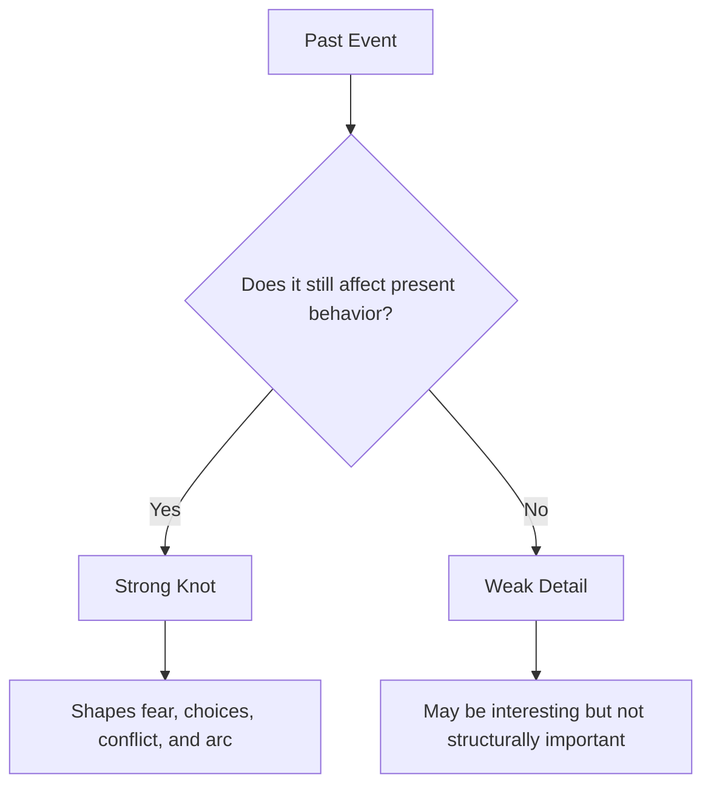

# 009 - A Significant Past Event

## Section

**01 - The Character**

## Original Lecture Title

**A Significant Past Event**

## Vietnamese Title

**Một sự kiện quan trọng trong quá khứ**

## Duration

**6:30**

---

# Lesson Overview

This lesson focuses on the importance of a character’s past.

A character is shaped not only by what they do in the present, but also by what they have done, what they have suffered, what they remember, and what they try to hide.

Some past events are minor and can be ignored. Others leave a deep mark on the character’s personality, fears, habits, blind spots, and decisions.

The instructor describes these important past events as **knots**: unresolved emotional problems that still affect the character’s life.

---

# Core Idea

A character is shaped by significant events from the past.

These events may create:

* Fear.
* Shame.
* Guilt.
* Anger.
* Trauma.
* Obsession.
* Defensive habits.
* Emotional blindness.
* A need for control.
* A fear of love, loss, or failure.

A strong backstory event does not need to be explained directly to the reader. It can appear through the character’s behavior, reactions, silence, and choices.

---

# Key Concept: The Knot

The instructor uses the image of a **knot** to describe an unresolved past event.

On a ship, a knot in the wrong place can stop the rope from moving smoothly. It can cause delays, problems, or even disasters.

The same is true for a character.

A character may move confidently through life until they encounter a knot from their past.

They may:

* Notice the knot and try to untangle it.
* Know the knot exists but pretend it is not important.
* Fail to notice it and stumble into it.
* Be controlled by it without understanding why.

---

# Diagram: The Knot of the Past



---

# Why Past Events Matter

## 1. They explain present behavior

A character’s strange behavior becomes believable when the writer understands where it comes from.

For example:

* A fear of commitment may come from betrayal.
* Carelessness with money may come from growing up poor.
* Obsession with control may come from a chaotic childhood.
* Hatred of dogs may come from a painful childhood memory.
* Emotional coldness may come from grief.

The reader does not always need to know the full backstory immediately, but the writer must know it.

---

## 2. They affect how readers judge the character

If you meet someone at dinner, you judge them based on what they say and do in that moment.

But if someone tells you that this person has just:

* Gotten out of jail.
* Gone through a divorce.
* Been accused of murder.
* Gone bankrupt.

Then your interpretation of their behavior changes.

The same thing happens in fiction.

Backstory changes meaning.

---

## 3. They create emotional depth

A character without a past can feel flat.

A character with a meaningful past feels like someone who existed before the story began.

Their present actions are no longer random. They become the result of memory, wound, desire, and survival.

---

# Visible and Invisible Marks

A past event can leave a mark in two different ways.

## Visible Mark

A visible mark can be seen physically or socially.

Examples:

* A scar.
* A disability.
* A ruined reputation.
* A lost home.
* A public failure.
* A broken relationship.

## Invisible Mark

An invisible mark affects the character internally.

Examples:

* Fear.
* Shame.
* Grief.
* Guilt.
* Distrust.
* Pessimism.
* Emotional numbness.
* Refusal to hope.

Both types can shape the story.

---

# Diagram: Types of Past Marks



---

# Example: *An Unfinished Life*

In *An Unfinished Life* by Mark Spragg, the protagonist lives alone on a ranch.

He is trying to overcome:

* The death of his son in a car accident.
* His anger toward his daughter, who was driving the car.
* His inability to feel hope again.

This past event has turned him into a lonely and pessimistic man.

However, he does not fully understand how deeply the event still controls him. He does not see the knot clearly.

The unexpected event that helps him begin to untangle the knot is meeting the grandson he did not even know he had.

Through his daughter and granddaughter, he begins to glimpse the possibility of a normal life again — one surrounded by people who love him and whom he can love in return.

---

# How a Knot Moves the Plot

A knot can become one of the engines of the story.

Many stories are about the process of slowly untangling this knot.



A story often becomes powerful when the present-day plot forces the character to confront something they have avoided for years.

---

# The Rule: Go Deep

The instructor gives one important rule:

> Go deep.

It is not enough to give a character a random fear or habit.

The writer must ask why.

For example:

## Weak Version

The character is afraid of spiders.

This is only a symptom.

## Stronger Version

The character is afraid of spiders because of a specific childhood event that connects to fear, helplessness, shame, or loss.

Now the fear has emotional meaning.

---

# Example: A Woman Who Hates Dogs

A character who hates dogs may seem simple at first.

But the writer must ask:

> Why does she hate dogs?

A deeper answer might be:

When she was little, she had a dog. During a fire, her father died while trying to save that dog.

Now her hatred of dogs is not random. It is connected to grief, guilt, and unresolved pain.

That is a knot.

---

# What Makes a Good Knot?

A strong knot should be specific and emotionally meaningful.

It does not always have to be huge, but it must be significant enough to affect the entire story.

## A strong knot should:

* Explain present behavior.
* Connect to the character’s inner life.
* Create emotional pressure.
* Affect decisions in the story.
* Be difficult to talk about.
* Create conflict when triggered.
* Require an event or relationship to untangle it.

## A weak knot may be:

* Too random.
* Too small for the story.
* Unconnected to the character’s choices.
* Used only as decoration.
* Mentioned once and never felt again.

---

# Diagram: Strong vs. Weak Backstory Event



---

# Practical Framework: Designing a Character’s Knot

## Step 1: Identify the past event

Ask:

* What happened to this character before the story began?
* Was it sudden, shocking, humiliating, tragic, or transformative?
* Did they cause it, witness it, survive it, or misunderstand it?

---

## Step 2: Identify the emotional wound

Ask:

* What feeling did the event leave behind?
* Did it create guilt, fear, shame, anger, grief, or distrust?
* What belief did the character form because of it?

Example:

> “If I love someone, I will lose them.”
> “I must control everything.”
> “No one can be trusted.”
> “I am responsible for what happened.”
> “I do not deserve happiness.”

---

## Step 3: Show how it affects the present

Ask:

* What does the character avoid because of this event?
* What do they overreact to?
* What ordinary situation triggers the old wound?
* What decision in the present is still controlled by the past?

---

## Step 4: Create the untangling event

Ask:

* What new event could force the character to face this knot?
* Who could enter their life and challenge their defensive pattern?
* What would make avoidance impossible?
* When should this event happen in the story?

---

# Character Knot Worksheet

Use this template to develop your protagonist’s past event.

```markdown id="mn3p2h"
## Character Name

[Write the character’s name.]

## Significant Past Event

What happened in the character’s past?

Answer:

## Emotional Impact

What wound did this event create?

Answer:

## Present-Day Symptom

How does this wound appear in the character’s behavior now?

Answer:

## Hidden Belief

What belief did the character form because of this event?

Answer:

## Avoidance Pattern

What does the character avoid because of this knot?

Answer:

## Trigger

What present-day situation activates the old wound?

Answer:

## Untangling Event

What event could help the character face and untangle the knot?

Answer:

## Story Placement

When should this event happen in the story?

Answer:
```

---

# Practical Exercise

Write the full backstory scene.

Even if most of it never appears directly in the novel, write it for yourself.

Include:

* Where the event happened.
* Who was there.
* What the character wanted at the time.
* What went wrong.
* What the character misunderstood.
* What emotional wound remained.
* What belief they carried into the future.

This scene may stay hidden from the reader, but it will help you write the character with greater consistency and depth.

---

# Reflection Questions

1. Is there a past event that marked the life of your protagonist?
2. How traumatic was it?
3. What is the relationship between the character and the knot they must untangle?
4. Does the character know the knot exists?
5. Are they able to talk to someone about it?
6. If they can talk about it, who do they talk to and why?
7. If they cannot talk about it, what stops them?
8. What event could help them untangle the knot?
9. How can you prepare the story for that event?
10. When should that event take place in the story?
11. How does this past event still control one present-day decision?

---

# Backstory-to-Plot Checklist

Use this checklist while planning or revising:

* The past event is specific.
* The event left a clear emotional mark.
* The character’s present behavior reflects the wound.
* The knot affects more than one scene.
* The character may not fully understand the knot at first.
* The reader can sense the wound through behavior.
* The plot creates pressure around the knot.
* A later event forces the character to face it.
* The knot connects to the character’s transformation.

---

# Summary

This lesson teaches that a character’s past can become one of the most important forces in the story.

A significant past event can create a knot: an unresolved emotional wound that shapes the character’s fears, habits, beliefs, and choices.

The writer’s job is not simply to invent a tragic backstory. The writer must understand how that event still lives inside the character and how the present-day plot can force the character to confront it.

The key lesson is:

> Do not only ask what happened to your character. Ask how that event still controls them now.
