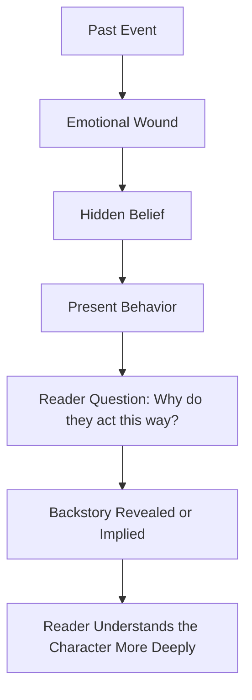
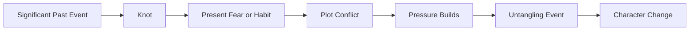
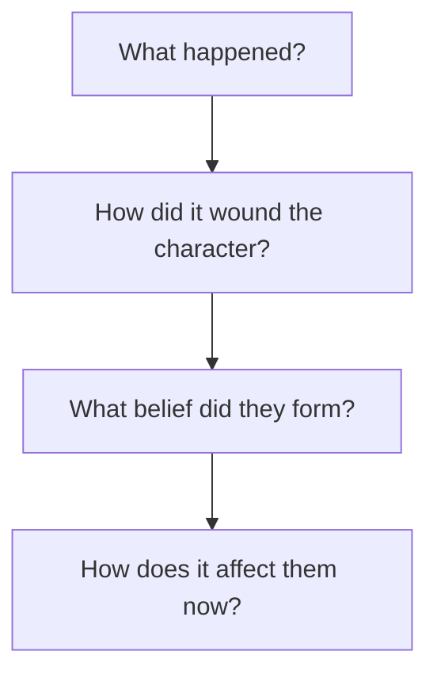
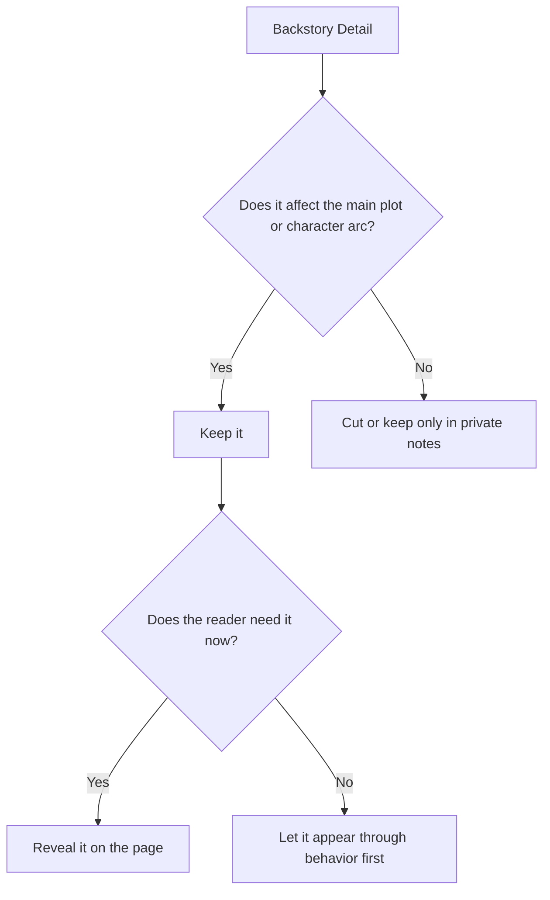

# 010 - Exercise: The Backstory Event

## Section

**01 - The Character**

## Original Lecture Title

**Exercise: The Backstory Event**

## Vietnamese Title

**Bài tập về biến cố quá khứ**

## Duration

**Not listed**
Writing exercise / discussion segment

---

# Lesson Overview

This lesson is a practical assignment about the **significant past event** that shaped the protagonist.

The previous lesson introduced the idea of a **knot**: an unresolved event from the character’s past that still affects their present behavior. This exercise asks the writer to identify that event, understand its emotional impact, and decide how it should appear in the story.

The goal is not to write a long biography. The goal is to discover the past event that explains why the protagonist acts the way they do.

---

# Assignment Title

**That One Event in Their Past**

## Estimated Time

**800 minutes**

## Student Solutions

**118 student solutions**

---

# Core Idea

Backstory should answer an important question:

> Why does this character behave this way?

A strong backstory event should explain something the reader will eventually wonder about.

For example:

* Why does the protagonist avoid love?
* Why do they fear failure?
* Why do they distrust authority?
* Why do they refuse help?
* Why are they obsessed with control?
* Why do they react so strongly to one specific situation?

The backstory event does not need to be fully shown on the page. Sometimes the reader only needs to see its emotional residue in the character’s present behavior.

---

# Key Points

## 1. Backstory should answer a “why”

A past event is useful when it explains present behavior.

If the protagonist acts in a strange, extreme, or confusing way, the writer should know what past experience created that reaction.

The reader may not learn the whole event immediately, but the character’s actions should feel emotionally grounded.

---

## 2. Only keep details that pay off later

A backstory scene may be beautifully written, but not every detail belongs in the novel.

Keep the details that:

* Affect the character’s decisions.
* Create emotional conflict.
* Return later in the plot.
* Explain a fear, habit, wound, or belief.
* Help the reader understand the character more deeply.

Cut details that are interesting but do not influence the main story.

---

## 3. Decide how much the reader needs to know

The writer must decide whether the backstory should appear as:

* A full scene.
* A short memory.
* A line of dialogue.
* A flashback.
* A rumor.
* A physical scar.
* A repeated habit.
* A silent reaction.
* A secret revealed near the end.

Sometimes the full event is unnecessary. The story may be stronger if the reader only sees how the past still lives inside the character.

---

# Diagram: From Past Event to Present Behavior



---

# If You Are Not Working on a Novel

Choose one of your favorite books and study the protagonist’s decisions in the first third of the story.

Answer these questions:

1. What is the title of the book?
2. Who is the main character?
3. What major decisions does the protagonist make early in the story?
4. Why do they do what they do?
5. Did something happen in their past that shaped their culture, worldview, fear, or way of thinking?
6. How does that past event influence their early choices?

This exercise helps you see how published stories use backstory to explain character behavior.

---

# If You Are Working on a Novel

Spend time questioning your own protagonist.

You should answer three main groups of questions.

---

## 1. The Past Event

Ask:

* Is there a past event that marked the protagonist’s life?
* What exactly happened?
* How old was the character when it happened?
* Who else was involved?
* Was the event sudden, traumatic, humiliating, tragic, or life-changing?
* How traumatic was it?

The event does not need to be huge, but it must be meaningful enough to affect the story.

---

## 2. The Character’s Relationship with the Knot

Ask:

* Does the character know this event still controls them?
* Do they talk about it openly?
* Do they hide it?
* Do they deny that it matters?
* Are they ashamed of it?
* Do they blame themselves?
* Do they blame someone else?
* Are they able to tell another person about it?

If they can talk about it, ask:

* Who do they talk to?
* Why that person?
* What do they leave unsaid?

If they cannot talk about it, ask:

* What stops them?
* Fear?
* Shame?
* Pride?
* Guilt?
* Lack of trust?

---

## 3. The Untangling Event

Ask:

* What event could help the protagonist untangle this knot?
* What person, conflict, or crisis could force them to face the past?
* How can the story prepare for this event?
* When should it happen in the story?
* What would change after the character faces the knot?

The untangling event should not feel random. It should grow naturally from the main plot.

---

# Diagram: The Backstory Knot



---

# Assignment Instructions

## Option A: Analyze a Published Book

Use this structure:

```markdown id="7z3w8h"
## Book Title

[Write the title here.]

## Main Character

[Write the protagonist’s name.]

## Early Decisions

What important decisions does the protagonist make in the first third of the story?

Answer:

## Motivation

Why does the protagonist do what they do?

Answer:

## Past Event

Did something happen in their past that affected their culture, worldview, or way of thinking?

Answer:

## Effect on Present Behavior

How does that past event influence their decisions in the present story?

Answer:
```

---

## Option B: Analyze Your Own Protagonist

Use this structure:

```markdown id="3g42tu"
## Protagonist Name

[Write the character’s name.]

## Significant Past Event

Is there a past event that marked the life of the protagonist?

Answer:

## Level of Trauma

How traumatic was it?

Answer:

## The Knot

What unresolved emotional knot did this event create?

Answer:

## Relationship with the Knot

How does the character relate to this knot?

- Do they know it exists?
- Do they deny it?
- Do they hide it?
- Do they misunderstand it?

Answer:

## Ability to Talk About It

Can the character talk to someone about it?

If yes, to whom and why?

If no, why not?

Answer:

## Untangling Event

What event could help them untangle the knot?

Answer:

## Story Setup

How can you prepare the story for this event?

Answer:

## Story Placement

When would this event take place in the story?

Answer:
```

---

# Practical Exercise

Write one paragraph of backstory as it might appear inside the novel.

The paragraph should be compressed to its emotional essentials.

Do not explain everything. Focus only on the details that still hurt, still matter, or still influence the character’s present behavior.

---

# Backstory Paragraph Formula

A useful paragraph may include:

1. The event.
2. The emotional wound.
3. The belief created by the wound.
4. The present-day effect.



---

# Example Backstory Paragraph

When Elena was eight, she waited all evening by the front window with her school certificate folded in her hand, certain her father would come home in time to see it. He arrived after midnight, smelling of rain and someone else’s perfume, and told her achievements were only impressive when they changed a family’s future. Since then, every prize she won felt less like joy and more like a debt she still had to pay.

---

# Why This Example Works

The paragraph does not explain Elena’s entire childhood.

Instead, it gives the emotional essentials:

| Element         | Detail                                |
| --------------- | ------------------------------------- |
| Past event      | Her father dismisses her achievement  |
| Emotional wound | She feels unseen and not enough       |
| Hidden belief   | Love must be earned through success   |
| Present effect  | Achievement becomes pressure, not joy |

This kind of backstory can explain why Elena pushes herself too hard in the present story.

---

# What to Include and What to Cut

## Include

* The detail that created the wound.
* The emotional turning point.
* The belief the character formed.
* The present behavior connected to the event.
* A concrete image the reader can remember.

## Cut

* Long explanations.
* Unnecessary family history.
* Details that never affect the plot.
* Information that repeats what the reader already knows.
* Backstory that stops the story without adding emotional pressure.

---

# Diagram: Backstory Filter



---

# Reflection Questions

1. Does the reader need the full event, or only its residue in the character’s present behavior?
2. What question does this backstory answer?
3. Which present-day behavior becomes clearer because of this past event?
4. Is the backstory specific enough to feel real?
5. Is the event emotionally strong enough to support the story?
6. Are you including details because they matter, or only because you like them?
7. Where should the backstory surface in the novel?
8. Should it appear early, late, or gradually?
9. Who else in the story knows about this event?
10. What would force the character to finally face it?

---

# Backstory Event Checklist

Use this checklist before submitting your assignment:

* The past event is specific.
* The event explains present behavior.
* The event created an emotional knot.
* The knot affects the main plot.
* The character has a clear relationship with the knot.
* The character may hide, deny, or misunderstand it.
* The reader does not receive unnecessary information.
* The backstory pays off later.
* The story contains or prepares an event that can help untangle the knot.
* The backstory is shown only as much as the reader needs.

---

# Summary

This exercise asks the writer to identify the past event that shaped the protagonist.

A meaningful backstory is not a random tragic detail. It is a source of behavior, fear, motivation, and conflict. It answers the reader’s question: why does this character act this way?

The writer should know the full event, but the reader may only need selected fragments. The strongest backstory details are the ones that return later in the main plot and influence the character’s transformation.

The key lesson is:

> Backstory is not about what happened long ago. It is about how the past is still acting on the character now.

---

# Bài luyện tập

## Mục tiêu


## Đề bài


## Yêu cầu hoàn thành

- [ ] 
- [ ] 
- [ ] 

## Kết quả / lời giải


## Ghi chú
