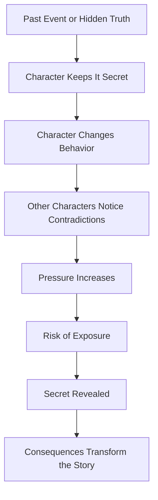
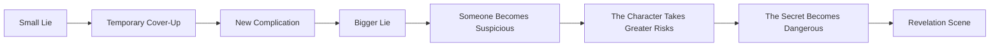

# 011 - The Character's Secret

## Section

**01 - The Character**

## Original Lecture Title

**Bí mật của nhân vật**
**English:** *The Character's Secret*

## Duration

**6:43**

---

## 1. Lesson Overview

A character’s secret can become one of the strongest engines of a story.

A secret creates tension because the character is not simply living their life; they are actively protecting something. The audience senses that there is a hidden truth beneath the surface, and this creates curiosity, dramatic irony, and emotional pressure.

A strong secret is not just a random twist. It should connect to the character’s deepest fear, the story’s central conflict, or the main theme of the novel.

---

## 2. Core Idea

> A secret becomes powerful when revealing it would cost the character something real.

That cost may be:

* Reputation
* Marriage
* Career
* Freedom
* Family
* Identity
* Social position
* Self-respect
* The trust of someone they love

The more the character has to lose, the stronger the secret becomes as a story engine.

---

## 3. Why Secrets Create Strong Plot Tension

A secret makes the plot dynamic because it naturally produces questions:

* What is the character hiding?
* Why are they hiding it?
* Who already knows?
* Who is close to discovering it?
* What happens when the truth comes out?

This creates a built-in desire in the reader to search for the truth.

---

## 4. Examples of Character Secrets

| Example                      | Secret Type         | Why It Works                                                                           |
| ---------------------------- | ------------------- | -------------------------------------------------------------------------------------- |
| **Dexter**                   | Double life / crime | He appears to be a detective but is secretly a serial killer.                          |
| **Snape in Harry Potter**    | Hidden loyalty      | He appears cruel or suspicious, but his secret is tied to love, guilt, and protection. |
| **Walter Keane in Big Eyes** | False authorship    | His fame is built on artworks he did not actually paint.                               |
| **Superman / Clark Kent**    | Hidden identity     | His secret protects the people around him.                                             |
| **Batman / Bruce Wayne**     | Double identity     | Public arrogance hides a private mission.                                              |
| **Héctor in Coco**           | Misunderstood past  | A secret changes how others understand his actions and identity.                       |

---

## 5. Types of Character Secrets

### 5.1 Negative Secrets

These are secrets that could destroy the character if exposed.

Examples:

* A crime
* A betrayal
* A hidden affair
* A lie that grew too large
* A stolen achievement
* A shameful family history
* A secret identity used for selfish reasons

Negative secrets often create suspense, guilt, and fear.

---

### 5.2 Positive Secrets

Some secrets appear negative at first but are later revealed to be noble, protective, or misunderstood.

Examples:

* A character pretends to be bad in order to protect someone.
* A character hides their identity to keep loved ones safe.
* A character is blamed for something they did not truly do.
* A character’s apparent cowardice is later revealed as sacrifice.

Positive secrets can create powerful emotional reversals and even support a happy ending.

---

## 6. The Secret as a Story Engine



---

## 7. The Four Key Questions for Designing a Secret

### Question 1: What would happen if the secret came out?

Ask what the character would lose.

Would they lose:

* Their freedom?
* Their job?
* Their marriage?
* Their children?
* Their reputation?
* Their social status?
* Their sense of identity?

A secret becomes dramatic when its exposure has serious consequences.

---

### Question 2: How does the character feel about the secret?

The secret should affect the character emotionally.

They may feel:

* Guilty
* Ashamed
* Afraid
* Angry
* Defensive
* Numb
* In denial
* Secretly proud
* Convinced they had no other choice

Sometimes the character believes they have forgotten the secret, but their behavior proves otherwise.

---

### Question 3: Is it truly their secret?

Not every secret belongs directly to the protagonist.

The character may be hiding:

* Their own past
* A family member’s crime
* A lover’s betrayal
* A friend’s shame
* A parent’s lie
* A secret that protects someone else

This can create moral complexity because the character may suffer for a truth that is not entirely theirs.

---

### Question 4: What are they doing to preserve the secret?

A character who has a secret must actively protect it.

They might:

* Avoid certain topics
* Refuse to answer questions
* Smile awkwardly
* Deny everything
* Stay silent
* Invent a small lie
* Invent bigger lies to protect the first lie
* Destroy evidence
* Manipulate others
* Push people away
* Pretend not to care

The way the character protects the secret reveals who they are.

---

## 8. Secret Escalation Pattern

Many strong secrets begin as something small.



A secret often becomes more powerful when the character did not originally intend to create a huge deception. One lie leads to another, and eventually the secret controls their life.

---

## 9. The Revelation Scene

If a secret is revealed in a scene, the moment should be memorable.

A strong revelation usually happens:

* At a moment of maximum tension
* During confrontation
* When the character can no longer escape the truth
* When another character finally connects the clues
* When the revelation changes how the audience understands the story

The revelation should not feel random. It should feel inevitable once the audience looks back.

---

## 10. Good Secrets Are Connected to Theme

A weak secret exists only to surprise the reader.

A strong secret connects to the story’s deeper questions.

For example:

| Theme     | Possible Secret                                               |
| --------- | ------------------------------------------------------------- |
| Identity  | The character is living under a false name.                   |
| Love      | The character betrayed someone they still love.               |
| Guilt     | The character caused an accident years ago.                   |
| Power     | The character’s success is built on someone else’s work.      |
| Family    | The character is hiding the truth about a parent or sibling.  |
| Justice   | The character knows who committed the crime but stays silent. |
| Belonging | The character is pretending to be someone they are not.       |

The secret should not sit outside the story. It should pressure the same emotional wound the story is already exploring.

---

## 11. Practical Exercise

Write down your protagonist’s secret.

Then answer:

1. What is your character’s secret?
2. Who else knows it?
3. What would happen if it were exposed?
4. What would your character lose?
5. When did the secret begin?
6. Did it start as a small lie?
7. How did it grow over time?
8. Who is most likely to discover it?
9. What is the worst possible moment for the truth to come out?
10. How will everyone react when they discover it?

---

## 12. Reflection Question

> What is your character afraid people would think if they knew the truth?

This question helps reveal the emotional core of the secret.

The real fear may not be punishment. It may be judgment.

Your character may fear that others will think they are:

* A coward
* A fraud
* A monster
* Weak
* Selfish
* Unlovable
* Unworthy of forgiveness

That fear is often more important than the secret itself.

---

## 13. Application to Your Novel

When applying this lesson to your work-in-progress, do not treat the secret as decoration.

Ask yourself:

* Does the secret influence the character’s choices?
* Does it create conflict with other characters?
* Does it affect the main plot?
* Does it connect to the theme?
* Would the story become weaker if the secret were removed?

If the answer is yes, the secret is not just a twist. It is part of the story’s engine.

---

## 14. Summary

A character’s secret creates tension, mystery, and emotional pressure. The best secrets are not isolated surprises; they are tied to the character’s fear, shame, desire, and central conflict.

A strong secret should:

* Cost the character something if revealed
* Shape the character’s present behavior
* Create tension with other characters
* Connect to the theme
* Build toward a memorable revelation

A secret is powerful because it makes the reader wonder not only what happened, but also what the truth will destroy when it finally comes out.

---

## 15. Assignment

Design your protagonist’s secret.

Use this structure:

```markdown
## My Character's Secret

### 1. The Secret

What is the hidden truth?

### 2. Origin

When did it begin?

### 3. Emotional Weight

How does the character feel about it?

### 4. Protection Strategy

What does the character do to keep it hidden?

### 5. Risk of Exposure

Who might discover it?

### 6. Consequences

What will be destroyed if the truth comes out?

### 7. Revelation Scene

When and how will the secret be revealed?
```

The goal is not simply to invent a shocking fact. The goal is to create a hidden truth that makes your character more complex and your story more alive.
