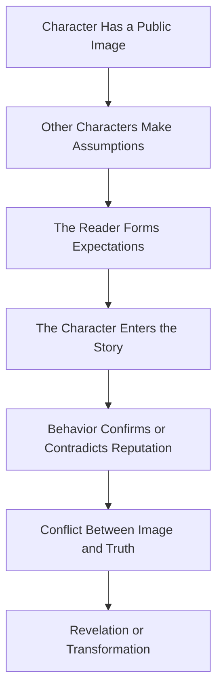
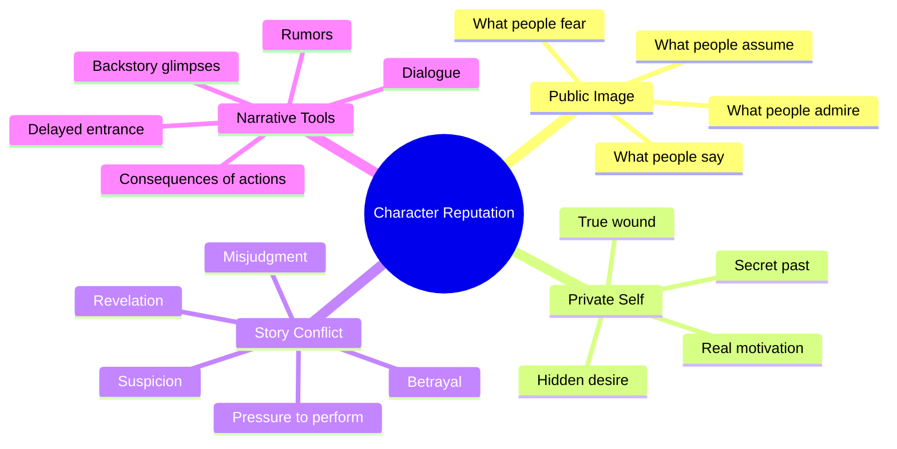

# 012 - The Character's Reputation / Social Image

## Section

**01 - The Character**

## Original Lecture Title

**Danh tiếng / hình ảnh xã hội của nhân vật**
**English:** *The Character's Reputation / Social Image*

## Duration

**7:33**

---

## 1. Lesson Overview

A character’s reputation is the image other people have of them.

This reputation does not need to be worldwide fame. A character can be “famous” inside a family, a school, a workplace, a village, a criminal circle, or a social group.

Once people start talking about a character, they begin judging that character before truly knowing them. In fiction, this can become a powerful storytelling tool because the reader can form an opinion about a character before the character even appears on the page.

---

## 2. Core Idea

> The gap between how a character is seen and who they really are creates conflict.

A character’s public image may be very different from their private truth.

They may be seen as:

* Dangerous, but actually vulnerable
* Kind, but secretly manipulative
* Cold, but deeply loyal
* Weak, but quietly courageous
* Trustworthy, but secretly plotting betrayal
* Evil, but secretly protecting someone
* Noble, but hiding a corrupt past

This gap creates tension because the character must live under the pressure of other people’s assumptions.

---

## 3. Why Reputation Matters in Fiction

Reputation affects how characters are treated.

It can shape:

* How others speak about them
* Whether others trust them
* Whether others fear them
* Whether others forgive them
* Whether others listen to them
* Whether others underestimate them
* Whether others expect them to behave in a certain way

A character may begin acting not according to who they truly are, but according to the image they feel forced to protect.

---

## 4. Reputation as Story Pressure



---

## 5. Three Ways to Build a Character's Reputation

### 5.1 Delay Their Entrance

One powerful method is to let other characters talk about someone before that person appears.

This creates anticipation.

The reader begins to wonder:

* Who is this person?
* Why is everyone afraid of them?
* Are the stories true?
* Will they be worse than expected?
* Will they be completely different from their reputation?

This works especially well for villains, powerful figures, mysterious mentors, dangerous rivals, or legendary characters.

---

### Example: Agatha Trunchbull in *Matilda*

In *Matilda*, the terrifying headmistress Agatha Trunchbull is not introduced immediately. Instead, the story lets other characters speak about her first.

Before the reader or viewer sees her directly, they have already heard stories about her cruelty and violence.

This delay builds fear.

By the time she finally appears, her reputation has already entered the room before she does.

---

### 5.2 Use Other Characters' Dialogue

A character’s reputation can be built through the words of others.

Other characters may:

* Whisper about them
* Warn the protagonist about them
* Praise them
* Fear them
* Worship them
* Mock them
* Spread rumors
* Tell exaggerated stories

This creates mystery because the reader does not know yet whether the reputation is accurate.

---

### Example: Kurtz in *Heart of Darkness*

In *Heart of Darkness*, Marlow hears about Kurtz long before he meets him.

Kurtz is described in different ways by different people:

* A genius
* A successful ivory trader
* A man worshipped like a god
* A cruel figure
* A madman
* A legend

For a long time, Kurtz is less a person than a name, a rumor, and an idea.

This makes the reader curious because the real Kurtz is hidden behind layers of reputation.

---

### 5.3 Reveal Glimpses of the Past

Another way to build reputation is to slowly reveal fragments of the character’s background.

The audience may first see the character behaving one way, then later discover that their past suggests something completely different.

This creates contradiction.

The viewer or reader begins to ask:

* Who is this person really?
* Were they always like this?
* Have they changed?
* Are they hiding something?
* Can we trust what we see?

---

### Example: Michael in *Burn Notice*

In *Burn Notice*, Michael often helps innocent people as a private detective.

However, the audience gradually learns that he was once a ruthless CIA operative. This contrast creates tension because the viewer must hold two images of him at the same time:

| Present Image         | Past Reputation      |
| --------------------- | -------------------- |
| Helps innocent people | Former CIA operative |
| Protective            | Dangerous            |
| Resourceful           | Ruthless             |
| Heroic                | Morally ambiguous    |

The conflict between his current actions and his past reputation makes him more complex.

---

## 6. Reputation Before Appearance

A character does not need to be physically present in a scene to dominate it.

Sometimes, a reputation can be more powerful than the character’s actual presence.


This technique is useful when introducing:

* Villains
* Legendary heroes
* Powerful family members
* Dangerous criminals
* Famous artists
* Political figures
* School authorities
* Rich heirs
* Secretive outsiders
* Antagonists

---

## 7. Reputation and the Antagonist

The antagonist’s reputation is especially important.

In thrillers, noir stories, mysteries, and crime fiction, the villain often becomes frightening before appearing directly.

The reader may first know the antagonist through:

* The bodies they leave behind
* The fear they create
* The rumors around them
* The damage they cause
* The way others avoid speaking their name
* The clues they leave for the protagonist

This makes the antagonist feel powerful because their presence is felt even when they are absent.

---

## 8. Example: John Doe in *Seven*

In the film *Seven*, the killer John Doe is not introduced immediately.

For much of the story, the audience knows him only through the consequences of his crimes.

His reputation is created through:

* The murder scenes
* The pattern of the Seven Deadly Sins
* The detectives’ reactions
* The intelligence behind the crimes
* The growing sense that the killer is always ahead

By the time John Doe appears, his reputation has already shaped the story.

---

## 9. Public Image vs Private Self

The strongest character reputations often contain contradiction.

| Public Image                         | Private Truth                                |
| ------------------------------------ | -------------------------------------------- |
| Everyone thinks they are dangerous.  | They are trying to protect someone.          |
| Everyone thinks they are innocent.   | They are hiding a crime.                     |
| Everyone thinks they are weak.       | They are quietly powerful.                   |
| Everyone thinks they are loyal.      | They are planning betrayal.                  |
| Everyone thinks they are selfish.    | They made a sacrifice no one knows about.    |
| Everyone thinks they are successful. | Their life is collapsing privately.          |
| Everyone thinks they are cruel.      | They are acting cruel to hide vulnerability. |

The story becomes richer when the reader discovers that reputation and truth are not the same thing.

---

## 10. Reputation Can Trap a Character

A character’s public image can become a prison.

They may feel forced to behave according to what others expect.

For example:

* The “strong one” cannot admit fear.
* The “good daughter” cannot rebel.
* The “genius” cannot admit failure.
* The “villain” cannot show kindness.
* The “leader” cannot show weakness.
* The “perfect wife” cannot reveal unhappiness.
* The “successful businessman” cannot admit bankruptcy.

Reputation creates pressure because the character may protect the image even when it hurts them.

---

## 11. Reputation as Dramatic Irony

Reputation can also create dramatic irony.

This happens when the reader knows the truth, but other characters do not.

Example:

* The town thinks the protagonist is a murderer.
* The reader knows they are innocent.
* Every scene becomes tense because the protagonist is judged unfairly.

Or the opposite:

* Everyone trusts the antagonist.
* The reader knows they are dangerous.
* Every friendly conversation becomes threatening.

---

## 12. Character Reputation Map



---

## 13. Practical Exercise

Write a scene from the point of view of a secondary character.

In that scene, the secondary character describes your protagonist’s reputation.

They may describe:

* What everyone says about the protagonist
* What rumors surround them
* Whether people admire or fear them
* What the secondary character personally believes
* What they think the protagonist is capable of
* What they do not understand about the protagonist

The goal is to show the protagonist indirectly.

---

## 14. Exercise Structure

Use this structure:

```markdown id="k3duvx"
## Reputation Scene

### 1. Speaker

Who is describing the protagonist?

### 2. Relationship

How does this person know the protagonist?

### 3. Public Image

What does everyone believe about the protagonist?

### 4. Personal Opinion

Does the speaker believe the reputation?

### 5. Rumor or Example

What story do people tell about the protagonist?

### 6. Hidden Truth

What does the speaker misunderstand?

### 7. Scene Purpose

How does this reputation create tension before the protagonist appears?
```

---

## 15. Reflection Question

> Where does your character’s private self diverge most sharply from their public image?

This question helps you identify the strongest source of conflict.

Ask yourself:

* What do people believe about this character?
* What is actually true?
* Does the character encourage the misunderstanding?
* Does the character suffer because of it?
* Does the character benefit from it?
* Who would be shocked if they discovered the truth?

The sharper the difference, the stronger the dramatic tension.

---

## 16. Application to Your Novel

To apply this lesson, choose one major character and define their reputation.

Then ask:

1. What do people say about this character before they enter the scene?
2. Is the reputation accurate, false, or partly true?
3. Who benefits from this reputation?
4. Who is harmed by it?
5. Does the character protect their image?
6. Does the character want to escape it?
7. When will the truth finally challenge the reputation?

---

## 17. Story Design Tip

Try making a character’s reputation the opposite of who they truly are.

For example:

* Make the protagonist seem like a villain, even though they are innocent.
* Make the antagonist seem trustworthy, even though they are plotting harm.
* Make a cold character secretly loving.
* Make a charming character secretly cruel.
* Make a respected family member secretly corrupt.
* Make a disliked outsider the only honest person in the story.

This contrast creates mystery, conflict, and emotional depth.

---

## 18. Summary

A character’s reputation is the image created by other people’s words, fears, assumptions, and stories.

A strong reputation can:

* Introduce a character before they appear
* Build suspense
* Shape the reader’s expectations
* Create conflict between image and truth
* Trap the character inside a public role
* Make the antagonist more threatening
* Make the protagonist more complex

The most powerful reputations are not simply labels. They are social forces that shape how the character moves through the story.

---

## 19. Assignment

Design the reputation of one character.

Use the following template:

```markdown id="lijaoe"
## Character Reputation Template

### 1. Character Name

Who is the character?

### 2. Public Reputation

What do people say about them?

### 3. Social Circle

Where is this reputation strongest?

Family, school, workplace, town, criminal world, artistic circle, political circle, etc.

### 4. Source of Reputation

Where did this image come from?

A rumor, an old event, a crime, a success, a misunderstanding, a deliberate lie, or someone else’s manipulation?

### 5. Private Truth

Who is this character really?

### 6. Gap Between Image and Reality

What is the biggest contradiction?

### 7. Behavior Under Pressure

How does the character act to protect or escape this reputation?

### 8. Scene Idea

Write one scene where another character talks about this reputation before the character appears.
```

A strong reputation makes the reader curious before the character even enters the page.
