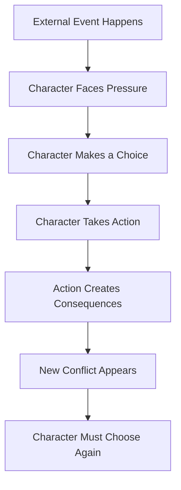
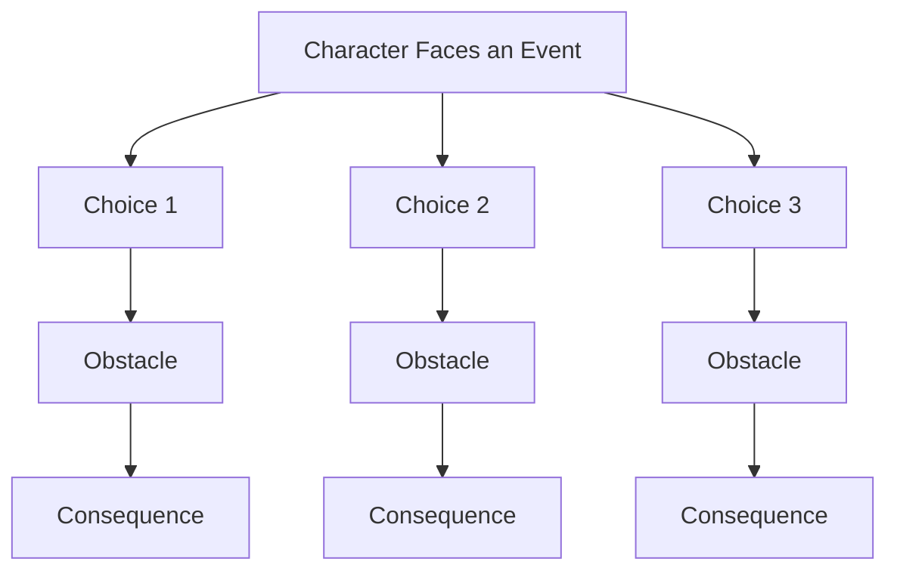
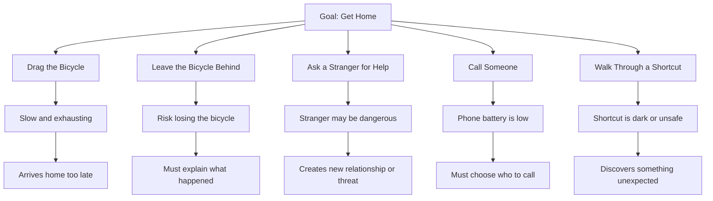

# 013 - Why Passive Characters Are Less Compelling

## Section

**01 - The Character**

## Original Lecture Title

**Vì sao nhân vật thụ động thường kém hấp dẫn**
**English:** *Why Passive Characters Are Less Compelling*

## Duration

**6:11**

---

## 1. Lesson Overview

One of the clearest rules in storytelling is:

> Do not create a passive character.

A passive character is someone who only reacts to events without making meaningful choices. They observe, wait, suffer, or drift through the plot, but they do not actively push the story forward.

This usually makes a story less compelling because readers are drawn to characters who want something, choose something, risk something, and change something.

---

## 2. Core Idea

> A character becomes interesting when they make choices that create consequences.

A story is not simply a sequence of events. A story becomes alive when a character responds to those events with intention.

Even if the character makes a bad choice, a foolish choice, or a morally wrong choice, that is still usually more interesting than no choice at all.

---

## 3. What Is a Passive Character?

A passive character is someone who:

* Watches events happen
* Waits for others to decide
* Avoids making choices
* Has no clear goal
* Does not risk anything
* Does not change the direction of the scene
* Reacts only when forced
* Could be removed from the scene without changing the outcome

If things happen around the protagonist but the protagonist does not affect anything, the character may be too passive.

---

## 4. Why Passivity Creates Boredom

Passivity often comes from a lack of motivation.

When people feel unmotivated, they may lie in bed, watch television, scroll online, avoid calls, or do nothing. These actions may be realistic, but they are not usually memorable scenes in fiction.

Readers do not need a protagonist who is always heroic or energetic. But they do need a protagonist who has some desire, pressure, conflict, or reason to act.

---

## 5. Passive vs Active Character

| Passive Character         | Active Character          |
| ------------------------- | ------------------------- |
| Only reacts to events     | Makes choices             |
| Has no clear goal         | Wants something specific  |
| Avoids risk               | Risks something           |
| Lets others decide        | Takes responsibility      |
| Observes the plot         | Changes the plot          |
| Has little inner conflict | Struggles between options |
| Creates boredom           | Creates tension           |

---

## 6. External Events Are Not Enough

Many events can happen outside the character’s control:

* It rains.
* A war breaks out.
* A crime occurs.
* A family secret is revealed.
* A UFO arrives.
* Someone dies.
* A stranger enters town.

These events may begin the story, but they are not enough by themselves.

The important question is:

> What does the character decide to do because of the event?

The protagonist does not need to control everything, but they must have some possibility of choice.

---

## 7. Story Movement Diagram



A compelling story usually moves through this repeated chain of pressure, choice, action, and consequence.

---

## 8. Three Ways to Make a Passive Character More Active

## 8.1 Put Them in Front of a Choice

A character becomes more interesting when they must decide between options.

The choice may be:

* Stay or leave
* Tell the truth or lie
* Save someone or protect themselves
* Fight or run away
* Forgive or take revenge
* Reveal a secret or keep hiding it
* Obey the family or betray expectations

The choice does not need to be easy. In fact, the harder the choice, the stronger the scene.

---

## 8.2 Give Them Needs and Desires

A passive protagonist may work at the beginning of a story, especially if the story is about someone slowly coming alive.

However, they cannot remain passive forever.

A character needs desires that push them forward.

These desires may be simple or complex:

* Hunger
* Safety
* Love
* Freedom
* Revenge
* Belonging
* Recognition
* Survival
* Forgiveness
* A way home

Desire creates movement.

---

## 8.3 Set a Clear Goal

Most human actions are connected to goals.

We study to gain skills.
We work to earn money.
We exercise to become healthier.
We apologize to repair a relationship.
We investigate because we want the truth.

The same principle applies to fictional characters.

A passive character often becomes active once you answer this question:

> What does this character want to achieve?

---

## 9. Example: *Cast Away*

In *Cast Away*, the protagonist is stranded on an island.

At first, he has almost no control over his situation. But he does not remain passive.

He must choose to adapt or die.

His needs become story engines:

* Hunger forces him to find food.
* Isolation forces him to create emotional survival strategies.
* The desire to return home keeps him moving.
* The need to stay sane gives shape to his actions.

The story works because the character keeps making choices under pressure.

---

## 10. Example: *The Shawshank Redemption*

In *The Shawshank Redemption*, prison seems like a place where people have very little control.

Yet the story remains compelling because characters respond differently to confinement.

Brooks, for example, becomes so used to prison life that he cannot adapt to the outside world. His tragedy comes from the conflict between freedom and his inability to live with it.

The setting limits the character, but the character’s response still creates emotional meaning.

---

## 11. Action vs Event

A useful distinction:

| Event                               | Action                                         |
| ----------------------------------- | ---------------------------------------------- |
| Something happens to the character. | The character does something in response.      |
| A storm begins.                     | The character chooses to travel anyway.        |
| A secret is revealed.               | The character lies to protect someone.         |
| A war breaks out.                   | The character decides whom to save.            |
| A body is discovered.               | The character hides evidence.                  |
| A lover leaves.                     | The character follows, forgives, or cuts ties. |

Events create pressure.
Actions create story.

---

## 12. Action Tree Method

When you do not know what your character should do, build an action tree.

Start with the character’s name and the event they are facing. Then list possible choices, obstacles, and consequences.



The goal is to make the character consciously choose a path.

---

## 13. Example Action Tree

Situation:
The character wants to go home, but their bicycle has a flat tire.



Even a simple situation becomes dramatic when the character must choose and face consequences.

---

## 14. How to Detect Passive Scenes

Ask these questions about each scene:

1. What does the protagonist want in this scene?
2. What choice do they make?
3. What risk do they take?
4. What changes because of their action?
5. What would happen if they were removed from the scene?
6. Does the scene still work without them?

If the scene works the same without the protagonist, the scene may need revision.

---

## 15. How to Rewrite a Passive Scene

### Passive Version

The protagonist watches two family members argue. They say nothing. The argument ends. The story moves on.

### Active Version

The protagonist interrupts the argument and lies to protect one family member. This lie causes another character to become suspicious, creating a new conflict.

The difference is choice.

The active version changes the outcome and creates consequences.

---

## 16. Practical Exercise

Find one scene in your current draft where your character merely observes events.

Then rewrite the scene so the character makes a decision that changes the outcome.

Use this template:

```markdown id="zng6pu"
## Passive Scene Revision

### 1. Original Scene

What happens in the scene?

### 2. Passive Behavior

What does the character merely observe or endure?

### 3. Character Goal

What does the character want in this moment?

### 4. Possible Choices

List at least three actions the character could take.

### 5. Chosen Action

Which action will the character choose?

### 6. Obstacle

What makes this action difficult?

### 7. Consequence

How does this choice change the scene or the plot?
```

---

## 17. Reflection Question

> In your current draft, how many scenes could be deleted without your protagonist’s choices being affected?

This question helps reveal whether your protagonist is truly driving the story.

If many scenes can be removed without changing the protagonist’s choices, the protagonist may not be active enough.

---

## 18. Application to Your Novel

To strengthen your protagonist, review each major scene and ask:

* Does the protagonist make a choice?
* Does the choice cost something?
* Does the choice reveal character?
* Does the choice create consequences?
* Does the choice make the next scene necessary?

A strong protagonist does not need to win every scene. They simply need to act, choose, fail, adapt, and continue.

---

## 19. Summary

Passive characters are less compelling because they do not create enough tension, conflict, or movement.

A compelling character should:

* Want something
* Face obstacles
* Make choices
* Take action
* Create consequences
* React to those consequences
* Change the direction of the story

Even a flawed choice is better than no choice.

The key to escaping passivity is to begin with a conscious decision. Once the character chooses, the story begins to move.

---

# Bài luyện tập

## Mục tiêu


## Đề bài


## Yêu cầu hoàn thành

- [ ] 
- [ ] 
- [ ] 

## Kết quả / lời giải


## Ghi chú
