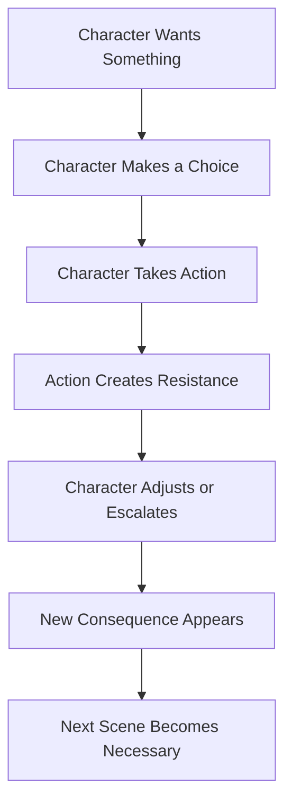
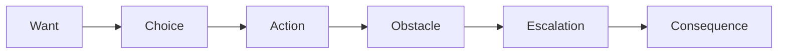

# 014 - Exercise: Building an Active Character

## Section

**01 - The Character**

## Original Lecture Title

**Bài tập về nhân vật chủ động**
**English:** *Exercise: Building an Active Character*

## Duration

**Not listed**
Writing exercise / discussion segment

---

## 1. Lesson Overview

This lesson is a practical exercise about turning a passive character into an active one.

An active character does not need to be fearless, powerful, or confident. They only need to make choices.

A character can be afraid and still active.
A character can be wrong and still active.
A character can hesitate and still be active.

The key is that they want something and take action to get it.

---

## 2. Core Idea

> Give the character a want in every scene.

Even if the want is small, it gives the character a reason to act.

A scene becomes stronger when the protagonist is not simply present, but is trying to achieve something.

---

## 3. Active Character vs Passive Character

| Passive Character                 | Active Character                   |
| --------------------------------- | ---------------------------------- |
| Waits for events to happen        | Initiates action                   |
| Only reacts                       | Makes decisions                    |
| Has no clear scene goal           | Wants something specific           |
| Avoids conflict                   | Enters conflict                    |
| Lets others drive the scene       | Changes the direction of the scene |
| Solves nothing or changes nothing | Creates consequences               |
| Watches the plot move             | Pushes the plot forward            |

---

## 4. What Makes a Character Active?

A character becomes active when they:

* Want something
* Choose a course of action
* Take a risk
* Affect the scene
* Create consequences
* Respond to new problems
* Keep pursuing a goal despite obstacles

Activity is not about confidence.
Activity is about choice.

---

## 5. Scene-Level Character Activity

Every scene should answer this question:

> What does the character actively want right now?

The answer does not always need to be dramatic.

The character may want to:

* Hide the truth
* Avoid a conversation
* Get someone’s attention
* Escape a room
* Protect a friend
* Find evidence
* Win an argument
* Impress someone
* Keep a secret
* Discover who is lying
* Leave before being noticed
* Force another character to confess

Small wants can still create strong scenes if the character acts on them.

---

## 6. Active Character Scene Flow



A scene becomes more dynamic when the protagonist’s choice creates the next problem.

---

## 7. Important Principle

> Let the character’s choices create new problems, not just solve old ones.

A weak scene ends when a problem disappears.

A stronger scene ends when the character’s action creates a new complication.

For example:

| Scene Problem                   | Passive Response     | Active Response                  | New Problem                            |
| ------------------------------- | -------------------- | -------------------------------- | -------------------------------------- |
| Someone accuses the protagonist | They stay silent     | They lie to protect themselves   | Someone else now has proof they lied   |
| A family argument begins        | They watch           | They interrupt and take sides    | One family member now feels betrayed   |
| A clue appears                  | They notice it       | They steal it before others see  | They are now suspected                 |
| A lover asks for the truth      | They avoid answering | They confess only half the truth | The hidden half becomes more dangerous |
| A villain threatens them        | They freeze          | They make a desperate bargain    | The bargain costs them later           |

Active characters make the story more complicated.

---

## 8. Active Does Not Mean Perfect

An active character can still be:

* Afraid
* Confused
* Reluctant
* Morally wrong
* Inexperienced
* Emotionally wounded
* Unprepared
* Manipulated
* Selfish
* Desperate

The important thing is that they still choose.

A wrong choice is often more interesting than no choice.

---

## 9. Beat Sheet Transformation

The goal of this exercise is to take a passive scene and rewrite the beat sheet so the protagonist initiates each major turn.

### Passive Beat Sheet Example

```markdown id="mfbaqa"
1. The protagonist enters the room.
2. Two family members argue.
3. A secret is mentioned.
4. The protagonist listens silently.
5. Another character storms out.
6. The scene ends.
```

This version is weak because the protagonist does not affect the scene.

---

### Active Beat Sheet Example

```markdown id="hq3pwo"
1. The protagonist enters the room because they want to retrieve a hidden letter.
2. Two family members begin arguing before the protagonist can reach it.
3. The protagonist interrupts the argument to distract them.
4. One family member becomes suspicious and asks why they are really there.
5. The protagonist lies and accuses someone else.
6. The accusation causes a new conflict.
7. The protagonist gets the letter, but now another character knows they are hiding something.
```

This version is stronger because the protagonist has a goal, makes choices, and creates consequences.

---

## 10. Action Chain Diagram



Use this chain to test whether your scene is active.

If one part is missing, the scene may feel passive.

---

## 11. Practical Exercise

Take one passive scene from your outline.

Rewrite the beat sheet so the protagonist initiates each turn.

Focus on these questions:

1. What does the protagonist want at the beginning of the scene?
2. What action do they take first?
3. How does another character resist them?
4. What choice does the protagonist make next?
5. What problem does that choice create?
6. How does the scene end differently because of the protagonist’s action?

---

## 12. Exercise Template

```markdown id="qcjdyq"
# Active Character Scene Rewrite

## 1. Original Passive Scene

Describe the scene as it currently exists.

## 2. Passive Problem

Where is the protagonist only watching, waiting, or reacting?

## 3. Scene Want

What does the protagonist actively want at the start of the scene?

## 4. First Action

What does the protagonist do to pursue that want?

## 5. Resistance

Who or what gets in the way?

## 6. Second Choice

How does the protagonist respond to the resistance?

## 7. New Problem

What new complication is created by the protagonist’s choice?

## 8. Changed Outcome

How is the scene different because the protagonist acted?

## 9. Next Scene Hook

What consequence now pushes the story forward?
```

---

## 13. Study Exercise

Take one of your favorite books and study the protagonist.

Ask:

* Are they active or passive?
* What do they want in each major scene?
* When do they make important choices?
* What consequences come from those choices?
* Do their actions create new problems?
* Would the story still happen without them?

This helps you understand how strong protagonists drive a story.

---

## 14. Reflection Question

> What does your character actively want at the start of this scene, and what do they do to get it?

This question should be asked for every important scene.

If the answer is unclear, the scene may need revision.

---

## 15. Quick Diagnostic Checklist

Use this checklist to test whether your character is active:

```markdown id="ixqkxx"
## Active Character Checklist

- [ ] The character wants something in this scene.
- [ ] The character makes at least one clear choice.
- [ ] The character takes action instead of only observing.
- [ ] The action meets resistance.
- [ ] The character responds to the resistance.
- [ ] Their choice changes the scene.
- [ ] Their choice creates a consequence.
- [ ] The consequence pushes the next scene forward.
```

If most boxes are unchecked, the character may be too passive in that scene.

---

## 16. Summary

An active character is compelling because they make choices that affect the story.

They do not need to be brave or correct. They only need to want something and act on that desire.

To build an active character:

* Give them a want in every scene
* Let them initiate action
* Put obstacles in their way
* Force them to choose
* Let their choices create consequences
* Allow those consequences to create new problems

A story becomes stronger when the protagonist does not merely experience the plot, but helps cause it.

---

# Bài luyện tập

## Mục tiêu


## Đề bài


## Yêu cầu hoàn thành

- [ ] 
- [ ] 
- [ ] 

## Kết quả / lời giải


## Ghi chú
