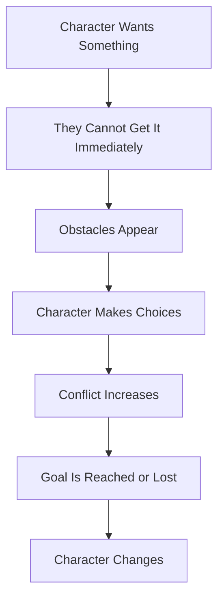
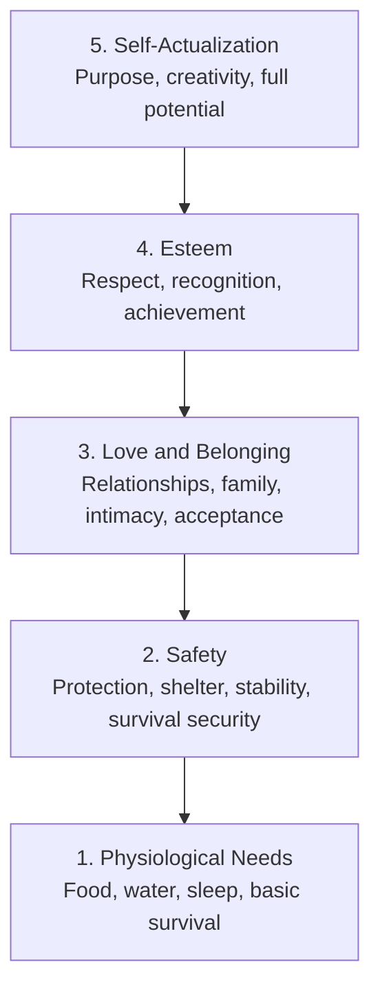
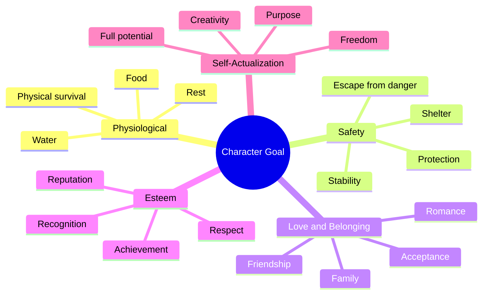

# 015 - The Character's Goal

## Section

**01 - The Character**

## Original Lecture Title

**Mục tiêu của nhân vật**
**English:** *The Character's Goal*

## Duration

**5:44**

---

## 1. Lesson Overview

A character’s goal is one of the strongest forces that moves a story forward.

In fiction, as in real life, people act because they want something. A strong story often begins with a feeling of dissatisfaction: the character wants something, but cannot get it immediately.

That gap between desire and difficulty becomes the lit fuse of the plot.

---

## 2. Core Idea

> A clear goal gives the reader something to follow, understand, and root for.

A character becomes more compelling when the reader knows:

* What they want
* Why they want it
* What prevents them from getting it
* What they are willing to risk for it
* How they will change if they succeed or fail

A vague desire creates weak tension.
A concrete goal creates visible story movement.

---

## 3. Why Goals Matter

A strong character goal helps the story because it:

* Gives the protagonist direction
* Creates conflict
* Makes scenes easier to structure
* Helps the reader understand what is at stake
* Gives the plot a clear shape
* Makes success or failure visible on the page

Without a goal, the character may become passive. With a goal, the character has a reason to choose, act, struggle, and change.

---

## 4. The Basic Story Fuse



A story becomes engaging when the goal is clear but difficult to reach.

---

## 5. Three Rules for a Strong Character Goal

## 5.1 The Goal Must Be Understandable

The reader should quickly understand what the protagonist is fighting for.

After the first few pages or the first chapter, the reader should be able to answer:

> What does this character want?

The goal does not need to be simple emotionally, but it should be clear enough for the reader to track.

---

## 5.2 One Story, One Main Goal

A novel may contain many smaller desires, but the protagonist should usually have one central goal.

This creates two advantages:

1. The plot becomes more focused.
2. The theme becomes stronger and less scattered.

A single main goal gives the story a clear spine.

---

## 5.3 One Goal, But Hard to Reach

The goal should not be easy.

The writer should gradually add:

* Conflicts
* Obstacles
* Delays
* Rivals
* Mistakes
* Moral dilemmas
* Emotional pressure
* External danger

The reader should not feel certain that the protagonist will succeed.

---

## 6. External Goal and Inner Need

A strong character goal often has two layers.

| Layer             | Meaning                              | Example                                                       |
| ----------------- | ------------------------------------ | ------------------------------------------------------------- |
| **External Goal** | What the character visibly wants     | Win the case, survive the island, get the job, save the house |
| **Inner Need**    | What the character emotionally needs | Self-worth, belonging, forgiveness, freedom, purpose          |

The external goal gives the plot shape.
The inner need gives the story emotional depth.

---

## 7. Maslow's Pyramid of Needs

Maslow’s hierarchy of needs can help writers design character goals.

A character’s goal usually belongs to one of these five levels.



The lower levels are closer to physical survival.
The higher levels are connected to identity, meaning, and fulfillment.

---

## 8. Level 1: Physiological Needs

These are the most basic survival needs.

A character may want:

* Food
* Water
* Sleep
* Shelter
* Physical survival
* Escape from hunger or exhaustion

### Example: *Gone with the Wind*

Scarlett O’Hara’s vow to never be hungry again comes from a deep survival need. Her goal of preserving her home and land is connected to the trauma of war and hunger.

At this level, the goal is urgent because failure may mean death or physical collapse.

---

## 9. Level 2: Safety Needs

Once basic survival is secured, the character may seek protection and stability.

A character may want:

* Safety
* Shelter
* Protection from danger
* Security for loved ones
* Escape from violence
* A stable home
* Control over their environment

### Example: *The Maze Runner*

Thomas and the other boys build shelter in the Glade because they must protect themselves from the deadly Grievers in the maze.

The goal is not just comfort. It is survival through security.

---

## 10. Level 3: Love and Belonging

After physical survival and safety, the character may seek emotional connection.

A character may want:

* Love
* Friendship
* Family
* Acceptance
* Belonging
* Reconciliation
* Emotional intimacy
* A place in a community

### Example: *Wuthering Heights*

Heathcliff’s revenge is driven by a burning desire for love and belonging. His destructive actions come from the pain of rejection and emotional exclusion.

At this level, the goal is emotional, but it can still create intense conflict.

---

## 11. Level 4: Esteem, Respect, and Recognition

At this level, the character wants to be valued.

A character may want:

* Respect
* Recognition
* Success
* Status
* Achievement
* A good reputation
* Proof of their worth
* To be taken seriously

This goal may appear on the surface as:

* Getting a high grade
* Winning a competition
* Becoming famous
* Building a career
* Proving someone wrong
* Receiving an award

But underneath, the character may be seeking dignity and validation.

---

## 12. Level 5: Self-Actualization

At the highest level, the character wants to become fully themselves.

A character may want:

* Purpose
* Meaning
* Creativity
* Freedom
* Discovery
* Personal truth
* Spiritual fulfillment
* To reach their full potential

### Example: *My Man Godfrey*

The protagonist abandons wealth and social standing because he wants to find a more meaningful purpose in life.

At this level, the goal is not just to survive or be admired. It is to live truthfully and fully.

---

## 13. Maslow Goal Map for Fiction



---

## 14. Goal Design Questions

To create a strong goal, answer these questions:

1. What does the protagonist want?
2. Can the reader understand it quickly?
3. Can the goal visibly succeed or fail?
4. Why can’t the protagonist get it immediately?
5. What is the biggest obstacle?
6. What will the protagonist lose if they fail?
7. How will the protagonist change if they succeed?
8. What deeper emotional need is hidden beneath the goal?

---

## 15. Weak Goal vs Strong Goal

| Weak Goal                 | Strong Goal                                                                |
| ------------------------- | -------------------------------------------------------------------------- |
| “She wants to be happy.”  | “She wants to win custody of her younger brother.”                         |
| “He wants a better life.” | “He wants to escape the island before the next storm.”                     |
| “She wants love.”         | “She wants to stop her fiancé from marrying someone else.”                 |
| “He wants success.”       | “He wants to win the final scholarship spot.”                              |
| “She wants freedom.”      | “She wants to expose the family crime before she is forced into marriage.” |

A strong goal is specific enough that the reader can see whether the character succeeds or fails.

---

## 16. Practical Exercise

State your protagonist’s overall novel goal in one sentence.

The sentence should be clear enough that a stranger could repeat it back to you.

Use this structure:

```markdown id="uiizbg"
My protagonist wants to ______________________, but ______________________ prevents them from getting it.
```

### Example

```markdown id="jblz95"
My protagonist wants to prove her father was murdered, but her own family is hiding the truth and trying to silence her.
```

---

## 17. Full Goal Template

```markdown id="bgeoyn"
# Character Goal Template

## 1. Protagonist

Who is the character?

## 2. External Goal

What do they visibly want to achieve?

## 3. Maslow Level

Which need does this goal belong to?

- Physiological survival
- Safety
- Love and belonging
- Respect and recognition
- Self-actualization

## 4. Inner Need

What deeper emotional need is hidden beneath the goal?

## 5. Main Obstacle

What prevents the character from reaching the goal immediately?

## 6. Stakes

What will the character lose if they fail?

## 7. Willingness to Risk

Why are they willing to do almost anything to achieve this?

## 8. Supporter

Who supports the protagonist, and why?

## 9. Transformation

How will the protagonist change if they reach the goal?
```

---

## 18. Reflection Question

> Will the reader know, by the end of chapter one, exactly what your character is trying to achieve?

This does not mean every secret must be revealed early.

But the reader should have enough clarity to understand the direction of the story.

A clear goal gives the reader a reason to keep reading.

---

## 19. Application to Your Novel

To apply this lesson, look at your protagonist and ask:

* What is their one main goal?
* Is it concrete?
* Is it visible on the page?
* Can it succeed or fail?
* Does it connect to the theme?
* Does it create conflict?
* Does it force the protagonist to act?
* Does it hide a deeper emotional need?

If the goal is too vague, make it more specific.

If the goal is too easy, add obstacles.

If the goal feels shallow, connect it to an inner need.

---

## 20. Summary

A character’s goal is the engine of the story.

A strong goal should be:

* Understandable
* Specific
* Difficult to reach
* Connected to conflict
* Visible on the page
* Emotionally meaningful
* Linked to a deeper need

The protagonist’s external goal gives the plot direction. Their inner need gives the story emotional power.

When the reader knows what the character wants and understands why they cannot easily get it, the story begins to move.
