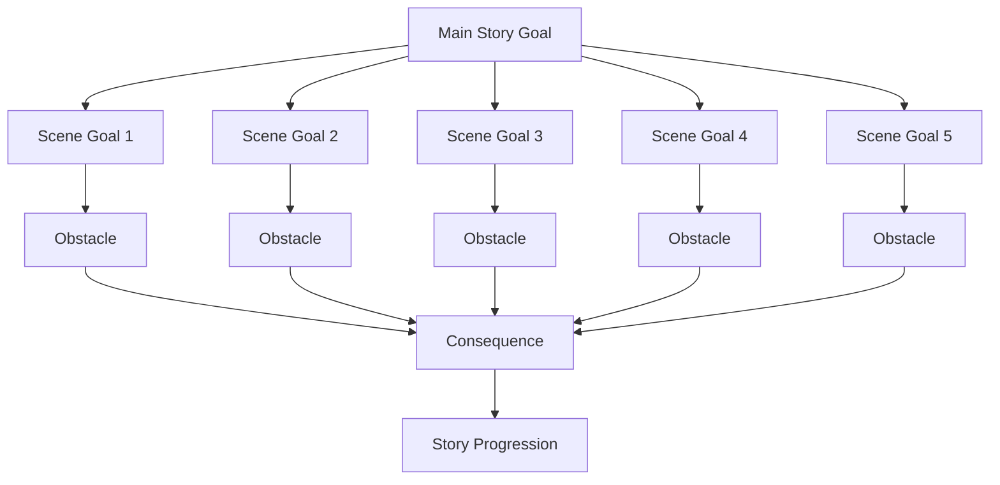
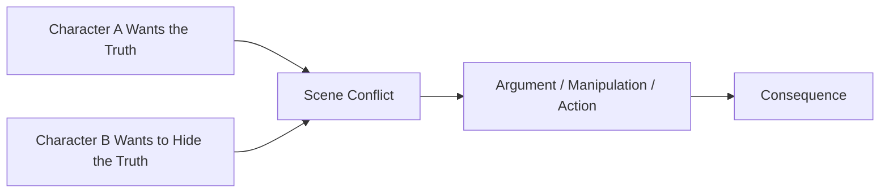
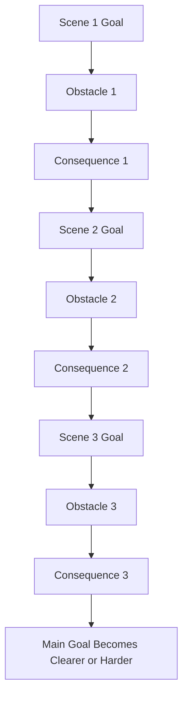

# 016 - Exercise: Defining the Goal

## Section

**01 - The Character**

## Original Lecture Title

**Bài tập về mục tiêu**
**English:** *Exercise: Defining the Goal*

## Duration

**Not listed**
Writing exercise / discussion segment

---

## 1. Lesson Overview

This lesson is a practical exercise about defining a character’s goal clearly.

A large story goal becomes stronger when it is broken down into smaller scene-level goals. Each scene should contain a specific thing the character wants, an obstacle blocking them, and a consequence if they fail.

A goal is not only something the character wants at the end of the story. It should also shape what they do from scene to scene.

---

## 2. Core Idea

> A big goal gives the story direction. Scene-level goals create movement.

The protagonist may have one main goal for the whole novel, but that goal should be supported by smaller goals in individual scenes.

For example:

| Big Goal                      | Scene-Level Goal                             |
| ----------------------------- | -------------------------------------------- |
| Prove the father was murdered | Break into the study to find a hidden letter |
| Win a scholarship             | Convince a teacher to write a recommendation |
| Escape the family estate      | Steal the key before dinner                  |
| Find a lost sibling           | Question the only witness                    |
| Protect a secret              | Stop another character from opening a box    |

The big goal gives the story a spine.
The smaller goals make the story move.

---

## 3. Goal Structure



Each scene goal should either move the character closer to the main goal or make the main goal harder to reach.

---

## 4. Why Scene Goals Matter

Scene-level goals help avoid passive storytelling.

A scene becomes stronger when the reader knows:

* What the character wants
* What blocks them
* What they do about it
* What happens if they fail
* How the scene changes the larger story

Without a scene goal, the scene may feel decorative rather than necessary.

---

## 5. Scene Goal Formula

Use this simple structure:

```markdown id="pje4qd"
In this scene, the character wants to ______________________,
but ______________________ gets in the way.
If they fail, ______________________ will happen.
```

### Example

```markdown id="old91z"
In this scene, the protagonist wants to steal the family will,
but her stepmother locks the study and invites a lawyer to dinner.
If she fails, the inheritance will be transferred before she can expose the truth.
```

---

## 6. Goals Need Stakes

A goal becomes dramatic when failure matters.

Ask:

> What happens if the character fails here?

The stakes may be:

* Emotional
* Social
* Physical
* Financial
* Moral
* Romantic
* Familial
* Professional
* Existential

A scene goal without stakes often feels weak because the reader has no reason to worry.

---

## 7. Conflict Between Goals

Scenes become naturally tense when two characters want different things.



Conflict does not always require violence. It can come from two incompatible goals.

---

## 8. Example of Conflicting Scene Goals

| Character   | Scene Goal                           | Conflict                                  |
| ----------- | ------------------------------------ | ----------------------------------------- |
| Protagonist | Wants to question the witness        | The witness wants to avoid involvement    |
| Mother      | Wants to keep the family image clean | The daughter wants to expose the scandal  |
| Detective   | Wants the truth                      | The family wants silence                  |
| Antagonist  | Wants to appear innocent             | The protagonist wants to catch them lying |
| Lover       | Wants honesty                        | The protagonist wants to protect a secret |

When goals collide, tension appears automatically.

---

## 9. Practical Exercise

List the scene-by-scene goals for your first five scenes.

For each scene, identify:

1. The protagonist’s goal
2. The obstacle blocking it
3. The stakes if they fail
4. The choice they make
5. The consequence that follows

---

## 10. First Five Scenes Goal Table

```markdown id="v2gc2w"
| Scene | Character Goal | Obstacle | Stakes | Choice | Consequence |
|---|---|---|---|---|---|
| Scene 1 |  |  |  |  |  |
| Scene 2 |  |  |  |  |  |
| Scene 3 |  |  |  |  |  |
| Scene 4 |  |  |  |  |  |
| Scene 5 |  |  |  |  |  |
```

---

## 11. Goal Progression Diagram



A strong plot often works like a chain.
Each scene goal creates a consequence that leads into the next scene.

---

## 12. Assignment: The Goal

### Assignment Time

**600 minutes**

### Assignment Prompt

Think about an old goal from your own life and write the story of how you reached it.

Write it in a personal and narrative way.

Your story should include:

* The obstacles
* Your limits
* Your strengths
* Your relationships

For each item, think about the impact it had on your journey toward the goal.

Do not forget to ask:

* What were the stakes?
* What did that goal mean to you?

---

## 13. Personal Goal Story Structure

Use this structure to write the assignment:

```markdown id="tbl0pg"
# My Old Goal

## 1. The Goal

What did I want to achieve?

## 2. Why It Mattered

What did this goal mean to me?

## 3. The Stakes

What would I lose or miss if I failed?

## 4. The Obstacles

What external problems blocked me?

## 5. My Limits

What personal weaknesses, fears, or circumstances made it difficult?

## 6. My Strengths

What qualities helped me continue?

## 7. My Relationships

Who helped, opposed, ignored, or influenced me?

## 8. The Turning Point

What moment changed the situation?

## 9. The Result

Did I achieve the goal? How?

## 10. Reflection

How did reaching this goal change me?
```

---

## 14. Instructor Note

There is no standard solution for this assignment.

Each answer will be personal because every goal has a different emotional meaning, different obstacles, and different stakes.

The purpose of the exercise is not to produce the “correct” answer. The purpose is to understand how goals work inside a real human story.

---

## 15. Example Analysis: Personal Freedom Goal

One student example describes a person who wanted control over their own life.

### Goal

To move out and gain freedom.

### Obstacles

* Living in the parents’ house
* Being misunderstood by the father
* Needing money
* Needing a practical plan

### Limits

* Limited independence
* Family judgment
* Emotional pressure

### Strengths

* Patience
* Planning
* Ability to save money
* Determination
* Emotional detachment from unfair judgment

### Relationships

* The father creates pressure and conflict.
* Friends become part of the escape plan.
* The protagonist persuades two friends to move together.

### Stakes

If the protagonist fails, they remain trapped in a life where they have little control.

### Meaning

The goal is not only about moving house. It is about freedom, adulthood, and self-ownership.

---

## 16. Example Analysis: Identity Goal

Another student example describes a character who wants to find a coherent identity.

### Goal

To become at peace with who she is.

### Obstacles

* Hallucinations
* Delusions
* Fragmented identity
* Confusion between reality and imagination

### Limits

* Her own mind
* Lack of awareness
* Psychological instability

### Strengths

* Introspection
* Partial self-awareness
* Desire to understand herself

### Relationships

* A love relationship with Jane
* Fleeting relationships with hallucinated strangers

### Stakes

If she fails, she may never understand who she truly is.

### Meaning

The goal is not simply self-discovery. It is survival of identity.

---

## 17. Reflection Question

> Which of these scene goals could be cut without weakening the larger story goal?

This question helps identify unnecessary scenes.

If a scene goal does not affect the larger story goal, the scene may need to be revised or removed.

A useful scene should usually do at least one of the following:

* Move the protagonist closer to the goal
* Move the protagonist farther from the goal
* Reveal a new obstacle
* Change the stakes
* Force a meaningful choice
* Create a consequence
* Reveal character through action

---

## 18. Scene Goal Diagnostic Checklist

```markdown id="c1z2p8"
## Scene Goal Checklist

- [ ] The character wants something specific in this scene.
- [ ] The goal is connected to the larger story goal.
- [ ] There is an obstacle blocking the goal.
- [ ] Failure has consequences.
- [ ] Another character has a conflicting goal.
- [ ] The protagonist makes a choice.
- [ ] The choice changes the scene.
- [ ] The scene creates a consequence for the next scene.
```

---

## 19. Application to Fiction Writing

When designing your protagonist’s goal, think on two levels:

### 1. Novel-Level Goal

This is the main thing the protagonist wants across the whole story.

Example:

```markdown id="u72q0j"
The protagonist wants to expose the truth behind her sister’s death.
```

### 2. Scene-Level Goal

This is the smaller thing the protagonist wants inside one scene.

Example:

```markdown id="s5hov8"
In this scene, the protagonist wants to steal the coroner’s report before her uncle destroys it.
```

The scene-level goal should serve the novel-level goal.

---

## 20. Summary

A strong goal is not only a final destination. It should shape every important scene.

To define goals effectively:

* Break the main goal into smaller scene goals
* Give each scene goal an obstacle
* Make failure matter
* Create tension through conflicting goals
* Let each choice create consequences
* Remove or revise goals that do not support the larger story

The clearer the goal, the easier it is for the reader to follow the character’s journey and care about the outcome.
