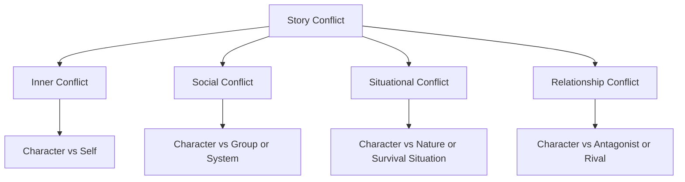
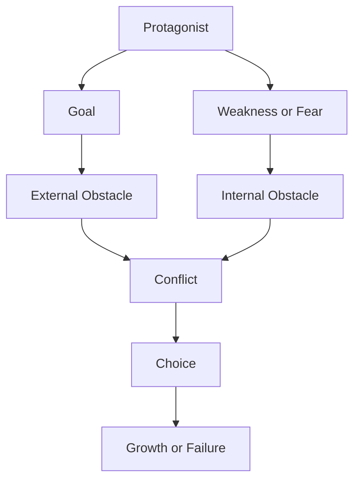

# 017 - Obstacles in the Story

## Section

**01 - The Character**

## Original Lecture Title

**Obstacles in the Story**

## Duration

**7:10**

---

## 1. Lesson Overview

Once a character has a clear goal, the story naturally creates its opposite force: **the obstacle**.

An obstacle is anything that stands between the protagonist and their goal. It can be external, such as a person, distance, poverty, danger, or society. It can also be internal, such as fear, guilt, insecurity, false beliefs, or emotional weakness.

A strong obstacle does more than delay the character. It forces the character to make choices, change strategy, confront weakness, and grow.

---

## 2. Core Idea

> **A goal creates direction.
> An obstacle creates conflict.
> Conflict creates story.**

Without obstacles, the protagonist reaches the goal too easily.
Without meaningful obstacles, the story may feel random, passive, or emotionally flat.

---

## 3. What Is an Obstacle?

An obstacle can be:

| Type             | Description                             | Example                                         |
| ---------------- | --------------------------------------- | ----------------------------------------------- |
| **Person**       | Someone actively blocks the protagonist | An antagonist, rival, villain, authority figure |
| **Environment**  | Nature or setting becomes dangerous     | Ocean, island, storm, wilderness                |
| **Circumstance** | Life conditions prevent progress        | Poverty, eviction, debt, lack of time           |
| **Emotion**      | Inner fear or belief blocks action      | Fear, shame, guilt, insecurity                  |
| **Society**      | A system or group opposes the character | Prison, government, family, corporation         |

---

## 4. Example: *Finding Nemo*

In *Finding Nemo*, Marlin’s obstacle is not only the ocean.

His deeper obstacle is **his fear of the ocean**.

Because of this fear, he tries to keep Nemo close and safe inside the coral reef. But when Nemo is lost, Marlin must enter the dangerous ocean and face the very thing he fears most.

### Why This Works

Marlin’s obstacle is connected to his weakness.

He does not simply need to travel farther.
He needs to become braver, more trusting, and more open to risk.

---

## 5. Example: *The Pursuit of Happyness*

In *The Pursuit of Happyness*, Chris Gardner does not face monsters, aliens, or a traditional villain.

Instead, his obstacles come from ordinary life:

* He struggles to sell bone-density scanners.
* His wife leaves him.
* He cannot pay rent.
* His car is impounded.
* He is evicted.
* He and his son are forced into unstable living conditions.

The conflict is powerful because everyday life itself becomes the pressure against him.

### Why This Works

The story shows that obstacles do not need to be spectacular to be dramatic.

Sometimes, ordinary survival can create deep emotional tension.

---

## 6. Weak Obstacle vs Strong Obstacle

Not every difficulty is automatically a strong story obstacle.

For example, imagine this story:

1. A man is shipwrecked on an island.
2. He needs to find water.
3. Monsters appear.
4. A tropical storm arrives.
5. He survives everything.

At first, this seems full of obstacles. But the problem is that these obstacles feel random. They would happen to anyone on the island.

They are not deeply connected to the protagonist’s personality, weakness, fear, or inner arc.

---

## 7. The Problem with Random Obstacles

Random obstacles can create action, but they may not create meaningful conflict.

A good obstacle should do at least one of these things:

* Directly block the protagonist’s goal.
* Attack the protagonist’s weakness.
* Force a difficult choice.
* Reveal character.
* Change the protagonist’s strategy.
* Increase emotional pressure.
* Push the character toward transformation.

---

## 8. Three Questions for Testing an Obstacle

Use these questions when designing conflict:

### 1. Is the obstacle stopping the protagonist from reaching the goal?

The obstacle must be connected to the objective.

If the protagonist wants to save someone, the obstacle should delay, prevent, or complicate that rescue.

### 2. Does the obstacle force the protagonist to make a new choice?

A weak obstacle only demands more effort.

A strong obstacle demands a new decision, sacrifice, risk, or change in perspective.

### 3. Is the obstacle predictable or surprising?

If the reader expects exactly what happens, the scene may feel flat.

However, the surprise must still be logical.
Unexpected events should remain consistent with the setting, plot, and characters.

---

## 9. Four Main Types of Conflict

The lesson introduces four major categories of conflict.

---

## 10. Inner Conflict

### Character vs Self

Inner conflict comes from the protagonist’s own:

* Fear
* Insecurity
* Flaw
* False belief
* Shame
* Guilt
* Desire
* Emotional wound

This conflict creates suffering inside the character and prevents them from reaching the goal.

### Example: *Anna Karenina*

Anna is torn apart by her love for Vronsky and her own self-condemnation. This inner conflict does not lead her toward growth. Instead, it pushes her toward tragedy.

This is part of what gives the novel its emotional power.

---

## 11. Social Conflict

### Character vs Group or System

Social conflict happens when the protagonist struggles against a larger force, such as:

* A government
* A prison
* A family
* An army
* A corporation
* A nation
* A social class
* A justice system

This type of conflict often explores themes such as:

* Justice
* Freedom
* Revenge
* Oppression
* Power
* Corruption

### Example: *The Shawshank Redemption*

Andy Dufresne is accused of murder but claims to be innocent. His conflict is not only with one person. It is also with the prison system represented by Warden Norton.

---

## 12. Situational Conflict

### Character vs Situation, Nature, or Survival

Situational conflict appears in stories about survival or danger caused by external circumstances.

Common examples include:

* Earthquakes
* Tsunamis
* Hurricanes
* Shipwrecks
* Wild animals
* Dinosaurs
* Sharks
* Isolation
* Harsh landscapes

### Examples

* *Jurassic Park*
* *Cast Away*
* *Jaws*

In these stories, the environment or situation itself becomes the antagonist.

---

## 13. Relationship Conflict

### Character vs Antagonist or Rival

Relationship conflict happens when another character personally blocks the protagonist.

The antagonist usually acts in one of two ways:

1. They want the same goal as the protagonist and are more likely to get it.
2. They do not want the protagonist to reach the goal.

### Examples

| Story                   | Conflict                                            |
| ----------------------- | --------------------------------------------------- |
| *Titanic*               | Jack and Cal both desire Rose                       |
| *The Lord of the Rings* | Sauron tries to stop Frodo from destroying the Ring |

In strong relationship conflict, the antagonist often represents the protagonist’s greatest fear in human form.

---

## 14. Obstacle Escalation

Good obstacles should become more difficult as the story progresses.

The ending feels satisfying when the final obstacle is the hardest and most meaningful one.

---

## 15. Practical Story Design Model

When designing obstacles, connect them to the protagonist’s goal and weakness.

A strong scene often combines both external and internal obstacles.

For example:

* External obstacle: The character must cross the ocean.
* Internal obstacle: The character is terrified of the ocean.

Together, they create meaningful conflict.

---

## 16. Practical Exercise

Map three obstacles of increasing difficulty between your protagonist and their goal.

| Stage      | Goal                                  | Obstacle                           | Type of Conflict                            | What It Demands from the Character            |
| ---------- | ------------------------------------- | ---------------------------------- | ------------------------------------------- | --------------------------------------------- |
| Obstacle 1 | What does the protagonist want first? | What blocks them?                  | Inner / Social / Situational / Relationship | What new effort is required?                  |
| Obstacle 2 | What is the next step?                | What makes it harder?              | Inner / Social / Situational / Relationship | What new choice is required?                  |
| Obstacle 3 | What is the final major barrier?      | What almost stops them completely? | Inner / Social / Situational / Relationship | What must they sacrifice, learn, or confront? |

---

## 17. Scene Revision Exercise

Choose one conflict scene you have written recently.

Then ask:

1. What is the protagonist trying to achieve in this scene?
2. What exactly stops them?
3. Is the obstacle connected to the protagonist’s goal?
4. Is the obstacle connected to the protagonist’s weakness?
5. Does the obstacle force a new choice?
6. Is the scene too predictable?
7. What unexpected but logical complication could increase the intensity?

---

## 18. Reflection Questions

### Main Reflection

Does each obstacle demand something new from your character, or just more of the same effort?

### Additional Questions

1. What is the protagonist’s main goal?
2. What is the strongest force preventing that goal?
3. Which obstacle attacks the protagonist emotionally?
4. Which obstacle changes the protagonist’s strategy?
5. Which obstacle raises the stakes the most?
6. Does the final obstacle feel stronger than the first one?

---

## 19. Key Takeaways

* A story goal naturally creates the need for obstacles.
* Obstacles can be external or internal.
* The best obstacles are connected to the protagonist’s goal and weakness.
* Random obstacles may create action, but not necessarily meaningful conflict.
* Strong conflict forces choices, growth, sacrifice, or transformation.
* Obstacles should escalate so the story does not feel anticlimactic.
* Unexpected complications should still be logical and consistent.

---

## 20. Summary

This lesson explains how obstacles create conflict in a story. An obstacle is anything that blocks the protagonist from reaching their goal, but the strongest obstacles are not random difficulties. They are connected to the protagonist’s desire, fear, weakness, or emotional wound.

Good obstacles force the character to change strategy, make difficult choices, and confront something personal. By escalating obstacles and linking them to the character’s inner arc, the writer can create a story that feels tense, meaningful, and emotionally satisfying.
