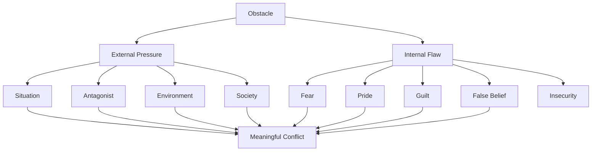
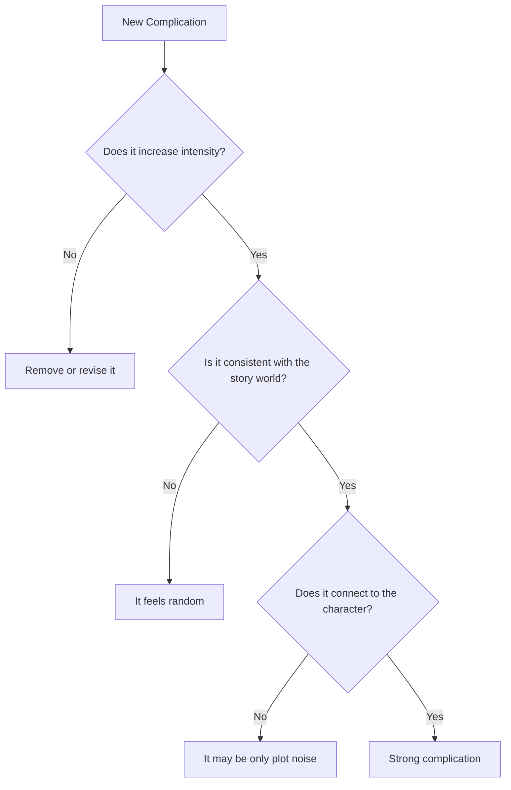

# 018 - Discussion / Exercise: Obstacles

## Section

**01 - The Character**

## Original Lecture Title

**Discussion / Exercise: Obstacles**

## Duration

**Not listed**
Writing exercise / discussion segment

---

## 1. Lesson Overview

This lesson is a practical discussion and exercise about **obstacles** in fiction.

The main goal is to check whether the conflicts in your story are truly stopping the protagonist from achieving their goal, or whether they are only decorative problems added to the plot.

A strong obstacle should not simply exist because the story needs trouble. It should be connected to the protagonist’s goal, weakness, flaw, fear, or personal limitation.

---

## 2. Core Idea

> **The best obstacles are not just things that happen to the character.
> They are problems that become harder because of who the character is.**

A good obstacle should feel specific to this protagonist.

If any other character could face the same obstacle in exactly the same way, the conflict may be too generic.

---

## 3. Plot-Driven Obstacles vs Character-Driven Obstacles

There are two important kinds of obstacles:

| Type                          | Meaning                                        | Weak Version            | Strong Version                                                                         |
| ----------------------------- | ---------------------------------------------- | ----------------------- | -------------------------------------------------------------------------------------- |
| **Plot-driven obstacle**      | A problem created by external events           | A storm blocks the road | A storm blocks the road while the character must choose whether to risk someone’s life |
| **Character-driven obstacle** | A problem made worse by the protagonist’s flaw | The character is late   | The character is late because their pride made them refuse help                        |

---

## 4. What Makes an Obstacle Satisfying?

A satisfying obstacle usually does three things:

1. **It blocks the protagonist’s goal.**
2. **It becomes harder because of the protagonist’s flaw.**
3. **It cannot be removed too easily.**

If an obstacle disappears too quickly, the story loses tension.

The reader may feel that the conflict was not serious enough, or that the writer created suspense without paying it off.

---

## 5. Main Question of the Exercise

When reviewing your story, ask:

> **Is this obstacle difficult because of the plot, or because of the protagonist’s own nature?**

The strongest answer is often both.

---

## 6. Example of a Weak Obstacle

### Situation

The protagonist wants to confess the truth to their family.

### Obstacle

It starts raining, so they arrive late.

### Problem

The rain is external, but it does not reveal anything meaningful about the protagonist.

It could happen to anyone.

---

## 7. Turning It into a Stronger Obstacle

### Situation

The protagonist wants to confess the truth to their family.

### Stronger Obstacle

It starts raining, but the real problem is that the protagonist refuses to call for help because they are too proud to admit weakness.

### Why It Works Better

Now the obstacle is not only bad weather.

The conflict is connected to the character’s flaw: **pride**.

The rain creates pressure, but pride makes the situation worse.

---

## 8. Obstacle Design Formula

Use this formula when improving conflict:

### Simple Formula

> **Goal + External Problem + Personal Flaw = Strong Obstacle**

---

## 9. Practical Exercise

Pick your protagonist’s biggest external obstacle.

Then rewrite it so that their personal flaw makes it harder to overcome.

| Step | Question                                         | Your Answer |
| ---- | ------------------------------------------------ | ----------- |
| 1    | What does the protagonist want?                  |             |
| 2    | What external obstacle blocks them?              |             |
| 3    | What personal flaw makes this obstacle worse?    |             |
| 4    | What choice does the character now have to make? |             |
| 5    | What happens if they fail?                       |             |
| 6    | How does this obstacle increase tension?         |             |

---

## 10. Assignment Instructions

Take one of your recent novels or short stories.

Read the first part and identify the main conflict that the protagonist has to deal with.

Then complete the following tasks:

### 1. Check the Main Conflict

Make sure the conflict is truly an obstacle stopping the protagonist from achieving their goal.

Ask:

* What does the protagonist want?
* What exactly blocks them?
* Would the protagonist reach the goal if this obstacle disappeared?

---

### 2. Examine Reader Expectation

Take a step back and examine what you have written.

Ask:

* Is this exactly what the reader would expect to happen?
* If yes, is that good or bad?
* If no, is the surprise logical or forced?

Predictability is not always bad.

Sometimes the reader expects something because the story has built toward it properly. But if everything happens exactly as expected, the scene may lack intensity.

---

### 3. Add an Unexpected Complication

Think of a completely unexpected element that could increase the intensity of the conflict.

This complication should make the obstacle harder, more emotional, or more dangerous.

However, it must still make sense.

---

### 4. Keep the Surprise Logical

Unexpected events must remain consistent with:

* The setting
* The plot
* The characters
* The story’s tone
* The rules of the world

A surprise should feel unexpected, but not random.

---

## 11. Unexpected but Logical Complication

A useful complication should pass this test:

---

## 12. Examples of Better Complications

| Basic Conflict                          | Predictable Version        | Stronger Complication                                                                  |
| --------------------------------------- | -------------------------- | -------------------------------------------------------------------------------------- |
| A detective searches for evidence       | The evidence is missing    | The evidence exists, but using it will expose the detective’s own past mistake         |
| A daughter wants to confront her father | He refuses to talk         | He agrees to talk only if she publicly lies for the family                             |
| A hero wants to rescue someone          | The villain blocks the way | The hero can save the victim only by breaking the moral rule they believe defines them |
| A student wants to win a scholarship    | Another student is better  | The rival is also the only friend who helped them survive school                       |

---

## 13. Reflection Questions

### Main Reflection

Which obstacle in your outline exists only because of the plot, not because of who your character is?

### Additional Reflection Questions

1. What is your protagonist’s main goal?
2. What is the biggest obstacle blocking that goal?
3. Is the obstacle external, internal, or both?
4. Which personal flaw makes the obstacle harder?
5. What would happen if the protagonist overcame the obstacle too easily?
6. What unexpected but logical complication could increase the intensity?
7. Does the obstacle force the protagonist to make a difficult choice?
8. Does the conflict reveal something about the protagonist?

---

## 14. Revision Checklist

Use this checklist when revising a conflict scene.

* [ ] The protagonist has a clear goal.
* [ ] The obstacle directly blocks that goal.
* [ ] The obstacle is not removed too easily.
* [ ] The conflict is connected to the protagonist’s flaw.
* [ ] The obstacle forces a choice.
* [ ] The scene is not only random difficulty.
* [ ] The complication is surprising but logical.
* [ ] The obstacle increases tension.
* [ ] The scene reveals character.
* [ ] The conflict pushes the story forward.

---

## 15. Key Takeaways

* Not every problem is a meaningful obstacle.
* A strong obstacle must stop the protagonist from achieving their goal.
* The best obstacles are specific to this character.
* Character flaws should make external problems harder.
* Removing an obstacle too easily weakens tension.
* Unexpected complications should still follow the story’s logic.
* A good conflict scene should reveal who the protagonist really is.

---

## 16. Summary

This exercise helps writers test whether their obstacles are truly effective. A strong obstacle should not only delay the plot. It should challenge the protagonist personally.

The most powerful conflicts happen when external pressure meets internal weakness. By connecting obstacles to the protagonist’s flaw, the writer creates tension that feels specific, meaningful, and emotionally satisfying.

---

# Bài luyện tập

## Mục tiêu

## Đề bài

## Yêu cầu hoàn thành

- [ ] 
- [ ] 
- [ ] 

## Kết quả / lời giải

## Ghi chú
