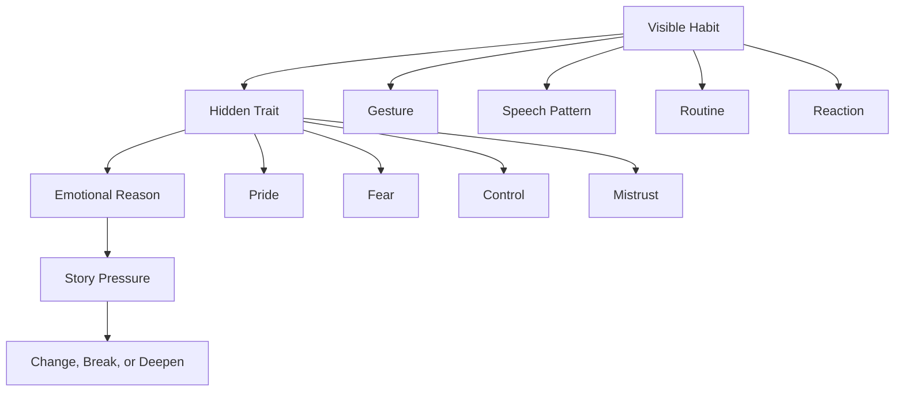
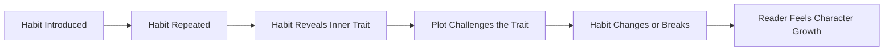
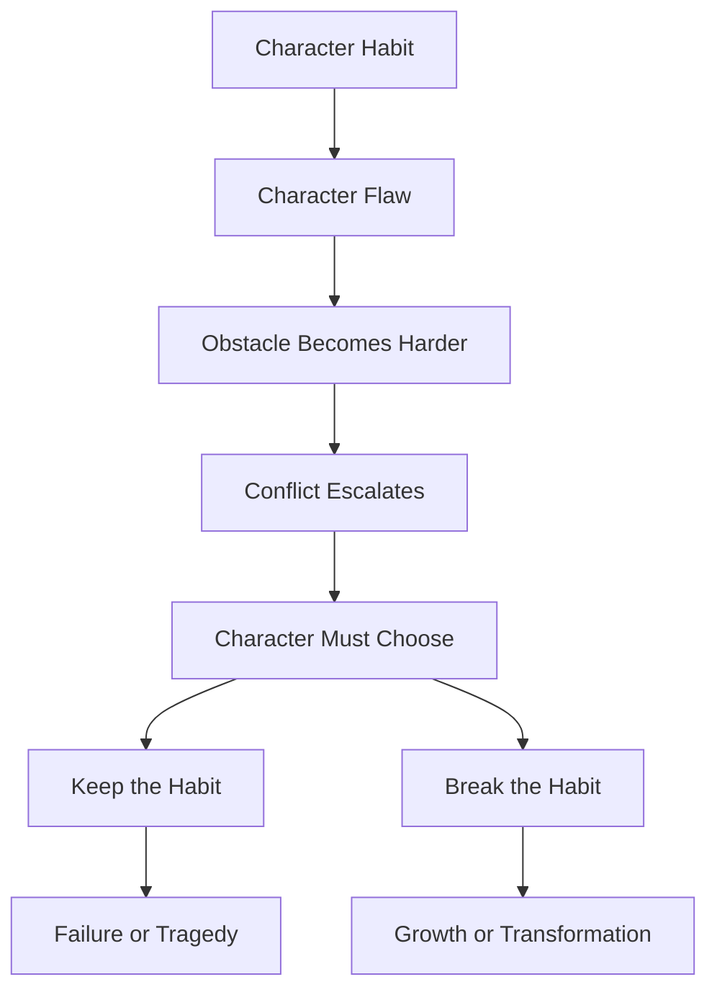

# 019 - Habits and Stubborn Traits

## Section

**01 - The Character**

## Original Lecture Title

**Habits and Stubborn Traits**

## Duration

**6:49**

---

## 1. Lesson Overview

This lesson focuses on **habits**, **quirks**, and **stubborn traits** in character design.

A character becomes more believable when they have repeated behaviors that feel natural and consistent. These small details help the reader recognize the character across a long novel.

However, habits are not only decorative. A strong habit can reveal personality, emotional wounds, fears, values, or inner resistance. Sometimes, the habit a character clings to most tightly is exactly what the story will eventually force them to change.

---

## 2. Core Idea

> **A habit makes a character recognizable.
> A stubborn trait makes a character difficult to change.
> A story becomes powerful when the plot pressures that trait.**

Habits give characters texture.
Stubborn traits give characters friction.

---

## 3. What Is a Character Habit?

A habit is a repeated behavior that belongs naturally to a character.

It can be:

| Type of Habit        | Description                     | Example                                             |
| -------------------- | ------------------------------- | --------------------------------------------------- |
| **Physical gesture** | A repeated body movement        | Touching a ring, biting nails, adjusting glasses    |
| **Speech pattern**   | A repeated way of speaking      | Avoiding direct answers, joking under pressure      |
| **Emotional habit**  | A repeated emotional response   | Shutting down when hurt, laughing when nervous      |
| **Decision habit**   | A repeated way of choosing      | Always taking control, always avoiding risk         |
| **Social habit**     | A repeated behavior with others | Apologizing too much, interrupting, refusing help   |
| **Private ritual**   | A personal routine              | Cleaning obsessively, writing lists, checking locks |

---

## 4. Habit vs Trait

A **habit** is something the character repeatedly does.
A **trait** is something the character repeatedly is.

| Habit                              | Trait Behind It                            |
| ---------------------------------- | ------------------------------------------ |
| Always checks the door twice       | Anxiety, fear, need for control            |
| Makes jokes during serious moments | Avoidance, insecurity, emotional defense   |
| Refuses to ask for help            | Pride, independence, mistrust              |
| Keeps old objects                  | Sentimentality, grief, inability to let go |
| Plans everything carefully         | Discipline, fear of chaos, perfectionism   |

A habit becomes stronger when it points to something deeper.

---

## 5. Why Habits Matter in Fiction

Habits help the reader feel that the character existed before the story began.

They make the character feel:

* Specific
* Memorable
* Human
* Consistent
* Emotionally recognizable

A character without habits may feel like a function of the plot.
A character with meaningful habits feels lived-in.

---

## 6. Stubborn Traits

A stubborn trait is a deeply fixed part of the character’s personality.

It is not easy to change because it usually protects the character from something painful.

Examples:

* Pride protects them from shame.
* Control protects them from fear.
* Sarcasm protects them from vulnerability.
* Independence protects them from rejection.
* Perfectionism protects them from failure.
* Silence protects them from conflict.

The plot becomes stronger when it challenges the exact trait the character depends on.

---

## 7. Character Habit Structure

A good habit is not random.
It is connected to the character’s inner life.

---

## 8. Small Gestures with Big Emotional Weight

Small recurring gestures can become emotionally powerful if used carefully.

For example:

| Recurring Gesture                     | Possible Meaning               |
| ------------------------------------- | ------------------------------ |
| A character always touches a necklace | Memory, grief, attachment      |
| A character avoids eye contact        | Shame, fear, secrecy           |
| A character folds paper cranes        | Hope, control, ritual          |
| A character always locks the door     | Fear, trauma, need for safety  |
| A character cleans when anxious       | Control, emotional suppression |

The key is not to repeat the gesture too often.

If used too much, it becomes annoying.
If used with purpose, it becomes meaningful.

---

## 9. Habit as Foreshadowing

A habit can prepare the reader for later emotional change.

When a habit disappears, changes, or reverses at the right moment, the reader feels the transformation without needing a long explanation.

---

## 10. Example: Refusing Help

### Habit

The protagonist always says, “I’m fine,” even when they are clearly struggling.

### Hidden Trait

They are proud and afraid of depending on others.

### Story Pressure

Later, the plot puts them in a situation they cannot survive alone.

### Character Change

They must finally ask for help.

### Why It Works

The broken habit becomes emotional evidence of growth.

The reader understands that the character has changed because their repeated behavior has changed.

---

## 11. Example: Making Jokes Under Pressure

### Habit

The character jokes whenever a situation becomes emotionally serious.

### Hidden Trait

They are afraid of vulnerability.

### Story Pressure

Someone they love needs an honest answer.

### Character Change

For once, they do not joke.

They speak plainly.

### Why It Works

The absence of the habit becomes meaningful.

The reader notices the silence because the story has taught them what the character usually does.

---

## 12. Using Habits Sparingly

A habit should be repeated enough to become recognizable, but not so much that it becomes mechanical.

### Weak Use

The character bites their lip in every emotional scene.

### Strong Use

The character bites their lip only when they wants to speak but chooses silence.

The second version is more meaningful because the habit has a specific emotional function.

---

## 13. Habit Escalation

A habit can evolve across the story.

| Stage     | Habit Function             | Example                                                 |
| --------- | -------------------------- | ------------------------------------------------------- |
| Beginning | Shows personality          | The character always refuses help                       |
| Middle    | Creates conflict           | Their refusal makes the situation worse                 |
| Crisis    | Becomes a serious obstacle | They lose something because they would not trust anyone |
| Climax    | Must change or break       | They finally ask for help                               |
| Ending    | Shows transformation       | They accept support without shame                       |

---

## 14. Habit and Plot Connection

The strongest habits are tied directly to the story’s main conflict.

A habit becomes dramatic when keeping it has consequences.

---

## 15. Practical Exercise

List three habits your protagonist has.

Then identify which one the story will eventually force them to break.

| Habit   | What It Reveals | How It Helps the Character | How It Hurts the Character | Will the Story Break It? |
| ------- | --------------- | -------------------------- | -------------------------- | ------------------------ |
| Habit 1 |                 |                            |                            | Yes / No                 |
| Habit 2 |                 |                            |                            | Yes / No                 |
| Habit 3 |                 |                            |                            | Yes / No                 |

---

## 16. Deeper Character Exercise

Choose one habit and answer the following:

1. When did this habit begin?
2. What emotion does it protect the character from?
3. Who notices this habit first?
4. When does the habit cause trouble?
5. What scene forces the character to change it?
6. What replaces the habit by the end of the story?

---

## 17. Reflection Questions

### Main Reflection

Which of your character’s habits would readers notice if it suddenly disappeared?

### Additional Reflection Questions

1. Which habit makes your protagonist feel most specific?
2. Which habit reveals their weakness?
3. Which habit creates conflict with other characters?
4. Which habit protects them emotionally?
5. Which habit does the plot need to challenge?
6. Which repeated gesture could become meaningful near the ending?
7. What would it mean if the character stopped doing this habit?

---

## 18. Revision Checklist

Use this checklist when revising character habits.

* [ ] The character has at least one recognizable habit.
* [ ] The habit is not random.
* [ ] The habit reveals personality, emotion, or history.
* [ ] The habit appears consistently but not too often.
* [ ] The habit connects to a deeper trait or flaw.
* [ ] The habit creates friction somewhere in the story.
* [ ] The plot eventually pressures this habit.
* [ ] The habit changes, breaks, or gains new meaning by the end.
* [ ] The reader would notice if the habit disappeared.

---

## 19. Key Takeaways

* Habits make characters feel real and memorable.
* Stubborn traits create friction and resistance to change.
* A repeated gesture can carry emotional meaning.
* The strongest habits reveal deeper personality or pain.
* A habit should not be repeated mechanically.
* A habit becomes powerful when the plot challenges it.
* Character growth can be shown through the change or disappearance of a habit.

---

## 20. Summary

This lesson explains how habits and stubborn traits help build memorable characters. A habit gives the reader something consistent to recognize, while a stubborn trait creates resistance inside the character.

The best habits are not decorative details. They reveal something deeper about the character and can become part of the story’s emotional arc. When the plot forces the protagonist to break or transform a fixed habit, the reader can feel the character’s growth through action rather than explanation.
