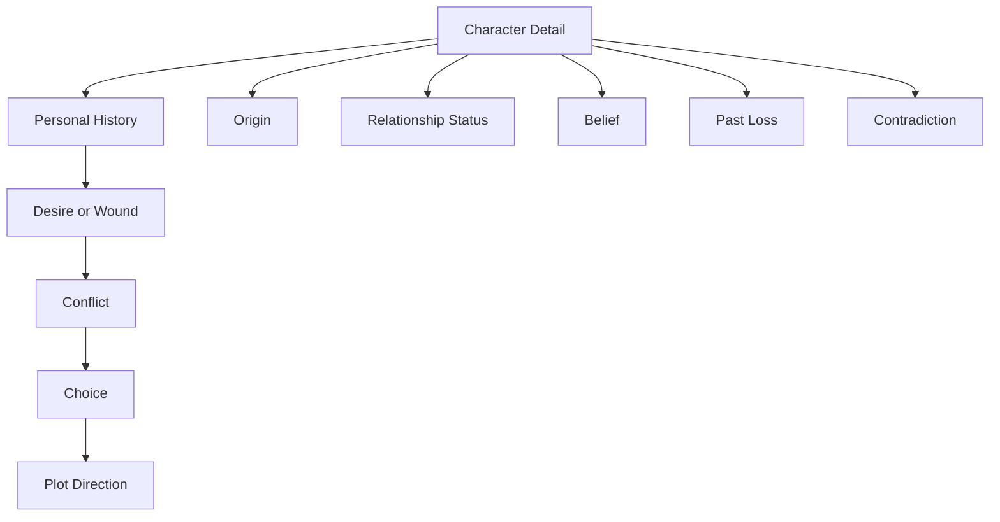
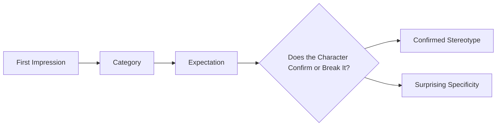
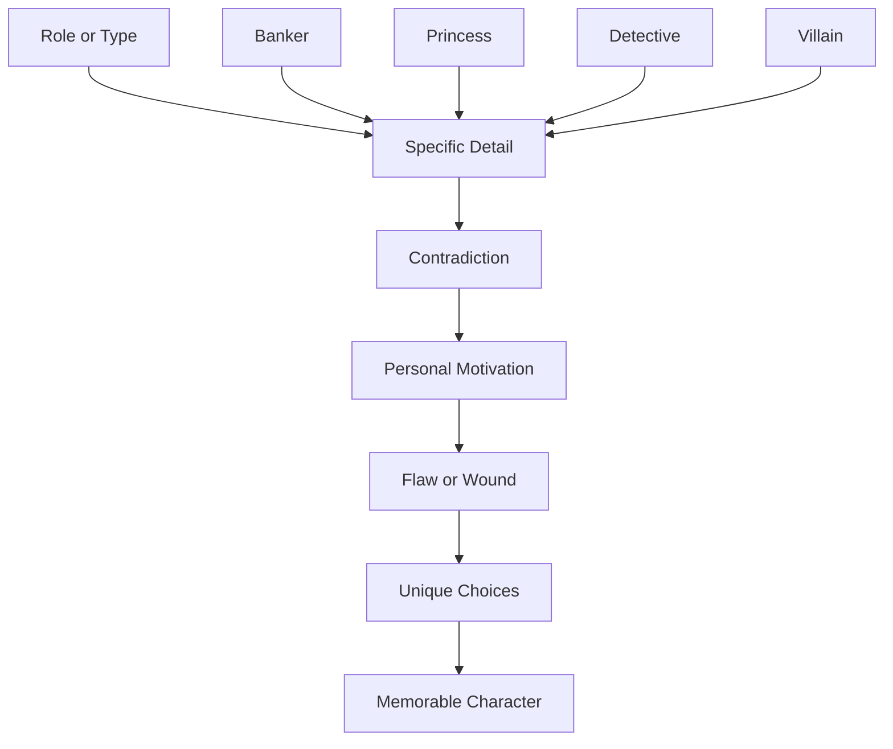

# 020 - Avoiding Generic, Stereotypical Characters

## Section

**01 - The Character**

## Original Lecture Title

**Avoiding Generic, Stereotypical Characters**

## Duration

**5:41**

---

## 1. Lesson Overview

This lesson focuses on how to avoid creating characters who feel generic, flat, or stereotypical.

A generic character is not memorable because they lack specific traits, contradictions, personal history, and emotional pressure. Readers do not connect deeply with characters who feel like empty templates.

A strong character is built through carefully chosen details. These details affect the plot, create conflict, shape decisions, and make the story feel like it could only happen to this particular person.

---

## 2. Core Idea

> **A character becomes interesting when they stop being a type and start becoming a specific person.**

A stereotype gives the reader a quick category.
Specific details give the reader a real human being.

---

## 3. Why Generic Characters Fail

A writer may be tempted to keep a character vague so the plot can move more easily around them.

This seems convenient, but it creates a serious problem:

* The character does not feel real.
* The reader has little reason to care.
* The plot becomes harder to develop.
* The character’s choices feel interchangeable.
* The story could happen to almost anyone.

A character without specific traits cannot strongly influence the story.

---

## 4. Generic Character vs Specific Character

| Generic Character        | Specific Character                                           |
| ------------------------ | ------------------------------------------------------------ |
| Defined mainly by role   | Defined by personal history, desire, flaw, and contradiction |
| Could be replaced easily | Feels necessary to the story                                 |
| Has predictable behavior | Has surprising but believable behavior                       |
| Exists to serve the plot | Shapes the plot through choices                              |
| Feels like a type        | Feels like a person                                          |

---

## 5. Example: Jane and Phil

At first, Jane and Phil are almost interchangeable.

### Basic Version

| Character | Basic Traits                                                           |
| --------- | ---------------------------------------------------------------------- |
| Jane      | Woman, works in a bank, has no children, likes the beach and mountains |
| Phil      | Man, accountant, has no children, likes the sea and mountains          |

At this stage, it is difficult to know why one should be the protagonist instead of the other.

There is not enough specificity.

---

## 6. Adding Specific Details

Now more details are added:

| Character | More Specific Details                                                                                 |
| --------- | ----------------------------------------------------------------------------------------------------- |
| Jane      | Born and raised in the United States, single by choice, begins to think she wants a child             |
| Phil      | Born and raised in Mexico, married for twenty years, he and his wife have never been able to conceive |

Now the characters begin to suggest different stories.

Jane’s story may involve independence, identity, choice, motherhood, regret, or changing desire.

Phil’s story may involve marriage, grief, cultural expectation, infertility, masculinity, and long-term hope or disappointment.

Specificity creates story direction.

---

## 7. Specific Details Create Plot

The more specific the character becomes, the more specific the story becomes.

A strong story should feel like it could only happen to this character, in this situation, with this flaw, at this moment in their life.

---

## 8. What Is a Stereotype?

A stereotype is a simplified category.

It happens when a character is mainly built from a familiar type instead of individual details.

Examples:

* The dumb blonde
* The cold businessman
* The evil stepmother
* The perfect hero
* The weak princess
* The angry teenager
* The mysterious old man
* The genius nerd
* The heartless villain

Stereotypes are not always useless, but they become weak when the writer does nothing new with them.

---

## 9. How Readers Categorize Characters

In real life, people often make quick assumptions based on visible traits.

The same thing happens in fiction.

Readers naturally form expectations.

The writer can either confirm those expectations or subvert them.

---

## 10. Using Stereotypes Intelligently

Stereotypes can be useful when the writer uses them to create surprise.

The reader thinks they understand the character, but the story later reveals something deeper or unexpected.

### Examples

| Story                       | Stereotype Used         | How It Is Subverted                                                  |
| --------------------------- | ----------------------- | -------------------------------------------------------------------- |
| *Legally Blonde*            | The “dumb blonde”       | Elle proves herself intelligent, capable, and emotionally strong     |
| *Sierra Burgess Is a Loser* | The unpopular girl      | The story complicates beauty, insecurity, and romantic expectation   |
| *Home Alone*                | The frightening old man | Old Man Marley turns out to be kind and protective                   |
| *Shrek*                     | The scary ogre          | Shrek is rough and isolated, but deeply wounded and capable of love  |
| *Brave*                     | The princess role       | Merida resists the passive princess stereotype and fights for agency |

---

## 11. Contradiction Makes Characters Memorable

One of the easiest ways to avoid stereotypes is to give the character a trait that contradicts the expected type.

| Stereotype                | Contradictory Trait                           |
| ------------------------- | --------------------------------------------- |
| Tough soldier             | Secretly writes poetry                        |
| Rich heiress              | Hates luxury and wants practical work         |
| Shy librarian             | Loves dangerous street racing                 |
| Cold detective            | Cannot stop caring for abandoned animals      |
| Popular athlete           | Terrified of public attention                 |
| Old villain-like neighbor | Quietly protects children in the neighborhood |

A contradiction makes the reader curious.

---

## 12. Character Specificity Model

Do not stop at the role.

A role tells us what the character does.
Specificity tells us who the character is.

---

## 13. Description Is Not Enough

A character does not become unique simply because the writer describes their appearance.

Physical description can help, but deeper specificity comes from:

* What the character wants
* What they fear
* What they believe
* What they refuse to admit
* How they speak
* What they hide
* What they misunderstand
* What contradiction they carry
* What past event shaped them

A specific belief or speech pattern often individualizes a character more than hair color, clothing, or height.

---

## 14. Dialogue Test

A useful test:

> **If you removed the character’s name and role, would their dialogue still sound like them?**

If every character speaks the same way, they may not yet be specific enough.

### Ways to Make Dialogue Specific

| Method      | Example                                                        |
| ----------- | -------------------------------------------------------------- |
| Vocabulary  | Formal, poetic, technical, childish, blunt                     |
| Rhythm      | Fast, hesitant, fragmented, controlled                         |
| Avoidance   | Refuses emotional words                                        |
| Repetition  | Reuses certain phrases                                         |
| Worldview   | Interprets everything through money, faith, logic, fear, humor |
| Social mask | Polite outside, cruel in private                               |

---

## 15. Practical Exercise

Take your most stereotypical character and add one contradictory trait that complicates the reader’s first impression.

| Step | Question                                        | Your Answer |
| ---- | ----------------------------------------------- | ----------- |
| 1    | What stereotype does the character seem to fit? |             |
| 2    | What does the reader expect from this type?     |             |
| 3    | What contradictory trait can you add?           |             |
| 4    | Why does the character have this contradiction? |             |
| 5    | How does this contradiction affect the plot?    |             |
| 6    | When will the reader discover the deeper truth? |             |

---

## 16. Stereotype Revision Table

Use this table to revise flat characters.

| Current Character Type | Generic Version             | More Specific Version                                                     |
| ---------------------- | --------------------------- | ------------------------------------------------------------------------- |
| Rich girl              | Spoiled and arrogant        | Rich girl who secretly envies people who can fail without public shame    |
| Detective              | Serious and clever          | Detective who solves crimes well but cannot interpret ordinary kindness   |
| Villain                | Evil and cruel              | Villain who believes cruelty is the only honest form of love              |
| Mother                 | Caring and self-sacrificing | Mother who loves her child but secretly resents losing her own future     |
| Hero                   | Brave and noble             | Hero who performs courage publicly but avoids emotional honesty privately |

---

## 17. Questions for Creating a Non-Generic Character

Ask yourself:

1. What are the distinguishing traits of this character?
2. Why did I choose these particular traits?
3. Which details affect the plot?
4. Which details affect the character’s choices?
5. Does the character have stereotypical traits?
6. Am I using the stereotype to confirm or surprise the reader?
7. What contradiction makes this character more human?
8. What belief makes this character different from others in the story?
9. What would make this story impossible with a different protagonist?

---

## 18. Character Individualization Checklist

* [ ] The character is more than a role.
* [ ] The character has specific personal history.
* [ ] The character has a clear desire.
* [ ] The character has a flaw or false belief.
* [ ] The character has at least one contradiction.
* [ ] The character’s details affect the plot.
* [ ] The character’s dialogue sounds distinct.
* [ ] The reader’s first impression is complicated later.
* [ ] The character cannot be easily replaced by another character.
* [ ] The story feels specific to this person.

---

## 19. Key Takeaways

* Generic characters weaken emotional connection.
* Stereotypes come from relying too much on familiar types.
* Specific details make characters feel real.
* A contradiction can break a stereotype.
* The best details influence the plot, not just the description.
* Readers are intrigued by characters who challenge their first assumptions.
* A strong character should feel impossible to replace.

---

## 20. Summary

This lesson explains how to avoid generic and stereotypical characters. A vague character may seem flexible, but they often fail to move the reader or drive the plot.

Specificity is what makes a character come alive. Details such as origin, belief, flaw, desire, contradiction, and speech pattern turn a role into a real person. Stereotypes can be useful, but only when the writer uses them consciously, either to surprise the reader or reveal a deeper truth.

A memorable character is not simply “a type.” They are a specific person whose traits shape the story itself.

---

# Bài luyện tập

## Mục tiêu

## Đề bài

## Yêu cầu hoàn thành

- [ ] 
- [ ] 
- [ ] 

## Kết quả / lời giải

## Ghi chú
