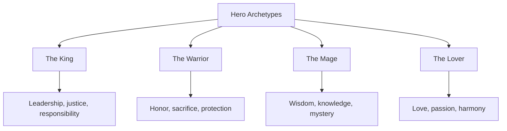
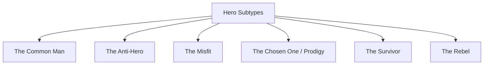
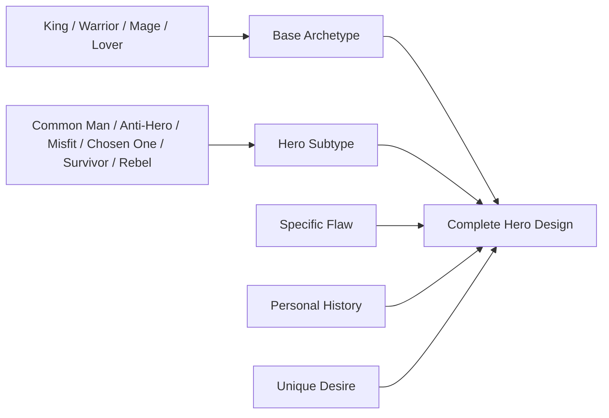
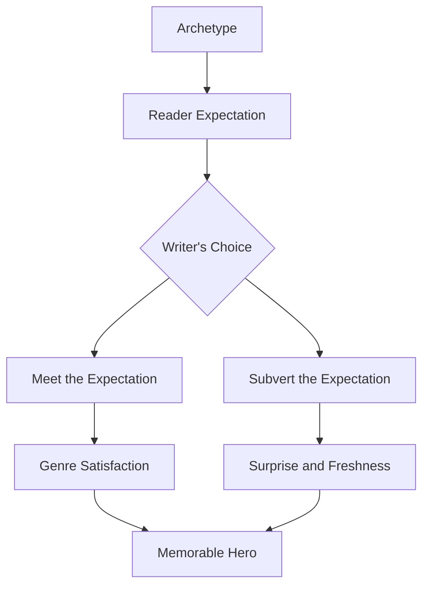

# 021 - Hero Archetypes

## Section

**01 - The Character**

## Original Lecture Title

**Hero Archetypes**

## Duration

**9:57**

---

## 1. Lesson Overview

This lesson introduces **hero archetypes**: recurring patterns of heroic characters that appear across stories, myths, novels, and films.

An archetype is not a finished character. It is a starting structure, a useful pattern that helps the writer understand what kind of hero they are creating and what readers may expect from them.

A memorable protagonist does not simply repeat an archetype. They personalize it with specific flaws, desires, wounds, contradictions, and history.

---

## 2. Core Idea

> **An archetype gives the hero a familiar shape.
> Specific flaws and history make the hero unforgettable.**

Readers often recognize archetypes quickly.
The writer can then either fulfill those expectations or deliberately subvert them.

---

## 3. What Is a Hero Archetype?

A hero archetype is a repeated heroic pattern.

It helps define:

* What the hero wants
* What the hero fears
* What kind of conflict they attract
* What kind of growth they need
* What role they play in the story world

However, an archetype should never replace characterization.

A hero becomes alive only when the writer adds personal detail.

---

## 4. Main Hero Archetype Structure

According to the lesson, there are **four base hero archetypes**:

---

# Part I: The Four Base Hero Archetypes

---

## 5. The King

The King archetype appears in stories where the protagonist is destined to become a true leader.

This archetype is common in fantasy, but it can appear in many genres.

The King has a double mission:

1. To conquer or reclaim a kingdom.
2. To protect and stabilize that kingdom.

The King must discover qualities they may not know they have:

* Justice
* Fairness
* Responsibility
* Leadership
* Self-knowledge
* Awareness of limits and strengths

---

## 6. The King’s Journey

The King often faces initiation tests such as:

* Betrayal
* Friendship
* Chaos
* Loss of control
* Responsibility
* Moral testing

Their destiny may already be marked, but they still need to grow into it.

### Examples

| Character   | Story            |
| ----------- | ---------------- |
| Simba       | *The Lion King*  |
| Aladdin     | *Aladdin*        |
| King Arthur | Arthurian legend |

---

## 7. The Warrior

The Warrior archetype is built around protection, service, loyalty, and sacrifice.

The Warrior protects:

* The realm
* The weak
* The beloved
* The innocent
* The group or community

A true Warrior is willing to risk their life for something greater than themselves.

---

## 8. The Warrior’s Values

The Warrior usually values:

* Honor
* Loyalty
* Courage
* Discipline
* Duty
* Sacrifice
* Ethical action

The choices a Warrior makes reveal their moral code.

### Examples

| Character      | Story                  |
| -------------- | ---------------------- |
| Leonidas       | *300*                  |
| D’Artagnan     | *The Three Musketeers* |
| Robin Hood     | Robin Hood legends     |
| The Terminator | *Terminator* series    |

---

## 9. The Mage

The Mage archetype is defined by wisdom, knowledge, and mystery.

The Mage has access to knowledge or ability beyond ordinary people.

This does not always mean literal magic.
A Mage can be a master of:

* Logic
* Medicine
* Investigation
* Technology
* Strategy
* Science
* Psychology

---

## 10. The Mage’s Danger

The greatest danger for the Mage is arrogance.

Because they know more than others, they may become:

* Conceited
* Detached
* Cold
* Manipulative
* Overconfident
* Isolated

The Mage must learn how to use knowledge without losing humility or humanity.

### Examples

| Character            | Type of Knowledge |
| -------------------- | ----------------- |
| Dr. House            | Medicine          |
| Sherlock Holmes      | Deduction         |
| Mr. Robot            | Technology        |
| Inspector Montalbano | Investigation     |

---

## 11. The Lover

The Lover archetype is driven by passion.

Their goal is often connected to:

* Love
* Happiness
* Beauty
* Harmony
* Art
* Desire
* Emotional union
* Devotion to an ideal

The Lover’s greatest fear is the loss of love.

---

## 12. The Lover’s Conflict

The Lover can be noble and healing, but love can also become destructive.

A distorted Lover may become:

* Obsessive
* Jealous
* Possessive
* Self-destructive
* Violent
* Unable to distinguish love from control

Often, the Lover must heal a wound or abandon a false belief before they can truly love.

### Examples

| Story                           | Lover Conflict                                 |
| ------------------------------- | ---------------------------------------------- |
| *Othello*                       | Love becomes jealousy and destruction          |
| *The Princess Bride*            | Devotion and romantic adventure                |
| *The Bridges of Madison County* | Love, longing, and sacrifice                   |
| *When Harry Met Sally*          | Friendship, intimacy, and romantic realization |

---

# Part II: Six Hero Subtypes

Each hero archetype can appear through different subtypes.

---

## 13. The Common Man

The Common Man is an ordinary person placed in extraordinary circumstances.

They usually have:

* No special powers
* No heroic reputation
* No desire to save the world
* No obvious greatness at first

This hero inspires trust because they feel like someone we might know, or someone we might be.

---

## 14. The Common Man’s Appeal

The Common Man shows that heroism can emerge from ordinary people.

They often begin as:

* Awkward
* Insecure
* Unprepared
* Ordinary
* Flawed
* Relatable

But the story reveals their courage under pressure.

### Examples

| Character     | Story                   |
| ------------- | ----------------------- |
| Marty McFly   | *Back to the Future*    |
| Dave Lizewski | *Kick-Ass*              |
| Forrest Gump  | *Forrest Gump*          |
| Amélie        | *Amélie*                |
| Frodo Baggins | *The Lord of the Rings* |

---

## 15. The Anti-Hero

The Anti-Hero does not have the typical noble traits of a hero.

They may be:

* Selfish
* Cowardly
* Immoral
* Cynical
* Unreliable
* Dishonest
* Uninterested in ideals

They may do the right thing, but often for the wrong reason.

---

## 16. Why the Anti-Hero Works

The Anti-Hero works when their flaws are entertaining, fascinating, or emotionally compelling.

The reader may know the character is not morally perfect, but still enjoys following them.

### Example: Jack Sparrow

Jack Sparrow is not a traditional hero. He avoids danger, causes problems, follows his own interest, and rarely behaves nobly in a straightforward way.

Yet he is beloved because he is funny, unpredictable, witty, and entertaining.

### Other Examples

| Character        | Story                                        |
| ---------------- | -------------------------------------------- |
| Jack Sparrow     | *Pirates of the Caribbean*                   |
| Elizabeth Bennet | *Pride and Prejudice*                        |
| Sherlock Holmes  | Modern film adaptations of *Sherlock Holmes* |
| Alan Garner      | *The Hangover*                               |

---

## 17. The Misfit

The Misfit is an outsider.

They are often ignored, misunderstood, mocked, or rejected by the community.

This subtype is common in stories for young readers because many teenagers experience feelings of isolation or not belonging.

---

## 18. The Misfit’s Strength

At first, the Misfit may not look heroic.

They may be:

* Introverted
* Awkward
* Strange
* Socially isolated
* Emotionally guarded
* Different from everyone else

However, their difference becomes their strength.

Their outsider perspective allows them to see what others cannot see.

### Examples

| Character        | Story                    |
| ---------------- | ------------------------ |
| Holden Caulfield | *The Catcher in the Rye* |
| Dory             | *Finding Nemo*           |
| Tarzan           | *Tarzan*                 |

---

## 19. The Chosen One / Prodigy

The Chosen One is born with potential, destiny, or hidden greatness.

At the beginning, they may not look heroic at all.

They may be:

* Clumsy
* Cowardly
* Untrained
* Unaware of their power
* Unprepared for responsibility

Because of this, they usually need mentors.

---

## 20. The Chosen One’s Question

The central question is often:

> **Is this person really the one who can save the world?**

The reader follows the story to see whether the hero can grow into the role assigned to them.

### Examples

| Character      | Story            |
| -------------- | ---------------- |
| Po             | *Kung Fu Panda*  |
| Luke Skywalker | *Star Wars*      |
| Neo            | *The Matrix*     |
| Daniel LaRusso | *The Karate Kid* |

---

## 21. The Survivor

The Survivor is a hero shaped by trauma.

They have lived through deep loss, such as:

* The death of a loved one
* The loss of home
* Captivity
* Betrayal
* War
* Violence
* Emotional ruin

They begin from pain, grief, or emptiness.

---

## 22. The Survivor’s Arc

The Survivor often begins with revenge or justice.

They may want to punish those who hurt them. But their deeper destiny is to rise from the ashes and become whole again.

### Examples

| Character       | Story         |
| --------------- | ------------- |
| Benjamin Martin | *The Patriot* |
| John Wick       | *John Wick*   |
| Oh Dae-su       | *Oldboy*      |

---

## 23. The Rebel

The Rebel understands how the world works, but refuses to accept it.

They live in a world that falls short of their ideals.

So they break the rules, challenge authority, and call others to action.

---

## 24. The Rebel’s Role

The Rebel is often a natural leader.

They can inspire:

* A nation
* A community
* A team
* A small group of outcasts
* A rebellion

Their strengths include:

* Inventiveness
* Intelligence
* Cunning
* Courage
* Charisma
* Strategic thinking

### Examples

| Character        | Story              |
| ---------------- | ------------------ |
| Robin Hood       | Robin Hood legends |
| Katniss Everdeen | *The Hunger Games* |
| Leonidas         | *300*              |

---

## 25. Archetype Combination Map

A protagonist can combine a base archetype with a subtype.

### Example

A character could be:

* A **Warrior + Survivor**
* A **Mage + Misfit**
* A **Lover + Anti-Hero**
* A **King + Chosen One**
* A **Rebel + Common Man**

The archetype gives structure.
The specific flaw and personal history make the hero unique.

---

## 26. How to Use Archetypes Without Being Generic

Archetypes become dangerous when the writer treats them as complete characters.

A strong hero needs more than a label.

| Archetype Label | Generic Version  | Personalized Version                                                           |
| --------------- | ---------------- | ------------------------------------------------------------------------------ |
| Warrior         | Brave fighter    | A loyal fighter who cannot forgive himself for surviving when his brother died |
| Mage            | Smart genius     | A brilliant doctor whose knowledge cannot save the person he loves             |
| Lover           | Romantic dreamer | A passionate artist who confuses admiration with love                          |
| Rebel           | Rule-breaker     | A rebel who fears becoming the same kind of leader they overthrew              |
| Chosen One      | Destined savior  | A chosen hero who secretly wants someone else to take the burden               |

---

## 27. Reader Expectations and Subversion

Every archetype creates expectations.

The writer can meet expectations when they serve the story.
The writer can subvert expectations when they reveal something deeper.

---

## 28. Practical Exercise

Identify the closest archetype to your protagonist.

Then list two ways your character breaks from it.

| Step | Question                                                 | Your Answer                                                     |
| ---- | -------------------------------------------------------- | --------------------------------------------------------------- |
| 1    | Which of the four base archetypes fits your protagonist? | King / Warrior / Mage / Lover                                   |
| 2    | Which hero subtype fits them best?                       | Common Man / Anti-Hero / Misfit / Chosen One / Survivor / Rebel |
| 3    | What would readers expect from this archetype?           |                                                                 |
| 4    | What is the first way your character breaks from it?     |                                                                 |
| 5    | What is the second way your character breaks from it?    |                                                                 |
| 6    | How does this make the hero more specific?               |                                                                 |

---

## 29. Assignment Questions

Answer the following questions about your protagonist:

1. Which of the four archetypes does your protagonist match?
2. Why does this archetype fit them?
3. Which hero subtype do they belong to?
4. What traits distinguish them from others in the same archetype?
5. What would readers assume about them at first?
6. Where does your character surprise the reader?
7. What specific flaw personalizes the archetype?
8. What part of their history makes this archetype feel unique?

---

## 30. Reflection Questions

### Main Reflection

What would readers assume about your hero based on the archetype alone, and where does your character surprise them?

### Additional Reflection Questions

1. Is your hero’s archetype clear?
2. Is your hero more than the archetype?
3. What expectation does your hero fulfill?
4. What expectation does your hero break?
5. What personal wound shapes their version of the archetype?
6. What flaw prevents them from becoming fully heroic?
7. What does the hero need to learn by the end of the story?

---

## 31. Hero Archetype Revision Checklist

Use this checklist when revising your protagonist.

* [ ] The protagonist has a recognizable heroic pattern.
* [ ] The archetype supports the story’s genre.
* [ ] The hero is not only a generic type.
* [ ] The hero has a specific flaw.
* [ ] The hero has a personal history.
* [ ] The hero has a unique desire.
* [ ] The hero fulfills some reader expectations.
* [ ] The hero subverts at least one expectation.
* [ ] The hero’s choices reflect their archetype.
* [ ] The hero’s arc changes or deepens the archetype.

---

## 32. Key Takeaways

* Every story needs a hero, but there is no single definition of heroism.
* Archetypes are useful starting points, not complete characters.
* The four base hero archetypes are the King, Warrior, Mage, and Lover.
* Hero subtypes include the Common Man, Anti-Hero, Misfit, Chosen One, Survivor, and Rebel.
* Reader expectations come naturally from archetypes.
* A writer can satisfy or subvert those expectations.
* The most memorable heroes personalize the archetype through flaw, wound, history, and contradiction.

---

## 33. Summary

This lesson explains how hero archetypes can help writers design stronger protagonists. The four base archetypes — King, Warrior, Mage, and Lover — provide different heroic foundations. Each can be combined with subtypes such as the Common Man, Anti-Hero, Misfit, Chosen One, Survivor, or Rebel.

However, an archetype is only a framework. A memorable hero needs specific traits, flaws, wounds, desires, and personal history. The best protagonists echo familiar heroic patterns while also surprising the reader in ways that feel emotionally true.
