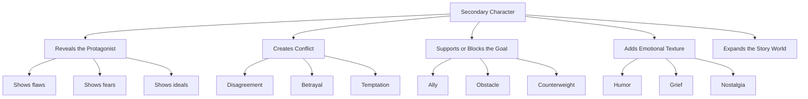
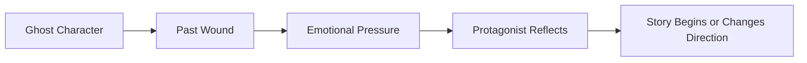
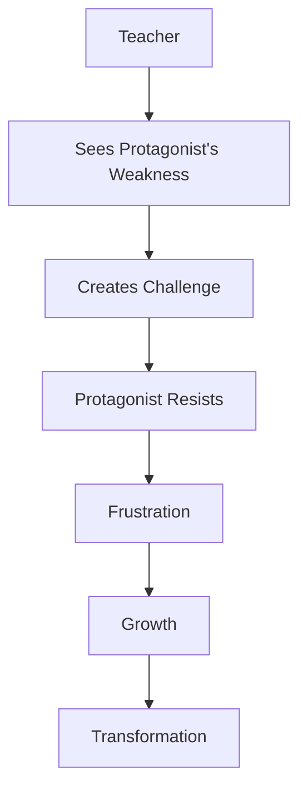
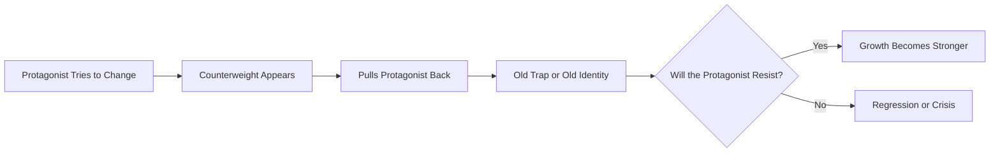
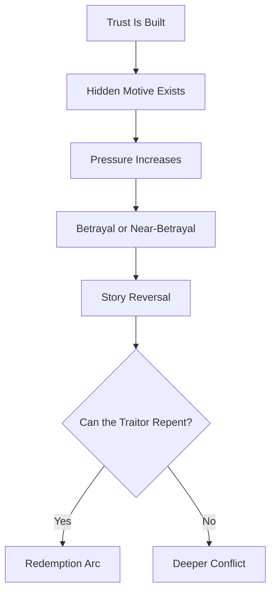
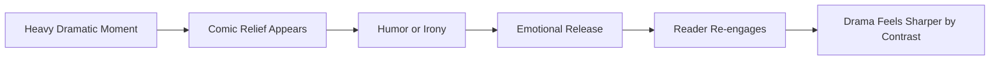
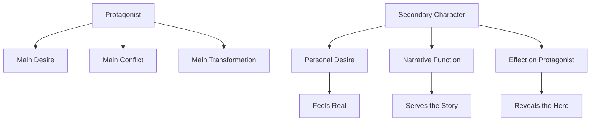

# 022 - Secondary Characters

## Section

**01 - The Character**

## Original Lecture Title

**Nhân vật phụ**

## Duration

**6:45**

---

## 1. Lesson Overview

There is no Batman without Robin.
No Harry Potter without Ron and Hermione.
No Sherlock Holmes without Watson.

In literature, secondary characters are often just as memorable and necessary as the protagonist. They do not merely fill space around the hero. Instead, they help reveal the protagonist’s inner complexity, expose weaknesses, create pressure, offer contrast, or become the emotional force that pushes the story forward.

Secondary characters do some of the “dirty work” of storytelling. They place the protagonist’s fears, hopes, flaws, strengths, and ideals into sharper relief.

However, this does **not** mean they should be reduced to mirrors or tools. A strong secondary character must feel like a real person with their own history, desire, personality, and problems.

---

## 2. Key Ideas

### 2.1 Secondary Characters Have Narrative Functions

A secondary character should serve a clear role in the story.

They may function as:

* A **mirror** who reflects the protagonist’s traits.
* A **foil** who contrasts with the protagonist.
* An **obstacle** who blocks the protagonist.
* An **ally** who supports the protagonist.
* A **temptation** who pulls the protagonist backward.
* A **comic relief** who releases tension.

The important point is that every major secondary character should contribute something the story needs.

---

### 2.2 They Must Have Their Own Wants

Secondary characters should not exist only to serve the protagonist.

Even if their role is small, they should want something of their own. That desire may not dominate the plot, but it gives them life.

A weak secondary character only asks:

> “How can I help the protagonist’s story?”

A strong secondary character also asks:

> “What do I want for myself?”

---

### 2.3 They Reveal the Protagonist

Secondary characters help readers understand the protagonist more deeply.

They do this through:

* Conflict
* Contrast
* Loyalty
* Betrayal
* Humor
* Memory
* Moral pressure
* Emotional reaction

Sometimes the protagonist’s true nature becomes visible only when they interact with someone else.

---

## 3. Core Diagram: How Secondary Characters Work

---

## 4. Types of Secondary Characters

The lecture mentions several common types of secondary characters. Each type creates a different kind of pressure around the protagonist.

---

## 4.1 The Ghost

### Definition

The ghost is a character connected to the protagonist’s past. This character appears, disappears, or remains emotionally present in order to force the protagonist to confront a moral, emotional, or psychological problem.

A ghost does not always have to be literally dead. They may be:

* A person from the past
* A missing friend
* A parent
* A former lover
* A memory
* Someone physically absent but emotionally powerful

### Narrative Function

The ghost usually represents something unresolved.

They may force the protagonist to face:

* Regret
* Grief
* Guilt
* Nostalgia
* A forgotten promise
* An old wound
* A truth they have avoided

### Examples

* Sam in *Ghost*
* The ghosts in *A Christmas Carol*
* Lila in *My Brilliant Friend*

In *My Brilliant Friend*, Lila’s disappearance becomes the force that makes the narrator begin writing their shared story. Her absence becomes the trigger for memory, anger, and storytelling.

### Function in Story

---

## 4.2 The Teacher

### Definition

The teacher is a character who helps the protagonist confront weakness, fear, or limitation.

This character may be a traditional mentor, but they can also be harsh, frustrating, or even antagonistic.

### Narrative Function

The teacher forces growth.

They often create the moments of greatest frustration for the protagonist, but those moments are necessary because they push the protagonist beyond their current limits.

### Examples

* Yoda in *Star Wars*
* Morpheus in *The Matrix*
* Mr. Miyagi in *The Karate Kid*
* Shifu in *Kung Fu Panda*

### What the Teacher Does

The teacher may:

* Train the protagonist
* Challenge their beliefs
* Reveal hidden weaknesses
* Push them toward discipline
* Force them to face fear
* Prepare them for transformation

### Function in Story

---

## 4.3 The Counterweight

### Definition

The counterweight is a character who pulls against the protagonist’s development.

While the teacher pushes the protagonist to change, the counterweight tries to keep them where they are.

### Narrative Function

The counterweight maintains the status quo.

This character may bring the protagonist back to:

* An old fear
* A former addiction
* A toxic relationship
* A previous identity
* A moral trap
* A psychological weakness

### Examples

* Mr. Hyde in *Dr. Jekyll and Mr. Hyde*
* Magneto in relation to Professor X in *X-Men*
* The Joker in relation to Batman

The Joker repeatedly tries to convince Batman that they are similar. He points out their shared alienation, pain, and rejection by society. His role is not simply to fight Batman physically, but to tempt him morally.

### Function in Story

---

## 4.4 The Traitor

### Definition

The traitor is a secondary character who betrays the protagonist or another important character.

This role often creates one of the most memorable reversals in a story.

### Narrative Function

The traitor creates shock, but the betrayal must feel believable.

For betrayal to work, the writer must first establish:

1. A bond of trust.
2. A reason for betrayal.
3. Emotional consequences.
4. A change in the direction of the story.

A betrayal that comes from nowhere feels cheap. A betrayal that grows from desire, fear, jealousy, ambition, or survival feels powerful.

### Examples

* Petyr Baelish in *A Song of Ice and Fire*
* Scar in *The Lion King*
* Mr. Orange in *Reservoir Dogs*
* Mr. Tumnus in *The Lion, the Witch and the Wardrobe* as a near-betrayal figure who repents

In *The Lion, the Witch and the Wardrobe*, Mr. Tumnus is expected to deliver Lucy to the White Witch. However, he changes his mind and chooses to protect her instead.

### Function in Story

---

## 4.5 The Comic Relief

### Definition

Comic relief is a secondary character who brings humor, irony, simplicity, or absurdity into the story.

This type of character is especially useful in stories with heavy drama, danger, injustice, pain, or emotional tension.

### Narrative Function

Comic relief does not merely “make jokes.”

A good comic relief character can:

* Highlight suffering through contrast
* Make dark moments more bearable
* Reveal truths through humor
* Expose hypocrisy
* Show innocence or absurdity
* Make the story more emotionally balanced

### Examples

* The Minions in *Despicable Me*
* Many Disney, Pixar, and DreamWorks side characters

The Minions are memorable because they are brutally honest, chaotic, loyal, strange, and joyful. They speak a language we do not fully understand, yet their emotions and intentions are easy to read.

They are funny because they are simple, direct, and unpredictable.

### Function in Story

---

## 5. Summary Table of Secondary Character Types

| Type              | Main Function                    | What They Reveal                         | Common Risk                     |
| ----------------- | -------------------------------- | ---------------------------------------- | ------------------------------- |
| The Ghost         | Brings the past into the present | Regret, grief, guilt, memory             | Becoming too vague or symbolic  |
| The Teacher       | Forces growth                    | Weakness, fear, limitation               | Becoming a cliché mentor        |
| The Counterweight | Pulls the hero backward          | Temptation, old identity, moral weakness | Becoming a simple villain       |
| The Traitor       | Creates reversal                 | Trust, ambition, fear, betrayal          | Betrayal feels unearned         |
| The Comic Relief  | Releases tension                 | Absurdity, honesty, emotional contrast   | Becoming irrelevant or annoying |

---

## 6. Secondary Characters vs. Protagonist

A secondary character should be developed carefully, but they should not steal the central focus from the protagonist.

The balance is important:

The protagonist carries the main arc.
The secondary character strengthens, challenges, complicates, or reflects that arc.

---

## 7. Practical Exercise

For each major secondary character in your story, write one sentence answering this question:

> What does this character want that has nothing to do with the protagonist?

### Exercise Template

| Secondary Character | Their Role                       | What They Want for Themselves | How They Help or Hurt the Protagonist |
| ------------------- | -------------------------------- | ----------------------------- | ------------------------------------- |
| Character 1         | Teacher / Ghost / Traitor / etc. |                               |                                       |
| Character 2         | Teacher / Ghost / Traitor / etc. |                               |                                       |
| Character 3         | Teacher / Ghost / Traitor / etc. |                               |                                       |

---

## 8. Reflection Questions

Use these questions to test whether your secondary characters are truly necessary.

1. Which secondary character could be removed without damaging the story?
2. What does each secondary character want independently of the protagonist?
3. How did the relationship between the protagonist and this character begin?
4. What unites them?
5. What divides them?
6. What is unique about this secondary character?
7. What role do they play in the narrative?
8. How do they help the protagonist?
9. How do they hurt the protagonist?
10. Do they change during the story, or do they remain fixed?

---

## 9. Character Design Checklist

Before keeping a secondary character in your novel, ask:

* Do they have a clear role?
* Do they want something of their own?
* Do they create conflict, contrast, support, or pressure?
* Do they reveal something important about the protagonist?
* Do they feel like a person rather than a prop?
* Would the story lose something meaningful if they disappeared?

If the answer is no, the character may need to be revised, combined with another character, or removed.

---

## 10. Final Takeaway

Secondary characters deserve serious attention.

They may not own the spotlight, but they shape how the reader sees the protagonist. They bring pressure, humor, temptation, memory, betrayal, wisdom, and emotional complexity into the story.

A strong secondary character is not just someone standing beside the hero.

They are someone whose presence changes what the hero must face.
