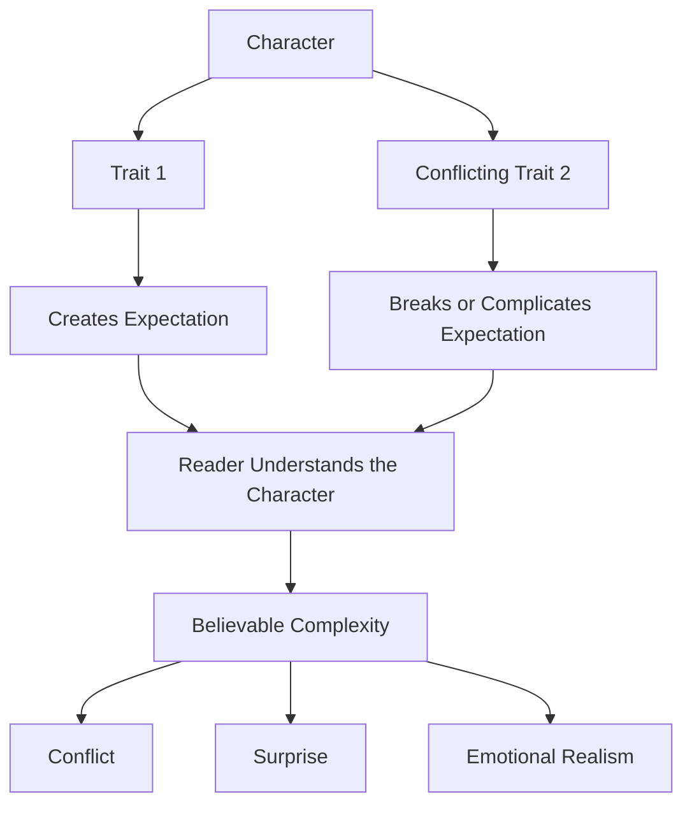
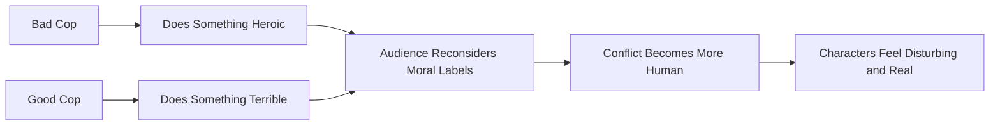
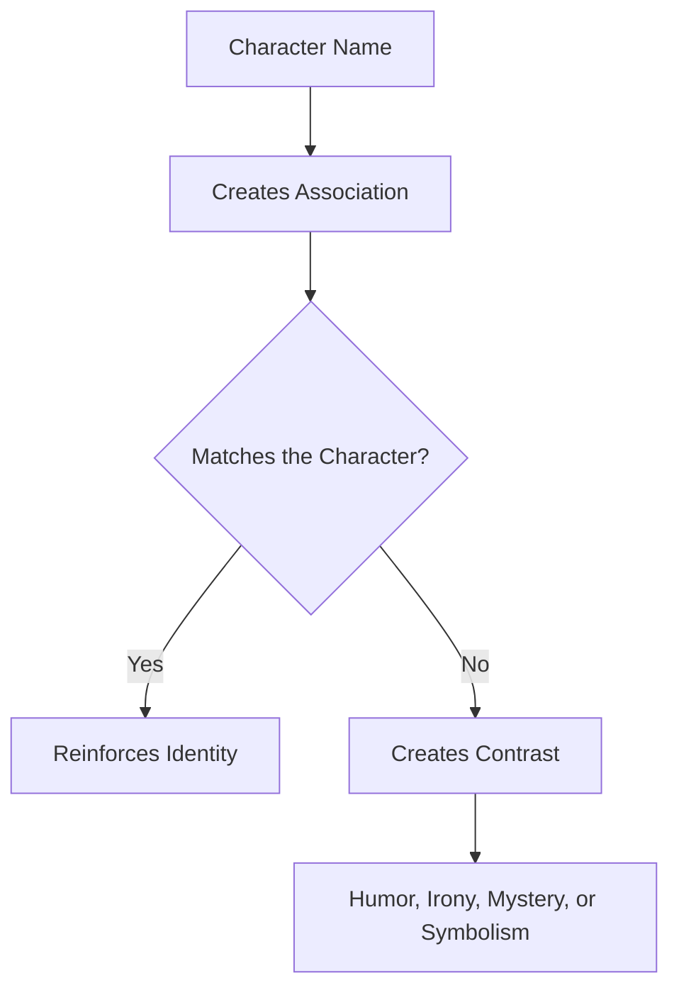
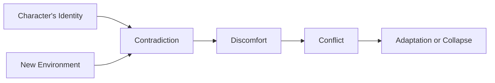
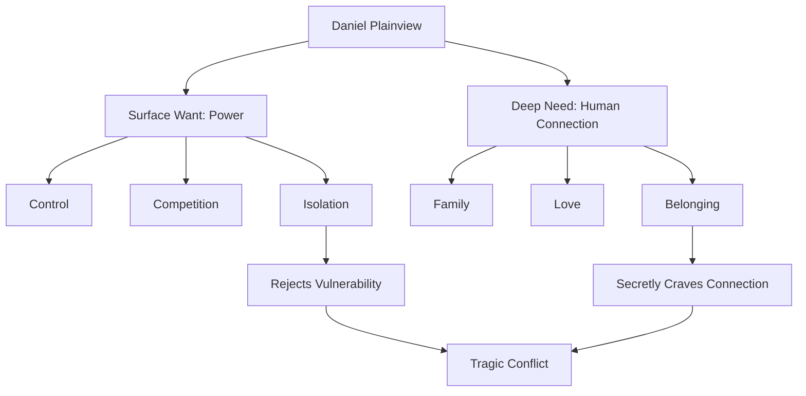
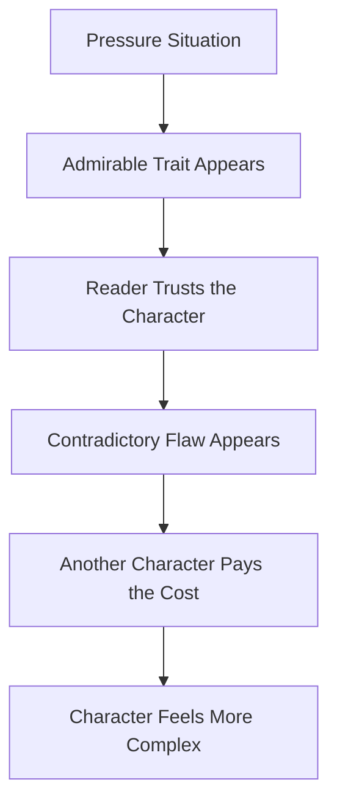

# 023 - People Are a Bundle of Contradictions

## Section

**01 - The Character**

## Original Lecture Title

**Con người là tập hợp của nhiều mâu thuẫn**

## Duration

**6:08**

---

## 1. Lesson Overview

People are complicated.

Every human being contains contradictions. We may want security, but also long for freedom. We may claim that we do not care what others think, yet spend hours choosing what to wear. We may be kind in one situation and cruel in another.

Contradictions make characters feel human.

In fiction, these contradictions create complexity, tension, and emotional realism. A character becomes more lifelike when they are not perfectly consistent, but when their contradictions make sense.

A believable character is not random. They are built from conflicting truths.

---

## 2. Key Ideas

### 2.1 Complexity Comes from Conflicting Truths

A complex character often contains two opposing traits that are both true.

For example:

* Generous but controlling
* Brave but petty
* Loving but selfish
* Honest but cruel
* Loyal but resentful
* Ambitious but insecure
* Gentle but capable of violence

The contradiction should not feel decorative. It should affect the character’s choices and create consequences.

---

### 2.2 Contradictions Create Believable Unpredictability

A contradictory character can surprise the reader without feeling random.

The reader may think:

> “I did not expect them to do that, but now that I think about it, it makes sense.”

That is the goal.

Good contradiction creates surprise and inevitability at the same time.

---

### 2.3 Real Flaws Must Have a Cost

Avoid giving characters “flaws” that are really just charming quirks.

A real flaw should cost something.

It may cost the character:

* A relationship
* Trust
* Safety
* Self-respect
* A dream
* A moral boundary
* Someone else’s happiness

A flaw that never hurts anyone is not really a flaw. It is decoration.

---

## 3. Core Diagram: Character Contradiction



---

## 4. Why Writers Must Test Their Characters

To make a character lifelike, the writer must have the courage to put them under pressure.

Do not create:

* A hero who never hurts anyone
* A hero who never breaks rules
* A hero who always knows the answer
* A villain who is always angry
* A villain who is always wrong
* A villain who only exists to lose

Instead, discover your character’s weaknesses and place them in situations they would hate to face.

A character becomes interesting when their self-image is tested.

---

## 5. Example: *Crash*

In the film *Crash*, Matt Dillon plays a corrupt and racist police officer. At first, he appears completely despicable.

However, the film complicates him.

We see him patiently caring for his sick father. Later, he risks his own life to save a woman trapped in a burning car.

This creates a disturbing contradiction because he had previously assaulted that same woman during a police stop.

At the same time, his colleague appears to be the “good cop” who wants to do the right thing. Yet later, that character shoots an innocent Black man.

The film becomes provocative because:



The contradiction does not excuse the characters. Instead, it makes them harder to simplify.

---

## 6. Areas Where You Can Add Contradiction

Contradictions can appear in many parts of character design.

---

## 6.1 Name

Names create associations.

A name can support the character’s identity, or it can deliberately contrast with it.

For example, would you give a cheerleader the name **Gertrude**?

Probably not, unless there is a reason.

That contrast could create humor, irony, mystery, or depth.

### Example: *Rapunzel*

In the fairy tale *Rapunzel*, the heroine is named after a plant. Her name comes from the bargain her parents made with a witch after stealing rampion from the witch’s garden.

The name carries the history of her fate before she even understands it.

### Function of Name Contradiction



---

## 6.2 Desire

A character’s hidden desire may strongly contradict the role they are expected to play in society.

### Example: *Billy Elliot*

Billy Elliot dreams of becoming a dancer in a world where dance is considered inappropriate for boys by the people around him.

His father wants him to become a boxer.

This creates a strong contradiction:

| Social Expectation         | Inner Desire                |
| -------------------------- | --------------------------- |
| Be tough                   | Be expressive               |
| Box                        | Dance                       |
| Follow masculine tradition | Follow personal passion     |
| Obey family expectations   | Fight for artistic identity |

The conflict comes from the gap between who society wants him to be and who he secretly wants to become.

---

## 6.3 Environment

The environment shapes the character.

Family, friends, school, work, class, culture, and location all influence how a character behaves.

A strong contradiction can appear when a character is placed in an environment that does not match who they believe they are.

### Example: *Orange Is the New Black*

The conflict begins when an upper-middle-class woman finds herself in federal prison.

Her identity, habits, assumptions, and social background collide with a completely different environment.

### Function of Environmental Contradiction



---

## 6.4 Traits and Opposites

The protagonist and antagonist often have opposite traits. These oppositions create dramatic energy.

However, the most interesting conflicts happen when the opposition is not simple.

### Example: *Amadeus*

Mozart has extraordinary musical genius. Salieri does not have the same level of talent, even though he is more socially respected.

Salieri hates Mozart, but he also recognizes Mozart’s genius. Near Mozart’s death, Salieri helps transcribe his final composition.

This creates a contradiction:

| Salieri’s Surface Emotion | Salieri’s Deeper Conflict |
| ------------------------- | ------------------------- |
| Hatred                    | Admiration                |
| Jealousy                  | Reverence                 |
| Rivalry                   | Dependence                |
| Pride                     | Inferiority               |

The conflict is powerful because Salieri does not simply hate Mozart. He hates him partly because he understands how gifted Mozart truly is.

---

## 6.5 Need vs. Want

What a character wants on the surface may be very different from what they need deep down.

This is one of the strongest sources of character contradiction.

### Want

The character’s conscious goal.

Examples:

* Power
* Money
* Revenge
* Fame
* Control
* Victory
* Escape

### Need

The deeper emotional truth the character avoids.

Examples:

* Love
* Forgiveness
* Belonging
* Vulnerability
* Self-acceptance
* Human connection
* Moral responsibility

---

## 7. Example: *There Will Be Blood*

Daniel Plainview, the protagonist of *There Will Be Blood*, is driven by competition, ambition, and power.

He says:

> “I have a competition in me.”

Daniel wants control. His oil field makes him feel alive. He rejects anyone who threatens his sense of power.

However, deep down, he also needs human connection.

This is shown through:

* His adoption of an orphan child
* His desire to have a family
* His welcoming of a stranger who claims to be his brother

Nobody forces Daniel to make these choices. They come from a real desire for connection.

But his obsession with power prevents him from accepting his need for love.

### Daniel’s Contradiction



---

## 8. Contradiction Design Table

| Area          | Possible Contradiction                   | Story Effect          |
| ------------- | ---------------------------------------- | --------------------- |
| Name          | A soft name for a violent person         | Irony or surprise     |
| Desire        | A boxer who wants to dance               | Social conflict       |
| Environment   | A privileged person in prison            | Identity crisis       |
| Traits        | A cruel person who is tender with family | Moral complexity      |
| Need vs. Want | Wants power but needs love               | Tragic inner conflict |
| Action        | A hero does harm                         | Reader shock          |
| Villainy      | A villain shows compassion               | Moral ambiguity       |

---

## 9. Practical Exercise

Take your protagonist and write two contradictory traits.

Then write a scene where both traits appear within a few lines of each other.

### Example Template

| Character   | Trait 1  | Contradictory Trait 2 | Scene Situation                                                         |
| ----------- | -------- | --------------------- | ----------------------------------------------------------------------- |
| Protagonist | Brave    | Petty                 | They risk danger to save someone, then complain about not being thanked |
| Protagonist | Generous | Controlling           | They pay for a friend’s problem, then use that favor to control them    |
| Protagonist | Honest   | Cruel                 | They tell the truth, but choose the most painful moment to do it        |

---

## 10. Mini Scene Exercise

Write a short scene using this structure:

```text
1. Put the character under pressure.
2. Let one admirable trait appear.
3. Immediately let the contradictory flaw appear.
4. Show the cost to another person.
```

### Scene Pattern



---

## 11. Reflection Questions

Use these questions to deepen your character:

1. What is your character’s biggest contradiction?
2. What does your character want on the surface?
3. What do they need deep down?
4. What trait do they believe is their strength?
5. How could that same trait become harmful?
6. What action could they take that would shock the reader but still make sense?
7. What does their contradiction cost the people around them?
8. Does their environment support who they are, or does it pressure them to become someone else?
9. What part of themselves are they trying to hide?
10. What would force that hidden part to appear?

---

## 12. Character Contradiction Checklist

A strong contradiction should meet these conditions:

* It contains two traits that are both true.
* It affects the character’s choices.
* It creates conflict.
* It has consequences.
* It surprises the reader without feeling random.
* It reveals something deeper about the character.
* It costs the character or someone around them.
* It connects to the character’s want, need, fear, or wound.

---

## 13. Final Takeaway

People are bundles of contradictions.

A lifelike character should not be perfectly good, perfectly evil, perfectly brave, or perfectly broken. They should contain opposing forces that make their choices difficult and their behavior emotionally believable.

Contradiction is not inconsistency.

Contradiction is the tension between two truths living inside the same person.

When you discover those opposing truths, you discover the heart of the character.

---

# Bài luyện tập

## Mục tiêu


## Đề bài


## Yêu cầu hoàn thành

- [ ] 
- [ ] 
- [ ] 

## Kết quả / lời giải


## Ghi chú
