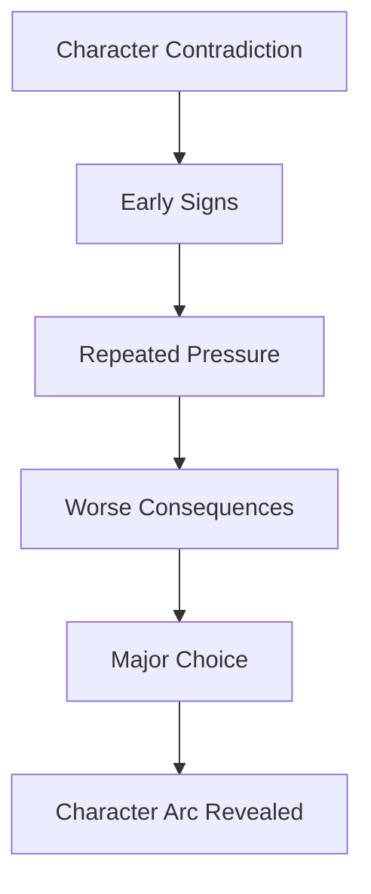
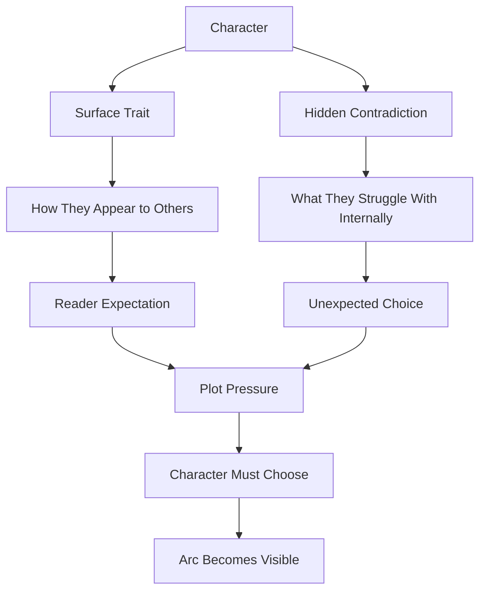
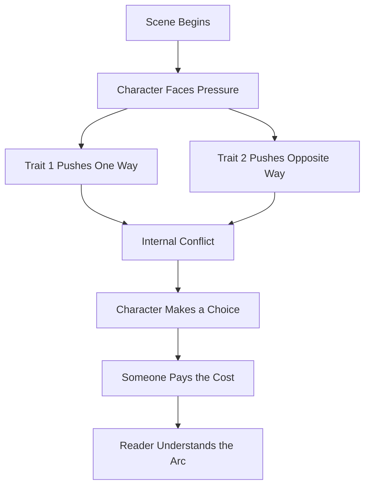
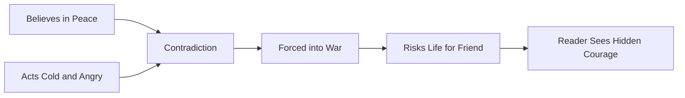
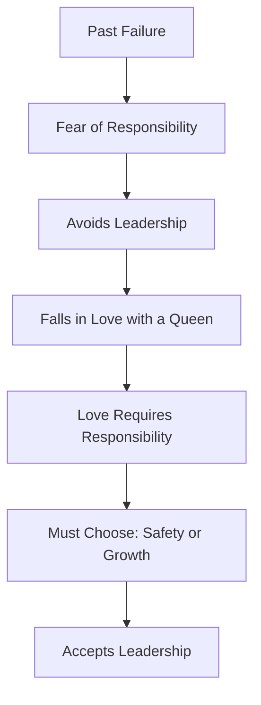
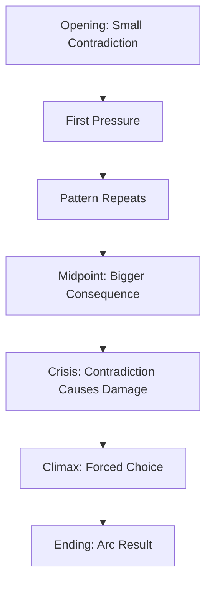

# 024 - Exercise: Character Contradictions

## Section

**01 - The Character**

## Original Lecture Title

**Bài tập về mâu thuẫn tính cách**

## Duration

**Not listed**
Writing exercise / discussion segment

---

## 1. Lesson Overview

This lesson is a practical exercise about character contradictions.

In the previous lesson, we learned that people are not simple. A believable character can be generous but controlling, brave but insecure, kind but cruel, or idealistic but selfish.

In this exercise, the goal is to take that idea and apply it directly to a character.

Contradiction becomes powerful when it is not just a personality detail, but a source of conflict inside the story.

A character’s contradiction should eventually force them to make a difficult choice.

---

## 2. Key Ideas

### 2.1 Contradictions Must Be Tested by the Plot

A contradiction becomes meaningful when the story forces the character to choose between two sides of themselves.

For example:

| Trait 1              | Trait 2                            | Plot Test                                          |
| -------------------- | ---------------------------------- | -------------------------------------------------- |
| Wants peace          | Gets angry easily                  | They must negotiate with an enemy                  |
| Hates responsibility | Loves someone who needs leadership | They must choose between freedom and commitment    |
| Wants love           | Fears vulnerability                | They must confess the truth                        |
| Wants power          | Needs family                       | They must sacrifice control to save a relationship |

The plot should not simply describe contradiction.
It should pressure the contradiction until something breaks or changes.

---

### 2.2 Contradictions Should Appear Consistently

A contradiction should not appear only once for dramatic effect.

If the character is truly contradictory, that tension should appear across the manuscript.

The reader should be able to see the pattern in:

* Dialogue
* Choices
* Relationships
* Reactions under pressure
* Private thoughts
* Moments of failure
* Moments of courage

A contradiction works best when it becomes part of the character’s emotional logic.

---

### 2.3 Do Not Resolve the Contradiction Too Early

If a contradiction is resolved too soon, the story loses tension.

The character should struggle with the contradiction for long enough that the reader feels its cost.

A strong contradiction can create pressure across the entire story.



---

## 3. Main Assignment

### Assignment: People Are a Jumble of Contradictions

**Time suggested:** 500 minutes
**Student solutions:** 39

### Core Question

> What kind of contradiction could you add to your characters?

This assignment asks you to study contradiction either in a real person or in a fictional character you are creating.

---

## 4. Assignment Option A: If You Are Not Working on a Novel

Describe one of your friends or relatives who has the most contradictions.

### Questions to Answer

1. Why did you choose this person?
2. What contradictions do they have?
3. Do these contradictions have a funny side?
4. Do these contradictions create problems for them or for others?
5. What makes this person memorable?

### Example Direction

You might describe someone who:

* Gives good advice but never follows it.
* Wants peace but argues constantly.
* Acts confident in public but is insecure in private.
* Loves helping others but hates being asked for help.
* Claims to be relaxed but tries to control every detail.

---

## 5. Assignment Option B: If You Are Working on a Novel

Take a character you have recently created.

Then answer the following questions:

1. What kind of contradiction could you add to increase their complexity?
2. What would make them feel more lifelike?
3. Is there anything they want that contrasts with how they live?
4. Is there anything they need that contrasts with their principles?
5. Do they live in harmony with their environment?
6. Could they take an action that completely shocks the reader?
7. If they shocked the reader, why would they do that?

---

## 6. Character Contradiction Map

Use this diagram to build the contradiction clearly.



---

## 7. Exercise Template

Use this table to develop your character’s contradiction.

| Question                                             | Answer |
| ---------------------------------------------------- | ------ |
| Character name                                       |        |
| What do they seem like on the surface?               |        |
| What is their hidden contradiction?                  |        |
| What do they want?                                   |        |
| What do they need?                                   |        |
| What principle do they claim to follow?              |        |
| What action could break that principle?              |        |
| What would force them to act that way?               |        |
| Who gets hurt by this contradiction?                 |        |
| What does this contradiction reveal about their arc? |        |

---

## 8. Late-Novel Scene Exercise

Design a scene late in the novel where your character’s two contradictory traits are forced into direct conflict.

### Scene Design Questions

| Scene Element | Guiding Question                                         |
| ------------- | -------------------------------------------------------- |
| Situation     | What is happening in the scene?                          |
| Pressure      | What forces the character to choose?                     |
| Trait A       | Which side of the character appears first?               |
| Trait B       | Which opposing side appears next?                        |
| Choice        | Which trait wins?                                        |
| Cost          | What does the choice cost?                               |
| Arc Meaning   | What does this reveal about the character’s development? |

---

## 9. Scene Structure

A strong contradiction scene can follow this pattern:



---

## 10. Example 1: Peace Advocate Who Gets Angry Easily

### Character Contradiction

This character believes in peace, kindness, and ending war. However, in personal relationships, he is cold, lonely, and quick to anger.

### Contradiction Table

| Element                     | Description                                                         |
| --------------------------- | ------------------------------------------------------------------- |
| Public belief               | Stop wars and be kind to others                                     |
| Private flaw                | Cold, angry, emotionally distant                                    |
| Social consequence          | People he tries to help often become angry at him                   |
| Environmental contradiction | He is forced to fight in a war                                      |
| Shocking action             | He risks his life to save a wounded friend                          |
| Why it makes sense          | His ideals are real, even if his behavior often fails to match them |

### Why This Works

This contradiction is strong because the character is not a hypocrite in a simple way. He truly believes in peace, but he struggles to live peacefully with the people closest to him.

His contradiction creates both irony and pain.



---

## 11. Example 2: Character Who Hates Responsibility but Loves a Queen

### Character Contradiction

Ty hates responsibility because he once led a hunting group and his best friend almost died. Because of that trauma, he avoids leadership and commitment.

However, he falls in love with a queen and offers to marry her, which would make him a consort and place him directly inside responsibility.

### Contradiction Table

| Element          | Description                                    |
| ---------------- | ---------------------------------------------- |
| Fear             | Responsibility                                 |
| Backstory wound  | His friend almost died when he was in charge   |
| Desire           | To be with the queen he loves                  |
| Contradiction    | Love pushes him toward the very thing he fears |
| Character growth | He must learn to accept responsibility         |
| Shocking change  | He eventually becomes king                     |
| Arc meaning      | He moves from avoidance to leadership          |

### Why This Works

The contradiction connects directly to character growth.

At the beginning, Ty avoids responsibility.
By the end, he must accept the greatest responsibility possible.

That makes the arc clear and emotionally satisfying.



---

## 12. Want vs. Need Exercise

A useful way to build contradiction is to separate what the character wants from what they need.

| Character Layer | Meaning                                | Example                            |
| --------------- | -------------------------------------- | ---------------------------------- |
| Want            | What the character consciously pursues | Freedom                            |
| Need            | What the character must accept to grow | Responsibility                     |
| Fear            | What they try to avoid                 | Failing others                     |
| False belief    | The lie they believe                   | “If I lead, people will get hurt.” |
| Final test      | The scene that challenges the lie      | They must lead others to safety    |

---

## 13. Contradiction Tracking Across the Manuscript

To make the contradiction feel consistent, track it from beginning to end.

| Story Stage    | How the Contradiction Appears                                     |
| -------------- | ----------------------------------------------------------------- |
| Opening        | Show the contradiction in a small but clear way                   |
| Early conflict | Let the contradiction create a problem                            |
| Midpoint       | Increase the pressure                                             |
| Crisis         | Make the contradiction hurt someone                               |
| Climax         | Force the character to choose                                     |
| Ending         | Show whether the contradiction is resolved, accepted, or worsened |

---

## 14. Manuscript Contradiction Diagram



---

## 15. Practical Exercise

Write two contradictory traits for your protagonist.

Then design a late-novel scene where both traits are visible and forced into conflict.

### Step-by-Step

1. Choose one admirable trait.
2. Choose one opposing flaw or fear.
3. Connect both traits to the character’s backstory.
4. Create a scene where both traits cannot coexist peacefully.
5. Force the character to choose.
6. Decide what the choice costs.
7. Decide what the choice says about the character’s arc.

---

## 16. Writing Prompt

Use this prompt to draft the scene:

```text id="cxsrsv"
My character is both __________ and __________.

They want __________, but they need __________.

Near the end of the story, they face a situation where __________.

If they follow their first trait, they will __________.

If they follow their second trait, they will __________.

They choose __________.

This choice reveals that __________.
```

---

## 17. Reflection Questions

1. Which contradiction makes your character more lifelike?
2. Which trait do you want to win in the late-novel scene?
3. What does that choice say about their arc?
4. What does the contradiction cost the people around them?
5. Does the contradiction create conflict more than once?
6. Is the contradiction connected to the character’s want and need?
7. Is the contradiction resolved too early?
8. Could the character shock the reader while still remaining believable?
9. What pressure would make them act against their own principles?
10. What part of themselves are they forced to face?

---

## 18. Character Contradiction Checklist

Before finishing the exercise, check whether your contradiction is strong enough.

* The contradiction contains two true sides of the character.
* It is not just a decorative quirk.
* It creates conflict in the plot.
* It affects other characters.
* It appears more than once.
* It connects to the character’s wound, fear, want, or need.
* It can create a shocking but believable action.
* It is tested strongly near the end of the story.
* It reveals the character’s arc.

---

## 19. Final Takeaway

Character contradiction is not just a detail. It is a storytelling engine.

A contradiction becomes powerful when the plot keeps pressing on it until the character must choose which side of themselves will win.

That choice reveals who the character really is.

A lifelike character does not need to be perfectly consistent.
They need to be emotionally believable.

Their contradictions should not confuse the reader.
They should help the reader understand the character more deeply.

---

# Bài luyện tập

## Mục tiêu


## Đề bài


## Yêu cầu hoàn thành

- [ ] 
- [ ] 
- [ ] 

## Kết quả / lời giải


## Ghi chú
