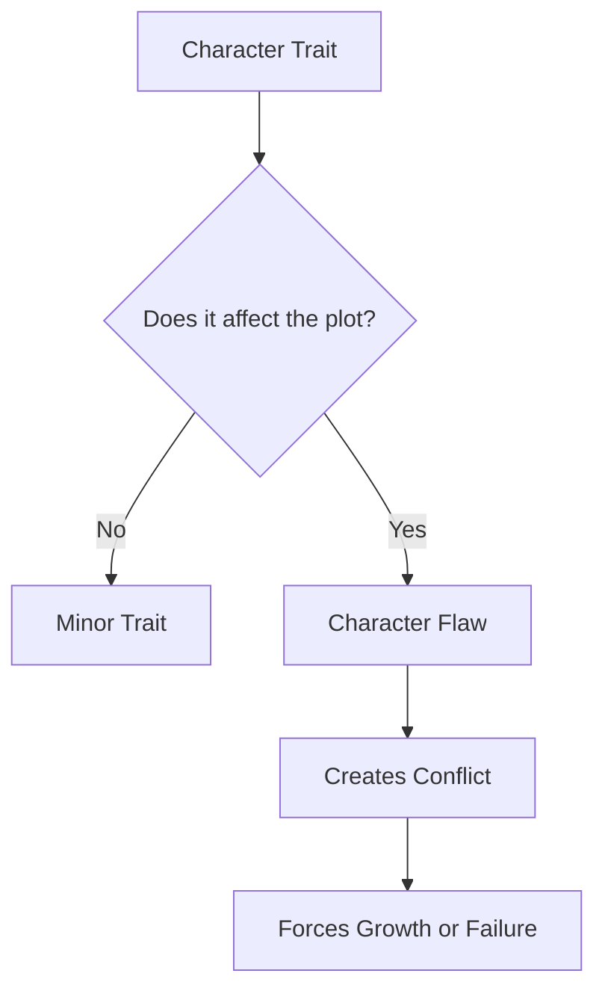
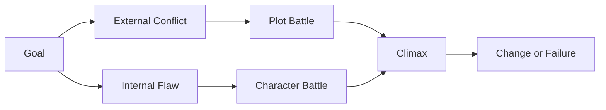

# 025 - Nobody Is Perfect

## Section

**01 - The Character**

## Original Lecture Title

**Không ai hoàn hảo**
**English:** Nobody Is Perfect

## Duration

**5:21**

---

## Lesson Overview

Perfect characters are difficult to care about because they have nothing meaningful to overcome. A strong protagonist needs flaws, weaknesses, or limitations that actively affect the plot.

A flaw is not just a decorative trait. It becomes important when it creates conflict, raises stakes, and forces the character to change.

---

## Core Idea

> A character flaw becomes powerful when it directly blocks the protagonist from achieving their goal.

A protagonist should not be flawless. Their weaknesses make them human, relatable, and dramatically interesting.

---

## Batman vs. Superman Example

Superman is almost perfect. He is strong, brave, intelligent, fast, and nearly impossible to defeat unless kryptonite is involved. Because of this, it can be difficult to imagine how he might truly fail.

Batman, on the other hand, has no superpowers. He is skilled, intelligent, and determined, but he is also limited, wounded, obsessive, and vulnerable.

That is why Batman often creates stronger dramatic tension. When he wins, the audience feels the cost of that victory.

---

## What Is a Character Flaw?

A **flaw** is a negative trait, weakness, limitation, or wound that affects the plot.

A flaw can be:

| Type of Flaw       | Example                      | Effect on Story                |
| ------------------ | ---------------------------- | ------------------------------ |
| Physical flaw      | Cyrano de Bergerac's nose    | Shapes how others perceive him |
| Emotional flaw     | Dumbo's fear of heights      | Blocks him from using his gift |
| Moral flaw         | The Beast's arrogance        | Creates his central conflict   |
| Addictive flaw     | Alcoholism or drug addiction | Creates danger and instability |
| Psychological flaw | Fear under pressure          | Makes key decisions harder     |

---

## Trait vs. Flaw

Not every negative trait is automatically a flaw.

For example, a clumsy character may simply be funny. But if that character wants to win someone's love, and their awkwardness constantly ruins important romantic moments, then clumsiness becomes a real story flaw.

The difference is simple:

---

## Plot-Driven Flaws

A flaw becomes dramatically useful when it creates a serious obstacle.

Imagine your protagonist must defuse a bomb.

Possible flaws:

1. **Colorblindness**
   They cannot distinguish the wires.

2. **Alcoholism**
   The one time they must stay focused is the moment they are drunk.

3. **Fear under pressure**
   Their hands shake, they sweat, and they cannot think clearly.

Each flaw creates a different kind of tension. The external problem is the bomb, but the deeper problem is the character's weakness.

---

## Fatal Flaw

A **fatal flaw** is the central weakness that the protagonist must overcome in order to complete their arc.

It is not a small inconvenience. It is the inner obstacle that stands between the character and their goal.

---

## Example: Beauty and the Beast

In *Beauty and the Beast*, the Beast appears to have a physical flaw: he has been transformed into a monstrous creature.

However, his true fatal flaw is not his appearance.

His real flaw is **arrogance**.

Because of his arrogance, he was cursed in the first place. To break the spell, he must receive true love. This means he must learn to love and be loved despite both his appearance and his bad temper.

The Beast has two battles:

| Battle          | Description                                                   |
| --------------- | ------------------------------------------------------------- |
| External battle | Conflict with Gaston                                          |
| Internal battle | Conflict with his arrogance, anger, and emotional limitations |

Only by winning both battles can he reach his goal and complete the story.

---

## Key Points

* Flawless protagonists are difficult to root for because they have nothing internal to overcome.
* A flaw must have real consequences in the plot.
* A good flaw is connected to the story's main conflict.
* A fatal flaw should be serious enough that the character cannot move forward without facing it.
* The best flaws create both external problems and internal transformation.

---

## Practical Exercise

Write a scene where your protagonist's flaw directly causes a problem.

Do not let the problem come only from an outside force. The character's own weakness should make the situation worse.

### Example Setup

Your protagonist wants to confess the truth to someone they love, but their fatal flaw is pride.

Because of that pride, they avoid apologizing, twist the conversation, and accidentally hurt the other person even more.

---

## Character Flaw Development Worksheet

Use the questions below to design your protagonist's flaw.

| Question                                                    | Answer |
| ----------------------------------------------------------- | ------ |
| What is your character's main flaw?                         |        |
| Is it physical, emotional, moral, psychological, or social? |        |
| How did this flaw begin?                                    |        |
| What does the character do to hide it?                      |        |
| What does the character do to overcome it?                  |        |
| How does the flaw affect the plot?                          |        |
| What situations will test this flaw?                        |        |
| What happens if the character never changes?                |        |

---

## Reflection Questions

1. What does your character's flaw cost them by the end of the book if they do not change?
2. Is the flaw important to the plot, or is it only decorative?
3. Does overcoming the flaw change both the protagonist and the story?
4. What kind of scene would force the character to face this flaw directly?

---

## Summary

This lesson teaches that strong protagonists need meaningful flaws. A flaw is not just a weakness mentioned once. It must affect the plot, create consequences, and force the character into difficult choices.

The most powerful flaws are connected to the central conflict of the story. When the protagonist overcomes that flaw, the story changes. When they fail to overcome it, the flaw becomes the reason for their downfall.

In short:

> A perfect character has nothing to overcome.
> A flawed character has a story.

---

# Bài luyện tập

## Mục tiêu

## Đề bài

## Yêu cầu hoàn thành

- [ ] 
- [ ] 
- [ ] 

## Kết quả / lời giải

## Ghi chú
