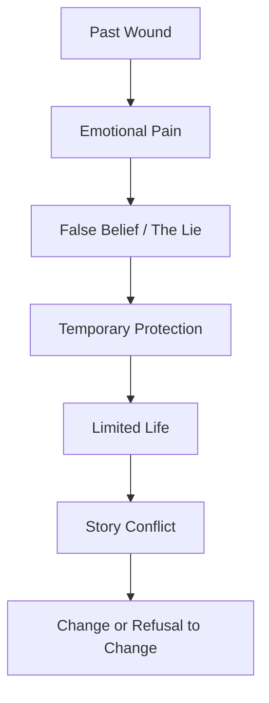
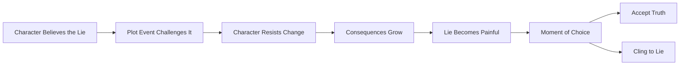
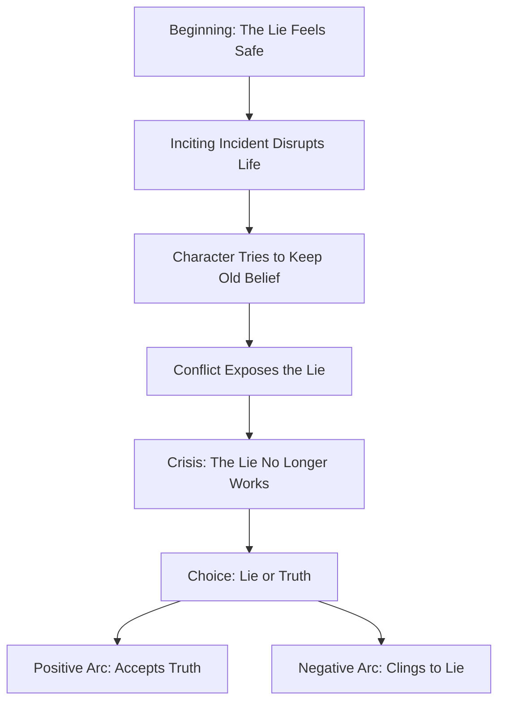

# 026 - The Character's Lie / False Belief

## Section

**01 - The Character**

## Original Lecture Title

**Lời nói dối / niềm tin sai lầm của nhân vật**
**English:** The Character's Lie / False Belief

## Duration

**5:24**

---

## Lesson Overview

Every character resists change in some way. Change is frightening because it threatens the world the character already knows, even if that world is painful, limited, or incomplete.

At the beginning of a story, the protagonist usually lives with some kind of inner lack. This lack may not be obvious from the outside. A character can be rich, successful, loved, or comfortable and still feel trapped, empty, guilty, ashamed, afraid, or incomplete.

Behind that discomfort is often a false belief.

This false belief is called **the lie**.

---

## Core Idea

> The character's lie is a mistaken belief about themselves, other people, or the world.
> The story forces the character to question that belief.

The lie usually protects the character at first. It gives them a sense of safety and control. However, as the story progresses, the same belief begins to limit them, hurt them, and block them from real growth.

---

## What Is the Character's Lie?

The **lie** is a belief the protagonist accepts as truth, even though it prevents them from living fully.

It can usually be written in one sentence.

Examples:

| Story                           | Character's Lie                                       |
| ------------------------------- | ----------------------------------------------------- |
| *A Christmas Carol*             | A person's value is measured by money.                |
| *Jane Eyre*                     | Love must be earned through suffering and submission. |
| *Toy Story*                     | The only good way to live is to be the favorite toy.  |
| *The Bridges of Madison County* | It is too late to change life and choose true love.   |
| *Rear Window*                   | Marriage will destroy freedom and independence.       |
| *Stardust*                      | A selfish person is the protagonist's true love.      |

---

## Why Characters Believe the Lie

A character usually believes the lie because of something in their past.

The lie often begins as a survival strategy.

At first, the lie may seem useful. It helps the character avoid pain, rejection, danger, shame, or failure.

But later, the lie becomes a prison.

---

## The Character's Safe World

At the start of the story, the protagonist often lives inside a familiar world. This world may be comfortable or miserable, but it feels safe because it is known.

The character may think:

* "This is just how life works."
* "I cannot change."
* "People like me do not deserve better."
* "If I try, I will lose everything."
* "It is safer not to want too much."
* "Love always leads to pain."
* "Success is the only thing that gives me value."

This safe world protects the lie.

But beyond the safe world, there is change. And beyond change, there is the story.

---

## Inner Lack

The protagonist begins the story with a lack.

This lack can be:

| Type of Lack | Meaning                                                 |
| ------------ | ------------------------------------------------------- |
| Mental       | They misunderstand themselves or the world.             |
| Emotional    | They cannot process fear, guilt, grief, shame, or love. |
| Physical     | They lack strength, freedom, safety, or ability.        |
| Spiritual    | They lack meaning, faith, peace, or purpose.            |
| Social       | They lack connection, trust, or belonging.              |

This lack does not always match the character's external situation.

A prisoner may feel spiritually free.
A billionaire on vacation may feel emotionally trapped.

The real lack begins inside the character.

---

## Example: Peter Pan / Hook

In *Hook*, Peter is a lawyer who spends very little time with his family. His children, Jack and Maggie, suffer because of his absence and broken promises.

When Captain Hook captures his children and takes them to Neverland, Peter is forced to rediscover his true identity: he is Peter Pan.

The external adventure reveals an internal problem.

Peter has forgotten who he is and what truly matters.

His lie may be expressed as:

> Work, responsibility, and success matter more than imagination, family, and presence.

The story forces him to confront that belief.

---

## The Lie and the Plot

The plot's job is to pressure-test the lie.

At first, the protagonist may defend their false belief. But each major event should make the lie harder to maintain.

A strong character arc depends on this pressure.

The story should keep asking:

> Will the protagonist keep believing the lie, or will they finally accept the truth?

---

## Example: Candide

In Voltaire's *Candide*, the protagonist begins with a naive belief taught by Pangloss: that the world is perfect and everything happens for the best.

Throughout the novel, this belief is tested again and again. Each encounter exposes another weakness in that worldview.

By the end, the story reveals the deeper message:

> Blind optimism can become madness when it refuses to recognize real suffering.

The lie is not just personal. It becomes the center of the book's philosophical argument.

---

## Lie vs. Truth

A character arc often moves from **lie** to **truth**.

| Element | Meaning                                    |
| ------- | ------------------------------------------ |
| Lie     | The false belief that limits the character |
| Wound   | The past pain that created the lie         |
| Want    | What the character thinks they need        |
| Need    | What the character truly needs             |
| Truth   | The healthier belief they must accept      |
| Change  | The transformation that completes the arc  |

---

## Character Arc Structure

---

## Key Points

* Many character arcs are built around a false belief.
* The lie is usually connected to the character's backstory wound.
* The lie often begins as a form of protection.
* Over time, the lie becomes a limitation.
* The plot should challenge the lie again and again.
* The protagonist must eventually choose between staying safe and changing.
* A strong lie can connect the character arc to the story's theme.

---

## Practical Exercise

Write your character's core lie in one sentence.

Then trace it back to the past event, wound, or emotional experience that created it.

### Example

**Core lie:**
"I must never depend on anyone."

**Past wound:**
The character trusted someone deeply and was abandoned when they needed help most.

**How the lie protects them:**
They avoid vulnerability and remain independent.

**How the lie hurts them:**
They cannot form real intimacy or accept support.

**Truth they must learn:**
Depending on others does not make them weak.

---

## Character Lie Worksheet

| Question                                          | Answer |
| ------------------------------------------------- | ------ |
| What false belief does your protagonist hold?     |        |
| Can the lie be written in one sentence?           |        |
| What past wound created this belief?              |        |
| How does the lie protect the character?           |        |
| How does the lie limit or hurt the character?     |        |
| What does the character think they want?          |        |
| What do they actually need?                       |        |
| What truth must they learn?                       |        |
| What plot events will challenge the lie?          |        |
| What must they give up to stop believing the lie? |        |

---

## Reflection Questions

1. What mistaken idea does your protagonist have about themselves or the world?
2. What do they lack mentally, physically, emotionally, or spiritually at the beginning of the story?
3. Is the lie making their life difficult or miserable? How?
4. If their life seems to be going smoothly, what could happen that would force them to change?
5. What would your character have to give up in order to stop believing the lie?
6. What truth must replace the lie by the end of the story?

---

## Summary

This lesson explains that many powerful character arcs begin with a false belief. The protagonist believes something untrue about themselves, the world, love, success, freedom, safety, or happiness.

At first, the lie seems to protect them. But as the plot develops, it becomes clear that this belief is also the thing holding them back.

The story forces the character to face a choice:

> Continue believing the lie and remain trapped,
> or accept the truth and change.

A strong character's lie does not only shape the protagonist. It also shapes the theme, conflict, and emotional meaning of the entire story.
