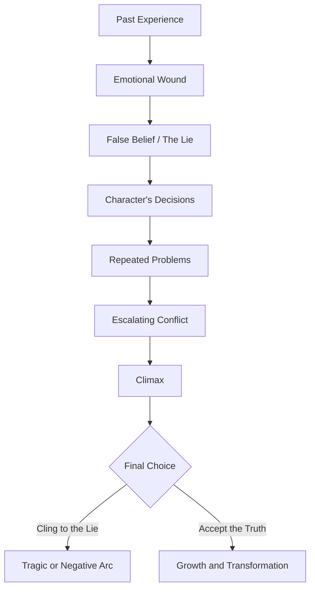
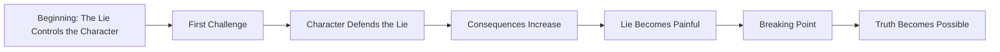

# 027 - Exercise: The Lie

## Section

**01 - The Character**

## Original Lecture Title

**Bài tập về "the lie"**
**English:** Exercise: The Lie

## Duration

**Not listed**
Writing exercise / discussion segment

---

## Assignment

**The Lie**

**Estimated time:** 600 minutes
**Student solutions:** 30

---

## Lesson Overview

This exercise focuses on identifying **the lie** that controls a character's life.

A character's lie is a false belief they hold about themselves, other people, or the world. This belief may feel true to them, but it limits their choices, damages their relationships, and prevents real growth.

The purpose of this exercise is to understand how a false belief begins, how it affects behavior, and how the story eventually forces the character to confront it.

---

## Core Idea

> A character's lie should not remain abstract.
> It must appear through action, choice, conflict, and consequence.

The lie becomes useful in storytelling when the audience can see the character acting according to it.

---

## What This Exercise Asks You to Do

First, reflect on your own life.

Have you ever experienced a revelation that changed the way you saw the world?

It could be caused by:

* A new love
* A betrayal
* Moving to another city
* Losing something important
* Meeting someone who challenged your beliefs
* Realizing that an old way of thinking was hurting you

That old belief may have been controlling your decisions without you realizing it.

That is what a lie is.

---

## The Lie in Character Writing

If you are working on a novel, examine your protagonist carefully.

Ask:

* What mistaken idea do they have about themselves?
* What mistaken idea do they have about the world?
* What do they believe is true, even though the story will prove it false?
* How does that belief shape their decisions?
* What would they have to lose in order to stop believing it?

---

## Key Points

* Show the lie in action early in the story.
* The lie should affect the character's behavior, not just their thoughts.
* Escalate situations that make the lie harder to maintain.
* The plot should pressure-test the lie repeatedly.
* The climax often forces a final choice: cling to the lie or accept the truth.
* The moment the lie breaks must feel earned by everything that came before it.

---

## Lie Development Diagram



---

## How to Show the Lie in Action

The lie should appear early in the story through a concrete moment.

For example:

| Character's Lie                       | Scene That Shows It                                                  |
| ------------------------------------- | -------------------------------------------------------------------- |
| "People only use each other."         | The protagonist rejects help from someone sincere.                   |
| "Love must be earned."                | The protagonist tries to be perfect so others will not abandon them. |
| "Asking for help means weakness."     | The protagonist hides a serious problem until it gets worse.         |
| "Money is the only measure of worth." | The protagonist chooses profit over kindness.                        |
| "It is too late to change."           | The protagonist refuses an opportunity for happiness.                |

The audience should not only hear the lie. They should see the character live by it.

---

## The Lie Across the Story



At first, the character may not realize they are wrong. They may believe their lie is wisdom, survival, maturity, loyalty, or common sense.

But the story should gradually reveal the cost of that belief.

---

## Practical Exercise

Write the scene where the lie is finally broken.

In this scene, your protagonist should face a situation where their old belief no longer works.

They must make a different choice.

After writing the scene, note what the character does immediately afterward.

### Exercise Instructions

Answer the following questions:

1. What mistaken idea does the protagonist have about themselves or the world around them?
2. What do they lack mentally, physically, emotionally, or spiritually in order to achieve what they want?
3. When the story begins, is the lie making the protagonist's life miserable or difficult? How?
4. If everything in their life seems to be going smoothly, what could suddenly go wrong and force them to change?
5. What scene finally breaks the lie?
6. What does the protagonist do differently after the lie is broken?

---

## Worksheet: The Character's Lie

| Question                                          | Answer |
| ------------------------------------------------- | ------ |
| What is the protagonist's lie?                    |        |
| Can the lie be written in one sentence?           |        |
| What past event created this belief?              |        |
| How does the lie protect the character?           |        |
| How does the lie hurt the character?              |        |
| What does the character lack at the beginning?    |        |
| How does the lie affect their choices?            |        |
| What events challenge the lie?                    |        |
| What is the final scene where the lie breaks?     |        |
| What truth replaces the lie?                      |        |
| What does the character do differently afterward? |        |

---

## Example 1

### Mistaken Idea

The protagonist believes:

> People only use each other. Love does not exist.

### Lack

The protagonist lacks exposure to different kinds of people. They only interact with a narrow and limited part of society.

### Effect of the Lie

This belief influences their decision-making and prevents them from wanting more from life.

They avoid trust, intimacy, and emotional risk.

### Catalyst for Change

A major plot event forces the protagonist into a new social world. This new world does not match their old belief.

Because the lie no longer explains reality, the protagonist must either change or become more isolated.

---

## Example 2

### Mistaken Idea

The protagonist believes:

> Love has to be earned. It is not given freely.

### Lack

The protagonist wants to obtain a cure for their mother, but they lack the ability to ask for help.

### Effect of the Lie

The lie drives them to be perfect.

They believe that failure will make others reject them.

Because of this, they avoid vulnerability and carry too much alone.

### Catalyst for Change

The protagonist encounters an obstacle they cannot overcome by themselves.

When someone helps them, they realize that needing help does not make them weak.

They also realize that love does not disappear just because they fail.

---

## Building the Breaking Scene

The scene where the lie breaks should include:

| Element  | Purpose                                        |
| -------- | ---------------------------------------------- |
| Pressure | The character cannot avoid the truth anymore.  |
| Choice   | They must act differently from before.         |
| Cost     | Giving up the lie means losing old protection. |
| Truth    | A healthier belief becomes possible.           |
| Action   | The character proves change through behavior.  |

---

## Scene Template

Use this structure to draft the moment where the lie breaks.

```markdown
### Scene: The Lie Breaks

**Old Lie:**  
The protagonist believes that...

**Situation:**  
The protagonist faces...

**Pressure:**  
This situation makes the lie impossible to maintain because...

**Old Reaction:**  
Normally, the protagonist would...

**New Choice:**  
This time, the protagonist...

**Truth Revealed:**  
The protagonist realizes that...

**Immediate Action Afterward:**  
Right after accepting the truth, the protagonist...
```

---

## Reflection Question

> Is the moment your character abandons the lie earned by everything that came before it?

A character should not abandon a lifelong false belief too easily. The story must prepare that transformation through repeated pressure, failure, consequence, and emotional discovery.

---

## Summary

This exercise asks you to identify the false belief that shapes your protagonist's life.

The lie should appear early, influence decisions, create problems, and become harder to maintain as the plot develops.

By the climax, the protagonist should face a final choice:

> Continue living by the lie,
> or accept the truth and change.

The strongest character arcs make this transformation feel necessary, painful, and earned.
